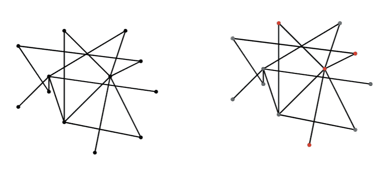
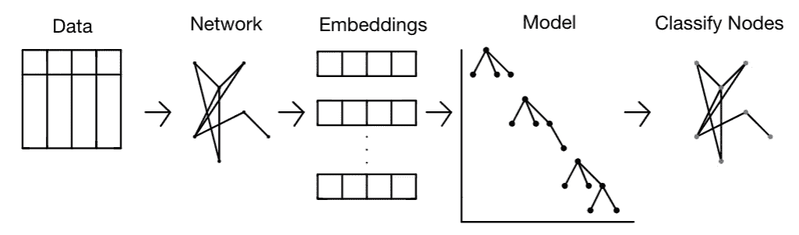
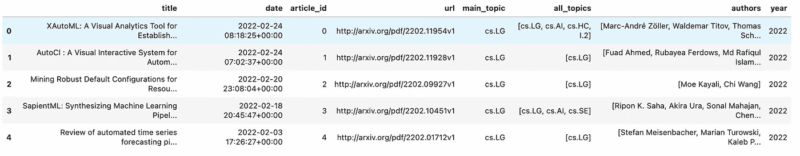
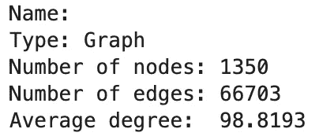
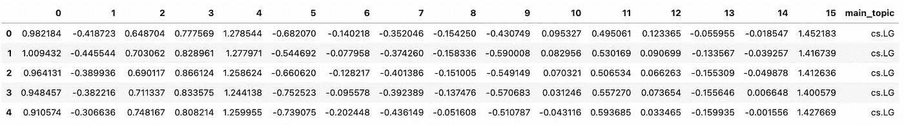
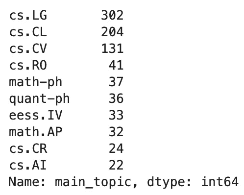
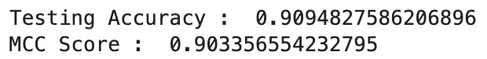

# 使用 Node2Vec 进行节点分类

> 原文：<https://towardsdatascience.com/node-classification-with-node2vec-58892845697b>

## 用 Python 构建多类节点分类模型


图片由 [Gerold Hinzen](https://unsplash.com/@geroldhinzen) 从 [Unsplash](https://unsplash.com/photos/p8Jft09BBPw) 拍摄

本文将展示使用图形解决分类问题的管道的实现。今天介绍的解决方案背后的基本算法是 Node2Vec。如果你对 node2vec 不熟悉，我以前写过一篇关于它的文章，你可以在下面看看。

[](/node2vec-explained-db86a319e9ab)  

您还可以在这里查看如何使用 Node2Vec 构建链接预测推荐系统。

## 目录

*   什么是节点分类？
*   问题陈述
*   解决方案架构
    -需求
*   数据
*   创建网络
*   应用节点 2Vec
*   训练分类器
    -评估分类器
    -预测节点类
*   结束语
*   资源

# 什么是节点分类？

节点分类是机器学习在图上的常见应用。通常，您训练一个分类模型来学习某个节点属于哪个类。
这种方法常见于二元和多类分类[1]。在二元分类中，你要处理两个不同的类，而在多类分类中，你要处理两个以上不同的类。
在本教程的上下文中，我们将使用 node2vec 来生成网络的节点嵌入。Node2vec 旨在保留原始图中的初始结构。



图 g 中的节点分类示例。右图展示了按不同颜色(红色、蓝色、绿色)分类的节点。图片由作者提供。

# 问题陈述

给定 arXiv 上发表的研究论文的主题，我们将构建一个管道，该管道将训练一个模型来根据其主题对研究论文进行分类。

# 解决方案架构

我们将首先创建一个网络，其中节点作为文章，连接这些节点的边基于连接一对文章的主主题。创建这个网络后，我们将使用 node2vec 来生成与每篇文章相关的节点嵌入。最后，我们可以将与每个节点关联的节点嵌入映射到其关联的主题。嵌入可以作为特征传递，并且主主题可以作为训练分类模型的目标。



上面概述了建议的节点分类体系结构。图片由作者提供。

## 要求

```
Python=3.8.8
arxiv=1.4.2
networkx=2.5
pandas=1.2.4
numpy=1.20.1
node2vec=0.4.4
sklearn=0.24.1
```

如果你没有安装 node2vec 包，这里的是通过命令行安装它的库文档。类似地，您可以使用以下指令用 Python 安装 arXiv 包[这里](https://pypi.org/project/arxiv/)。

# 数据

我们将使用 arXiv API 来收集与各种关键字相关的研究论文和出版物的数据。基于他们 API 的 arXiv 使用条款，它是完全免费的，并鼓励使用。有关其使用条款的更多信息，请参考其文档，您可以在此处找到。

在本文中，我将向您展示如何通过 Python 调用 API 来收集我们今天构建的模型所需的以下信息。如果你想通过其他编程语言使用这个 API，或者只是想了解更多关于如何使用这个 API 的信息，我强烈建议你参考他们的文档，你可以在这里找到。

我们想要点击 arXiv API 来收集一些关于基于我们上面确定的查询的最新研究论文的信息。这将允许我们根据这篇研究论文数据创建一个网络，然后我们可以尝试对该网络上的节点进行分类。出于本文的目的，我将在每个查询中搜索最多 250 个结果，但是您不必为自己设置相同的约束。arXiv API 允许用户每次查询达到 300，000 个结果[2]。下面概述的函数将生成一个获取以下信息的 CSV:
`title, date, article_id, url, main_topic, all_topics, authors, year`
您可以获取更多信息，如链接、摘要、文章，但我决定不这样做，因为这些功能不会真正用于本分析和教程。

下面是我点击 arXiv API 时得到的输出示例。根据您选择查询的关键字和时间，您可能会收到不同的信息。



通过 API 查询 arXiv 后的示例输出。图片由作者提供。

如果您在查询数据时遇到问题，出于可再现性的目的，我在本文中进行的分析所使用的 CSV 被上传到我的 GitHub，您可以在这里找到。

# 创建网络

现在我们已经使用 arXiv API 获取了数据，我们可以生成一个网络。该网络将具有以下结构，节点将是 article _ ids，边将是连接一对文章的所有主题。例如，具有以下主题天文物理学的 article_id 1 和具有主题 stats 的 article_id 10 以及具有主题`astro-physics`、`math`的 article_id 7 可以被连接。这将是一个多边网络，其中每条边的权重为 1。

以下是我生成的与网络相关的统计数据:



生成的图表统计信息的摘要。图片由作者提供。

# 应用节点 2Vec

这个组件将包括在上面生成的图上运行 node2vec，并为该网络创建相关的节点嵌入。这些嵌入将会起到至关重要的作用，因为它们是构建节点分类模型所必需的主要特性。

下面您可以看到嵌入数据的输出示例，其中索引值代表节点，主主题列代表目标变量。



node2vec 生成的嵌入数据的输出示例。图片由作者提供。

在我查询这些数据的那天，我注意到数据集中有 110 个不同的主题。下面你可以看到与研究论文中最常出现的主题相关的数值。



十大最常用话题。图片由作者提供。

# 训练分类器

## 评估分类器

为了评估该模型的性能，我们将考察以下准确度得分:

*   准确度分数
*   马修相关系数
*   分类报告
*   混淆矩阵



与节点分类模型评估相关的准确性测量。图片由作者提供。

我没有添加与分类报告和混淆矩阵相关的图像，因为它们太大了(因为有 110 个唯一的类)。你可以参考 Jupyter 笔记本中与本教程相关的图片[这里](https://github.com/vatsal220/medium_articles/blob/main/node_classification/classify_node.ipynb)。

## 预测节点类

# 结束语

从管道的结果可以看出，梯度提升分类器在基于 node2vec 特性的节点分类方面做得非常好。这一点基于准确率、马太相关系数、混淆矩阵、分类报告的高分都有明显体现。

这种流水线很容易被二进制分类所复制。我鼓励您训练和测试各种分类模型，看看哪种模型最适合您正在使用的数据集。

要继续学习这篇教程，你可以参考我的 GitHub 上的 Jupyter 笔记本。

# 资源

*   [1][https://neo4j . com/docs/graph-data-science/current/algorithms/ml-models/Node-classification/#:~:text = Node % 20 class % 20 is % 20a % 20 common，class % 20 problems % 3A % 20 binary % 20 and % 20 multi class](https://neo4j.com/docs/graph-data-science/current/algorithms/ml-models/node-classification/#:~:text=Node%20Classification%20is%20a%20common,classification%20problems%3A%20binary%20and%20multiclass)
*   [2]https://pypi.org/project/arxiv/

如果你喜欢读这篇文章，这里有一些我写的其他文章，我想你可能也会喜欢。

[](/text-summarization-in-python-with-jaro-winkler-and-pagerank-72d693da94e8)  [](/random-walks-with-restart-explained-77c3fe216bca)  [](/frequentist-a-b-testing-explained-90b9ce8c28b9)  [](/mining-modelling-character-networks-part-ii-a3d77de89638) 