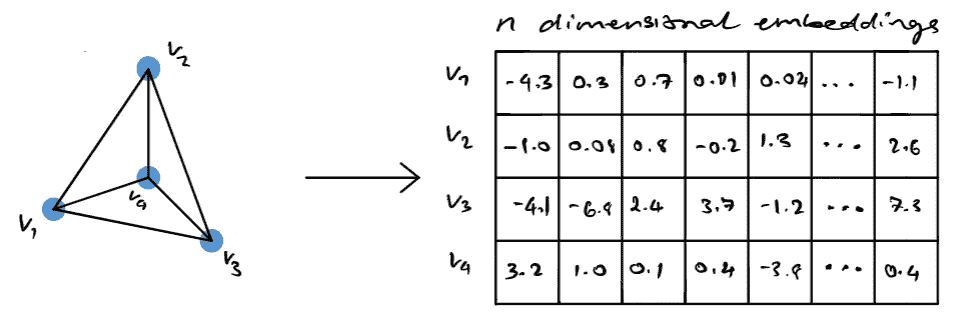
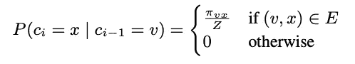
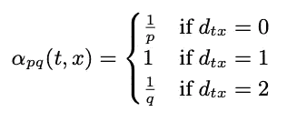
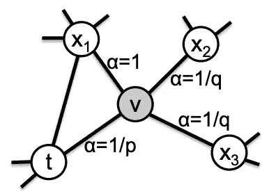
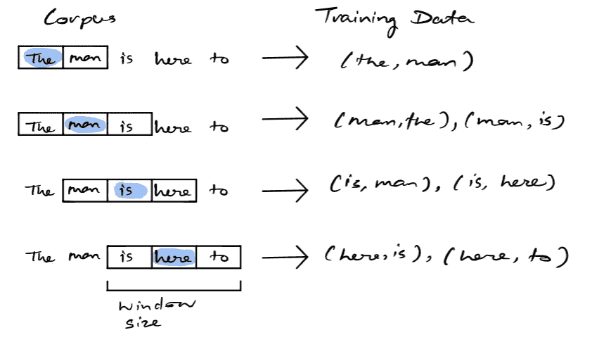
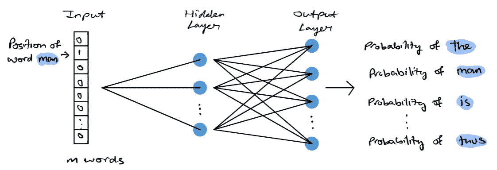
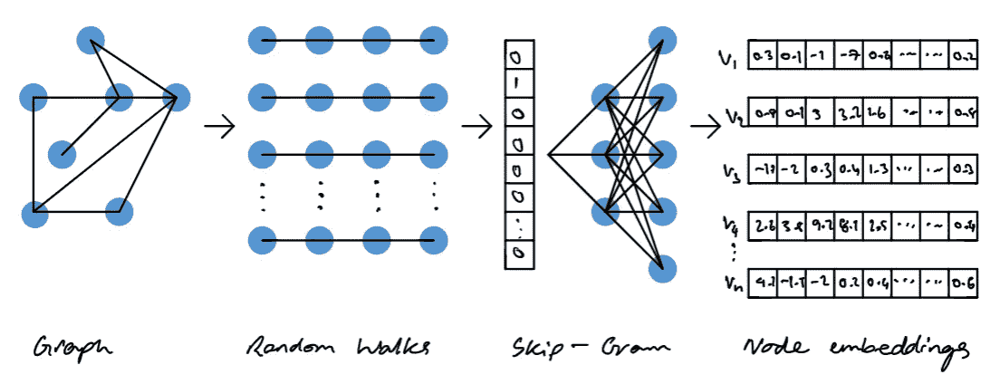
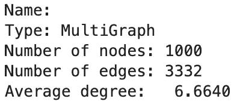
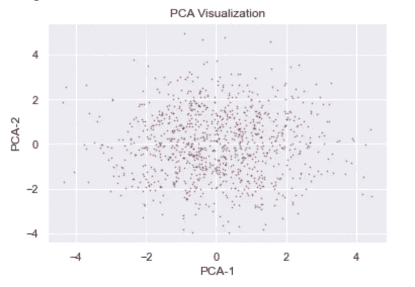

# Node2Vec 解释

> 原文：<https://towardsdatascience.com/node2vec-explained-db86a319e9ab>

## 用 Python 解释和实现 Node2Vec 白皮书


图片由[阿丽娜·格鲁布尼亚](https://unsplash.com/@alinnnaaaa)拍摄自 [Unsplash](https://unsplash.com/photos/hdpDLIXZg7Y)

## 目录

*   介绍
*   什么是图？
*   Node2Vec 是什么？
*   随机漫步生成
*   跳过程序体系结构
*   它是如何工作的
*   履行
*   为什么要用 Node2Vec？
*   结束语
*   资源

# 介绍

这篇文章将给出由[阿迪蒂亚·格罗弗](https://arxiv.org/search/cs?searchtype=author&query=Grover%2C+A)和[朱尔·莱斯科维奇](https://arxiv.org/search/cs?searchtype=author&query=Leskovec%2C+J)提出的 node2vec 算法的直观和技术理解。这篇论文可以在这里找到并阅读[，对于那些想更深入了解所介绍的技术概念的人来说。本文作者在 python3 中制作了一个名为 node2vec 的开源包，可以通过 pip 安装，用于网络上的可扩展特征学习。在网上可以找到这篇论文的各种开源实现，作者 Aditya 创建的知识库可以在这里找到](https://arxiv.org/abs/1607.00653)。另一个非常流行和常用的实现也可以在[这里](https://pypi.org/project/node2vec/)找到。出于本文后面的教程和示例的目的，我将使用后一个包。

# 什么是图？

图论，致力于研究图形的数学领域。图是模拟节点之间成对关系的数学结构[1]。当节点之间存在关系时，这些节点通过边连接。节点也可以与自己有关系，否则称为自循环。图有多种形式，每种形式都有明显不同的特征，图可以是有向的、无向的、加权的、二分的等等。每个图也可以映射到一个邻接矩阵。邻接矩阵中的元素表示图[1]中的节点对是否彼此相邻。您可以参考图 1 来直观地了解图表的外观。


图 G 的邻接矩阵(图片由作者提供)

# 什么是 Node2Vec

使用网络时，一个值得注意的问题是将网络结构转换为数字表示，然后可以传递给传统的机器学习算法。Node2Vec 是一种允许用户将图 G 中的节点映射到嵌入空间的算法。通常，嵌入空间的维数低于原始图 g 中的节点数。该算法试图保留原始图中的初始结构。本质上，图中相似的节点将在嵌入空间中产生相似的嵌入。这些嵌入空间本质上是对应于网络中每个节点的向量。图嵌入通常用作输入特征，以解决围绕[链接预测](/link-prediction-recommendation-engines-with-node2vec-c97c429351a8)、社区检测、分类等的机器学习问题。



使用 node2vec 从输入图 G 生成 n 维节点嵌入(图片由作者提供)

一般来说，当处理非常大的图表时，科学家很难直观地表示他们正在处理的数据。查看图形外观的常见解决方案是生成与该图形相关联的节点嵌入，然后在低维空间中可视化这些嵌入。这使您可以直观地看到在非常大的网络中形成的潜在集群或组。

# 随机漫步生成

理解什么是随机漫步以及它们如何工作对于理解 node2vec 如何工作是至关重要的。我将提供一个高层次的概述，但是如果你想更直观地理解和实现 python 中的随机漫步，你可以阅读我以前写的关于这个主题的文章。

</random-walks-with-restart-explained-77c3fe216bca>  

作为一个高层次的概述，随机漫步的最简单的比较就是漫步。想象你走的每一步都是由概率决定的。这意味着在每一个时间指数上，你已经基于一个概率结果朝着一个确定的方向前进。该算法探索了您将要采取的每一步的关系以及它与初始起点的距离。

现在你可能想知道这些从一个节点移动到另一个节点的概率是如何计算的。Node2Vec 引入了下面的公式，用于确定移动到节点 x 的概率，假设您先前在节点 v。



图片取自 [Node2Vec 论文](https://arxiv.org/pdf/1607.00653.pdf) [4]

其中 z 是归一化常数，πvx 是节点 x 和 v [4]之间的非归一化转移概率。显然，如果没有连接 x 和 v 的边，那么概率将是 0，但如果有边，我们确定从 v 到 x 的归一化概率。

该论文指出，引入偏差来影响随机游走的最简单方法是，如果每个边都有一个权重。然而，这在未加权的网络中是行不通的。为了解决这个问题，作者引入了由两个参数 p 和 q 控制的引导随机行走。p 表示随机行走回到前一个节点的概率，而 q 表示随机行走可以通过图中以前看不见的部分的概率[4]。



图片取自 [Node2Vec 纸](https://arxiv.org/pdf/1607.00653.pdf) [4]

其中，dtx 表示节点 t 和 x 之间的最短路径，如下图所示。



图片取自 [Node2Vec 论文](https://arxiv.org/pdf/1607.00653.pdf) [4]

# 跳过程序体系结构

为了理解 node2vec 中正在做的事情，有必要对 word2vec 有一个大致的了解。不久前，我写了一篇文章解释 word2vec 论文的直觉和实现。你可以在这里查看。

</word2vec-explained-49c52b4ccb71>  

出于本文的考虑，我将提供跳格模型的高级概述。

skip-gram 模型是一个简单的神经网络，具有一个经过训练的隐藏层，以便在输入单词出现时预测给定单词出现的概率[2]。该过程可以直观地描述如下。



为 skip-gram 模型生成训练数据的示例。窗口大小为 3。图片由作者提供

如上所述，给定一些文本语料库，在一些滚动窗口上选择目标单词。训练数据由该目标单词和窗口中所有其他单词的成对组合组成。这是神经网络的最终训练数据。一旦训练了模型，我们就可以基本上得出一个单词成为给定目标的上下文单词的概率[2]。下图显示了 skip-gram 模型的神经网络体系结构。



跳格模型架构(图片由作者提供)

语料库可以表示为大小为 N 的向量，其中 N 中的每个元素对应于语料库中的一个单词。在训练过程中，我们有一对目标和上下文单词，输入数组中除目标单词外的所有元素都为 0。目标字将等于 1。隐藏层将学习每个单词的嵌入表示，产生一个 d 维嵌入空间[2]。输出层是具有 softmax 激活功能的密集层。输出层基本上会产生一个与输入大小相同的向量，向量中的每个元素都由一个概率组成。这个概率指示了目标单词和语料库中的关联单词之间的相似性。

# 它是如何工作的

node2vec 的过程相当简单，首先输入一个图，并从输入图中提取一组随机行走。然后，遍历可以被表示为单词的有向序列，其中每个节点表示一个单词。然后将生成的随机游走传递到 skip-gram 模型中。如上所述，skip-gram 模型作用于单词和句子，随机游走中的每个节点可以表示为一个单词，整个游走可以表示为一个句子。skip-gram 模型的结果产生了每个节点(或者这个类比中的单词)的嵌入。整个过程见下图。



Node2Vec 架构(图片由作者提供)

# 履行

本文的这一部分将重点关注 Python 中 node2vec 的实现。下面是文章中使用的库和版本。对于这个实现，我们将生成一个随机图，将 node2vec 应用于该图，然后使用 PCA 在一个低维空间中可视化嵌入。如果你想浏览一下这个例子中用到的笔记本，你可以在这里找到它[。](https://github.com/vatsal220/medium_articles/blob/main/n2v/n2v.ipynb)

## 要求

```
Python=3.8.8
networkx=2.5
pandas=1.2.4
numpy=1.20.1
matplotlib=3.3.4
node2vec=0.4.4
seaborn=0.11.1
sklearn=0.24.1
gensim=4.0.1
```

如果你没有安装 node2vec 包，这里的是通过命令行安装它的库文档。

## **生成网络**

上面的脚本将为我们生成一个随机图，以便在上面使用 node2vec。用户将为随机生成的网络指定他们想要的节点数量和度分布。网络将通过配置模型生成。配置模型本质上是通过分配边来匹配度序列来生成随机图。请注意，由于这是随机的，因此每次生成的网络都会不同。此外，这只是一个运行 node2vec 的示例网络，仅仅因为生成的网络是一个多图并不意味着 node2vec 只能在其他多图上运行。Node2Vec 可以在有向、无向、加权、多重或常规网络上运行。当我为`n = 1000`运行上面的函数时，下面是与结果图相关的统计数据。



与生成的网络相关的统计数据(图片由作者提供)


与生成的网络相关联的度分布(图片由作者提供)

如果你特别想在某个网络上测试这个算法，那么可以随意排除这篇文章的这一部分。在生成的图上应用 node2vec。一般来说，在图形生成之后应该有一个数据预处理阶段，通常如果你的图形真的很大，你可能想要修剪掉任何无用的边/离群值，以使算法更有效一点。

## **应用节点 2Vec**

```
**Parameter Info** 
- graph: a graph g, where all nodes must be integers or strings 
- dimensions: embedding dimensions (default: 128) 
- walk_length: number of nodes in each walk (default: 80) 
- num_walks: number of walks per node (default: 10) 
- weight_key: the key for the weight attribute on weighted graphs (default: ‘weight’) 
- workers: number of workers for parallel execution (default: 1)
- p: the probability of a random walk getting back to the previous node (default: 1)
- q: probability that a random walk can pass through a previously unseen part of the graph (default: 1)
```

Node2Vec.fit 方法接受任何可被`gensim.Word2Vec`接受的关键字参数。上面提到的参数记录在 node2vec 库[3]中。出于本文的目的，我将窗口值设置为 1，min_count 设置为 1，batch_words 设置为 4，dimensions 设置为 16。其余没有提到的参数设置为 word2vec 提供的默认值。请根据您自己的问题随意调整这些参数。

因为这个实现在后端使用 word2vec，所以您能够识别类似于输入节点的其他节点。请记住，输入节点必须以字符串的形式传入，它将以列表的形式按照相似性降序输出与输入节点最相似的前 N 个(默认为 10 个)节点。


与 input_node 1 最相似的节点(图片由作者提供)

## **转换为数据帧**

## 可视化嵌入



通过 PCA 可视化的 Node2Vec 嵌入。每个点代表原始网络中的一个节点(图片由作者提供)

请注意，就本文的目的而言，这种可视化没有任何意义。这是因为我们已经随机生成了带边的网络。如果您使用代表某个数据集的实际网络，您可以做出一些有趣的观察。在图中，每个单独的点对应于一个节点，根据论文所述，如果节点彼此相似，则它们会靠得更近。这将是一个简单的方法来查看是否有任何集群/社区与您的数据形成。

# 为什么要用 Node2Vec？

1.  它易于扩展和并行化
2.  python 和 spark 中的开源
3.  通过节点嵌入学习特征表示的独特方法
4.  原始网络的结构通过嵌入得以保留
5.  Node2Vec 有许多实际应用，包括但不限于节点分类、社区检测、链路预测等。

# 结束语

总的来说，我认为本文的主要收获应该是 node2vec 生成与给定网络中每个节点相关的嵌入。这些嵌入保留了网络的原始结构，因此相似的节点将具有“相似的”嵌入。这是一个开源算法，可以很好地处理更大的网络(只要你有足够的计算能力)。

即使通读了我的文章，我还是鼓励你去阅读原文，并尝试应用它来进行一些分析/解决一些问题。原文可以在这里找到[。](https://arxiv.org/pdf/1607.00653.pdf)

如果您想了解如何在链接预测和推荐引擎的上下文中使用 Node2Vec，可以在这里参考我的文章:

<https://vatsal12-p.medium.com/link-prediction-recommendation-engines-with-node2vec-c97c429351a8>  

# **资源**

*   【1】[https://en.wikipedia.org/wiki/Graph_theory](https://en.wikipedia.org/wiki/Graph_theory)
*   [2]图形机器学习:通过应用 Aldo Marzullo、Claudio Stamile 和 Enrico Deusebio 的机器学习技术和算法，将图形数据带到下一个级别
*   [3][https://pypi.org/project/node2vec/](https://pypi.org/project/node2vec/)
*   [4]https://arxiv.org/pdf/1607.00653.pdf

我写的一些其他文章，你可能会喜欢读。

<https://pub.towardsai.net/dynamic-time-warping-explained-fbb24c1e079b>  <https://vatsal12-p.medium.com/salary-analysis-comparison-of-the-us-canadian-markets-b6813839ca55>  </word2vec-explained-49c52b4ccb71>  </recommendation-systems-explained-a42fc60591ed>  </k-nearest-neighbours-explained-7c49853633b6>  </bayesian-a-b-testing-explained-344a6df88c1a> [## 贝叶斯 A/B 测试解释

towardsdatascience.com](/bayesian-a-b-testing-explained-344a6df88c1a) </mining-modelling-character-networks-part-i-e37e4878c467> 