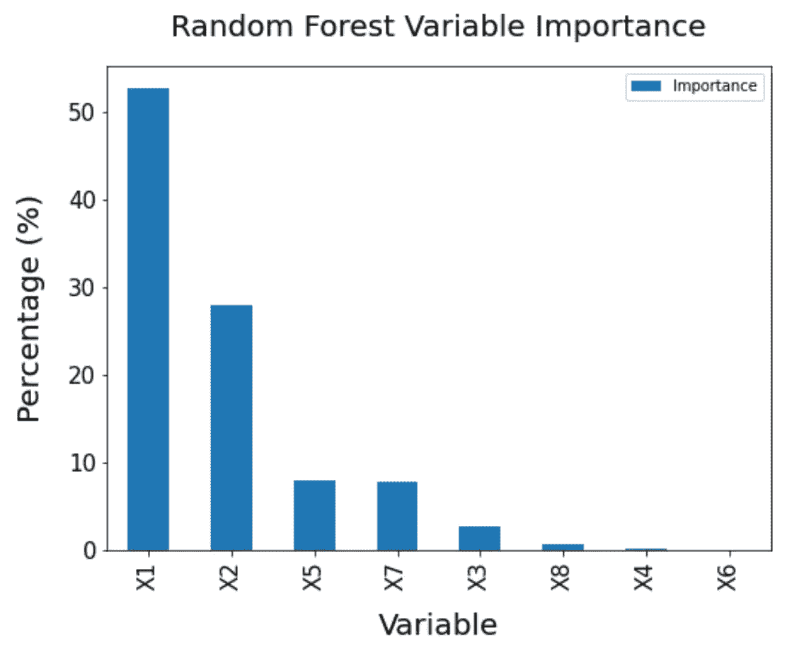

# 决策树和随机森林的非线性回归

> 原文：<https://towardsdatascience.com/non-linear-regression-with-decision-trees-and-random-forest-afae406df27d>

## UCL 数据科学学会研讨会 12b:决策树和随机森林在 Python 中的实现及性能评估


杰里米·毕晓普在 [Unsplash](https://unsplash.com?utm_source=medium&utm_medium=referral) 上的照片

今年，作为 UCL 数据科学协会的科学负责人，该协会将在整个学年举办一系列 20 场研讨会，主题包括数据科学家工具包 Python 简介和机器学习方法。每个人的目标是创建一系列的小博客文章，这些文章将概述主要观点，并为任何希望跟进的人提供完整研讨会的链接。所有这些都可以在我们的 [GitHub](https://github.com/UCL-DSS) 资源库中找到，并将在全年更新新的研讨会和挑战。

本系列的第十二次研讨会是对高级回归方法的介绍。这之前已经介绍了 Lasso 和 Ridge 回归，但是我们现在将介绍决策树和随机森林回归方法的实现。虽然亮点将在这篇博文中呈现，但完整的研讨会可以在我们的 GitHub 账户[上找到。](https://github.com/UCL-DSS/advanced-regression)

如果您错过了之前的任何研讨会，可以在这里找到:

</an-introduction-lasso-and-ridge-regression-using-scitkit-learn-d3427700679c>  </introduction-to-logistic-regression-predicting-diabetes-bc3a88f1e60e>  </linear-regression-in-python-for-data-scientists-16caef003012>  

## 回归树

决策树遵循树状结构(因此得名),其中节点代表特定属性，分支代表决策规则，主节点代表结果。这可以想象成类似于我们在高中数学中画的决策树，只是规模要复杂得多。该算法本身的工作原理是根据每个节点的不同属性分割数据，同时试图减少选择度量(通常是基尼指数)。本质上，使用回归树的目的是根据属性分割数据，然后使用这些属性来预测我们的目标变量结果。

使用与研讨会第一部分(建筑能效数据)相同的数据集，我们可以使用 scikit-learn 库实现它们，就像我们对 Ridge and Lasso regression 所做的那样。使用回归树的主要好处是，这些方法能够发现因变量和自变量之间的非线性关系，而以前的方法侧重于线性关系。当涉及到变量之间更复杂的关系时，这通常是有益的，但有时会以过度拟合以及时间和资源为代价！

我们可以像以前一样使用以下符号来拟合模型和数据:

```
#import the necessary module
from sklearn.tree import DecisionTreeRegressor#create the regression tree
reg_tree = DecisionTreeRegressor(random_state=42)
#fit the regression tree
reg_tree.fit(X_train, y_train)
```

这里的一个主要区别是，我们不再有每个参数的系数，因为这不再是一个线性模型。这意味着模型可能被描述为一个黑盒(取决于你允许决策树增长到多深)，因为我们不一定知道它是如何或者为什么以这种方式工作的。在这种情况下尤其如此，因为我们已经通过不限制它可以创建的深度而给了模型有效的自由支配。这意味着我们可以期望模型能够预测训练集中的所有值:

```
reg_tree.score(X= X_train, y = y_train)#out:
1.0
```

我们可以看到这种情况。因此，这可能是训练数据过度拟合的一个例子，由此我们的模型可能在看不见的数据上具有高方差。我们可以这样检查:

```
tree_predictions = reg_tree.predict(X_test)#R2 score
reg_tree.score(X=X_test, y=y_test)#out:
0.9965565405329665
```

在这种情况下值得注意的是，模型对未知数据的预测能力仍然存在，这表明在定型数据中看到的关系在未知数据中也非常明显。

在现实和许多其他数据集中，这是非常不可能的情况，因此我们很可能有极端过度拟合。限制这种情况的一种方法是控制决策树可以增长的程度，在这种情况下，可以使用`max_depth`参数来实现。我们可以这样做:

```
#create the regression tree
reg_tree_limit= DecisionTreeRegressor(random_state=42,
                                     max_depth = 5)
#fit the regression tree
reg_tree_limit.fit(X_train, y_train)print(reg_tree_limit.score(X= X_train, y = y_train))#out:
0.9911552954578272
```

模型拟合在训练数据上有所降低，但我们主要感兴趣的是它在看不见的数据上的表现:

```
print(reg_tree_limit.score(X_test, y_test))#out:
0.9882274019933065
```

这表明约束模型实际上在看不见的数据上表现更差。

这可以在更多看不见的数据上进一步探索，看看这是否在看不见的数据上的模型可变性方面成立。然而，虽然这是一个相当糟糕的示例，但您可以在这里看到，限制模型的深度已经限制了训练数据的得分(引入了一些偏差)，希望减少模型在看不见的数据上的潜在方差。另一个好处是，它还会限制模型实现所需的时间和资源。

可用于训练模型以提高其性能、降低其复杂性或提高其通用性的其他参数包括:

*   标准:衡量分割质量的标准
*   Splitter:在每个节点进行拆分的策略
*   Max_depth:树的最大深度
*   min_samples_split:拆分内部节点所需的最小样本数
*   min_samples_left:叶节点上所需的最小样本数
*   Max_Features:寻找最佳分割时要考虑的特征数量

这些参数的使用将取决于您的建模目标以及您的应用程序，即您希望将模型限制到什么程度，以及您有多少时间和能力来调整这些参数以提高模型拟合度。


吉利·斯图尔特在 [Unsplash](https://unsplash.com?utm_source=medium&utm_medium=referral) 上拍摄的照片

## 随机森林回归

随机森林回归可能是实现回归树的更好方法，前提是您有资源和时间来运行它。这是因为它是一种集成方法，这意味着它结合了多种不同算法(在这种情况下是决策树)的结果，以创建更准确的预测，并确保没有过度拟合。

其工作方式是限制输入到每个决策树的数据量和变量，这样他们就看不到全部数据。在我们的案例中，考虑到偏差和过度拟合，这有助于确保模型不会过度拟合数据，并且可以在模型中探索每个变量的重要性。当然，过度拟合仍然会发生，但是它试图减少这种可能性，就像单个决策树一样。

因此，这可以如下实现:

```
#import the necessary library 
from sklearn.ensemble import RandomForestRegressor#create the random forest
reg_random_forest = RandomForestRegressor(n_estimators = 10,
                                          random_state=0)
#fit the regression to the data
reg_random_forest.fit(X_train, y_train.values.reshape(-1))
```

然而，在我们检查模型在训练和测试数据上的性能之前:

```
print(reg_random_forest.score(X= X_train, y = y_train))print(reg_random_forest.score(X=X_test, y=y_test))#out:
0.999637869613283
0.9976901385082313
```

我们在这里可以看到，尽管模型在训练数据上的表现比决策树差，但它在测试数据上的表现实际上优于决策树。这是因为它没有完全学习原始数据(尽管它很接近)，这意味着它仍然能够很好地概括。

这个模型的另一个好处是，至少与决策树回归模型相比，它被描述为黑盒的可能性稍微小一些。这是因为它能够告诉我们模型中功能的重要性(它们对模型预测的贡献有多大)，虽然决策树可以做到这一点，但随机森林更可靠，因为创建了大量的树(较少基于随机机会)。这些值加起来等于 1，最大的特征告诉我们模型中最重要的变量。我们可以这样实现:

```
#extract the feature importance
feature_importances = pd.DataFrame(
    {"variables":X_train.columns.values,
     "Importance":reg_random_forest.feature_importances_*100})#sort the values by size
feature_importances.sort_values(by = "Importance",
                               inplace = True,
                               ascending=False)#plot the results
fig, ax = plt.subplots(1,1, figsize = (8,6))feature_importances.plot.bar(x = "variables",
                           y = "Importance", 
                             ax = ax)ax.set_title("Random Forest Variable Importance",
            fontsize = 20,
            pad = 20)
ax.set_ylabel("Percentage (%)",
             fontsize = 20,
             labelpad = 15)
ax.set_xlabel("Variable",
             fontsize = 20,
             labelpad = 15)ax.tick_params(axis = "both",
              which = "both",
              labelsize = 15)
```



作者图片

这里要考虑的一个重要因素是，尽管线性回归方法表明 X2 不重要，但这个模型表明 X2 非常重要。因此，我们可以假设，这是因为 X2 与我们的目标变量 Y1 具有非线性关系，这是标准线性回归方法所不能捕捉到的。

利用这一点，我们可以执行特征选择来删除不重要的变量。为此，有多种不同的方法，但两种常见的方法包括:

*   去除贡献小于 1%的变量
*   移除贡献小于随机变量的变量

最后，与决策树模型一样，我们可以调整参数以提高训练和测试数据的模型性能，这些参数包括:

*   森林中的树的数量
*   `criterion`:测量分割质量的功能
*   `max_depth`:单棵树的最大深度(和我们之前做的一样)
*   `min_samples_split`:分割内部节点所需的最小样本数

你可以在实践练习册中找到更多信息，可以在[这里](https://github.com/UCL-DSS/advanced-regression)找到，如果你愿意，你也可以在研讨会旁边提供的问题练习册中挑战自己。


照片由 [Irina Iriser](https://unsplash.com/@iriser?utm_source=medium&utm_medium=referral) 在 [Unsplash](https://unsplash.com?utm_source=medium&utm_medium=referral) 上拍摄

如果您想了解我们协会的更多信息，请随时关注我们的社交网站:

https://www.facebook.com/ucldata 脸书

insta gram:https://www.instagram.com/ucl.datasci/

领英:[https://www.linkedin.com/company/ucldata/](https://www.linkedin.com/company/ucldata/)

如果你想了解 UCL 数据科学协会和其他优秀作者的最新信息，请随时使用我下面的推荐代码注册 medium:

<https://philip-wilkinson.medium.com/membership>  

或者由我来查看其他商店:

</git-and-github-basics-for-data-scientists-b9fd96f8a02a>  </an-introduction-to-object-oriented-programming-for-data-scientists-879106d90d89>  </univariate-outlier-detection-in-python-40b621295bc5> 