# 非线性规划:理论与应用

> 原文：<https://towardsdatascience.com/nonlinear-programming-theory-and-applications-cfe127b6060c>

## 详细解释了基于梯度的线搜索优化算法，并用 Python 从头开始实现


照片由[在](https://unsplash.com/@visitalmaty?utm_source=medium&utm_medium=referral) [Unsplash](https://unsplash.com?utm_source=medium&utm_medium=referral) 参观阿拉木图

优化问题通常分为两大类:*线性和非线性规划，*这是 Luenberger & Ye (2008)的名著的书名。这些类别通过在目标函数或约束中是否存在非线性函数来区分，并导致非常不同的解决方法。在本文中，重点将放在第二类上。

在算法细节之前，我们将通过一些一般的优化概念来了解如何制定一个优化问题。一旦定义了这些概念，我们将深入到凸无约束问题中，在这里我们将看到局部极小的一般理论，并实现四种线搜索算法:*最速下降*、*共轭梯度*、*牛顿法*、*拟牛顿法* ( *BFGS* 和 *SR1* )。最后，我们将引入约束，并应用 *SLSQP* 的实现来解决一个受约束的例子。

对于那些对细节感兴趣的人来说，本文中使用的代码完全可以在这个 [GIT](https://github.com/bruscalia/optimization-demo-files/tree/main/convex) 存储库中找到。

# 优化问题的结构

为了公式化一个优化问题，必须定义一个目标 *f* ，它是一个向量决策变量 ***x*** 的函数，并且可能受到一些等式和不等式约束，这些约束也是 ***x*** 的函数。该目标通常在*最小化*的意义上定义，因此目标是找到其关于约束的最低值。当陈述*∈ω时， ***x*** 的每个分量的边界在公式中可能是明确的，其中ω是定义决策变量的极限的集合。*

*一般公式可以表述如下。*

*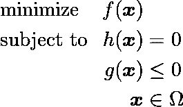*

*最优化问题的一般表述。(图片由作者提供)。*

*非线性规划有几个应用。一些最常见的是工程设计、控制、数据拟合和经济规划。这些应用通常共享一些关于问题结构的属性，使得凸优化算法非常有效。了解这些属性是什么以及算法将如何解释问题，对于执行优化任务非常有帮助，从制定问题到选择最合适的方法来解决它。因此，首先要做的是理解什么使得一个解*最优*。让我们在下一节中更好地理解它。*

*作为一名化学工程师，我创建了一个 [jupyter 笔记本](https://github.com/bruscalia/optimization-demo-files/blob/main/convex/example_xylene.ipynb)，其中有一个在催化反应器中最大化*邻二甲苯*产量的例子，供那些有兴趣看到一些应用的人使用。*

# *无约束问题:局部最优的条件*

*在局部优化问题中，我们寻找一个比它的邻居更好的解决方案。在无约束最小化问题中，由于没有*不可行*规则，我们寻找一个目标值比它的邻居更低的解。定义这种解决方案有两个必要条件(Nocedal & Wright，2006):*

1.  *如果 ***x*** *** 是局部极小点且 *f* 在***x******∇*f*一定等于零。*
2.  *如果目标 *f* 相对于 ***x* ，**的 Hessian 矩阵存在并且在 ***x*** *** 的开邻域内连续，那么矩阵∇ *f* 一定是半正定的。*

*更简单地说，目标函数相对于 ***x*** 的斜率在局部最优中为零，并且当它改变时，它在任何搜索方向上上升。从视觉上看，就像下图。*

*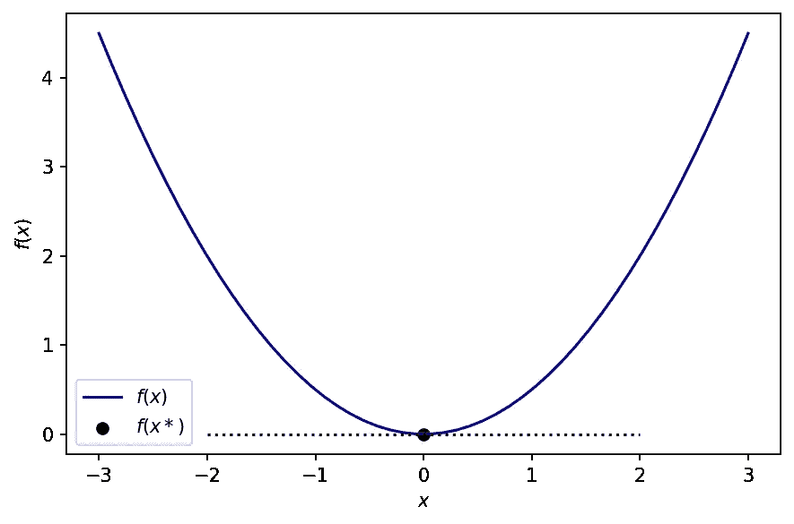*

*局部最优。(图片由作者提供)。*

*贯穿本文，在例题中，目标函数将被表征为 ***x*** 中的二次抛物线函数，定义为。*

*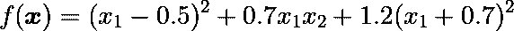*

*示例中使用的目标函数。(图片由作者提供)。*

*从视觉上看，它是这样的。*

*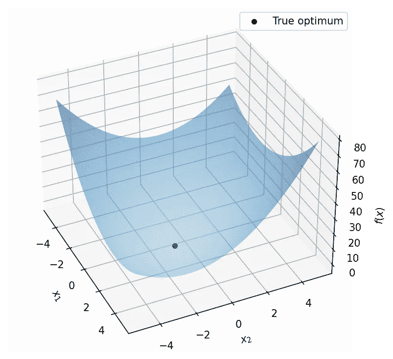*

****x*** *中的目标函数。(图片由作者提供)。**

*用 Python 代码。*

```
*def obj_fun(x):
    return (x[0] - 0.5) ** 2 + 0.7 * x[0] * x[1] \
        + 1.2 * (x[1] + 0.7) ** 2

def gradient_fun(x):
    return np.array([2 * (x[0] - 0.5) + 0.7 * x[1], \
        0.7 * x[0] + 2 * 1.2 * (x[1] + 0.7)])*
```

# ***一般框架***

*基于梯度(或下降)的算法的特征在于迭代过程，其中从初始点开始；根据固定规则确定运动方向；然后在该方向上移动到该线上目标函数的(相对)最小值。在新的点上，确定一个新的方向，并重复这一过程(Luenberger & Ye，2008)。*

*在最小化问题中，这类似于下坡下降过程，其中重力将物体拉向局部地理最小值。在本文讨论的算法中，目标函数的梯度扮演了重力的角色(或者至少与之类似)。*

*执行这些迭代有两个基本策略:*线搜索*和*信赖域。*在某种意义上，线搜索和信赖域方法的不同之处在于它们选择移动到下一次迭代的方向和距离的顺序。线搜索从固定方向开始，然后确定适当的距离。在信赖域中，我们首先选择一个最大距离，即信赖域半径，然后寻找一个方向和步骤，在这个距离约束下获得可能的最佳改进。如果这一步证明是不令人满意的，我们减少距离的措施，并再次尝试(Nocedal &赖特，2006)。在本文中，*线搜索*方法将被提出，接下来用数学术语描述。*

*让我们将 ***x*** 定义为优化变量的向量，将 ***p*** 定义为由某个未知规则定义的搜索方向，将 *α* 定义为向相对最优值给出令人满意的前进的相对步长。然后，在每次迭代 *k* 时，我们必须递归地更新当前解，如下式所示。*

*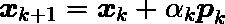*

*向搜索方向前进。(图片由作者提供)。*

*当在两次连续迭代之间，目标函数的改进、在 ***x*** 中的位置或者两者都小于用户指定的容差时，算法停止。*

*如果这个描述让你想起了*神经网络*优化器，比如*随机梯度下降*、*亚当*和 *RMSProp* ，那就很有意义了。这些算法使用梯度信息在*损失函数*的最小化意义上更新模型参数。然而，没有线搜索，所以 *α* 由与学习速率和收敛相关的一些规则来定义。此外，还有一个动量项，它将来自先前搜索方向的信息与每次迭代的当前梯度值相结合，这与*共轭梯度有一些相似之处。**

*在整篇文章中，我们将基于一个通用框架实现算法: *DescentAlgorithm* ，用下面的代码表示。*

```
*import numpy as np
from scipy.optimize import minimize, line_search, BFGS, SR1
from numdifftools import Gradient

class DescentAlgorithm:

    def __init__(self, fun, gradient=None, hess=None, nd={},
                 wolfe_c1=1e-4, wolfe_c2=0.1, x_tol=1e-6,
                 f_tol=1e-6, max_iter=50, save_history=False):

        self.fun = fun

        if gradient is None:
            self.gradient = Gradient(fun, **nd)
        else:
            self.gradient = gradient

        self.hess = hess
        self.wolfe_coefs = wolfe_c1, wolfe_c2
        self.x_tol = x_tol
        self.f_tol = f_tol
        self.max_iter = max_iter
        self.save_history = save_history
        self.history = []

    def optimize(self, x0, *args, **kwargs):

        x0 = np.atleast_1d(x0).astype(float)
        self.history = []
        xk = x0.copy()
        fk = self.fun(x0, *args, **kwargs)
        gradk = self.gradient(x0, *args, **kwargs)

        fc, gc = 1, 1

        pk = self.prepare_initial_step(xk, fk, gradk, *args,
                                       **kwargs)

        advance_x, advance_f, advance_max = True, True, True
        k = 0

        if self.save_history:
            self.history.append({"x":xk, "f":fk, "grad":gradk})

        while (advance_x or advance_f) and (k <= self.max_iter):

            alpha, fc_, gc_, fnew, fk, gradnew \
                = line_search(self.fun, self.gradient,
                              xk, sk, gradk, fk, args=args,
                              c1=self.wolfe_coefs[0],
                              c2=self.wolfe_coefs[1],
                              maxiter=15)

            if alpha is None:
                alpha = 1
                fnew = self.fun(xk + alpha * sk, *args, **kwargs)
                gradnew = self.gradient(xk + alpha * sk, *args,
                                        **kwargs)

            xnew = xk + alpha * pk
            fc = fc + fc_
            gc = gc + gc_

            if gradnew is None:
                gradnew = self.gradient(xnew, *args, **kwargs)

            advance_f = abs(fnew - fk) > self.f_tol
            advance_x = np.linalg.norm(xnew - xk) > self.x_tol

            xk, fk, gradk, pk = \
                self.prepare_next_step(xk, fk, gradk, pk,
                                       xnew, fnew, gradnew,
                                       *args, **kwargs)
            k = k + 1

            if self.save_history:
                self.history.append({"x":xk, "f":fk, "grad":gradk})

            if np.linalg.norm(pk) < np.sqrt(np.finfo(float).eps):
                self.message = 'Negligible step'
                self.success = True
                break

        if not (advance_x or advance_f):
            self.success = True
            self.message = 'Tolerance reached'

        elif k > self.max_iter:
            self.success = False
            self.message = 'Max iterations reached'

        self.x = xk
        self.f = fk
        self.grad = gradk
        self.fc = fc
        self.gc = gc
        self.result = {"x":xk, "f":fk, "grad":gradk, "iter":k,
                       "message":self.message,
                       "success":self.success}

    def prepare_next_step(self, xk, fk, gradk, pk, xnew, fnew, 
                          gradnew, *args, **kwargs):
        pass

    def prepare_initial_step(self, xk, fk, gradk, *args, **kwargs):
        pass*
```

*注意，作为一个通用框架， *DescentAlgorithm* 仍然缺少如何选择搜索方向的实现，这对于每个算法来说都是特定的。此外，如果没有提供梯度函数，来自*numdiftools*的类*梯度*将被导入以计算数值导数。*

*在上面的框架中，*scipy . optimize . line _ seach*用于计算每次迭代的相对步长。在本文中从头实现它可能太广泛了，但是在下一节中，将介绍线搜索的主要概念。*

# *线搜索*

*当计算 *α* 时有一个折衷，因为尽管希望获得搜索方向上的最佳解，但这可能导致大量的函数求值，这通常是不希望的，因为这些函数可能很复杂并且计算代价很高。因此，定义 *α* 的最常见策略是通过包围和插值迭代，直到满足某些收敛条件。*

*最常见的收敛条件是*沃尔夫条件*。首先，让我们定义一个单变量函数 *φ* ( *α* )，它根据步长沿着搜索方向计算目标函数。*

*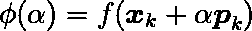*

*线搜索功能。(图片由作者提供)。*

**Wolfe 条件*规定目标函数的值必须小于原点的函数(由参数 *c1* 控制)，目标函数的曲率也必须如此(由参数 *c2* 控制)。Nocedal & Wright (2006)的建议是对 *c1* 使用 1e-4，对*牛顿*和*拟牛顿*方法定义 *c2* 等于 0.9，而对*共轭方向*和*最陡下降*为 0.1。*

*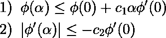*

*线搜索的 Wolfe 条件。(图片由作者提供)。*

*从视觉上看，它如下图所示，起点用黑色表示，违反 *Wolfe 条件*的点用红色表示，适当的步长用绿色表示。*

*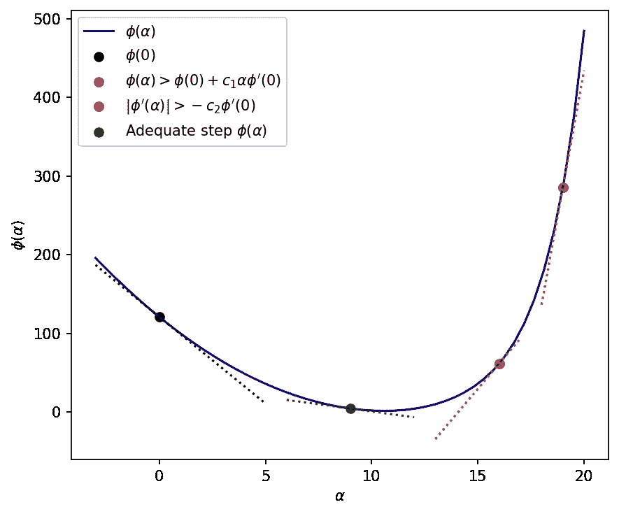*

*满足 Wolfe 条件的步长选择。(图片由作者提供)。*

# *使用梯度信息:最速下降*

> *最陡下降方向- *∇* f 是直线搜索法最明显的搜索方向选择。这是很直观的:在我们可以移动的所有方向中，它是 f 下降最快的方向(Nocedal & Wright，2006)。*

*因此，让我们将*最速下降*算法定义为选择一点梯度的负值作为搜索方向的算法。*

*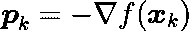*

*最陡下降搜索方向。(图片由作者提供)。*

```
*class SteepestDescent(DescentAlgorithm):

    def prepare_next_step(self, xk, fk, gradk, pk, xnew, fnew,
                          gradnew, *args, **kwargs):
        return xnew, fnew, gradnew, -gradnew

    def prepare_initial_step(self, xk, fk, gradk, *args, **kwargs):
        return -gradk*
```

*让我们用我们的框架来解决这个问题。*

```
*steepest = SteepestDescent(obj_fun, gradient=gradient_fun,
                           save_history=True)

steepest.optimize(x0)*
```

*解决方案存储在实例*最陡*的属性*结果*中，我们可以访问属性*历史*中的步骤历史。从视觉上看，达到最佳状态的步骤如下所示。*

*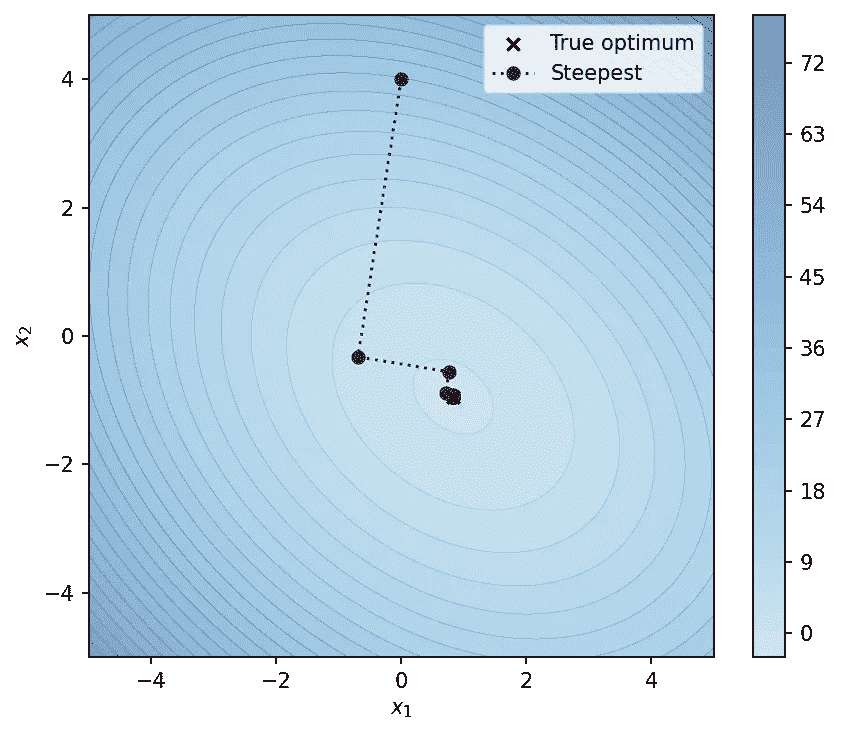*

*使用最速下降的优化步骤。(图片由作者提供)。*

*注意，不一定当前迭代的梯度信息足以将解引向局部最小值。在本例中，该算法经过 13 次迭代才达到 1e-6 的容差。在下一个示例中，我们将通过使用来自先前搜索方向的信息来改进搜索并减少必要的迭代次数，从而使算法收敛得更快。*

# *共轭梯度*

> *共轭方向法可以认为是介于最速下降法和牛顿法之间的一种方法。他们的动机是希望加速与最陡下降相关的典型的缓慢收敛，同时避免与评估相关的信息要求(Luenberger & Ye，2008)。*

*这些方法是基于纯二次函数设计的，因此，在我们的优化问题中，预期性能会很好。*

*使用*Fletcher–Reeves 方法*在迭代 *k* 时的搜索方向规则如下。*

*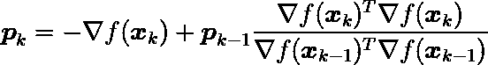*

*共轭梯度中的搜索方向。(图片由作者提供)。*

*用 Python 代码，可以做到如下。*

```
*class ConjugateGradient(SteepestDescent):

    def prepare_next_step(self, xk, fk, gradk, pk, xnew, fnew,
                          gradnew, *args, **kwargs):
        return xnew, fnew, gradnew, -gradnew + \
            pk * gradnew.dot(gradnew) / gradk.dot(gradk)*
```

*解决同一个问题，*共轭梯度*产生了惊人的结果，仅在两次迭代内就收敛到局部最优。这是意料之中的，因为正如我所提到的，算法是基于二次函数的性质设计的，并且，在这些函数中，它被期望在 *n* 次迭代内收敛，这是 *n* 个决策变量的数目。*

*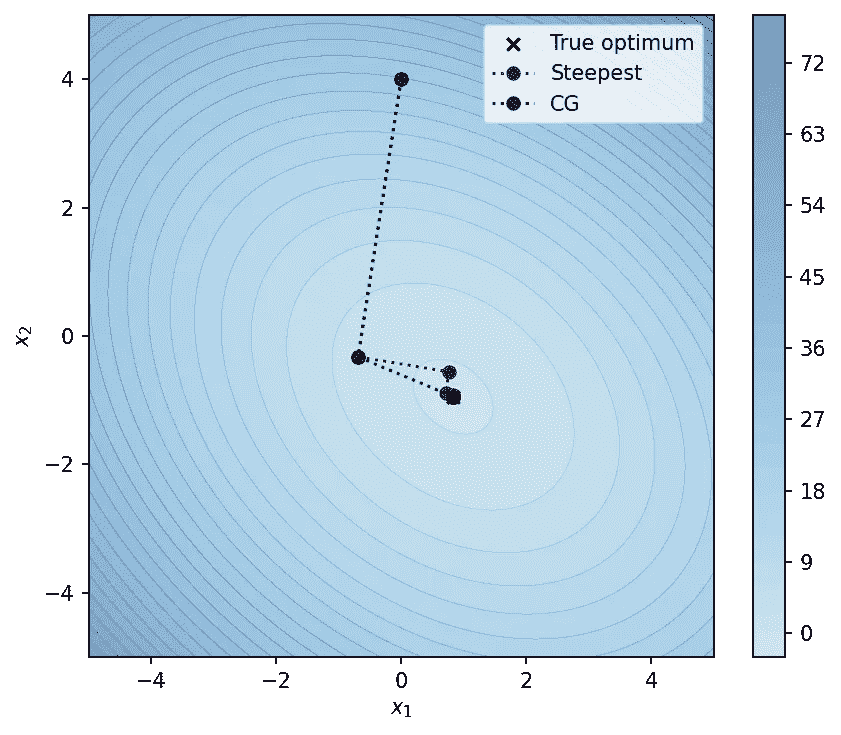*

*共轭梯度对最速下降优化结果。(图片由作者提供)。*

*在下一节中，我们将看到，在定义搜索方向时，通过使用曲率信息的力量，事情可以得到更大的改善。*

# *牛顿方法*

> *牛顿方法背后的思想是，被最小化的函数 f 由一个二次函数局部逼近，而这个逼近函数被精确地最小化。因此，在 k 附近，我们可以通过截断的泰勒级数来近似 f(luen Berger&Ye，2008)。*

*截断的泰勒级数由下面的等式表示。*

*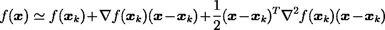*

*泰勒级数对函数的截断二次逼近。(图片由作者提供)。*

*因此，在索引 *k* 的迭代中，搜索方向 ***p*** 定义如下。*

*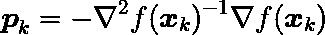*

*牛顿法中的搜索方向。(图片由作者提供)。*

*在二次函数的情况下，这导致目标函数 *f* 的精确优化器。*

*让我们在我们的框架中实现它。*

```
*class Newton(DescentAlgorithm):

    def __init__(self, fun, gradient=None, hess=None, nd={},
                 wolfe_c1=1e-4, wolfe_c2=0.9,
                 x_tol=1e-6, f_tol=1e-6, max_iter=50,
                 save_history=False):

        if hess is None:
            raise TypeError("Must provide hessian")

        super().__init__(fun, gradient=gradient, hess=hess, nd=nd,
                         wolfe_c1=wolfe_c1, wolfe_c2=wolfe_c2,
                         x_tol=x_tol, f_tol=f_tol,
                         max_iter=max_iter,
                         save_history=save_history)

    def prepare_next_step(self, xk, fk, gradk, pk, xnew, fnew,
                          gradnew, *args, **kwargs):
        H = self.hess(xnew, *args, **kwargs)
        return xnew, fnew, gradnew, np.linalg.solve(H, -gradnew)

    def prepare_initial_step(self, xk, fk, gradk, *args, **kwargs):
        H = self.hess(xk, *args, **kwargs)
        return np.linalg.solve(H, -gradk)*
```

*而现在，在解决问题之前，我们必须定义一个函数 ***x*** 返回*黑森*矩阵∇ *f* ( *x* )。*

```
*def hess_fun(x):
    return np.array([[2., 0.7],
                    [0.7, 2\. * 1.2]])*
```

*而且真的只需要一次迭代…*

**

*牛顿法与共轭梯度优化结果的比较。(图片由作者提供)。*

*当然，其他目标函数而不是二次函数将需要更多的迭代来优化，但它仍然是一个强大的方法，背后有美丽的数学。*

*在下一节中，我们将看到一些避免明确计算 *Hessian* 矩阵的策略。*

# *拟牛顿*

> *拟牛顿法提供了一种替代牛顿法的有吸引力的方法，因为它们不需要 Hessian 计算，但仍能达到超线性收敛速度。代替真正的 Hessian，他们使用一个近似值，它在每一步之后更新，以考虑在该步骤中获得的额外知识。这种更新利用了梯度的变化提供了目标沿搜索方向的二阶导数的信息(Nocedal & Wright，2006)。*

*在这些方法中，搜索方向的定义几乎与*牛顿法*中的规则相同。然而，我们将使用近似矩阵 *B* ，而不是使用真正的 *Hessian* 。*

*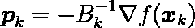*

*拟牛顿法中的搜索方向。(图片由作者提供)。*

*矩阵 *B* 由单位矩阵乘以某个常数初始化，然后在每次迭代中递归更新。两种最常见的更新方法是 *BFGS* 和 *SR1* 。两者都在 *scipy* 中使用类 *HessianUpdateStrategy* 的白色标签结构实现。在我们的实现中，我们将使用 *BFGS* 、 *SR1* ，或者在 *scipy 的*结构中使用自定义的 *HessianUpdateStrategy* 。算法如下。*

```
*class QuasiNewton(Newton):

    def __init__(self, fun, gradient=None, hess=None, nd={},
                 wolfe_c1=1e-4, wolfe_c2=0.9,
                 x_tol=1e-6, f_tol=1e-6, max_iter=50,
                 save_history=False):

        if hess is None:
            hess = BFGS(exception_strategy="damp_update",\
                        min_curvature=0.2)

        super().__init__(fun, gradient=gradient, hess=hess, nd=nd,
                         wolfe_c1=wolfe_c1, wolfe_c2=wolfe_c2,
                         x_tol=x_tol, f_tol=f_tol,
                         max_iter=max_iter,
                         save_history=save_history)

    def prepare_next_step(self, xk, fk, gradk, pk, xnew, fnew,
                          gradnew, *args, **kwargs):
        self.hess.update(xnew - xk, gradnew - gradk)
        H = self.hess.get_matrix()
        return xnew, fnew, gradnew, np.linalg.solve(H, -gradnew)

    def prepare_initial_step(self, xk, fk, gradk, *args, **kwargs):
        self.hess.initialize(xk.shape[0], "hess")
        H = self.hess.get_matrix()
        return np.linalg.solve(H, -gradk)*
```

**BFGS* 和 *SR1* 更新的方程式如下所述。*

*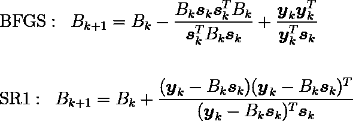*

*BFGS(上)和 SR1(下)的 Hessian 更新。(图片由作者提供)。*

*其中， ***y*** 对应迭代 *k* 和 *k* -1 之间的梯度变化，而 ***s*** 对应同样两次迭代之间 ***x*** 的变化。*

*在使用 *BFGS* 更新的解决方案中，有趣的事情发生了。使用 *c2* =0.9 的推荐值，可以接受相对较小的搜索步长，尽管搜索方向指向精确的最小值，但解决方案仍需要一次迭代才能达到。然而，使用更具限制性的值 *c2* =0.1，正如预期的那样，它在两次迭代中收敛。这些结果如下所示。*

*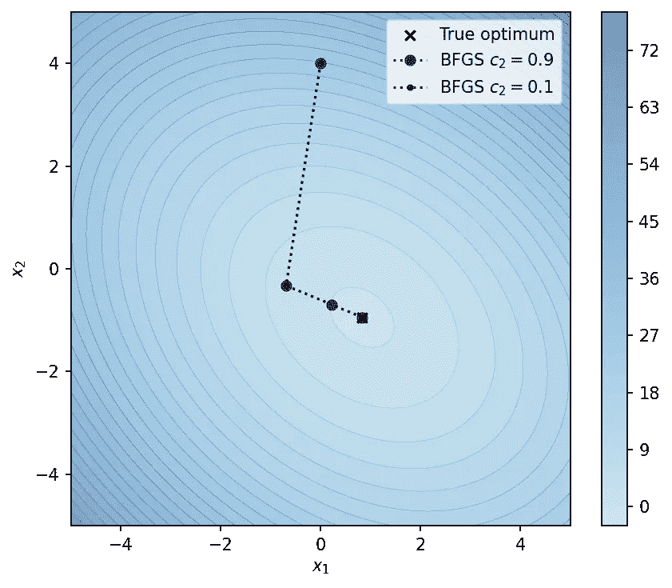*

*使用 Wolfe 第二条件的两个不同值的 BFGS 的优化结果。(图片由作者提供)。*

*在理解了无约束优化是如何工作的之后，在下一节中，让我们深入了解一下*约束优化*。*

# *约束最优化和拉格朗日乘子*

*本节讨论了约束优化的一些理论基础，但是，如果您只对*动手*感兴趣，我建议您跳过它，直接进入实现示例。*

*如在公式化一般优化问题时所描述的，有两种可能的约束类型:等式约束和不等式约束。*

> *一个基本的概念，提供了大量的洞察力以及简化所需的理论发展是一个积极的约束。如果不等式约束等于零，则称其在可行点 **x** 处有效，如果小于零，则称其无效。按照惯例，我们将任何等式约束称为在任何可行点都有效(Luenberger & Ye，2008)。*

*在约束优化问题中，搜索空间受到给定点 ***x*** 处的活动约束的限制。这导致类似于无约束等价的一阶条件。投影在可行搜索空间的切线超平面中的目标函数的梯度在局部最优中必须等于零。在下面的等式中，考虑 ***h*** 包括最优中的等式和主动不等式约束，以及*y 在切线超平面上的搜索方向。**

**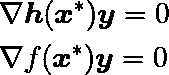**

**约束优化问题局部最优的搜索空间定义。(图片由作者提供)。**

**所以在局部最小值中，*f*(***x******)是主动约束的梯度的线性组合，这就导致了*拉格朗日乘子*的引入，如此，*拉格朗日函数*。**

**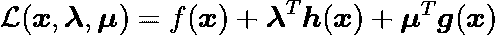**

**约束优化问题的拉格朗日函数。(图片由作者提供)。**

**其中， ***λ*** 和 ***μ*** 为等式和不等式约束的相应*拉格朗日乘子*的向量。在这个公式中，不等式表述为***g***(***x***)≤0，这就导致了它们对应的*拉格朗日乘数* ***μ*** ≤0 的条件。因此，对于不活动的不等式约束，通过设置*= 0，而对于活动约束***g***(***x***)= 0，来实现表示为*互补松弛度*的条件。***

**凸约束优化的一阶和二阶最优性必要条件的类似条件是:**

1.  **∇𝓛( ***x*** **、* ***λ*** *、* ***μ*** )相对于 ***x*** 必须等于零，并考虑到*互补松弛度*。**
2.  **∇ 𝓛( ***x*** **，* ***λ*** *，* ***μ*** )相对于 ***x*** 必须是半正定的。**

**对理论方面感兴趣的，推荐阅读 Nocedal & Wright (2006)和 Luenberger & Ye (2008)的著作。但是，现在让我们深入研究一个应用程序…**

# **一个约束问题和 SLSQP**

**在这一节中，我们将为我们的优化问题引入一个非线性约束，使得无约束最优不可行。在本例中，它将由 ***x*** 中的一个几何圆定义，半径平方为 3，以原点为中心。**

**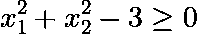**

**例子的不等式约束。(图片由作者提供)。**

**在*scipy . optimize*minimize 函数中，不等式必须定义为大于或等于零。因此，示例约束必须按如下方式实现。**

```
**def cons_fun(x):
    return (x ** 2).sum() - 3

def cons_grad(x):
    return 2 * np.array(x)**
```

**现在我们的问题是这样的。**

**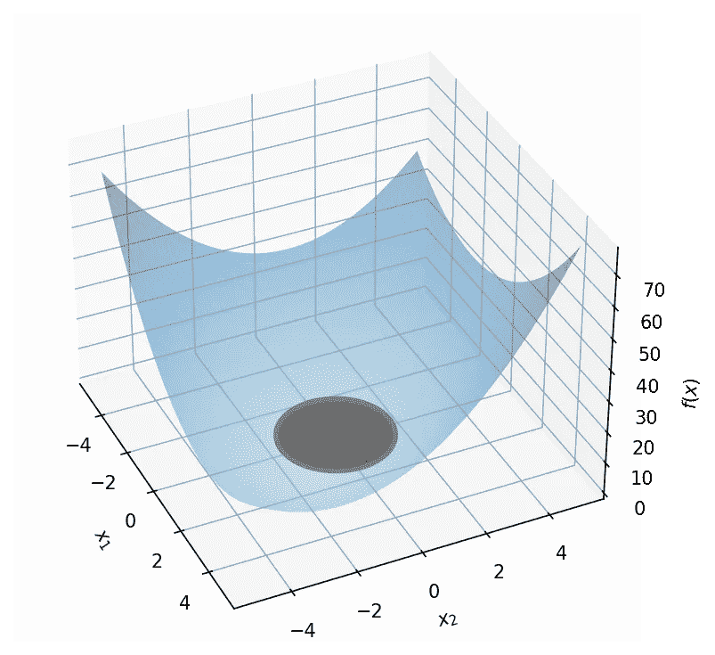**

*****x*** *中的目标函数和约束区域。(图片由作者提供)。***

**我们将使用 *SLSQP* 的 *scipy* 实现来解决这个问题，该算法使用*拉格朗日乘数*的信息来定义搜索方向。为此，我们将从 *scipy.optimize* 中调用*最小化*函数。**

```
**sol_cons = minimize(
    obj_fun, x0, jac=gradient_fun,
    constraints={"type":"ineq", "fun":cons_fun, "grad":cons_grad},
    method="SLSQP",
)**
```

**解决方案如下所示。**

**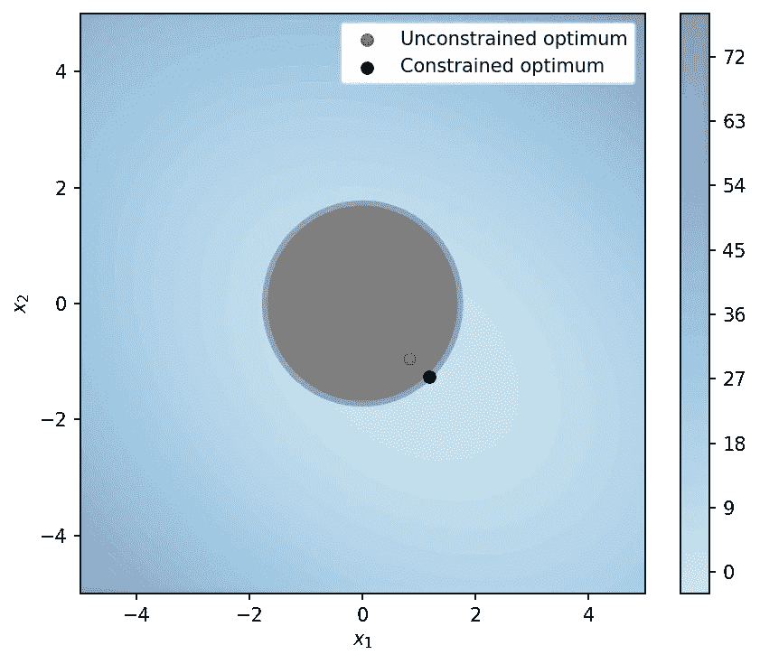**

**用 SLSQP 和相应的无约束优化解约束问题。(图片由作者提供)。**

**对于那些对细节感兴趣的人来说，*序列最小二乘规划* ( *SLSQP* )是由 Dieter Kraft (1988)提出的一种算法，它使用原始-对偶策略，通过最小二乘法迭代地解决二次子问题。它与*拟牛顿*方法有许多相似之处，但是相对于*用*拉格朗日函数*的*Hessian*代替目标函数的 *Hessian* ，并添加约束，通过约束的线性近似来限制可行搜索空间。它使用一种活动集策略，其中新的活动约束或者基于阻塞条件被添加或者基于它们的拉格朗日乘数被移除到活动集，并且步长使用价值函数来定义。序列二次规划的细节也可以在 Boggs & Tolle (1996)和 Nocedal & Wright (2006)找到。***

# **进一步阅读**

**有些问题需要不同的方法，而不是非线性凸优化。例如，非凸、多模态、不可微和多目标问题提出了一些有趣的挑战。群体和进化计算通常是解决这类问题的有效方法。因此，对于有兴趣探索这些话题的人，我建议做一些关于*粒子群优化*、*遗传算法*、*差分进化*及其应用的研究。**

**您可以在下面的文章中找到差分进化的概述以及一些有趣的应用。**

**</pymoode-differential-evolution-in-python-78e4221e5cbe>  </differential-evolution-an-alternative-to-nonlinear-convex-optimization-690a123f3413>  

# 结论

本文详细阐述了凸非线性优化的相关理论，并用实际的实现例子进行了说明。基于无约束梯度的算法已经从零开始实现，而约束算法的已建立的实现被应用于示例问题。整篇文章中使用的代码完全可以从这个 [GIT](https://github.com/bruscalia/optimization-demo-files/tree/main/convex) 库中获得。

# 参考

博格斯，P. T .和托尔，J. W .，1996 年。序列二次规划。*《数字学报》，*第 4 卷，第 1–51 页。

H. S .福格勒，1999 年。*化学反应工程原理。第三版。上马鞍河(新泽西州):普伦蒂斯霍尔 PTR。*

卡夫，d .，1988 年。*序列二次规划软件。*s . l:Wiss。DFVLR。

Luenberger，D. G. & Ye，y .，2008 .*线性与非线性规划。*第 3 版。斯坦福:斯普林格。

Nocedal，J. & Wright，S. J .，2006 .*数值优化。*第 2 版纽约:斯普林格纽约。**