# 非线性收缩:导论

> 原文：<https://towardsdatascience.com/nonlinear-shrinkage-an-introduction-825316dda5b8>

## 高维统计

## 高维空间中的最优协方差矩阵估计

统计学、机器学习以及金融和生物学等其他领域的任何应用都需要对协方差矩阵进行精确估计。然而，如今许多这些应用涉及高维数据，因此通常的(样本)协方差估计器不再适用。因此，在过去的二十年里，无数的论文一直试图解决这个问题。这项研究中出现的一个非常有效的方法是“非线性收缩”([1])。在本文中，我将重点放在这种方法的最新版本上，即[2]中的二次逆收缩(QIS ),它使得非线性收缩易于实现并且计算速度快。

让我们从基本介绍开始(如果你已经处理过协方差矩阵，你可以安全地跳过这一节)。

## 基础知识

协方差矩阵收集两个或多个随机变量的方差和协方差。也就是说，如果我们观察随机变量 *X_1、X_2* 和 *X_3* ，那么协方差矩阵给出为:

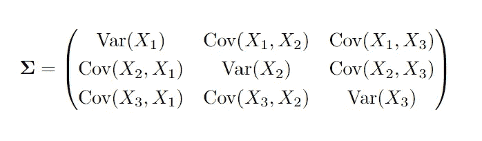

由于*x1*和*x2*和*x2*和*x1*之间的协方差相同，所以矩阵必然是对称的。从线性代数中，我们还知道这个矩阵有一个所谓的*特征分解*，即，

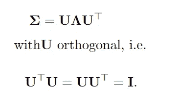

这里重要的部分是λ矩阵，它是一个包含协方差矩阵特征值的对角矩阵:

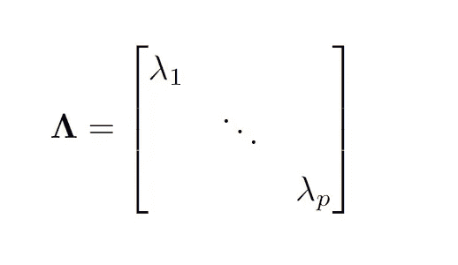

因此，我们不仅可以对角化协方差矩阵，而且这些对角元素包含重要信息。例如，他们立即告诉我们协方差矩阵的秩:它只是非零特征值的数量。如果矩阵具有满秩，即如果所有特征值都大于零，则意味着随机变量完全分散在 *p* 维空间中。这也非常有用，因为

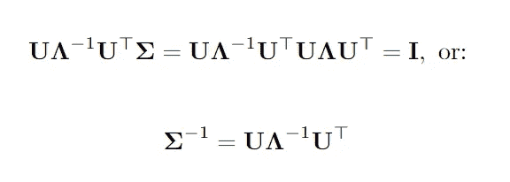

特别地，我们看到协方差矩阵是可逆的当且仅当所有特征值不为零，或者矩阵的秩为 *p* 。

> 每个对称矩阵都可以分解成正交矩阵和一个(实)对角矩阵的乘积。对角矩阵的值揭示了重要的性质，并且可以用来容易地计算逆矩阵(如果它存在的话)。

## 问题是

假设现在我们有一个样本，样本中有 *n* 个独立同分布的随机向量，预期值为零(只是为了简单起见)。*p×p*协方差矩阵可以通过通常的样本协方差矩阵(scm)来估计:

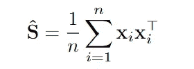

如果数据遵循高斯分布，这就是最大似然估计。这种估计器具有各种有利的特性，特别是当 *n* 趋于无穷大并且 *p* 保持不变(或者相对于 *n* 缓慢增长，使得 *p/n* 趋于零时，这种估计器会收敛到真实值。

但是，请注意，在上面的矩阵中，我们有*个 p*(p-1)/2 个*元素要估计。 *p*(p-1)* 是从 *p* 中选择两个元素的方式数，然后我们除以 2，因为矩阵是对称的。在一个 *n* 的样本中，如果 *n* 不比 *p* 大多少，这就会成为一个问题！当 T21 发生时，这是最容易看到的。在这种情况下，scm，一个 *p x p* 矩阵，可以显示为最多具有秩 *n < p* 。特别是，即使真正的协方差矩阵是可逆的(=所有特征值都大于零)，scm 也会有 *p-n* *零*个特征值，因此永远不可逆。因此，如果您需要估计协方差矩阵的逆矩阵，如在线性判别分析或计算高斯密度值时，这是一个问题。

这可能有些极端，但是即使你有 *p=n/2* ，scm 的估计误差也可能很大。现在让我们来看一个解决这个问题的强有力的方法。

## 解决方案

我有点紧张了。当然，这个问题有很多很多的解决方案，根据具体情况，有些方案比其他方案更有效。即使只是改变你衡量成功的方式，也可以改变方法的顺序。

一个可以说是简单的想法导致了无数的研究和应用，那就是将 scm 和单位矩阵进行线性组合:

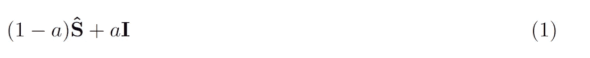

收缩强度 *a* 可以以多种方式选择，尽管最常见的是根据理论考虑从数据中自动选择。如果我们考虑单位和 scm 的特征分解，我们已经看到一些奇特的东西:

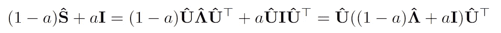

也就是说，我们只是有了新的特征值，它们是 scm 特征值的一个凸组合和一个凸组合*。所以如果第 *i* 个特征值是 2，那么正则化值现在是 *(1-a)*2 + a*1* 。特别地，由于 scm 的最小特征值是 0，最小正则化特征值现在是 *a* 。所以只要 *a > 0* 成立，正则化矩阵就永远是可逆的！L2 正则化回归中的公式可能也是熟悉的:*

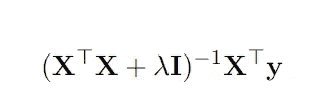

在这些收缩方法中，特征向量保持不变但特征值被修改的原则是重要的。这是有意义的，因为当 *p* 接近或大于 *n* 时，通常不可能正确估计所有参数。但是 *p* 本征值是另一回事，并且可能是可以达到的。这是非线性收缩背后的基本思想，它将这一点推进了一步。

> 估计高维的特征向量是无望的。因此，一个重要的原则是调整特征值，只保留特征向量不变。

在上面的线性收缩中，如果我们选择 *a* “正确”，当 *n* 和 *p* 一起趋于无穷大时，我们实际上可以在渐近极限中实现最佳性能。这是在 2004 年的一篇论文([3])中建立的，并且显示了如果估计类是上面的线性估计，则是最优特征值估计。也就是说，当 *a* 变化时，线性收缩估计量的类别仅仅是形式(1)的所有估计量。

非线性收缩在一个更大的类中导出一个渐近估计量(不需要仅仅是 scm 的线性函数)。特别是，它解决了这个问题

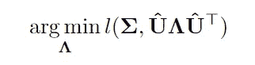

其中 l 是损失函数。换句话说:如果我们只被允许使用 scm 的*特征向量*，我们正在寻找使结果矩阵尽可能接近真实协方差矩阵的(压缩)特征值的选择！正如我们之前看到的，线性收缩是这种情况的特例，因为我们也只改变那里的特征值。然而，现在我们确定 Lambda 的方法不再局限于线性，提供了更大的灵活性！

有趣的是，上述(无法实现的)最优解非常直观:

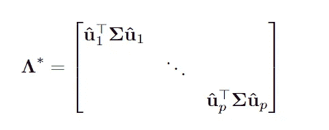

其中 *u_j* 仅仅是之前的样本特征向量:

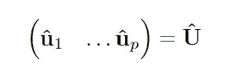

也就是说，在这种情况下，特征值的最佳解不是真实的，而是我们将 scm 特征向量应用于真实协方差矩阵时获得的值。

> 对于一系列损失函数，我们能做的最好的事情是估计当样本特征向量应用于真实协方差矩阵时产生的值。

原来非线性收缩法能够在 *n，p* 一起趋于无穷大时，一致地估计这些最优元素！现在让我们看一个例子。

## 代码示例

所以非线性收缩理论上很美，但实际上能用吗？这就是最近两篇论文的来源，它们将非线性收缩从一个计算繁重的幻想想法带入了现实世界。特别是“QIS”法(二次逆线性收缩，[2])只用几行代码就能计算出来！但是你甚至不需要这样做，因为所有必要的代码都可以在这里得到。

让我们看一个 R 中的应用程序，使用 [qis](https://github.com/MikeWolf007/covShrinkage/blob/main/qis.R) 函数。在本例中，我们采用一个具有挑战性的真实协方差矩阵

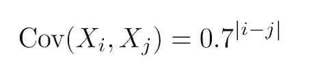

特别是方差为 1，指数 *i* 和 *j* 越远，它们之间的协方差越小。因此，当我们向右移动时，协方差矩阵的元素以指数方式接近零，但是它们中的许多仍然是更大的零。我们在这个例子中用 *n=800* 和 *p=1000* ，这样 *p > n* 。

```
library(mvtnorm)
source("qis.R")set.seed(1)n<-800
p<-1000
rho<-0.7# Generate the covariance matrix
Sig<-sapply(1:p, function(i) {sapply(1:p, function(j) rho^{abs(i-j)} ) }  )# Take the eigendecomposition of the true covariance matrix
spectral<-eigen(Sig)# Simulate data
X<-rmvnorm(n = n, sigma = Sig)# Take the eigendecomposition of the scm
samplespectral<-eigen(cov(X))# Use QIS and take the eigendecomposition
Cov_qis <- qis(X)
qisspectral<-eigen(Cov_qis)# Rename
qisspectral$U<-qisspectral$vectors
qisspectral$Lambda<-qisspectral$values# Want u_j'*Sig*u_j for all j=1,...,p
whatwewant<-diag( t(qisspectral$U)%*%Sig%*%qisspectral$U  )#check on first value whether its really calculated correctly
(whatwewant[1]-t(qisspectral$U[,1,drop=F])%*%Sig%*%qisspectral$U[,1,drop=F])
```

该代码模拟来自 1000 维多元正态分布的数据，并计算样本协方差矩阵及其特征值。请注意，这没有任何问题，尽管这是 scm 的危险之一，但即使在不合适的时候，它也能工作。然后计算 QIS 矩阵以及特征值和特征向量(与 scm 的特征向量相同)。最后，我们计算上面讨论的理论最优解。

让我们做一些策划

```
plot(sort(samplespectral$values, decreasing=T), type="l", cex=0.8, lwd=1.5, lty=1)
lines(sort(spectral$values, decreasing=T), type="l", col="darkblue", cex=0.8, lwd=1.5, lty=2)
lines(sort(whatwewant, decreasing=T), type="l", col="darkred", cex=0.8, lwd=1.5,, lty=3)
lines(sort(qisspectral$Lambda, decreasing=T), type="l", col="darkgreen", cex=0.8, lwd=1.5, lty=4)legend(500, 20, legend=c("Sample Eigenvalues", "True Eigenvalues", "Attainable Truth", "QIS"),
       col=c("black", "darkblue", "darkred", "darkgreen"), lty=1:4, cex=0.8)
```

这给了

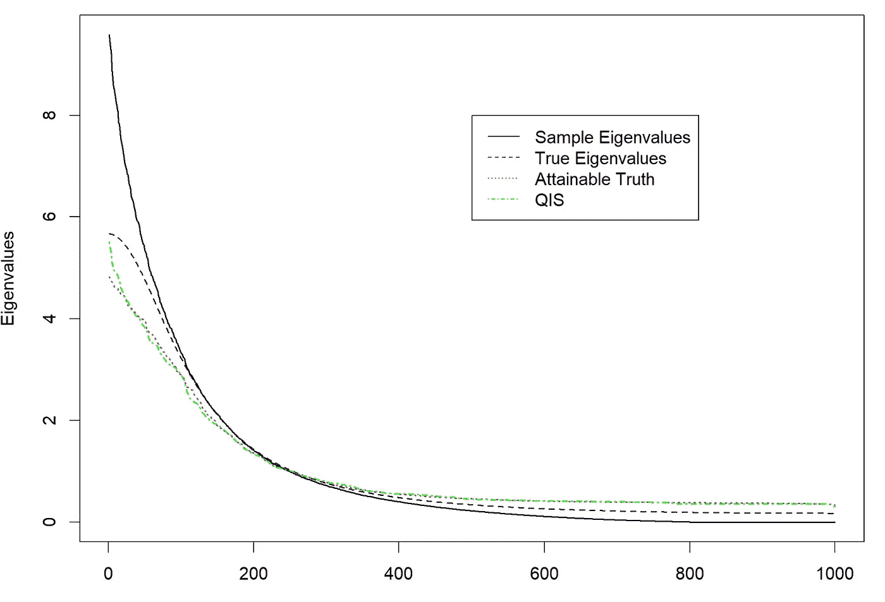

这个情节为什么有趣？首先，我们看到样本特征值相差很大——它们超过了最大特征值，低估了最小特征值。特别是最后的*1000–800 = 200*特征值为零。这种“过度分散”在高维中是众所周知的，小的特征值估计得太小，大的特征值估计得太大。另一方面，我们看到非线性收缩的特征值(绿色)非常接近蓝色的真实值。更重要的是，它们非常接近红线，这是上面可达到的真理，即*u _ j’* Sig * u _ j！*

实际上，整个矩阵的估计值要高出 30%以上:

```
((norm(cov(X)-Sig,type="F")-norm(Cov_qis-Sig, type="F"))/norm(Cov_qis-Sig, type="F"))
[1] 0.3088145
```

根据真实基础协方差矩阵的形式，这种差异也可以大得多。重要的是，当 *p* 与 *n* 相比非常小时，QIS 的表现与通常的协方差矩阵估计器大致相同，并且一旦 *p* 相对于 *n* 增长，QIS 的表现就会(好得多)。因此，如果 *n* 足够大( *n > 100* )，那么直接使用 QIS 可能会更好！

**结论**

本文介绍了样本协方差矩阵的非线性收缩方法。在给出了更概念性/数学性的介绍之后，一个小的代码示例说明了 r 中的方法。该方法的代码也可以在 Matlab 和 Python 中找到。

这种方法也有很多实际应用，特别是在金融领域。从你自己的工作中，你知道这在其他应用中有用吗？我总是很高兴听到有趣的用例和数据集。

## 参考

[1]莱多伊特和沃尔夫(2012 年)。高维协方差矩阵的非线性收缩估计。统计年鉴，40(2):1024–1060。

[2]莱多伊特和沃尔夫(2022 年)。大型协方差矩阵的二次收缩。伯努利，28(3):1519–1547。

[3]莱多伊特和沃尔夫(2004 年)。高维协方差矩阵的一个良态估计。多元分析杂志，88(2):365–411。