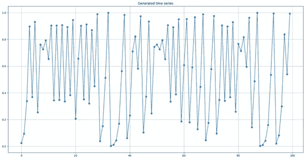
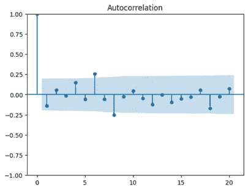
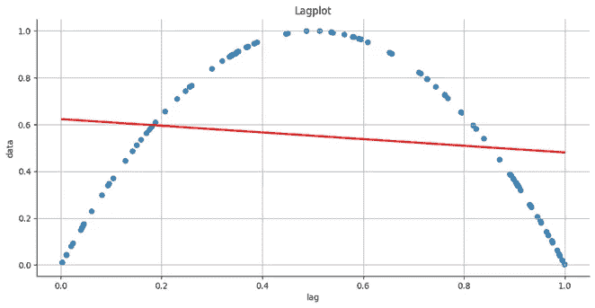
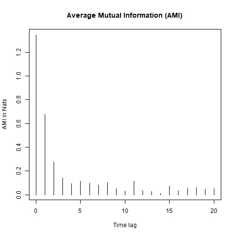
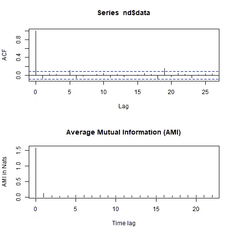
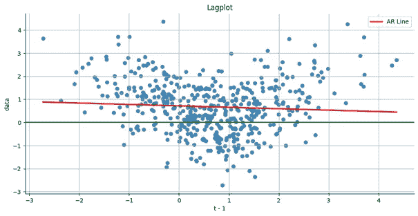
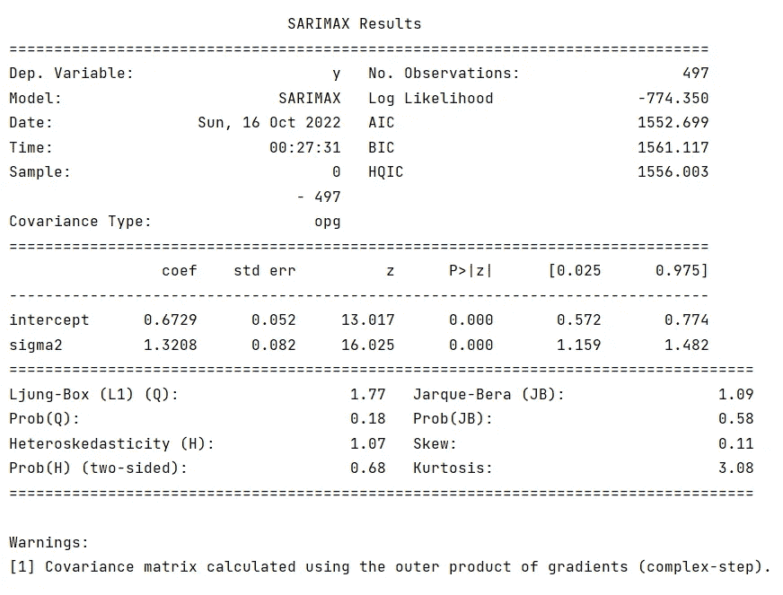
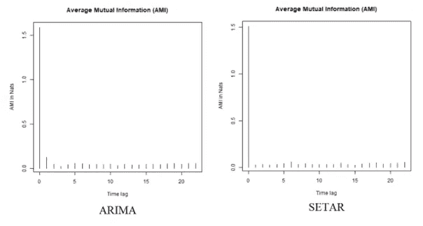
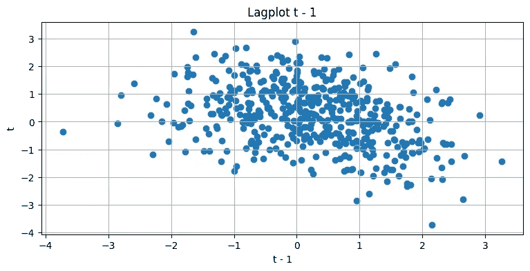
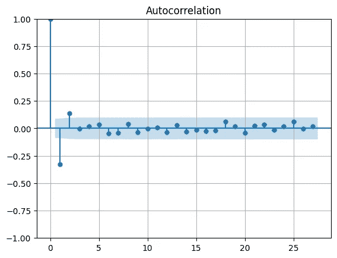

# 非线性时间序列——直观介绍

> 原文：<https://towardsdatascience.com/nonlinear-time-series-an-intuitive-introduction-7390aae8b446>

## 为什么标准的时间序列分析程序有时会失败？

照片由 [sebo106](https://pixabay.com/pl/photos/zabytek-czechy-czech-praga-rathaus-92861/) 拍摄

注意:本文假设您已经熟悉 SARIMAX 模型。如果你不是，请先检查一下。

## 介绍

我在学习时间序列分析的时候，很多次听人说“ ***如果 AR 模型解决不了，试试 ARIMA*** *”。*

然后我会听到“ ***”如果 ARIMA 不工作，检查季节性组件*** ”。

这将继续下去:“ ***如果萨里玛不起作用，尝试添加新的变量，使其成为萨里玛或 ARDL*** ”。

当那不行的时候，我听到了“ ***协整呢？****老实说——在很多情况下，这就足够了。*

*然而，当你说以上都不起作用时，事情就有点紧张了。这时，即使是最平和、最善良的计量经济学家也会开始紧张，并说:“*如果真的什么都不管用，就去做一个天真的预测，或者只是假设平均值*”甚至是你听到过的最悲伤的句子:“*好吧，那就不可预测了*”。*

*但是是吗？*

## ***线性和非线性***

*首先，值得注意的是，我提到的所有模型都基于线性回归，识别程序基于滞后变量之间的线性关系或 ECM 项。这种方法显然是正确的，但是，在某些情况下，它可能被证明是不完整的。我给你举个简单的例子。我生成了一个时间序列:*

**

*生成的时间序列*

*假设我在做一个标准的 EDA。在某一点上，我必须检查时间序列的自相关性:*

**

*对生成的时间序列进行 ACF 测试*

*看到这张图表后，你的第一个结论是什么？ARIMA 出局了，也许是没有自回归成分的季节性模型？*

**

*从我的生活中*

*在继续之前，我必须承认我骗了你一点——我生成的时间序列是完全确定的，只取决于第一个滞后！事实上，您可以使用以下代码生成完全相同的时间序列:*

*您现在可能已经注意到，ACF 测试在检测数据之间的真实关系方面失败得很惨。我们从这个测试中发现的唯一或多或少正确的是季节性。为了理解为什么会发生这种情况，看一下这个视频:*

*但现在，我们来看看它的滞后情节:*

**

*具有 AR 线的确定性时间序列的滞后图*

*红线是适合该数据集的回归线。可以看到，时刻 *t* 和 *t-1* 之间的关系是二次的。换句话说，一个*线性*模型怎么可能预测到它？我向你们展示这一切是因为我想让你们意识到，即使在最友好的非线性环境中，标准的 Box-Jenkins 方法也可能不起作用。*

*那么如何检验非线性时间序列相关性呢？一种方法(当然不是唯一的，也不是在所有情况下都有效)是使用平均互信息:*

**

*确定性时间序列的 AMI*

*这看起来确实比我们从 ACF 测试中学到的更接近真相。请注意，这里我们也可以找到季节性的迹象。在现实生活中很难找到确定性的时间序列(我猜除了物理学)，所以让我们继续讨论非确定性的情况。我们将分析另一个时间序列(人工数据集，用 *tsDyn* 生成)。其 ACF 和 AMI 图如下所示:*

**

*ACF 和 AMI*

*它的滞后曲线是这样的:*

**

*具有 AR 线的非确定性时间序列的滞后图*

*你能说在这一点上 ARIMA 是否会工作吗？*

**

*pmdarima 估计的 ARIMA 模型*

*根据 ACF 测试——不存在自相关，所以 auto-arima 只拟合截距。通常这意味着，我们的预测不会很好。那我们该怎么办？事实上，有非线性模型可以处理这种时间序列，但我不想让这篇文章太专业，所以我现在不打算解释它的属性(也许在另一篇文章中？).不管怎样，让我比较一下非线性 SETAR 和线性 ARIMA 的结果:*

**

*时间序列和样本内预测*

*这两者之间的差异是显而易见的——线性 ARIMA 无法像 SETAR 一样对这一时间序列建模。由于序列本身不是自相关的，所以检查残差的自相关性是没有意义的，但是，我们能做的是比较初始时间序列中的残差、ARIMA 残差和 SETAR 残差之间的 AMI:*

**

*ARIMA 和塞塔模型残差的 AMI*

*SETAR 残差不再像初始序列和 ARIMA 残差那样在第一次滞后时有尖峰，因此它是更好的模型。在这一点上，你可能会认为，非线性时间序列和线性时间序列之间有明显的区别。**错了！**虽然存在无法使用 Box-Jenkins 方法处理的情况(如上例),但大多数非线性时间序列乍一看都是线性的。而且，很多时候线性模型的表现要优于非线性模型！这是因为我们在预测时所做的是最小化某个误差函数。根据哪一个是你的标准，你会得到不同的结论。让我给你看另一个非线性时间序列的例子，它比上面两个更容易找到:*

**

*滞后图(人工数据集，用 *tsDyn* 生成)*

**

*ACF 测试图(人工数据集，用 *tsDyn* 生成)*

*如果你在做分析时看到它，你会说它是线性的还是非线性的？ACF 测试表明这里存在显著的自相关。虽然我可以向你保证，事实上这个时间序列是非线性生成的，**但我不能保证 ARIMA 不会做出更好的预测**——这取决于满足什么需求。此外，当你处理非线性模型时，你更容易出现错误的识别和过度拟合。*

## *摘要*

*时间序列中有不同类型的非线性关系，不可能在一篇文章中展示所有这些关系，但我想给你一个简单直观的非线性时间序列介绍，以及为什么现实生活中最流行的方法可能会失败。虽然在大多数情况下，标准 ARIMA 会做得很好，但非线性依赖的世界要复杂得多。*

*此外，没有一个单一的程序可以处理所有这些问题，因为可能同时发生的非线性的排列数目几乎是无限的。现代贝叶斯、半参数和非参数技术确实在这方面提供了一些帮助——尽管它们肯定不会为我们做所有的工作，但它们可以自动化其中的一些工作，并通过数据驱动的方法覆盖更广泛的可能解决方案。*

*别忘了跟着我[上媒](https://medium.com/@michacukrowski)！*

*另外，请随时通过 LinkedIn 联系我。*

*     *