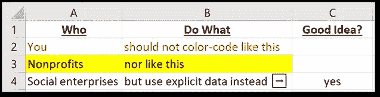
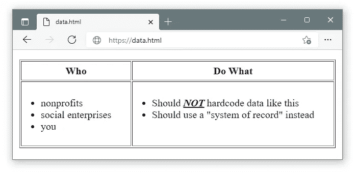
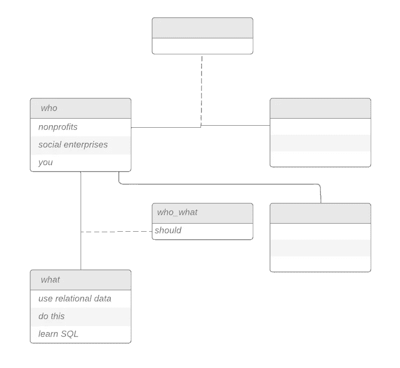
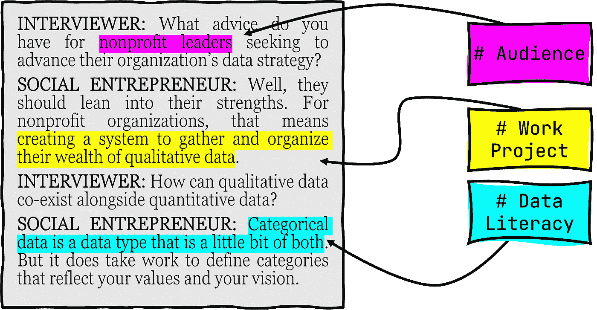
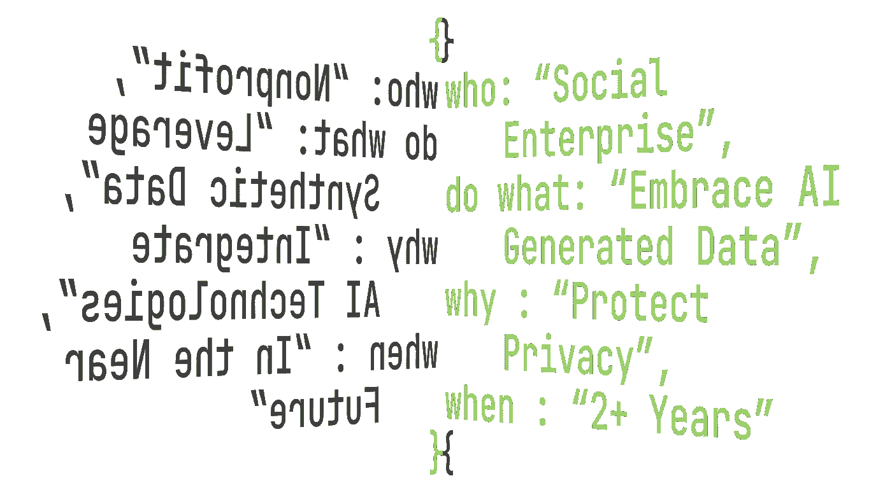

# 非营利数据管理的 5 个最佳实践

> 原文：<https://towardsdatascience.com/nonprofit-data-management-cb1e4dd2cf0c>

插图 AI-由[中途](https://www.midjourney.com/)使用作者提示的“非营利组织数据提示”生成。根据 Midjourney 的商业使用协议授权。

## **快速导航:**

1.  [避免手动对电子表格进行颜色编码](#0471)
2.  [不要把数据硬编码到你的网站上](#a942)
3.  [拥抱关系数据](#7acc)
4.  [包含定性和分类数据](#aaae)
5.  [立志创造&利用合成数据](#1e7b)

几年前，当我从通信职业转向数据分析时，我试图留在非营利和社会企业部门。我看到了唾手可得的果实，它可以帮助这些足智多谋、以使命为导向的组织通过制定数据战略来降低开支并最大化影响。然而，当我开始深入研究时，我很快认识到许多非营利组织的数据管理不善，几乎不可能进行任何有意义的分析。俗话说:[“垃圾进，垃圾出。”](https://en.wikipedia.org/wiki/Garbage_in,_garbage_out)

为了让在非营利部门寻找机会的有抱负的数据科学家和希望建立强大数据战略的社会企业家免受我所忍受的同样的头痛，我开发了 5 个最佳实践。这 5 个最佳实践代表了我在职业生涯中从易到难总结的经验，从两个“不要”，两个“要”和一个“梦想要大！”

# #1:避免手动对电子表格进行颜色编码

诚然，我们都做过这样的事情:将单元格的字体颜色设置为红色以标记问题，将单元格突出显示为绿色以表示完成，或者将任何其他可能的彩虹颜色编码到 Excel 或 Google 电子表格中，作为存储和传递信息的快捷方式。虽然颜色编码对于使电子表格可读来说似乎是无害的，但从长远来看，这种技术会导致数据混乱。

为什么混乱？颜色编码数据几乎总是*隐式*数据。除非您正在跟踪专门关于颜色的数据(例如油漆颜料),否则颜色代码和数据含义之间没有明显的联系。虽然“图例”或“关键”可以帮助澄清含义，但它们经常会丢失或被裁剪掉，并且在以灰度打印时毫无用处。对于复杂的数据管理和分析来说，将彩色编码的数据导入到 R 和 Python 等语言中使用的任何数据结构中是极其乏味的。

作者使用 Microsoft Excel 的插图。

去年，我与一家小型非营利组织签约，针对一场突出的社会危机开展快速拓展活动。他们唯一的员工正在休陪产假，而我则负责挖掘电子表格，以确定在接下来的 48 小时内需要联系哪些联系人。然而，每个电子表格都是彩色代码的万花筒，其中大部分对他们唯一的员工来说意义重大，但我要花很多电话和宝贵的时间才能破译。

通过创建新的*显式*数据列，我们能够共享数据的含义。显式数据是确切表示其含义的数据。例如，显式数据可以是一个简单表示单词`complete`的值，或者是一个“complete？”而不是绿色来表示“complete”下面有`yes`和`no`值的列。显式数据同时具有更好的人类可读性和计算机可读性。例如:一旦我们在快速推广活动中建立了明确的数据，我们就能够使用它来将正确的消息发送给适当的受众。

显式数据开启了**条件格式**作为颜色编码的可行替代方案的可能性。在 [Google Sheets](https://support.google.com/docs/answer/78413) 、 [Microsoft Excel](https://support.microsoft.com/en-us/office/use-conditional-formatting-to-highlight-information-fed60dfa-1d3f-4e13-9ecb-f1951ff89d7f) 、 [Apple Numbers](https://support.apple.com/guide/numbers/highlight-cells-tan93f5de5c3/mac) 和 [more](https://help.libreoffice.org/latest/lo/text/scalc/guide/cellstyle_conditional.html) 中可用，条件格式是基于单元格值添加颜色和其他视觉效果的规则的创建。例如，不是手动将单元格涂成绿色来表示一行“完成”，而是将“完成？”列可以用值“是”标记，条件格式编排规则将自动为该行分配绿色。条件格式的优势在于它保留了颜色编码的视觉突出，同时还允许更接近地表示其含义的显式数据。

通过不将数据的含义与任意的颜色方案捆绑在一起，组织数据变得更有弹性，可以处理包括员工流动、软件升级和知识交流在内的挑战。

# #2:不要将数据硬编码到网站中

我最近为一个非盈利组织提供咨询，该组织正在从头开始重建他们的网站。该组织的历史可以追溯到一个多世纪前，他们的许多数据都反映了这一遗产，包括重要里程碑的时间表、几十年来有影响力的人物列表、著名的公开声明和媒体档案。然而，所有这些历史数据都是有组织的(有时这些有价值的数据甚至只存在于这个组织越来越过时、漏洞百出的网站上)。硬编码到 HTML 中的数据量不仅阻碍了关键的网站升级，还使得查询数据以进行最基本的分析变得困难。

作者使用良好的老式 HTML 的插图。

为了阐明根本问题，了解技术术语[“记录系统”](https://en.wikipedia.org/wiki/System_of_record)是很有帮助的:信息存储系统是给定数据的权威数据源。在我的客户上面的例子中，个人网页被用作记录系统。这是一个自然的诱惑，因为网站是一种领导层和受众之间的公开对话。随着该组织发现其利基，它用新数据更新网站以回答重要问题:我们与谁相连？我们能做什么？我们在哪里操作？

然而，一般的非营利网站都在努力实现更适合于[“参与系统”](https://www.techtarget.com/searchcio/definition/systems-of-engagement)范式的目标:为用户提供一种可访问的方式来查看、查询和与存储在别处的集中记录系统中的信息进行交互。Web 框架根本不是设计来作为记录系统运行的。

另一方面，数据库管理系统被设计成适合“记录系统”的范例。通过关注数据本身，去除前端视觉考虑，维护良好的数据库自然成为组织最有价值数据的记录系统。此外，组织的网站可以查看、查询或调用大多数数据库管理系统。这意味着数据仍然可以通过网站*获得，而不会卡在*网站上*。尽管建立一个独立于网站的数据库需要一些前期工作，但这样做可以提高数据弹性和网站灵活性。*

实现“记录系统”的一个简单的练习是在你的网站上搜索项目符号或聚集有趣数据的表格。将数据创建到一个无代码数据库[中，如 Airtable](https://airtable.com/invite/r/9jyJBxR8) ，并将[一个 Airtable“视图”嵌入回你的网站](https://support.airtable.com/hc/en-us/articles/217846478-Embedding-a-view-or-base)。这种方法的优点是 Airtable 视图允许基于您想要显示的内容进行数据过滤。例如，您可以创建将公共数据与分类数据分开的视图，同时仍然将所有数据方便地收集在一个数据库中！

# #3:拥抱关系数据

虽然电子表格对于“快速而肮脏”的数据收集和分析很有用，但一个不断发展的组织将不可避免地发现他们的数据被困在二维电子表格的[“监狱栏”](https://www.google.com/search?q=prison+bars&tbm=isch)中。当跨多个用户部署时，除了对大小和数据完整性的关注之外，电子表格还有一个额外的限制，即每个数据点都被困在一个单独的“单元”中，这使得很难为了批量更新或复杂分析的目的而连接数据。

作者使用 LucidChart 的插图

与关系数据形成对比，关系数据最常见于关系数据库管理系统(RDBMS)。关系数据模型允许通过主键(表中每行的一列唯一 id)和外键(引用“外部”表的主键的一列，允许在当前表的一行中引用另一行的数据)的集合跨表链接数据。

矛盾的是，尽管*社会*企业本质上是*关系型*企业，但追求社会公益的组织通常不会为其最关键的数据使用关系型数据模型。这种疏忽可能是因为他们没有意识到关系数据的价值，或者缺乏存储和访问关系数据的技术能力。

对于想要向关系数据飞跃的组织来说，像前面提到的 [Airtable](https://airtable.com/invite/r/9jyJBxR8) 这样的无代码解决方案是一个很好的网关(并且有[非营利定价](https://support.airtable.com/hc/en-us/articles/360008649233-Nonprofit-and-educational-plans-FAQs))。有更高级数据需求和更精通技术的非营利组织会发现 SQL 数据库是最佳选择。最后，尽管在技术意义上它们不是“关系型”的，但是像 [Neo4j](https://neo4j.com/product/) 这样的尖端图形数据库解决方案不仅存储关于相关实体的信息，还存储关于关系本身的信息*。*

*在您利用了关系数据的力量之后，即使只是一次，您也一定会看到在任何地方实现关系数据的潜力。以下是我自己职业生涯中的一些例子:*

*   **面向青少年的服务项目*:我利用关系数据来巧妙地管理学生和他们父母的数据，而不是求助于像“家长 2 号联系信息”这样的笨重的列名，它们会使我们的旧电子表格变得杂乱无章。*
*   **政治宣传:*我创建了一个关系数据模型，用于权力映射练习，以确定影响关键决策者的最短路径。*
*   **野生动物保护网络*:为了使我们的目录易于浏览，我使用了一个关系数据库来为濒危物种、潜在捐赠者、全球保护组织和当地野生动物保护区建立不同但相关的表格。*

# *#4:接受定性和分类数据*

*与营利性组织不同，非营利性组织在一个几乎没有利润空间和价格信号的世界中运作。套用经济学家弗里德里希·哈耶克(Friedrich Hayek)的话，“价格”本身是一个抽象的数据点，它替代了来自全球市场的信息，然后以一种近乎神奇的无形之手的方式协调追求利润的经济活动。因为非营利组织不受利润动机的支配，他们失去了这种由价格决定的方向感，并发现他们的许多项目无法提炼出可量化的底线。为了报告“增长”或其他目标，非营利组织需要用真实世界的数据来填补收入数字留下的真空。*

*至关重要的是，这些真实世界的数据经常以**定性数据**的形式出现。定量数据“测量”并基于数字，而定性数据“描述”并通常基于文本。定性数据可以包括利益相关者调查、访谈记录、焦点小组录音和志愿者观察。非营利组织依靠定性数据生存和发展——即使这些“数据”只是在便利贴上流传的涂鸦！*

**

*作者插图*

*令人沮丧的是，资助机构经常要求提供定量数据而不是定性数据的报告，尽管非营利组织可能会有较少的定量数据和大量的定性数据。为自己辩护的是，资助机构确实试图让接受者对他们收到的资金负责。此外，许多基金会官员越来越意识到，光是定量数据就忽略了重要的背景。结合定量和定性数据的混合方法通常是讲述社会影响和变化的最有说服力的方法。*

***分类数据**是定量数据与定性数据的结合点。类别集通常由可用于对记录进行分类的单词或短语组成。例如，志愿者管理数据库可能有一个志愿者“动机”字段，其中的选项包括`skill_development`、`required_service_hours`、`personal_story`或`member_of_group`。然后，分类数据可用于问题的子集数据，例如“如果志愿者的动机是技能发展，那么他们平均工作多少小时，而不是需要多少服务时间？”以及更复杂的研究技术，如[回归分析](https://stats.oarc.ucla.edu/spss/faq/coding-systems-for-categorical-variables-in-regression-analysis-2/)。*

*可以对数据进行分类，也可以从数据分析中得出分类。我的团队在纽约召开了一次气候行动组织峰会，会上出现了一个分类的例子。通过对话和越来越杂乱的白板，我们开始确定正在采取的不同类型的气候行动:“宣传”、“碳减排”和“备灾”。然而，这次为期一天的首脑会议不足以完成实际上必须是一个反复的过程。通过后续对话，我们开发了[一个受开放编码(数据的自由关联)、轴向编码(将数据分组)和选择性编码(像拼图块一样将组组合在一起)的“基础理论”](https://en.wikipedia.org/wiki/Grounded_theory#Coding)启发的流程。*

*根据您试图解决的问题，为您的数据创建可靠的类别可能是一个劳动密集型和智力要求高的过程。如果你的组织真的想接受定性数据，在数据团队中嵌入一个人种学家(如果试图理解一个没有明确解决方案的问题)或一个项目评估者(如果试图证明一个尝试性的解决方案)是值得的。让一名精通“编码类别”的定性数据专家与一名精通“编码计算机”的定量数据专家并肩工作，对于任何寻求通过循证方法解决紧迫社会问题的雄心勃勃的组织来说，都是一记强有力的组合拳。*

# *#5:创建和利用合成数据*

*合成数据是由算法生成的“假数据”，旨在复制实际数据集。根据算法的复杂程度，合成数据集不仅会复制数据的结构和每个字段的取值范围，还会复制相关性、标准差和其他统计模式。这种额外的复杂程度意味着合成数据集的统计分析将与相应的“真实数据”的统计分析几乎完全相同。*

**

*作者使用 [Jetbrains Mono](https://www.jetbrains.com/lp/mono/) 的插图，这是一种专门的编程字体。*

*合成数据一经创建，就可以通过多种有益的方式加以利用。对于向弱势群体提供服务的非营利组织，合成数据允许通过直接分析服务数据进行项目评估，而不会损害任何个人服务接受者的隐私。虽然非营利组织仍然应该明确某人的数据将如何被使用和共享，但在与外部研究人员和合作伙伴组织合作时，合成数据的高度匿名性质是一种值得保护的措施。*

*合成数据可以成为将人工智能引入非营利组织运营的战略入口。首先，合成数据几乎总是通过某种形式的人工智能生成的，因此学习如何创建合成数据可以作为人工智能技术和术语的速成班。第二，因为合成数据保护隐私，生成合成数据集为非营利组织提供了在平台上运行自己的“数据科学竞赛”的可能性，如 [Kaggle](https://www.kaggle.com/c/about/host) 或 [DrivenData](https://www.drivendata.org/partners/) 。最后，一些人认为，通过用合成数据补充代表不足人口的真实数据，合成数据可以帮助纠正“[人工智能偏差](/reducing-ai-bias-with-synthetic-data-7bddc39f290d)”，这样机器就不会将代表不足内在化为“不太可能存在”。虽然很有希望，但请记住[人工智能偏见实际上只是通过输入数据教给机器](https://hbr.org/2019/10/what-do-we-do-about-the-biases-in-ai)的人类偏见。合成数据可能有助于纠正一些人工智能偏见，但真正的解决方案是在人类源头解决偏见。*

*[合成数据领域正在快速发展](https://www.forbes.com/sites/robtoews/2022/06/12/synthetic-data-is-about-to-transform-artificial-intelligence/)，但我发现 [Gretel](https://www.forbes.com/sites/robtoews/2022/06/12/synthetic-data-is-about-to-transform-artificial-intelligence/) 的平台相对容易学习和使用。值得注意的是，[他们专门为非营利组织出版并展示了他们技术的价值](https://gretel.ai/blog/why-nonprofits-should-care-about-synthetic-data)，这是数据科学领域非常罕见的营销决策。需要一些技术知识来建立和调整 Gretel 模型:大约相当于一个学期的机器学习课程(相对于一个成熟的计算机科学学位)。根据本文前面分享的其他技巧，值得强调的是 Gretel 可以处理[关系数据](https://gretel.ai/blog/transforms-and-multi-table-relational-databases)和[基于文本的数据](https://gretel.ai/blog/conditional-text-generation-by-fine-tuning-gretel-gpt)(即定性数据)。然而，Gretel 不能处理彩色编码的电子表格，而是针对诸如`.csv`或`.json`的文件格式进行了优化。*

# *最后的想法*

*收集、存储和分析数据的成本正呈指数级下降。这些进步也有阴暗的一面，对侵犯隐私和人工智能偏见的担忧日益加剧就是明证。非营利组织有机会驾驭数据浪潮，以便更有效地实现其使命，但需要努力将数据的有用性转化为非营利组织的具体特质，同时不让数据的阴暗面偷偷溜进后门。我的希望是，通过这些非营利数据管理的最佳实践，你能够扩大你的组织的影响，在世界上做更多的好事，同时也将坏事最小化。*

*也就是说，让非营利组织理解数据是一个持续的过程！在下面的投票中，让我知道你认为哪个建议最有用。您的回答有助于引导我思考是否以及何时更深入地探究这些话题。*

*如果你喜欢这篇文章，你可能会发现我的使用 Python 的 Airtable 教程[很有帮助。欢迎随时关注我这里的](/downloading-airtable-data-into-python-89e5c7107a24)[媒体](https://medium.com/@kalebnyquist)或[推特](https://twitter.com/KalebNyquist)(我在这里谈论的*不仅仅是数据，还有一些数据)。**

*如果你想支持更多这样的写作，你可以[给我买杯咖啡](https://www.buymeacoffee.com/kalebnyq)或者(如果你还没有的话)[使用我的推荐链接](https://medium.com/@kalebnyquist/membership)成为一个媒体订阅者。我自己的数据之旅的一个主要部分是熨斗学校的数据科学项目，如果你是一个寻求提高你的数据技能的非营利专业人士，如果你通过这个推荐链接请求更多信息，它会帮助我[。](https://flatironschool.com/scholarships/2022q2ar/?utm_campaign=ec2a7f51-e911-403e-8e92-50950d9f7c32&utm_source=emailbatch&utm_medium=email&utm_term=txtlink)*