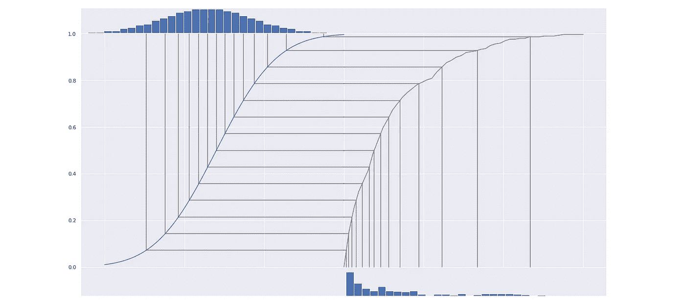
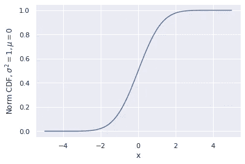
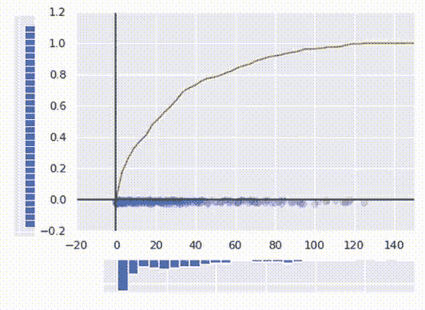
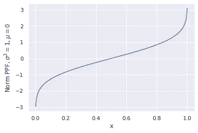
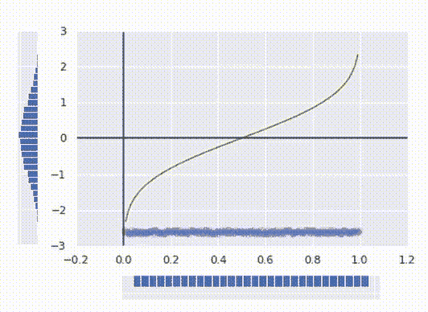
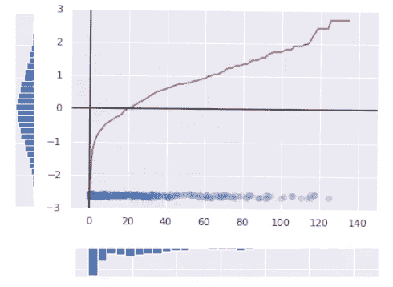
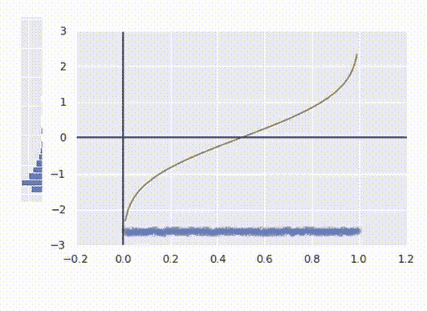

# 用几行代码规范化任何连续分布的数据

> 原文：<https://towardsdatascience.com/normalize-any-continuously-distributed-data-with-a-couple-of-lines-of-code-5b68454fd2f6>

## 如何使用逆变换采样来改进您的模型

规范化数据是数据科学中的一项常见任务。有时，它允许我们加快梯度下降或提高模型精度，在某些情况下，它绝对至关重要。例如，我在上一篇文章中描述的模型不能处理非正态分布的目标。一些标准化技术，比如取对数，可能在大多数时候都有效，但是在这种情况下，我决定尝试一些对任何数据都有效的技术，不管它最初是如何分布的。下面我将描述的方法是基于[逆变换采样](https://en.wikipedia.org/wiki/Inverse_transform_sampling):主要思想是基于数据的统计特性构造这样的函数 F，所以 F(x)是正态分布的。下面是怎么做的。



作者图片

我说的算法是基于逆变换采样法。这种方法广泛应用于伪随机数生成器中，从任何给定的分布中生成数字。有了均匀分布的数据，你总是可以用任何给定的累积密度函数(或简称为 CDF)将其转换成分布。CDF 显示了小于给定值的分布数据点的比例，并且基本上表示了分布的所有统计特性。



均值和单位方差为零的正态分布的 CDF。显示几乎所有的点都大于-4 小于 4，其中 50%小于 0(图片作者提供)

主要思想是，对于任何连续分布的数据，xᵢ(cdf(xᵢ)是均匀分布的。换句话说，要得到均匀分布的数据，只需取每个点的 CDF。这种说法的数学证明超出了本文的范围，但是上述操作实际上只是对所有值进行排序，并用每个值的编号来替换它，这给了它一种直观的感觉。



将一些杂乱的数据转换成统一的数据(图片由作者提供)

在上面的 gif 中，你可以看到它是如何工作的。我生成了一些杂乱的分布式数据，然后计算它的 CDF(红线)并用它转换日期。现在数据均匀分布。

计算 CDF 比看起来容易。记住，CDF 是比给定数据小的一部分数据。

```
def CDF(x, data):  
   return sum(data <= x) / len(data)
```

值得一提的是，CDF 通常是一个双射函数，这意味着转换是可逆的。我们可以利用这一事实将得到的均匀分布转换成我们想要的任何分布，比如正态分布。为了做到这一点，我们需要计算我们想要得到的分布的逆 CDF。一般来说，这不是最容易的任务。我们需要的函数叫做百分点函数，简称 PPF。对我们来说幸运的是，任何主要发行版的 PPF 都可以通过 SciPy 库访问，不需要自己计算。



均值和单位方差为零的正态分布的 PPF。它显示第 50 百分位是 0，超过 60%的点位于-1 和 1 之间(图片由作者提供)

下面是如何解释它:对于任何介于 0 和 1 之间的参数 x，PPF 返回该点的最大值，以适合第 x 个百分位数。同时，作为 CDF 的反函数，它看起来像第一张图片中的函数，只是旋转了 90 度。



从均匀分布获得正态分布(图片由作者提供)

现在我们有了一个理想的正态分布。最后，要创建一个转换初始数据的函数，我们只需将这两个操作合并成一个函数:

```
from scipy.stats import normdef normalize(x, data):
   x_uniform = CDF(x, data)
   return norm.ppf(x_uniform)
```



将初始杂乱分布转换为具有零均值和单位方差的正态分布(图片由作者提供)

上图中的红线代表最终的变换函数。

顺便说一下，我们可以很容易地将数据转换成任何其他分布，只需用一个期望的分布替换 PPF。下面是我们把杂乱的数据转换成对数正态分布。注意变换曲线是如何不同的。



注意最后的变换总是单调的。这意味着在变换后没有两点被交换。如果一个点的初始要素值大于另一个点的初始要素值，则在变换后，该点的变换值也将更大。这一事实允许该算法应用于数据科学任务。

总之，与更常见的方法不同，本文描述的算法不需要任何关于初始分布的假设。同时，输出数据极其精确地遵循正态分布。这种方法已被证明可以提高假设输入数据分布的模型的准确性。比如上一篇文章的[贝叶斯模型](https://medium.com/towards-data-science/using-bayesian-statistics-to-predict-cafes-popularity-with-geodata-3286deaffc2)在没有数据归一化的情况下 R ~ 0.2，在归一化数据的情况下 R 为 0.34。线性模型也显示，在标准化数据上，R 提高了 3-5 个百分点。

就是这样。感谢您的时间，我希望这篇文章对您有用！