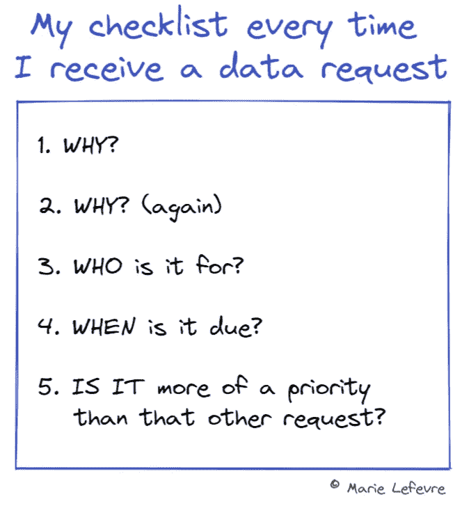

# 并非所有的数据请求都是紧急的，所以从问这 5 个问题开始

> 原文：<https://towardsdatascience.com/not-all-data-requests-are-urgent-so-start-by-asking-these-5-questions-ad77d1fbe7dd>

## 在开始分析数据之前，您应该向每个业务用户提出 5 个问题+ 1 个实际操作练习，以说明实际情况

[维克多何](https://unsplash.com/@victorhwn725?utm_source=unsplash&utm_medium=referral&utm_content=creditCopyText)在 [Unsplash](https://unsplash.com/?utm_source=unsplash&utm_medium=referral&utm_content=creditCopyText) 上的照片

W 无论是特定的深入分析请求还是广泛使用的仪表盘，**数据分析师都会收到或多或少结构化的请求**。最终，他们的工作是**收集、优先考虑和回答业务用户的需求**，不是吗？

那当然是真的。然而，我认为持续处理来自不同利益相关者的请求对数据分析师来说是有代价的。在某些时候**人们可能会被收到的请求的数量和多样性所淹没**……并在这个过程中迷失。作为一名数据分析师，这些年来我学会了如何更好地组织摆在我面前的数据请求。当有人向我提出数据请求时，我会尝试系统性地后退一步，而不是直接跳入一个据称是“超级紧急”的请求，这个请求会在压力下完成，不到一个月就会被遗忘。**在进入真正的分析部分之前，我开始向提问者提 5 个快速问题。**

当应用这个框架时，我看到的第一个好处是，它为业务用户和作为数据分析师的我之间的公开对话创造了空间。通过这样做，我们不再是像“我需要你帮我提取这个数字”这样的纯粹的交易关系，而是在为同一目的拥有互补技能的同事之间进行**讨论——我们的公司实现其目标和愿景。**

在这篇文章中，我想带你了解这五个问题。首先，我将详细说明**为什么这些问题在接收数据请求时最为重要**。在第二部分，我想带你和我一起参加一个商业利益相关者(在我们的例子中是首席营销官)**和数据分析师**(在我们的例子中是你自己)之间的**现实讨论。**

我的清单(图片由作者提供，使用 [Excalidraw](https://excalidraw.com/)

# 1.为什么？

对我来说，两个利益相关者之间的任何互动都应该从一个为什么开始。在[构建仪表板的情况下](/how-to-build-effective-and-useful-dashboards-711759534639)，这是我系统地问的第一个问题。这让每个人都能理解他们互动的原因(我们为什么要开这个会？为什么需要这些数据？等等。以便他们能够有一个良好的开端。在数据请求的情况下，这也会给你动力去处理它，并证明你会为此付出多少努力。

# 2.为什么？(再次)

为什么另一个为什么？我想在这里提到一个概念，用于**找到给定问题的根源**。在描述 AWS 架构良好的框架的白皮书中，他们详细描述了应该如何使用“五个为什么技术”。在我们的例子中，不止一次地问为什么有两个好处。首先，它比第一个显而易见的原因走得更远，从而“有助于克服我们可能有的假设”。第二，它对当前用例进行了更多的抽象，因为它为问题提供了更广阔的视角:我们不仅仅是回答您非常具体的需求，而是解决一个可能影响公司内其他利益相关者的问题。

# 3.是给谁的？

最终，向您索要给定输出(一段代码、一个特别分析、一个仪表板……)的人可能不是唯一使用它的人。首先，你需要**了解是否有更多的人支持这个请求**。第二，你必须**了解相似的人是否可能有相同的需求**，无论是现在还是未来。例如，团队领导可能需要一个自己的仪表板，也需要一个所有团队成员的仪表板。他们今天的团队可能需要它，但其他团队领导可能在未来几周需要类似的。

# 4.什么时候到期？

大多数情况下，请求者会认为他们的请求很快就会到期，如果不是立即到期的话。这是完全正常的，因为他们需要你的输出来继续他们正在进行的主题——顺便说一下，这表明你的工作将为他们带来真正的价值，这是个好消息！通过询问截止日期，你会**感觉到请求的紧迫性**。这里的理想情况是问一问是否可以区分硬性截止日期和有好处的截止日期。这将允许您在具有不同时间跨度的请求之间管理您的时间。

# 5.它比其他请求更重要吗？

特别是如果同一个人在几个话题上请求你的支持，这是一个询问他们你应该优先处理他们的好方法。在任何情况下，向请求者提出这个问题都会**让他们了解你的日常工作**。在大多数情况下，这将增加同理心的水平，并允许请求者和你之间更好的合作。通过与他们分享您的数据请求日志，您将降低因大量请求而产生的压力。

由[布雷特·乔丹](https://unsplash.com/@brett_jordan?utm_source=unsplash&utm_medium=referral&utm_content=creditCopyText)在 [Unsplash](https://unsplash.com/?utm_source=unsplash&utm_medium=referral&utm_content=creditCopyText) 上拍摄的照片

# 练习时间到了！

让我举一个我自己经历的例子来解释为什么**这 5 个问题是帮助你在回答数据请求时更好地管理时间和精力的关键**。如果你想“真正地”做情景练习，我邀请你在阅读我自己的*(斜体)*之前做你自己的解释。

*   首席营销官(CMO):你能摘录一下我们去年获得的所有客户的名单吗？

*我的解释:高层管理人员要求你提取一份客户名单。这可能非常重要，但是您必须问几个问题，以确保您为该请求分配了正确的时间和精力——没有必要直接跳入分析和恐慌！*

*   数据分析师(DA，在这种情况下是你自己):当然，你为什么需要这个列表？
*   CMO:我们想针对他们中的一些人策划一场营销活动。

*我的解释:这似乎是一个特定于营销的请求，因此你需要从营销的角度获取数据并展示出来，例如从营销数据库中提取数据，并添加与营销人员特别相关的 KPI。*

*   大卫·爱登堡:好的。你能更详细地告诉我这个活动是为了什么吗？
*   CMO:这仍有待确定，但我们的想法是更好地了解谁是我们最近获得的客户，并确定潜在的客户流失模式，我们可以通过电子邮件活动来解决。

*我的解释:更进一步，这指定了提取中所需的数据类型。CMO 间接地向你提供了关于他们所要求的输出的第一手提示:一份包含客户姓名和电子邮件地址的列表(向他们发送一封电子邮件)，以及估计客户流失概率的指标(例如，上次登录日期、客户满意度、品牌参与度)。*

*   大卫·爱登堡:你是唯一一个使用这种提取物的人吗，还是会和更多人分享，也许是营销团队的一些成员？
*   CMO:没错。一旦你提取了名单，你可以直接和我以及 CRM 团队分享。

我的解释:在回答完前三个问题后，你已经更好地理解了紧急程度和你未来分析的范围。这是来自 CRM 团队(而不是来自高层管理人员)的请求，您的输出将被几个具有营销背景的人使用(不仅仅是 CMO)。

*   大卫·爱登堡:你什么时候需要这个提取物？
*   CMO:如果能在周末拿到就好了。然而，下一个电子邮件活动不会在月底前开始，所以我们有时间做相应的准备。

*我的解释是:这里你可以看到，这是一个中期请求，而不是一个超级紧急的请求。你甚至可以区分硬性截止日期(月底)和美好的截止日期(周末)。*

*   大卫·爱登堡:我能给你的建议是在这个周末和你分享一份初稿，这样我们就可以在最终版本之前做一些调整。我还有最后一个问题:这个请求与您的 CRM 团队同事上周提出的“客户参与”仪表板的请求有什么关系？
*   CMO:谢谢你提醒我这个请求。事实上，它部分重叠了我自己的要求。然而，我的要求更紧急，我会和 CRM 经理谈谈，看看我们如何结合这两个要求，使它对你最有效。

*我的解释是:当你提醒他们你也必须处理的其他请求时，CMO 理解并愿意帮助你管理优先事项。这对你有利:不要犹豫要透明，即使这意味着暴露可能矛盾的请求。*

## 关键要点

在整个讨论过程中，你可以了解更多关于**确切的请求及其去向**。你明白，尽管是最高管理层成员的要求，但要做的工作不是马上就能完成的。您甚至可以获得关于期望输出的一些初始细节。这将让您有时间组织请求，向 CRM 团队询问更多细节，并在您的时间表中分配时间来及时回答。

# 现在怎么办？

下次你收到同事的数据请求时，问这五个问题。在您与此人会面并收集了他们的答案后，您肯定会更容易正确地对请求进行优先排序，并给予适当的时间。

在任何情况下，沟通都是关键。这就是为什么上面的 5 个问题是很好的开场白。请随意扩展这个列表，并根据您的具体使用情况和您自己的习惯进行调整！

你喜欢读这篇文章吗？ [*成为*](https://marie-lefevre.medium.com/membership) *的一员，加入一个不断成长的充满好奇心的社区吧！*

 