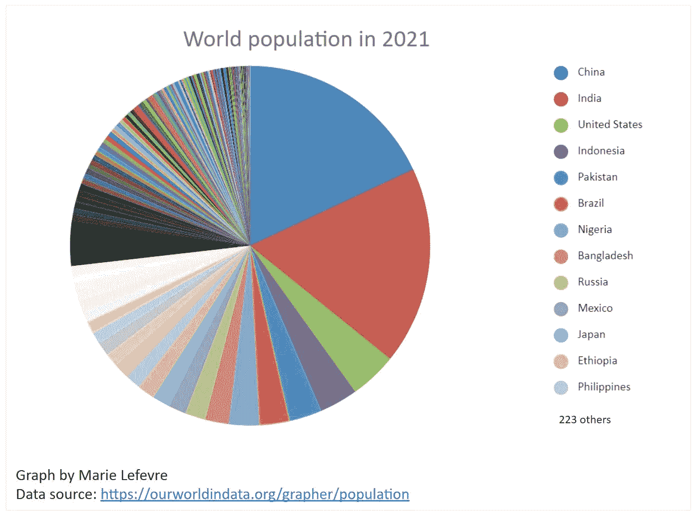
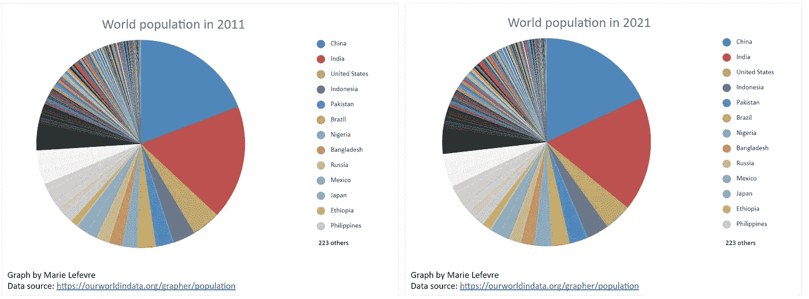
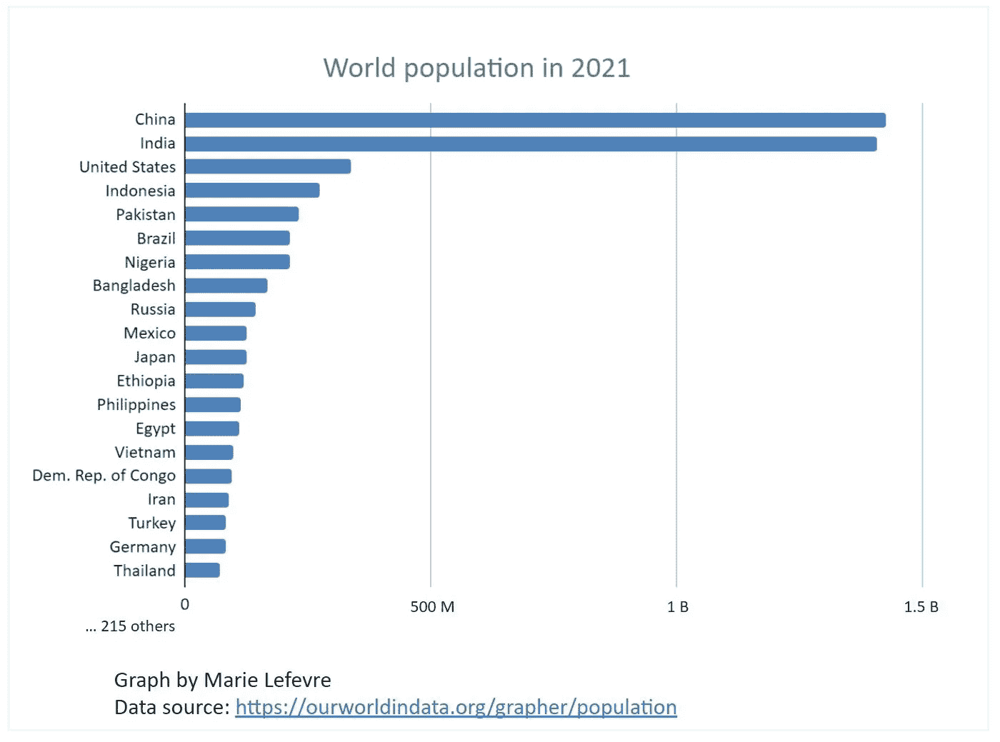
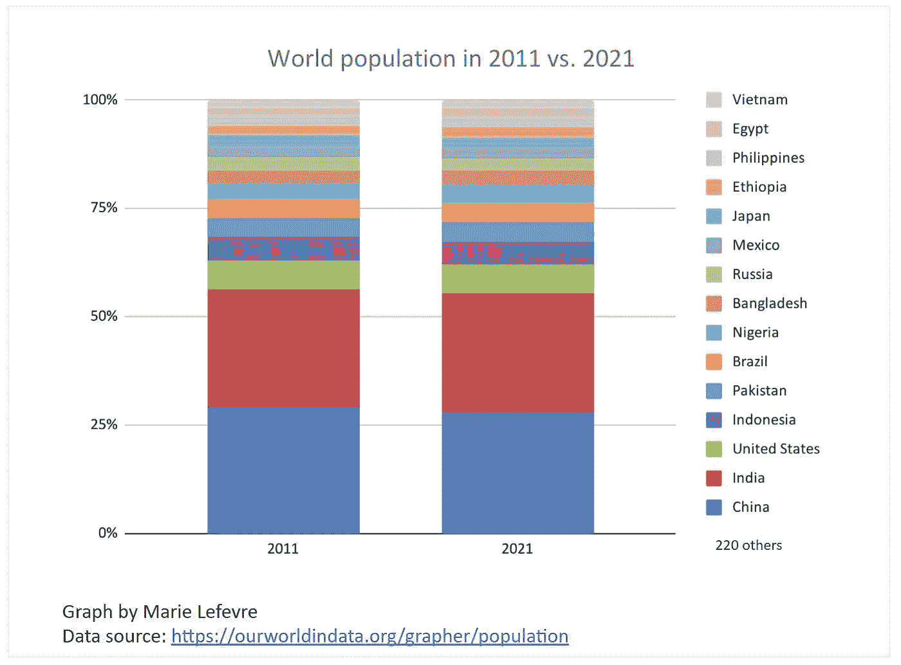

# 对你的饼状图不满意？尝试这些替代方案

> 原文：<https://towardsdatascience.com/not-satisfied-with-your-pie-chart-try-these-alternatives-84849ef81f50>

## 数据可视化

## 当饼图似乎不是可视化数据的最佳方式时，该怎么办？

照片由[谢里·西尔弗](https://unsplash.com/@sheri_silver?utm_source=unsplash&utm_medium=referral&utm_content=creditCopyText)在 [Unsplash](https://unsplash.com/?utm_source=unsplash&utm_medium=referral&utm_content=creditCopyText) 上拍摄

饼图是最直观的图表之一。**它们以紧凑的方式显示变量在几个特征之间的分布**。实际上，我看到很多同事用饼图展示一些关键数据。虽然它们有时是相关的，**饼状图对于某些用例来说绝对不是可视化数据的最佳方式**。

在这篇文章中，我将以各国的世界人口分布为例。在第一部分中，我想揭示饼图的缺点，以及为什么它们不一定是可视化数据的最佳选择。在第二部分中，我将介绍以更相关的方式显示数据的解决方案。通过这种方式，您可以反思自己对饼图的使用，并且**您可以为下一次数据可视化选择最适合的图表类型**。

# 让我们从一个例子开始

> 如何最好地可视化世界人口的分布？

这是我在整篇文章中试图用图表回答的核心问题。假设我想按国家呈现世界人口的分布。这是一个典型的用例，其中显示数据的替代方法——可能是我首先想到的——是饼图。

为了说明我的观点，我将使用《数据世界》中的开放数据。你可以在这里找到源数据集[。基于这些数据，我构建了下面的饼状图(图 1)。它显示了 2021 年世界人口按国家的分布情况。](https://ourworldindata.org/grapher/population)

图表 1

# 饼状图有什么弊端？

你觉得前面的图表有意义吗？它告诉读者什么？老实说，我不确定我应该从中得出什么结论。让我用 3 个问题来解释为什么。

## 问题 1:很难比较一个地区和另一个地区的大小

在图表 1 中，你可以看到中国的人口比印度多，但这并不明显，是吗？我们假设是这样的。你能从中国人口比印度人口多多少看出吗？

这是饼状图的第一个缺点。虽然他们很快给出了数量级的见解，但很难比较两个表面。大量特征尤其如此。在我们的例子中，大量的国家使得实际上不可能比较大多数国家的人口规模。

## 问题#2:它不允许显示大量的特征

在图 1 中，您可以看到图例中显示了大量国家(“223 个其他国家”)。但是你能快速说出有多少人住在梵蒂冈吗？在贝宁呢？

为此，您应该增加图例的大小，或者将鼠标移至饼图的每个部分。从这个例子中我们可以看出**饼状图并不适合显示大量的特征。**

## 问题#3:它给出了一个发行版的静态概述

在图表 1 中，你可以看到 2021 年世界人口的分布情况。在过去的 10 年里，它是如何发展的？为此，您必须复制相同的饼图并调整数据。在图表 2 中，我展示了 2011 年的世界人口。你能轻易说出 2011 年至 2021 年间哪个国家的人口比另一个国家多吗？

图表 2

**由于圆形区域，很难比较饼图的两个表面。**对于人眼来说，比较两个方形表面更容易。这就是为什么在比较不同时间段的两个分布时，饼图不是最佳选择。

# 饼图有哪些替代品？

如果您发现自己面临上述问题，这可能是一个信号，表明饼图不是可视化您的特定用例的数据的最佳方式。你现在应该做什么？尝试以下替代方法。

## 水平条形图

水平条形图基本上解决了问题#1 和#2。由于数据不受圆形的限制，每个特征(在我们的例子中，每个国家)可以显示在一个水平条中。这让读者能够轻松掌握某个国家的人口数量，并将其与另一个国家进行比较。如果要显示大量国家，水平条的数量会更长，但不会对每个国家数据的可读性产生负面影响。

这是 2021 年世界人口分布在水平条形图中的样子:

图表 3

## 堆积柱形图

堆积柱形图更能解决问题 1 和问题 3。因为他们也使用方形，所以比较两个国家或两个时间段的表面更容易。由于给定年份的显示更加紧凑，这种类型的图表更适合于比较分布随时间的演变。

您可以使用 100%显示或绝对值显示。在 100%堆积柱形图中，2011 年与 2021 年的世界人口分布如下:

图表 4

# 结论

饼图并不适合所有的用例。它们的缺点可能会阻止最终用户**以可操作的方式**解释结果。这就是为什么有两种图形选择可以让您以最合适的方式显示数据:水平条形图和堆积柱形图。

最终不变的是**问自己为什么要构建一个给定的图表，最终用户可能从中解读出什么结论**。只有当你定义了这些元素，你才能选择最好的图形形式。

*你喜欢读这篇文章吗？* [*成为*](https://marie-lefevre.medium.com/membership) *的一员，加入一个不断成长的充满好奇心的社区吧！*

 [## 通过我的推荐链接加入媒体-玛丽·勒菲弗尔

### 阅读玛丽·勒费夫尔(以及媒体上成千上万的其他作家)的每一个故事。每月 5 美元(或每年 50 美元),直接向…

marie-lefevre.medium.com](https://marie-lefevre.medium.com/membership)