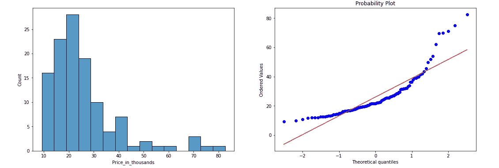
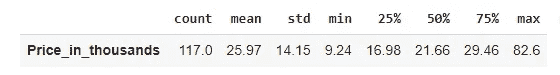
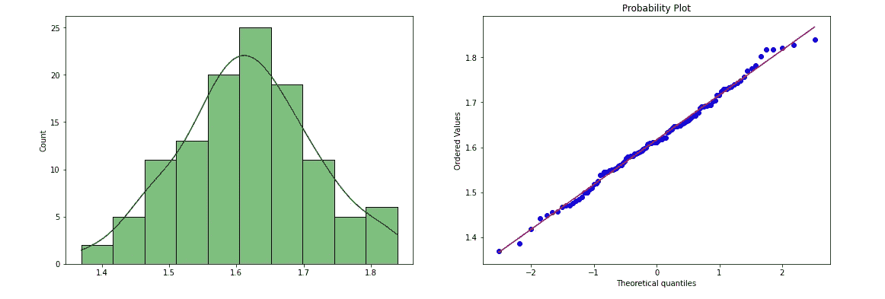
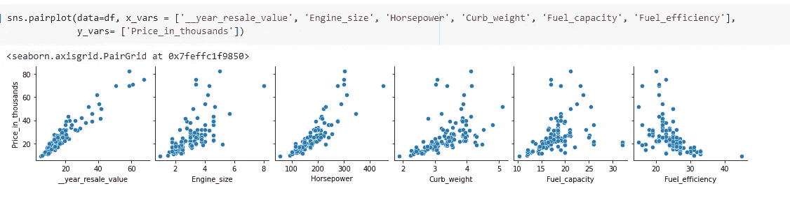
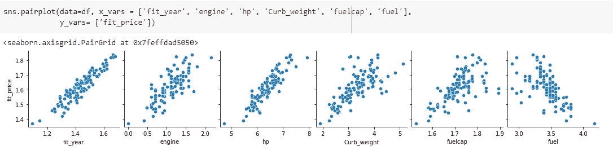
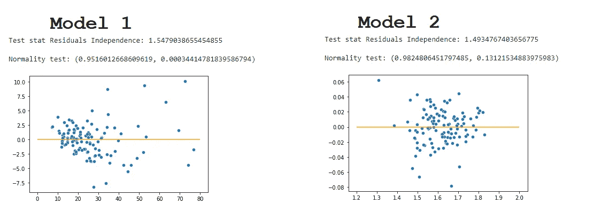

# 关于 Box-Cox 变换的注记

> 原文：<https://towardsdatascience.com/notes-about-the-box-cox-transformations-18d7cd594265>

## 经过一些测试，这里是我能提供的最好的结果


法比安·金特罗在 [Unsplash](https://unsplash.com/s/photos/bell-curve?utm_source=unsplash&utm_medium=referral&utm_content=creditCopyText) 上的照片

## Box-Cox 变换

这篇文章以一个有趣的故事开始。博克斯-考克斯变换是由两位统计学家创造的:乔治**博克斯**和大卫**考克斯爵士。他们曾经见过面，并同意一起写一篇论文，因为他们觉得有趣的是，他们的名字听起来很相似，就像押韵一样。对我们来说幸运的是，它赋予了他们转换数据的公式以生命。**

好吧，撇开好奇不谈，Box-Cox 实际上是幂变换，其目标是稳定方差，并使您的数据更像众所周知的钟形**正态分布。**

> Box-Cox 变换会改变数据的形状，使其更接近正态分布。

如果你有兴趣深化你的知识，了解这背后的数学，我在这篇文章的结尾留下了几个链接供参考。

## 我为什么要在乎？

我一直在研究和学习我能用这个有趣的工具做什么。

相信你知道什么是正态分布，它给我们带来的好处是什么。许多统计测试和理论坚定地依赖于正态分布的假设，其中最著名的是置信区间和假设检验。

因此，如果你有一个非正态分布的数据，你就失去了这些好处。

让我们看看这个例子。我有一个汽车价格数据集*(不，不是 mtcars 数据集……)。*如果我绘制直方图和 QQ 图，我会发现这不是一条正常曲线。

```
# Creating a subplot grid
fig , g = plt.subplots(1,2, figsize=(18,6))#Plot 1 = Histogram
g1 = sns.histplot(data=df, x='Price_in_thousands', ax=g[0]);# Plot2 - QQPlot
g2 = scs.probplot(df.Price_in_thousands, dist='norm', plot=plt)
```



直方图和 QQ 图—价格。图片由作者提供。

现在让我们检查它的统计描述。

```
df[['Price_in_thousands']].describe().round(2).T
```



图片由作者提供。

好的。现在，如果这条曲线遵循正态分布，我们可以很容易地看出，68%的值或多或少都在一个标准偏差内。

```
# Values within + or - 1 std from the mean divided by the number of rowsdf[df['Price_in_thousands'].between( 25.97 - 14.15, 25.97 + 14.15 )]['Price_in_thousands'].count()/ df.shape[0]**[OUT]:**
0.8461538461538461
```

看吧。我们有 84%的数据在 1 个标准偏差内。但是如果我们对数据使用来自`scipy`的 Box-Cox 变换，看看接下来会发生什么。还要注意，`boxcox()`函数返回转换后的数据和`lambda`数。λ是一个最佳估计值，它使数据成为一个像集合一样的正态分布，这在以后会很有用。

```
# Import library
import scipy.stats as scs# Transformation Box-Cox
fit_price, lam = scs.boxcox(df['Price_in_thousands'])# Create the plot grid
fig , g = plt.subplots(1,2, figsize=(18,6))# Histogram
g1 = sns.histplot(fit_price, ax=g[0]);# QQPlot
g2 = scs.probplot(fit_price, dist='norm', plot=plt);
```



转换成类似正态分布的数据。图片由作者提供。

```
# Stats
pd.DataFrame(fit_price).describe().round(2).T**[OUT]:**
count | mean |  std |  min  | 25%  | 50%  | 75%  | max
117.0 | 1.62 |  0.1 |  1.37 | 1.55 | 1.61 | 1.68 | 1.84
```

看看现在多好。曲线呈钟形，QQ 图几乎完全位于红线上方。

让我们检查一下 68%的数据是否在平均值的正负 1 个标准差范围内。

```
# Create a dataframe object with the fitted price
dff = pd.DataFrame(fit_price, columns=['fitted_price'])# Calculate percentage data within 1 std divided by total rows.
dff[dff.fitted_price.between( 1.62  - 0.1, 1.62 + 0.1 )].count()/ dff.shape[0]**[OUT]:**
fitted_price    0.675214 
dtype: float64
```

哇！就在现场！是 68%。

## 置信区间

从正态分布来看，计算置信区间变得更加容易。如果我们知道 95%的数据都在 2 个标准偏差以内，那么我们就可以考虑这些范围内的数据。

```
# Confidence Interval 95%
upper = 1.62 + 0.2
lower = 1.62 - 0.2print(f'The confidence interval for 95% level is between {round(lower,2)} and {upper}.')**[OUT]:** 
The confidence interval for 95% level is between 1.42 and 1.82.
```

然而，我们不能忘记价值观是变化的。那么，现在怎么办？

来自`scipy`的另一个好工具是逆 Box-Cox 操作。为了使用它，您必须导入`from scipy.special import inv_boxcox`。然后，请注意，当我们转换数据时，我们找到了最佳的λ。现在是使用它进行逆运算的时候了。

```
# Import the inverse Box-Cox
from scipy.special import inv_boxcox# Apply the inversion using the lambda value found on the prior transformation
upper_invert = inv_boxcox(upper, lam)
lower_invert = inv_boxcox(lower, lam)# Print the result
print(f'The confidence interval for 95% level is between {round(lower_invert,2)} and { round(upper_invert,2) }.')**[OUT]:**
The confidence interval for 95% level is between 10.74 and 70.86.
```

## 最后的想法

我测试了 Box-Cox 变换的其他用途。例如，如果我们在运行线性回归模型之前将数据转换为正态分布是否有用？

我的测试在那方面没有结论。我发现有时使用它是有用的，但是转换并不是对所有情况都有效。



价格和独立变量之间的线性关系。图片由作者提供。



转换价格和转换自变量之间的线性关系。图片由作者提供。

对于上面的数据集，我创建了两个模型。没有转换数据的第一个仍然比有转换变量的第二个好。


比较模型 1 和模型 2。图片由作者提供。



比较模型 1 和模型 2。图片由作者提供。

我看不出应用这些转换有什么不同。

我相信，当数据呈指数增长时，它可能会更有帮助，而且我们能够通过转换将数据*线性化。一些论文说，线性回归的转换——当需要时——必须从因变量开始，如果不够，那么尝试转换自变量。*

## 在你走之前

这些是我关于 Box-Cox 变换的笔记。

*   它们是*功率变换，*意味着将有一个功率因数λ应用于数据以对其进行变换。
*   应用 Box-Cox 后，数据的形状发生了变化。
*   数据分布将变得近似正常。
*   你可以利用这一点，比如应用置信区间或假设检验。
*   用`scipy.stats.boxcox()`来改造。
*   用`scipy.special.inv_boxcox()`完成转换的逆过程
*   我看不出我所做的测试对线性回归有很大的影响。

## 参考

[来自维基百科的 Box-Cox 变换](https://en.wikipedia.org/wiki/Power_transform)

Scipy 文档 [boxcox](https://docs.scipy.org/doc/scipy/reference/reference/generated/scipy.stats.boxcox.html) 和 [inv_boxcox](https://docs.scipy.org/doc/scipy/reference/generated/scipy.special.inv_boxcox.html)

[Box-Cox 定义](https://www.statisticshowto.com/box-cox-transformation/)

[Python 中的 Box-Cox](https://www.statology.org/box-cox-transformation-python/)

如果这些内容有用，请关注我。

[](https://gustavorsantos.medium.com/) [## 古斯塔沃·桑托斯-中等

### 生成词云，快速分析文本中最常用的词。词云是一个众所周知的工具使用的数据…

gustavorsantos.medium.com](https://gustavorsantos.medium.com/)