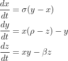
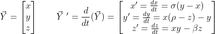
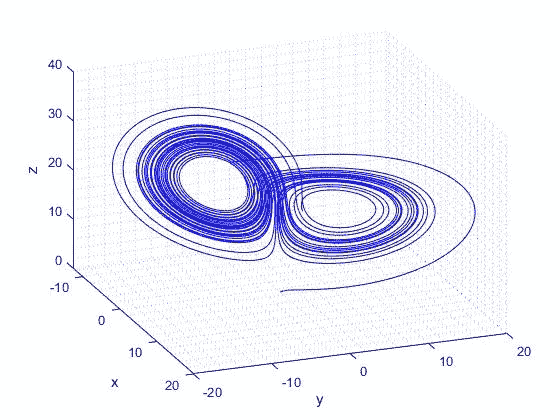

# MATLAB 中的数值积分

> 原文：<https://towardsdatascience.com/numerical-integration-in-matlab-f41d187c1c15>

## 用 MATLAB 实现微分方程数值积分的分步方法


在 [Unsplash](https://unsplash.com?utm_source=medium&utm_medium=referral) 上拍摄的 [ThisisEngineering RAEng](https://unsplash.com/@thisisengineering?utm_source=medium&utm_medium=referral)

微分方程描述了许多基本的物理定律。它们被用来模拟火箭的轨迹，估计一种致命疾病的感染率，模拟一个国家的经济增长，等等。它们就在我们身边，如果使用得当，可以产生强大的效果。大多数具有实际应用的微分方程是常微分方程。这些方程由一个或多个函数(及其导数)和一个独立变量组成。大多数 ODEs 中的自变量是时间，或 *t* 。不幸的是，大多数微分方程太难或者不可能显式求解。要得到一个困难的 ODE 的结果，下一个最好的步骤是数值积分。

数值积分用于近似 ODE 变量随时间的演变。在这篇文章中，我们将集中讨论初值问题。对于这些类型的问题，数值积分需要一个初始时间和初始条件，逐步通过预定义的时间间隔，并在每个时间步长计算变量的解。数值积分的好处是，根据所用的方法，常微分方程可以近似到很高的精度。此外，由于今天可用的大量计算能力，这些方法可以在几秒钟内运行。

MATLAB 有许多数值积分器，由于它的计算能力和相对简单的语法，是许多工程师和物理学家的选择。由于 MATLAB 是由 MathWorks 开发和维护的，他们提供了[详细的解释并列出了](https://www.mathworks.com/help/matlab/math/choose-an-ode-solver.html)他们的每个 ODE 解算器。为您的问题选择正确的解算器可能很关键，但是对于大多数应用程序来说，ode45 解算器是一个很好的起点。 *ode45* 解算器是一个[龙格库塔](https://en.wikipedia.org/wiki/Runge%E2%80%93Kutta_methods)四阶和五阶解算器。我从示例中学习得最好，所以让我们直接进入代码。

先明确一下我们要研究什么常微分方程。最迷人的一组颂歌是[洛伦兹系统](https://en.wikipedia.org/wiki/Lorenz_system)。这组微分方程由 Edward Lorenz 研究，可用于创建大气对流的简化模型。由于我们将更多地关注如何数值求解常微分方程，如果你想了解模型本身的更多细节，你可以访问上面的维基百科链接。描述洛伦兹系统的常微分方程如下:



这里，我们感兴趣的变量是 *x* 、 *y* 和 *z* 。我们将在后面的代码中定义常数 *σ、ρ* 和 *β* 。为了对这些方程进行数值积分，我们需要定义 *ode45* 函数所需的一切:初始条件、时间间隔和模型。我们的初始条件为下面的形式 *Y* (我们的结果也将采用这种形式)，模型为 *Y* 向量的时间导数(或洛伦兹系统 ODEs):



让我们通过将*模型*(或 *Y* 、 *dYdt* 的时间导数)定义为一个 MATLAB 函数来开始代码。下面的代码显示了这一点。我们首先从传递给*模型*的 *Y* 向量(不要与变量 *y* 混淆)中提取 *x* 、 *y* 和 *z* 。接下来，我们定义将由该函数返回的时间导数向量 *dYdt* 。这些是由洛伦兹系统定义的 ode。这里我们将 *σ、ρ* 和 *β* 分别定义为 10、20 和 1.5。

```
% ODEs or Model
function dYdt = model(t, Y)
    x = Y(1);
    y = Y(2);
    z = Y(3); dYdt = zeros(size(Y));
    dYdt(1) = 10*(y-x);   % dxdt
    dYdt(2) = x*(20-z)-y; % dydt
    dYdt(3) = x*y-1.5*z;  % dzdt
end
```

MATLAB 函数必须在代码末尾定义，所以下面的代码必须放在脚本的开头否则 MATLAB 会对你不满意。首先，按照标准做法，我们清除命令窗口，清除变量，并关闭所有图形窗口。这允许我们在运行脚本的其余部分之前从头开始。接下来，我们将定义 *ode45* 的另外两个重要输入，积分的初始条件和时间跨度。在这个例子中，这两个都是任意选择的，但是对于你的问题，你可能有特定的初始条件和你感兴趣的时间跨度。

```
clc
clear variables
close all% Initial Conditions and Time Span
Y0 = [1; 0; 0]; % [x; y; z]
tspan = [0 50]; % [Time_Start Time_Final]
```

下一步就是简单地将我们的 MATLAB 函数、感兴趣的时间跨度以及我们已经定义的初始条件传递给 *ode45* 。我们还可以为 *ode45* 定义一个[选项](https://www.mathworks.com/help/matlab/ref/odeset.html)、 *opts* ，这将确保我们的解决方案精确到您想要的程度。这里，我们使用 *odeset* 将解决方案的相对容差设置得很低。对于你的具体问题，你可能不需要那么低的成本，所以确定什么是最适合你的。用这些参数运行 *ode45* 后，可以提取 *x* 、 *y* 和 *z* 的解。

```
% Numerically Integrating
opts = odeset('RelTol', 1e-13);
[t, Y] = ode45(@model, tspan, Y0, opts);
x = Y(:, 1);
y = Y(:, 2);
z = Y(:, 3);
```

最后，您可以通过使用 *plot3* 函数，从数值积分中绘制出 *x* 、 *y* 和 *z* 的结果(对于本例，因为我们有三个变量)。

```
% Displaying Results
figure; hold on
plot3(x, y, z, 'b')
xlabel('x')
ylabel('y')
zlabel('z')
view(45, 45)
grid minor
```

如果一切顺利，你会从数值积分中得到下面的洛伦兹系统。



洛伦兹系统数值积分结果[由作者创建]

这就是使用 MATLAB 对常微分方程进行数值积分所需的全部代码。一旦你知道如何做，MATLAB 中强大的 ODE 解算器库使这个过程变得相对容易。如果您对 Python 中的数值积分感兴趣，我鼓励您阅读这篇文章:

</how-to-numerically-integrate-dynamics-problems-w-python-85d9783aa088>  

您还可以学习使用 MATLAB 中的 Runge Kutta 方法创建自己的数值积分器:

</how-to-solve-odes-in-matlab-without-built-in-functions-9eaa01c9fe10>  

感谢您的阅读！如果你需要帮助实现这一点，请留下评论。我很乐意帮忙。如果您对其他编码、工程或空间相关的文章感兴趣，请给我一个关注！