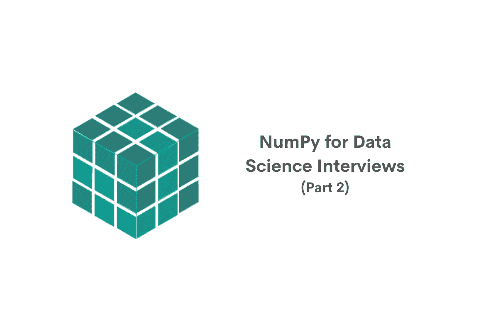
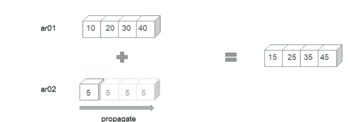
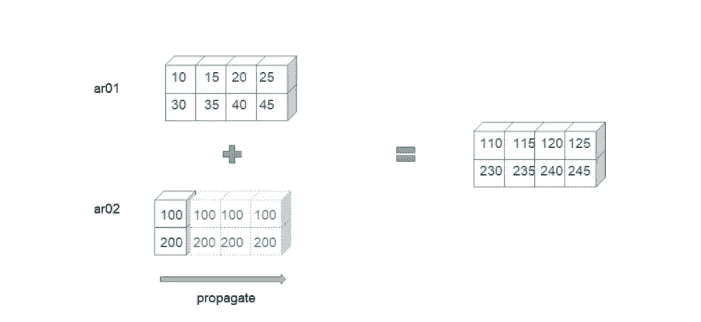
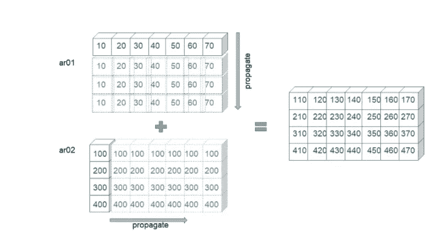
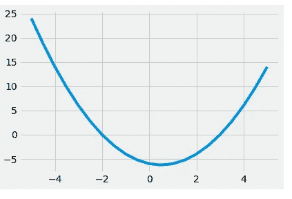
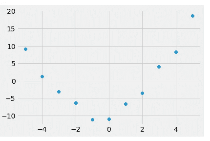
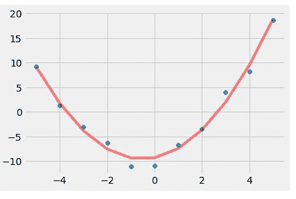

# 数据科学访谈节目:第 2 部分

> 原文：<https://towardsdatascience.com/numpy-for-data-science-interviews-part-02-28c9ee37d2c8>

## *数据科学数字系列的第 2 部分*



作者在 [Canva](https://canva.com/) 上创建的图像

在[的上一篇文章](/numpy-for-data-science-interviews-1f86e7277ddd)中，我们看了使用 NumPy 的基础知识。我们讨论了

*   对 NumPy 的需求以及 NumPy 数组与 Python 列表和 Pandas 系列的比较。
*   尺寸、形状等数组属性。
*   NumPy 中的特殊数组
*   重塑 NumPy 数组
*   索引和切片 NumPy 数组
*   NumPy 数组中的布尔掩码
*   NumPy 中的基本函数
*   矢量化运算

在本系列的第二部分，我们将讨论 NumPy 中的高级主题及其在数据科学中的应用。我们将会看到

*   随机数生成
*   高级阵列操作
*   处理缺失值
*   NumPy 中的排序和搜索功能
*   广播
*   矩阵运算和线性代数
*   多项式
*   曲线拟合
*   将数据导入 NumPy 和从 NumPy 导出数据

如果您以前没有使用过 NumPy，我们建议您阅读 NumPy 系列的[第一部分，开始了解 NumPy 概念。](/numpy-for-data-science-interviews-1f86e7277ddd)

# NumPy 的高级用法


作者在 [Canva](https://canva.com/) 上创建的图片

## NumPy 随机数运算

随机数生成是科学图书馆的重要基础。NumPy 支持使用 random()模块生成随机数。最简单的随机数生成方法之一是 rand()。rand 方法返回 0 和 1 之间均匀随机分布的结果。

```
np.random.rand()
0.008305751553221774
```

我们可以指定需要生成的随机数的数量。

```
np.random.rand(10)
array([0.03246139, 0.41410126, 0.96956026, 0.43218461, 0.3212331 ,
       0.98749094, 0.83184371, 0.33608471, 0.98037176, 0.03072824])
```

或者指定生成的数组的形状。例如，在这种情况下，我们得到 15 个形状为 3 x 5 的均匀分布的随机数

```
np.random.rand(3,5)
array([[0.65233864, 0.00659963, 0.60412613, 0.85469298, 0.95456249],
       [0.25876255, 0.12360838, 0.20899371, 0.9162027 , 0.74732087],
       [0.97992517, 0.1444538 , 0.47195618, 0.38424683, 0.93320447]])
```

我们也可以生成指定范围内的整数。为此，我们使用 randint()方法。

```
np.random.randint(4)
0
```

我们还可以指定需要多少个整数。

```
np.random.randint(1,6)
4
```

与 rand 方法一样，在 randint 函数中，我们也可以指定最终数组的形状

```
np.random.randint(1,6, (5,3))
array([[1, 1, 2],
       [4, 4, 3],
       [3, 4, 5],
       [5, 3, 4],
       [4, 1, 5]])
```

# 抽样

我们也可以使用随机数发生器对给定的群体进行抽样。例如，如果我们想从 10 种不同的颜色中选择三种颜色，我们可以使用 choice 选项。

```
color_list = ['Red', 'Blue', 'Green', 'Orange', 'Violet', 'Pink', 'Indigo', 'White', 'Cyan', 'Black' ]
np.random.choice(color_list, 5)
array(['Black', 'Black', 'Cyan', 'Black', 'Cyan'], dtype='<U6')
```

我们还可以指定是否希望重复选择

```
# Using replace = False to avoid repetitions
np.random.choice(color_list, 5, replace = False)
array(['Black', 'Pink', 'Red', 'Indigo', 'Blue'], dtype='<U6')
```

如您所料，如果选择的数量大于可用选项的数量，该函数将返回一个错误。

```
# Error when sample is more than the population
np.random.choice(color_list, 15, replace = False)
--------------------------------------------------------------------
ValueError                                Traceback (most recent call last)
~\AppData\Local\Temp/ipykernel_9040/2963984956.py in <module>
      1 # Error when sample is more than the population
----> 2 np.random.choice(color_list, 15, replace = False)mtrand.pyx in numpy.random.mtrand.RandomState.choice()ValueError: Cannot take a larger sample than population when 'replace=False'
```

# “冻结”随机状态

数据科学领域的一个关键要求是结果的可重复性。当我们选择随机数来计算结果时，为了能够重现相同的结果，我们需要相同的随机数序列。为此，我们需要了解随机数是如何产生的。

由计算机算法产生的随机数大多称为[伪随机数](https://en.wikipedia.org/wiki/Random_number_generation)。简而言之，这是一个数字序列，它具有与随机数相同的属性，但由于内存、磁盘空间等限制，最终会重复一种模式。该算法使用一个名为[种子](https://en.wikipedia.org/wiki/Random_seed)的初始值来生成随机数。算法的特定种子将输出相同的随机数序列。把它想象成一辆车的注册号码或者社会安全号码。这个数字可以用来识别序列。

为了重现相同的随机数集合，我们需要指定序列的种子。在 NumPy 中，这可以通过设置生成器的 RandomState 来实现。让我们用下面的例子来说明这一点。我们之前从十种颜色中选了五种。每次执行代码，我们可能会得到不同的结果。但是，如果我们在调用 choice 方法之前修复 RandomState，那么无论我们执行多少次单元格，都会得到相同的结果。

```
**Freezing the Random State**# without freezing : each time you execute this cell, you might get a different result
np.random.choice(color_list, 5, replace = False)array(['White', 'Blue', 'Black', 'Cyan', 'Indigo'], dtype='<U6')np.random.choice(color_list, 5, replace = False)
array(['Orange', 'Cyan', 'Pink', 'Violet', 'Black'], dtype='<U6')np.random.choice(color_list, 5, replace = False)
array(['Green', 'Blue', 'Orange', 'Pink', 'White'], dtype='<U6')# If we fix the random state, we will get the same sequence over and over again
np.random.RandomState(42).choice(color_list, 5, replace = False)
array(['Cyan', 'Blue', 'Pink', 'Red', 'White'], dtype='<U6')np.random.RandomState(42).choice(color_list, 5, replace = False)
array(['Cyan', 'Blue', 'Pink', 'Red', 'White'], dtype='<U6')np.random.RandomState(42).choice(color_list, 5, replace = False)
array(['Cyan', 'Blue', 'Pink', 'Red', 'White'], dtype='<U6')
```

这在数据科学操作中非常有用，例如将数据集拆分为训练和测试数据集。您将在几乎所有采样方法中找到这些播种选项——sample、Pandas 中的 shuffle 方法、scikit_learn 等中的 train_test_split 方法。

另一个有用的随机数操作是洗牌。顾名思义，shuffle 方法可以很好地对数组的元素进行重新排序。

```
my_ar = np.arange(1,11)
my_ar
array([ 1,  2,  3,  4,  5,  6,  7,  8,  9, 10])np.random.shuffle(my_ar)
my_ar
array([ 6,  3,  8, 10,  4,  2,  1,  9,  5,  7])my_ar = np.arange(1,11)
np.random.shuffle(my_ar)
my_ar
array([ 6,  7, 10,  8,  1,  9,  3,  4,  2,  5])my_ar = np.arange(1,11)
np.random.shuffle(my_ar)
my_ar
array([ 7,  6,  2,  4,  5,  8, 10,  9,  1,  3])
```

也可以通过指定 RandomState()来“固定”洗牌的结果。

```
# Using random state to fix the shuffling
my_ar = np.arange(1,11)
my_ar
array([ 1,  2,  3,  4,  5,  6,  7,  8,  9, 10])np.random.RandomState(123).shuffle(my_ar)
my_ar
array([ 5,  1,  8,  6,  9,  4,  2,  7, 10,  3])my_ar = np.arange(1,11)
np.random.RandomState(123).shuffle(my_ar)
my_ar
array([ 5,  1,  8,  6,  9,  4,  2,  7, 10,  3])my_ar = np.arange(1,11)
np.random.RandomState(123).shuffle(my_ar)
my_ar
array([ 5,  1,  8,  6,  9,  4,  2,  7, 10,  3])
```

# 数组运算

NumPy 支持一系列数组操作。我们已经在 NumPy 系列的[第一部中看到了一些基本的。让我们来看看一些高级操作。](https://www.stratascratch.com/blog/numpy-for-data-science-interviews/?utm_source=blog&utm_medium=click&utm_campaign=medium)

*拆分一个数组。*
我们有很多种选择，可以把数组分解成更小的数组。

*split()*
split 方法提供了两种主要的拆分数组的方法。
如果我们传递一个整数，这个数组就被分割成大小相等的数组。

```
my_ar = np.arange(31,61)
my_ar
array([31, 32, 33, 34, 35, 36, 37, 38, 39, 40, 41, 42, 43, 44, 45, 46, 47,
       48, 49, 50, 51, 52, 53, 54, 55, 56, 57, 58, 59, 60])
np.split(my_ar, 5)
[array([31, 32, 33, 34, 35, 36]),
 array([37, 38, 39, 40, 41, 42]),
 array([43, 44, 45, 46, 47, 48]),
 array([49, 50, 51, 52, 53, 54]),
 array([55, 56, 57, 58, 59, 60])]
```

如果数组不能分成大小相等的子数组，它将返回一个错误。

```
# This will result in an error since the array cannot be split into equal parts
np.split(my_ar, 8)
--------------------------------------------------------------------
TypeError                                 Traceback (most recent call last)
c:\users\asus\appdata\local\programs\python\python39\lib\site-packages\numpy\lib\shape_base.py in split(ary, indices_or_sections, axis)
    866     try:
--> 867         len(indices_or_sections)
    868     except TypeError:TypeError: object of type 'int' has no len()During handling of the above exception, another exception occurred:ValueError                                Traceback (most recent call last)
~\AppData\Local\Temp/ipykernel_9040/3446337543.py in <module>
      1 # This will result in an error since the array cannot be split into equal parts
----> 2 np.split(my_ar, 8)<__array_function__ internals> in split(*args, **kwargs)c:\users\asus\appdata\local\programs\python\python39\lib\site-packages\numpy\lib\shape_base.py in split(ary, indices_or_sections, axis)
    870         N = ary.shape[axis]
    871         if N % sections:
--> 872             raise ValueError(
    873                 'array split does not result in an equal division')
    874     return array_split(ary, indices_or_sections, axis)ValueError: array split does not result in an equal division
To avoid equal division error, use array_split() method
```

为了克服这个问题，我们可以使用 array_split()方法。

```
np.array_split(my_ar, 8)
[array([31, 32, 33, 34]),
 array([35, 36, 37, 38]),
 array([39, 40, 41, 42]),
 array([43, 44, 45, 46]),
 array([47, 48, 49, 50]),
 array([51, 52, 53, 54]),
 array([55, 56, 57]),
 array([58, 59, 60])]
```

我们可以传递拆分数组的索引，而不是指定子数组的数量。

```
np.split(my_ar, [5,12,15])
[array([31, 32, 33, 34, 35]),
 array([36, 37, 38, 39, 40, 41, 42]),
 array([43, 44, 45]),
 array([46, 47, 48, 49, 50, 51, 52, 53, 54, 55, 56, 57, 58, 59, 60])]
```

我们还可以使用另外两个方法
hs split——来水平划分数组

```
**hsplit**ar2d = my_ar.reshape(5,6)
ar2d
array([[31, 32, 33, 34, 35, 36],
       [37, 38, 39, 40, 41, 42],
       [43, 44, 45, 46, 47, 48],
       [49, 50, 51, 52, 53, 54],
       [55, 56, 57, 58, 59, 60]])
np.hsplit(ar2d, [2,4])
[array([[31, 32],
        [37, 38],
        [43, 44],
        [49, 50],
        [55, 56]]),
 array([[33, 34],
        [39, 40],
        [45, 46],
        [51, 52],
        [57, 58]]),
 array([[35, 36],
        [41, 42],
        [47, 48],
        [53, 54],
        [59, 60]])]
```

在指定索引处垂直拆分。

```
np.vsplit(ar2d, [1,4])
[array([[31, 32, 33, 34, 35, 36]]),
 array([[37, 38, 39, 40, 41, 42],
        [43, 44, 45, 46, 47, 48],
        [49, 50, 51, 52, 53, 54]]),
 array([[55, 56, 57, 58, 59, 60]])]
```

*堆叠阵列。*
和 split 方法一样，我们可以堆叠(或组合)数组。三种常用的方法是:

Stack:顾名思义，这个方法堆叠数组。对于多维数组，我们可以指定不同的轴来堆叠。

```
ar01 = np.ones((2,4)) * 5
ar01
array([[5., 5., 5., 5.],
       [5., 5., 5., 5.]])
ar02 = np.ones((2,4))
ar02               
array([[1., 1., 1., 1.],
       [1., 1., 1., 1.]])
ar03 = np.ones((2,4))*3
ar03
array([[3., 3., 3., 3.],
       [3., 3., 3., 3.]]) np.stack([ar01,ar02,ar03], axis = 0)
array([[[5., 5., 5., 5.],
        [5., 5., 5., 5.]],[[1., 1., 1., 1.],
        [1., 1., 1., 1.]],[[3., 3., 3., 3.],
        [3., 3., 3., 3.]]])
np.stack([ar01,ar02,ar03], axis = 1)
array([[[5., 5., 5., 5.],
        [1., 1., 1., 1.],
        [3., 3., 3., 3.]],[[5., 5., 5., 5.],
        [1., 1., 1., 1.],
        [3., 3., 3., 3.]]])
np.stack([ar01,ar02,ar03], axis = 2)
array([[[5., 1., 3.],
        [5., 1., 3.],
        [5., 1., 3.],
        [5., 1., 3.]],[[5., 1., 3.],
        [5., 1., 3.],
        [5., 1., 3.],
        [5., 1., 3.]]])
```

hstack:这将水平堆叠数组，类似于用于拆分的 hsplit()方法。

```
ar01 = np.arange(1,6)
ar01
array([1, 2, 3, 4, 5])
ar02 = np.arange(11,16)
ar02
array([11, 12, 13, 14, 15])
np.hstack([ar01,ar02])
array([ 1,  2,  3,  4,  5, 11, 12, 13, 14, 15])
np.hstack([ar01.reshape(-1,1), ar02.reshape(-1,1)])
array([[ 1, 11],
       [ 2, 12],
       [ 3, 13],
       [ 4, 14],
       [ 5, 15]])
```

vstack:这是垂直堆叠数组，类似于用于拆分的 vsplit 方法。

```
np.vstack([ar01,ar02])
array([[ 1,  2,  3,  4,  5],
       [11, 12, 13, 14, 15]])
np.vstack([ar01.reshape(-1,1), ar02.reshape(-1,1)])
array([[ 1],
       [ 2],
       [ 3],
       [ 4],
       [ 5],
       [11],
       [12],
       [13],
       [14],
       [15]])
```

# 处理缺失值

处理缺失值是数据科学中的一项重要任务。虽然我们希望数据没有任何缺失值，但不幸的是现实生活中的数据可能包含缺失值。与在聚合时自动忽略缺失值的 Pandas 函数不同，NumPy 聚合函数不以类似的方式处理缺失值。如果在聚合过程中遇到一个或多个缺失值，则结果值也将缺失。

```
my_ar = np.array([1, np.nan, 3])
my_ar
array([ 1., nan,  3.])
my_ar.sum()
nan
my2dar = np.array([[1, np.nan, 3],[4,5,6]])
my2dar
array([[ 1., nan,  3.],
       [ 4.,  5.,  6.]])
my2dar.sum(axis = 0)
array([ 5., nan,  9.])
my2dar.sum(axis = 1)
array([nan, 15.])
```

为了计算这些忽略缺失值的聚合值，我们需要使用“NaN-Safe”函数。例如，NaN-Safe 版本的 sum-nansum()将计算忽略缺失值的数组的和，nanmax()将计算忽略缺失值的数组的最大值，依此类推。

```
np.nansum(my_ar)
4.0
np.nansum(my2dar, axis = 0)
array([5., 5., 9.])
np.nansum(my2dar, axis = 1)
array([ 4., 15.])
```

# 整理

数据科学中遇到的另一个常见操作是排序。NumPy 有许多排序方法。

基本排序方法允许按升序排序。

```
my_ar = np.random.randint(1,51, 10)
my_ar
array([48, 37, 45, 48, 31, 22,  5, 43,  2, 21])
np.sort(my_ar)
array([ 2,  5, 21, 22, 31, 37, 43, 45, 48, 48])
```

对于多维数组，可以指定轴来执行排序操作。

```
my2dar = my_ar.reshape(2,-1)
my2dar
array([[48, 37, 45, 48, 31],
       [22,  5, 43,  2, 21]])
np.sort(my2dar, axis = 0)
array([[22,  5, 43,  2, 21],
       [48, 37, 45, 48, 31]])
np.sort(my2dar, axis = 1)
array([[31, 37, 45, 48, 48],
       [ 2,  5, 21, 22, 43]])
```

***注意*** :没有降序排序选项。可以对排序后的数组使用翻转方法来反转排序过程。或者用切片机。

```
np.sort(my_ar)[::-1]
array([48, 48, 45, 43, 37, 31, 22, 21,  5,  2])
np.flip(np.sort(my_ar))
array([48, 48, 45, 43, 37, 31, 22, 21,  5,  2])
np.sort(my2dar, axis = 0)[::-1, :]
array([[48, 37, 45, 48, 31],
       [22,  5, 43,  2, 21]])
np.sort(my2dar, axis = 1)[:, ::-1]
array([[48, 48, 45, 37, 31],
       [43, 22, 21,  5,  2]])
```

NumPy 也有间接排序方法。这些方法不是返回排序后的数组，而是返回排序后的数组的索引。将这些索引传递给切片器，我们就可以得到排序后的数组。

```
my_ar
array([48, 37, 45, 48, 31, 22,  5, 43,  2, 21])
np.argsort(my_ar)
array([8, 6, 9, 5, 4, 1, 7, 2, 0, 3], dtype=int64)
my_ar[np.argsort(my_ar)]
array([ 2,  5, 21, 22, 31, 37, 43, 45, 48, 48])
np.argsort(my2dar, axis = 0)
array([[1, 1, 1, 1, 1],
       [0, 0, 0, 0, 0]], dtype=int64)
np.argsort(my2dar, axis = 1)
array([[4, 1, 2, 0, 3],
       [3, 1, 4, 0, 2]], dtype=int64)
```

另一个可用的间接排序选项是 lexsort。lexsort 方法允许以指定的顺序对不同的数组进行排序。假设有两个数组—第一个包含五个人的年龄，第二个包含身高。如果我们想先按年龄再按身高排序，我们可以使用 lexsort 方法。结果将是考虑两种排序顺序的索引。

```
age_ar = np.random.randint(20,45,5)
age_ar
array([26, 31, 39, 33, 25])
height_ar = np.random.randint(160,185,5)
height_ar
array([180, 176, 174, 172, 177])
np.lexsort((age_ar, height_ar))
array([3, 2, 1, 4, 0], dtype=int64)
```

# 搜索

像排序方法一样，NumPy 也提供了多种搜索方法。最常用的是-

argmax(和 argmin):这些函数返回最大值(或最小值)的索引。

```
my_ar
array([48, 37, 45, 48, 31, 22,  5, 43,  2, 21])
np.argmax(my_ar)
0
np.argmin(my_ar)
8
my2dar
array([[48, 37, 45, 48, 31],
       [22,  5, 43,  2, 21]])
np.argmax(my2dar, axis = 0)
array([0, 0, 0, 0, 0], dtype=int64)
np.argmax(my2dar, axis = 1)
array([0, 2], dtype=int64)
```

NaN-Safe 方法也可以忽略 nanargmax 和 nanargmin 中缺少的值

其中:这将返回满足指定条件的数组的索引。

```
np.where(my_ar > 30)
(array([0, 1, 2, 3, 4, 7], dtype=int64),)
```

此外，它还可以根据元素是否满足条件来操作输出。例如，如果我们想将所有大于 30 的元素作为正数返回，其余的作为负数返回，我们可以用下面的方式来实现。

```
np.where(my_ar > 30, my_ar, -my_ar)
array([ 48,  37,  45,  48,  31, -22,  -5,  43,  -2, -21])
```

也可以在多维数组上执行这些操作。

```
np.where(my2dar > 30, my2dar, -my2dar)
array([[ 48,  37,  45,  48,  31],
       [-22,  -5,  43,  -2, -21]])
```

argwhere:返回满足 where 条件的数组的索引。

```
np.argwhere(my_ar > 30)
array([[0],
       [1],
       [2],
       [3],
       [4],
       [7]], dtype=int64)
np.argwhere(my2dar > 30)
array([[0, 0],
       [0, 1],
       [0, 2],
       [0, 3],
       [0, 4],
       [1, 2]], dtype=int64)
```

# 广播

NumPy 中最强大的概念之一是广播。NumPy 中的广播特性允许我们在某些情况下对不同形状的数组执行算术运算。在本系列的前一部分[中，我们已经看到了如何对两个形状相同的数组执行算术运算。或带有数组的标量。广播将这个概念扩展到两个形状不同的阵列。](https://www.stratascratch.com/blog/numpy-for-data-science-interviews/?utm_source=blog&utm_medium=click&utm_campaign=medium)

然而，并不是所有的阵列都与广播兼容。为了检查两个数组是否适合广播，NumPy 匹配数组元素的形状，从最外面的轴开始，一直到最里面的轴。如果相应的尺寸为

*   同一的
*   或者至少其中一个等于 1。

为了说明这一过程，让我们举几个例子。

***播音示例 01***

```
ar01 = np.arange(10,50,10)
ar01
array([10, 20, 30, 40])
ar02 = 5
ar01 + ar02
array([15, 25, 35, 45])
```

在这里，我们试图广播一个带有标量的 shape (4，)数组。标量值通过第一个数组的形状传播。



作者图片

***播音示例 02***

```
ar01 = np.arange(10,50,5).reshape(2,-1)
ar01
array([[10, 15, 20, 25],
       [30, 35, 40, 45]])
ar01.shape
(2, 4)
ar02 = np.array([[100],[200]])
ar02
array([[100],
       [200]])
ar02.shape
(2, 1)
ar01 + ar02
array([[110, 115, 120, 125],
       [230, 235, 240, 245]])
```

此示例分别有两个形状为(2，4)和(2，1)的数组。广播规则从最右边的维度应用。

*   首先，为了使维度 4 与维度 1 匹配，第二个数组被扩展。
*   然后程序检查下一个尺寸。因为这两个维度是相同的，所以不需要传播。
*   第一个数组和传播的第二个数组现在具有相同的维度，并且它们可以按元素添加。



作者图片

***广播示例 03***

```
ar01 = np.arange(10,80,10)
ar01
array([10, 20, 30, 40, 50, 60, 70])
ar01.shape
(7,)
ar02 = np.arange(100,500,100).reshape(-1,1)
ar02
array([[100],
       [200],
       [300],
       [400]])
ar02.shape
(4, 1)
ar01 + ar02
array([[110, 120, 130, 140, 150, 160, 170],
       [210, 220, 230, 240, 250, 260, 270],
       [310, 320, 330, 340, 350, 360, 370],
       [410, 420, 430, 440, 450, 460, 470]])
```

在本例中，我们试图将形状(7)的数组与形状(4，1)的数组相加。广播以下面的方式进行。

*   我们首先检查最右边的维度(7)和(1)。因为第二个数组的维数是 1，所以它被扩展以适合第一个数组的大小(7)。
*   此外，使用(4)检查接下来的维度()。为了匹配第二个数组的尺寸，第一个数组被扩展以适合第二个数组的大小(4)。
*   现在扩展数组的维数是(7，4)并且是按元素添加的。



作者图片

最后，我们看一下不适合一起广播的两个阵列。

```
ar01 = np.arange(10,80,10).reshape(-1,1)
ar01
array([[10],
       [20],
       [30],
       [40],
       [50],
       [60],
       [70]])
ar01.shape
(7, 1)
ar02
array([[100],
       [200],
       [300],
       [400]])
ar02.shape
(4, 1)
```

在这里，我们尝试将 shape (7，1)的数组与 shape (4，1)的数组相加。我们从最右边的维度开始—两个数组在这个维度上都有 1 个元素。然而，当我们检查下一个维度(7)和(4)时，这些维度对于广播是不兼容的。因此，程序抛出一个 ValueError。

```
ar01 + ar02
--------------------------------------------------------------------
ValueError                                Traceback (most recent call last)
~\AppData\Local\Temp/ipykernel_9040/1595926737.py in <module>
----> 1 ar01 + ar02ValueError: operands could not be broadcast together with shapes (7,1) (4,1)
```

# 矩阵运算和线性代数

NumPy 提供了许多执行矩阵和线性代数运算的方法。我们看看其中的一些。

***转置矩阵:***

对于二维数组，转置是指将行交换为列，将列交换为行。人们可以简单地调用。t 属性来获取转置矩阵。

```
my2dar
array([[48, 37, 45, 48, 31],
       [22,  5, 43,  2, 21]])
my2dar.T
array([[48, 22],
       [37,  5],
       [45, 43],
       [48,  2],
       [31, 21]])
```

对于多维数组，我们可以使用 transpose()方法，指定要转置的轴。

***矩阵的行列式:***

对于方阵，我们可以计算出[行列式](https://en.wikipedia.org/wiki/Determinant)。行列式在高等数学和数据科学中有许多应用。这些用于使用[克莱姆法则](https://en.wikipedia.org/wiki/Cramer%27s_rule)求解线性方程组，计算[特征值](https://en.wikipedia.org/wiki/Eigenvalues_and_eigenvectors)，这些特征值用于[主成分分析](https://en.wikipedia.org/wiki/Principal_component_analysis)等。要找到一个方阵的行列式，我们可以调用 NumPy 的 linalg 子模块中的 det()方法。

```
sq_ar = np.random.randint(10,50,9).reshape(3,3)
sq_ar
array([[34, 42, 34],
       [12, 16, 33],
       [22, 33, 12]])
np.linalg.det(sq_ar)
-4558.000000000001
sq_ar2 = np.array([[12,15], [18,10]])
sq_ar2
array([[12, 15],
       [18, 10]])
np.linalg.det(sq_ar2)
-149.99999999999997
```

***矩阵乘法:***

两个矩阵相乘构成了高等数学和数据科学中众多应用的基础。matmul()函数实现了 NumPy 中的矩阵乘法功能。为了说明矩阵乘法，我们用 eye()方法创建的单位矩阵乘以一个矩阵。我们应该得到原始矩阵作为结果积。

```
sq_ar
array([[34, 42, 34],
       [12, 16, 33],
       [22, 33, 12]])
np.matmul(sq_ar, np.eye(3,3))
array([[34., 42., 34.],
       [12., 16., 33.],
       [22., 33., 12.]])
sq_ar2
array([[12, 15],
       [18, 10]])
np.matmul(sq_ar2, np.eye(2,2))
array([[12., 15.],
       [18., 10.]])
```

***矩阵的逆:***

对于方阵 M，矩阵 M-1 的逆矩阵被定义为使得 M M-1 = In 的矩阵，其中 In 表示 n 乘 n 单位矩阵。我们可以通过使用 NumPy 中 linalg 子模块的 inv()方法找到 NumPy 中矩阵的逆。

```
inv2 = np.linalg.inv(sq_ar2)
inv2
array([[-0.06666667,  0.1       ],
       [ 0.12      , -0.08      ]])
```

我们可以证明矩阵与其逆矩阵的乘积等于单位矩阵。

```
np.matmul(sq_ar2, inv2)
array([[ 1.00000000e+00, -8.32667268e-17],
       [ 0.00000000e+00,  1.00000000e+00]])
```

***NumPy 数组相等。***

给定浮点精度的差异，我们可以比较两个 NumPy 数组在给定的容差内是否元素相等。这可以使用 allclose 方法来完成。

```
np.allclose(np.eye(2,2), np.matmul(sq_ar2, inv2))
True
```

***求解器。***

NumPy 的 linalg 模块有 solve 方法，可以计算线性方程组的精确解。

```
**Solving Linear Equations**x1 + x2 = 10
2x1 + 5x2 = 41
This should give x1 = 3 and x2 = 7coeff_ar = np.array([[1,1],[2,5]])
ord_ar = np.array([[10],[41]])
np.linalg.solve(coeff_ar, ord_ar)
array([[3.],
       [7.]])
```

# 多项式

像线性代数子模块一样，NumPy 也支持多项式代数。该模块有几个方法以及包含常见算术运算的多项式类。让我们看看多项式子模块的一些功能。为了说明这一点，我们用 x f(x)中的多项式来表示

```
f(x) = x² - x - 6
```

我们可以从系数中创建多项式。注意，系数必须按度数的升序排列。所以先列出常数项的系数(-6)，然后是 x 的系数(-1)，最后是 x (1)的系数

```
from numpy.polynomial.polynomial import Polynomial
poly01 = Polynomial([-6,-1,1])
poly01
x → -6.0-1.0x+1.0x²
```

该表达式也可以被因式分解为

```
f(x) = (x-3)(x+2)
```

这里 3 和-2 是方程 f(x) = 0 的[根](https://en.wikipedia.org/wiki/Equation_solving)。我们可以通过调用 roots()方法找到多项式的根。

```
poly01.roots()
array([-2.,  3.])
```

我们可以使用 fromroots()方法从根开始形成方程。

```
poly02 = Polynomial.fromroots([-2,3])
poly02
x → -6.0-1.0x+1.0x²
```

多项式模块还包含 linspace()方法，该方法可用于创建跨域的等距 x 和 f(x)对。这可以用来方便地绘制图形。

```
polyx, polyy = poly01.linspace(n = 21, domain = [-5,5])plt.plot(polyx, polyy)
[<matplotlib.lines.Line2D at 0x26006fd2e80>]
```



作者图片

# 曲线拟合

NumPy 多项式子模块还提供多项式对数据的最小平方拟合。为了说明这一点，让我们创建一组数据点，并为多项式表达式添加一些随机性。

```
numpoints = 11
x_vals = np.linspace(-5,5,numpoints)
y_vals = x_vals**2 + x_vals - 12 + np.random.rand(numpoints)*4plt.scatter(x_vals, y_vals)
<matplotlib.collections.PathCollection at 0x26008086940>
```



作者图片

然后，我们在这些点上调用 polyfit()方法，并找到拟合多项式的系数。

```
from numpy.polynomial import polynomial
fit_pol = polynomial.polyfit(x_vals, y_vals, 2)
fit_pol
array([-9.35761397,  0.96843091,  0.93303665])
```

我们还可以通过绘制数值来直观地验证拟合度。为此，我们使用多值方法来计算这些点处的多项式函数。

```
fit_y = polynomial.polyval(x_vals, fit_pol)
plt.scatter(x_vals, y_vals)
plt.plot(x_vals, fit_y, c = 'Red', alpha = 0.5 )
[<matplotlib.lines.Line2D at 0x26008102c10>]
```



作者图片

# 在 NumPy 中导入和导出数据

到目前为止，我们已经动态创建了数组。在现实生活的数据科学场景中，我们通常有可用的数据。NumPy 支持从文件导入数据和将 NumPy 数组导出到外部文件。我们可以使用 save 和 load 方法在 native NumPy native(.npy 和。npz 格式)。

```
**save**with open("numpyfile.npy", "wb") as f:
    np.save(f, np.arange(1,11).reshape(2,-1))**load**with open("numpyfile.npy", "rb") as f:
    out_ar = np.load(f)
out_ar
array([[ 1,  2,  3,  4,  5],
       [ 6,  7,  8,  9, 10]])
```

我们还可以使用 loadtxt 和 savetxt 方法从文本文件中读取数据和向文本文件中写入数据。

```
**savetxt**np.savetxt("nptxt.csv", np.arange(101,121).reshape(4,-1))**loadtxt**np.loadtxt("nptxt.csv")
array([[101., 102., 103., 104., 105.],
       [106., 107., 108., 109., 110.],
       [111., 112., 113., 114., 115.],
       [116., 117., 118., 119., 120.]])
```

## 结论

在本系列中，我们研究了 NumPy，它是 Python 数据科学生态系统中用于科学计算的基础库。如果你熟悉熊猫，那么搬到 NumPy 是非常容易的。有抱负的数据科学家或声称精通 Python 的数据分析师会对 NumPy 感到满意。

和任何技能一样，掌握数字所需要的只是耐心、坚持和练习。你可以从 StrataScratch 上的实际数据科学面试中尝试这些和许多其他的[数据科学面试问题](https://www.stratascratch.com/blog/data-science-interview-guide-questions-from-80-different-companies/?utm_source=blog&utm_medium=click&utm_campaign=medium)。加入由 40，000 多名志同道合的数据科学爱好者组成的社区。你可以练习 1000 多个不同难度的编码和非编码问题。今天就加入 StaraScratch，让你在苹果、网飞、微软等顶级科技公司工作的梦想成为现实，或者在 Noom、Doordash 等热门初创公司工作的梦想成为现实。所有的代码示例都可以在 [Github](https://github.com/viveknest/statascratch-solutions/blob/main/NumPy%20for%20Data%20Science%20Part%2002.ipynb) 这里找到。

【https://www.stratascratch.com】最初发表于<https://www.stratascratch.com/blog/numpy-for-data-science-interviews-part-02/?utm_source=blog&utm_medium=click&utm_campaign=medium>**。**