# NumPy 重塑可以打破你的心

> 原文：<https://towardsdatascience.com/numpy-reshape-can-break-your-heart-96fcc47c6894>

# NumPy 重塑可以打破你的心

## NumPy reshape 可能不会真的让你心碎，但它可以对心电图(ECG)等时间序列做出无意的改变，并导致生理属性的巨大变化


图 1:[凯利·西克玛](https://unsplash.com/@kellysikkema?utm_source=medium&utm_medium=referral)在 [Unsplash](https://unsplash.com?utm_source=medium&utm_medium=referral) 上的照片

我将要讲述的他的故事，来源于一次参加生理网挑战赛 [2020](https://physionetchallenges.org/2020/) 和 [2021](https://physionetchallenges.org/2021/) 的经历。这项机器学习挑战的任务是从心电图(ECG)中对心脏相关疾病进行分类。我们的团队决定使用 1D 卷积神经网络对 12 导联心电图中的 30 种不同的心脏疾病进行分类(你可以在我们的[预印本论文](https://www.researchgate.net/publication/355855233_Multi-label_ECG_classification_using_Convolutional_Neural_Networks_in_a_Classifier_Chain)中阅读更多关于这种方法的信息)。

在我们将数据集导入到 NumPy 数组中，然后不得不根据以下内容对数组进行整形之后，问题出现了:

> (n _ 患者 x n _ 通道 x n _ 信号长度)

到

> (n 个患者 x n 个信号长度 x n 个通道)

这对于使阵列符合 1D 卷积神经网络的输入形状是必要的。在以前的项目中，在处理图像数据时，我已经使用 NumPy 的 reshape 方法做到了这一点，效果非常好。下面的代码显示了在重新调整数组形状之前，如何绘制图 2 所示的三个 MNIST 数字示例。

```
Image_data = pd.read_csv("/kaggle/input/digit-recognizer/train.csv")
Image_data = Image_data.iloc[:,1:]
# Image_data shape = (42000, 28, 28, 1)for i **in** range(3):
    plt.imshow(Image_data[i][:,:,0])
    plt.axis("off")
    plt.show()
```

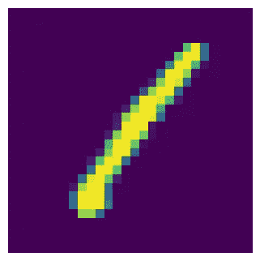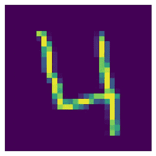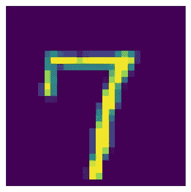

图 2:未经任何预处理的 MNIST 数字|作者图片

然后，让我们尝试将 reshape 方法应用于相同的三个数字，然后再次绘制它。

```
Image_data_reshaped= Image_data.reshape(42000,28,1,28)for i **in** range(3):
    plt.imshow(Image_data_reshaped[i][:,0,:])
    plt.axis("off")
    plt.show()
```


图 3:重塑后的 MNIST 数字|作者图片

图 3 显示了使用 NumPy reshape 方法后，图 2 中绘制的 3 个相同的图形。还有…tada:

# 没区别！🎉

现在，让我们切换回 ECG 案例，在 ECG 阵列上尝试同样的方法。首先，让我们看看什么是心电图:

> ECG 反映了心脏的电活动，并且对该记录的解释可以揭示心脏的许多病理。

通过在患者上身的不同位置放置 10 个电极来测量 12 导联 ECG。这让我们可以从不同的角度测量心脏的电活动。

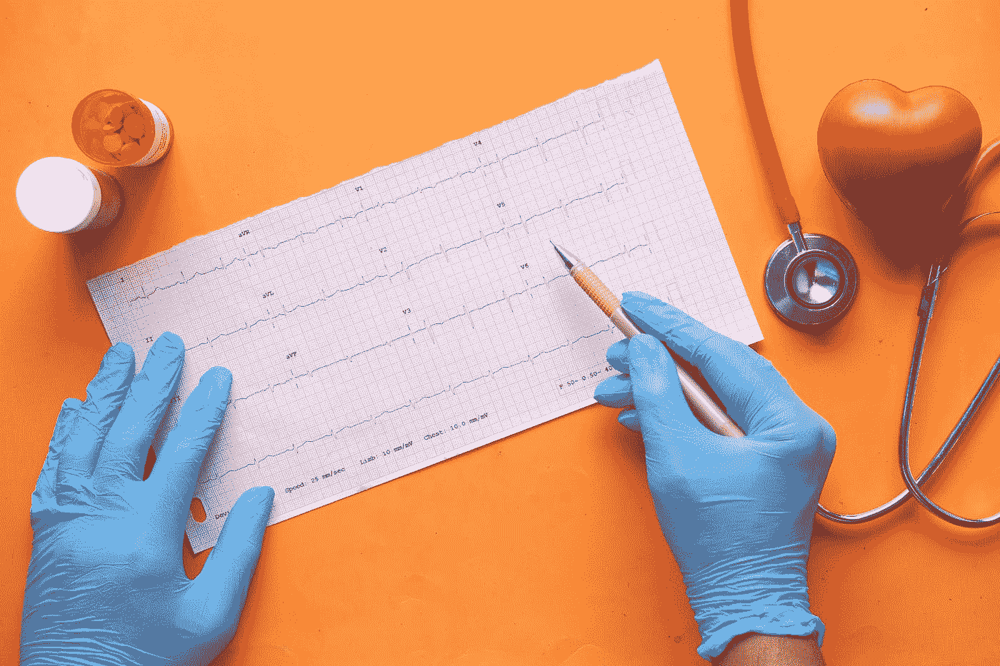

图 4:手动解读的 12 导联心电图。 [Towfiqu barbhuiya](https://unsplash.com/@towfiqu999999?utm_source=medium&utm_medium=referral) 在 [Unsplash](https://unsplash.com?utm_source=medium&utm_medium=referral) 上拍照

现在，让我们来看看数据集中第一位患者的 12 个心电图导联。下面的代码显示了如何选择一名患者的 12 导联心电图，并在没有任何整形的情况下绘制。图 5 显示了绘制的结果，每个子图显示了 12 个导联中的每一个。

```
# ecg_array shape is equal to (21832,12,5000)single_ecg = ecg_array[0]for i **in** range(12):
    ecg_plot.plot_1(single_ecg[i,:])
    plt.show()
```

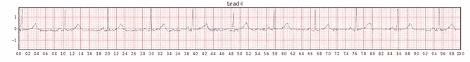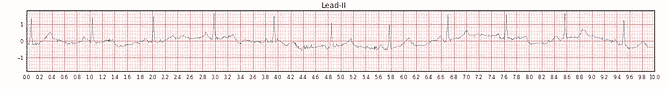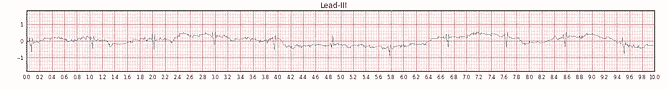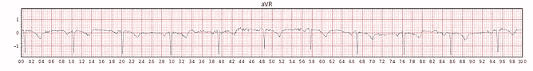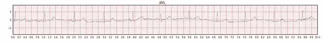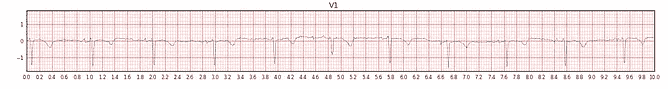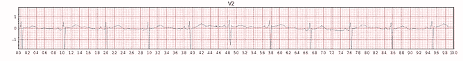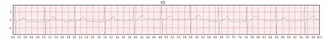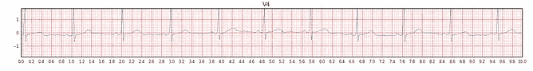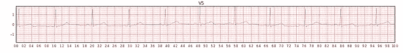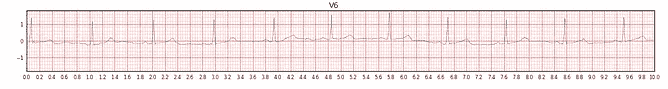

图 5:预处理前的心电图

现在，让我们对 ECG 使用整形方法。

```
# single_ecg shape = (12,5000)
reshaped_ecg = single_ecg.reshape(single_ecg.shape[1],single_ecg.shape[0])
# reshaped_ecg shape = (5000,12)for i **in** range(12):
    ecg_plot.plot_1(reshaped_ecg[:,i])
    plt.show()
```

图 6 显示了绘制整形后的 ECG 阵列后得到的 12 个导联

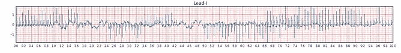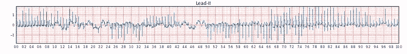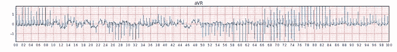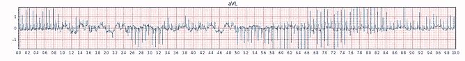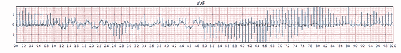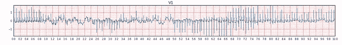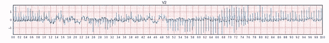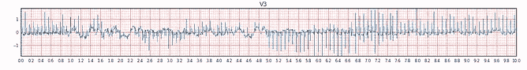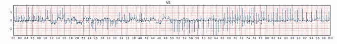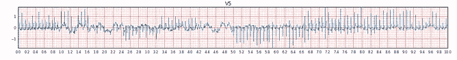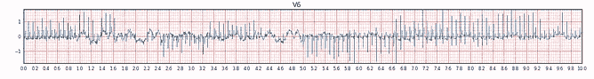

图 6:使用整形方法后的心电图|作者图片

嗯（表示踌躇等）...奇怪的事情发生了。让我们放大其中一个心电图。图 7 显示了应该是导联 I 的部分，它看起来仍然像 ECG，但不是我们预期的那样。如果我们再次仔细观察图 4 中的 12 个导联，我们会发现现在所有导联都完全相同。


图 7:放大使用 NumPy 整形方法处理的一个 ECG 导联|作者图片

显示结果的最佳方式是平坦化原始 ECG 信号，并将其重新采样为 5000 个样本，然后将其与整形后的信号进行比较，如图 8 所示。

```
# single_ecg.ravel() shape = 60000 (12 x 5000)
from scipy import signal#resample signal from 60000 to 5000
resamp_sig = signal.resample(single_ecg.ravel(), 5000) 
plt.plot(reshaped_ecg[:,0], label="reshaped signal")
plt.plot(resamp_sig, label="resampled signal")
plt.show()
```

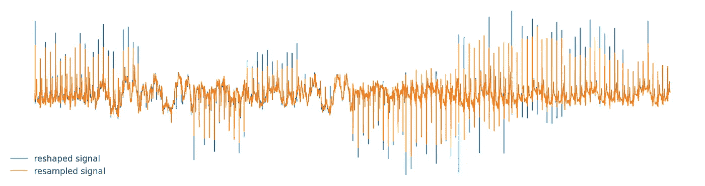

图 8:整形信号与重采样信号|作者图片

从图 8 中我们可以看到，整形方法实际上不仅整形了数组，还对所有原始的 12 个导联进行了重新采样，然后使其适合于单个导联，然后制作了 12 个副本。

好吧，所以 NumPy reshape 可能不会真的让你心碎，但在这种情况下，它无意中改变了心电图，也对生理特性产生了巨大的影响。在这种情况下，它将测得的心率提高了 12 倍，但我们如何克服这个问题呢？

## 用 n **umpy.moveaxis** 代替！

```
# single_ecg shape = (12,5000)
ecg_moveaxis = np.moveaxis(single_ecg, 0, -1)
# ecg_moveaxis.shape = (5000,12)
```