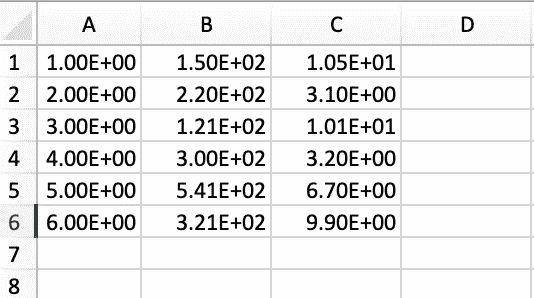
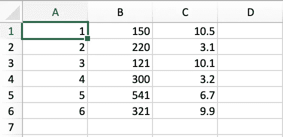

# 如何将 NumPy 数组写入 CSV 文件

> 原文：<https://towardsdatascience.com/numpy-to-csv-53df45d3948e>

## 展示了如何将 NumPy 数组转储到？csv 文件


由[凯利·西克玛](https://unsplash.com/@kellysikkema?utm_source=unsplash&utm_medium=referral&utm_content=creditCopyText)在 [Unsplash](https://unsplash.com/s/photos/write?utm_source=unsplash&utm_medium=referral&utm_content=creditCopyText) 上拍摄的照片

## 介绍

在 NumPy 和 Python 中使用数组时，我们通常需要将它们转储到各种形式的输出文件中，包括逗号分隔值(CSV)。

在今天的简短教程中，我们将讨论将 NumPy 数组写入此类文件的几种不同方法。最后，我们将讨论一种将 NumPy 数组转储到文件中时通常应该避免的方法。

首先，让我们创建一个示例 numpy 数组，我们将在这个简短的教程中引用它来演示一些概念。

```
import numpy as np arr = np.asarray([ 
    [1, 150, 10.5], 
    [2, 220, 3.1], 
    [3, 121, 10.1],
    [4, 300, 3.2], 
    [5, 541, 6.7], 
    [6, 321, 9.9],
])print(arr)
***array([[  1\. , 150\. ,  10.5],
       [  2\. , 220\. ,   3.1],
       [  3\. , 121\. ,  10.1], 
       [  4\. , 300\. ,   3.2],
       [  5\. , 541\. ,   6.7],
       [  6\. , 321\. ,   9.9]])***
```

## 使用`numpy.savetxt()`方法

当我们需要将一个 NumPy 数组转储到一个输出文件中时，我们的第一个选择是使用`[numpy.savetxt()](https://numpy.org/doc/stable/reference/generated/numpy.savetxt.html)`方法将一个数组保存到一个文本文件中。该方法允许用户指定分隔符，在我们的例子中应该是逗号:

```
np.savetxt('output.csv', arr, delimiter=',')
```

请注意，输出将使用科学符号，如下所示。



示例输出—来源:作者

如果你想避免使用科学符号，那么你可以指定一个合适的`fmt`。举个例子，

```
np.savetxt('output.csv', arr, delimiter=',', fmt='%f')
```



没有科学符号的输出示例—来源:作者

## 使用 numpy.tofile()方法

第二个选项是`[numpy.ndarray.tofile()](https://numpy.org/doc/stable/reference/generated/numpy.ndarray.tofile.html)`方法，用于将数组以文本或二进制形式写入文件。同样，我们可以指定分隔符(`sep`和`format`):

```
arr.tofile('output.csv', sep=',', format='%f')
```

## 要避免什么

另一种流行的(但不是很聪明的)方法是首先将 NumPy 数组转换成 pandas 数据帧，然后使用`[pandas.DataFrame.to_csv()](https://pandas.pydata.org/docs/reference/api/pandas.DataFrame.to_csv.html)`方法将结果数据帧写入输出 csv 文件。

但是，请注意，这不是一个好的做法，因为它会毫无理由地消耗太多的内存——尤其是当您使用相当大的数组时。

## 最后的想法

在今天的简短教程中，我们展示了一些将 NumPy 数组写入 CSV 文件的不同方法。更具体地说，我们讨论了如何使用`numpy.savetxt()`和`numpy.tofile()`方法做到这一点。

最后，我们强调了避免让 pandas 参与到将 NumPy 数组转储到 CSV 文件的过程中的重要性，因为这在内存方面是非常昂贵的。

[**成为会员**](https://gmyrianthous.medium.com/membership) **阅读介质上的每一个故事。你的会员费直接支持我和你看的其他作家。你也可以在媒体上看到所有的故事。**

[](https://gmyrianthous.medium.com/membership)  

**相关文章你可能也喜欢**

[](/requirements-vs-setuptools-python-ae3ee66e28af)  [](/how-to-merge-pandas-dataframes-221e49c41bec)  [](/euclidean-distance-numpy-1b2784e966fc) 