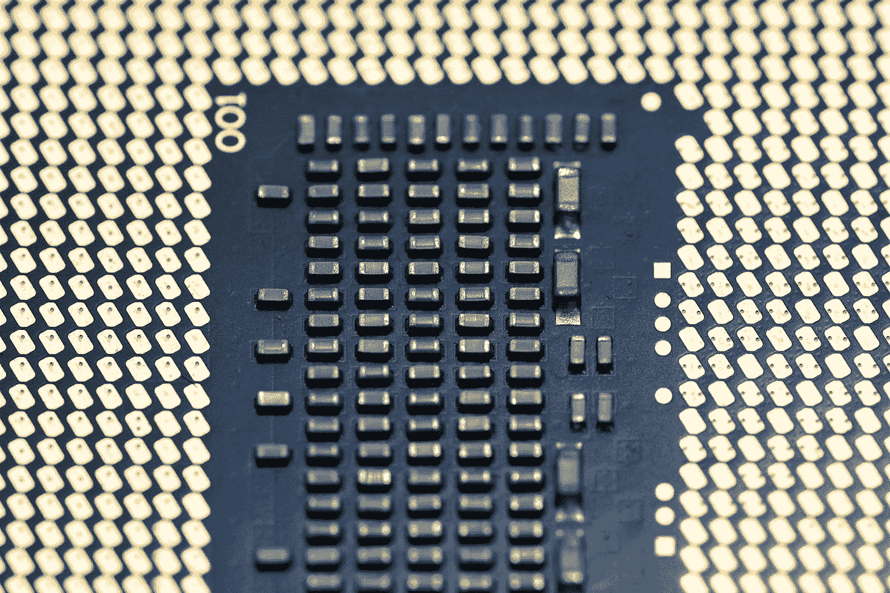
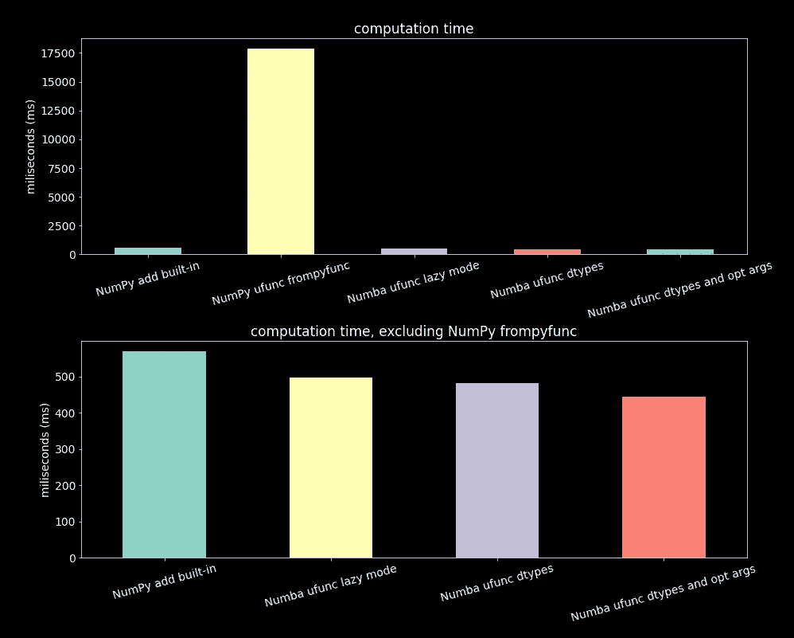

# NumPy ufuncs——矢量化函数背后的魔力

> 原文：<https://towardsdatascience.com/numpy-ufuncs-the-magic-behind-vectorized-functions-8cc3ba56aa2c>

## 了解 NumPy 通用函数(ufuncs)以及如何创建它们。编写自己的矢量化函数。

杰瑞米·贝赞格在 [Unsplash](https://unsplash.com?utm_source=medium&utm_medium=referral) 上的照片

你有没有想过 NumPy 神奇表演的由来？NumPy 在引擎盖下为数据科学家的许多日常驱动程序提供性能，例如熊猫。当然，考虑用 C 和 Fortran 编写的优化数组是正确的。至少说对了一半。另一半不是数组，而是 NumPy 的函数本身。NumPy 通用函数(以下简称 ufuncs)是数组(ndarray)之外的另一个构件。

当我们想写一些圆滑的和高性能的数字代码时，没有别的办法；我们用 NumPy。一旦我们开始使用 NumPy 数组，就可以直观地使用 NumPy 的内置函数来操纵和操作它们。如果我们在数组上使用 Python 的普通函数，性能会很快消失。

在这个故事中，我们将讨论一些关于 ufunc 的见解，更重要的是，学习关于自定义 uf unc 创建的基础知识。能够实现我们自己的 ufuncs 将使 NumPy 项目更上一层楼。

通常我们会花很多时间在 NumPy 的文档中寻找实现我们需要的功能的方法；有时候，我们找到了，有时候，我们没有。在后一种情况下，我们可能会最终实现一些 hack 或退回到普通 Python，并牺牲性能。编写自定义函数可以极大地简化我们的生活。

故事结构:

*   什么是 ufuncs？
*   一元和二元函数
*   NumPy ufunc 创建
*   Numba ufunc 创建:矢量化装饰器
*   ufunc 创建:NumPy vs. Numba
*   ufunc.reduce
*   ufunc.accumulate
*   最终意见

## 什么是 ufuncs？

NumPy ufuncs 对数组(ndarray)进行元素操作。其中一些支持更复杂的功能，如阵列广播。虽然 NumPy 的内置 uf unc 是矢量化的(C 或 Fortran 中的矢量化计算)，但并非所有 uf unc 都是相同意义上的矢量化，我们将在下面的部分中看到这一点。

所有 ufuncs 都采用相同的可选关键字参数，并公开相同的属性和方法；你可以在这里查看它们。

NumPy 中的大部分函数都是 ufuncs 然而，有些不是，而是 ufunc 的方法。ufunc 的方法是普通的 Python 函数，但仍然是从 ufunc 派生的。那是他们获得魔力的地方。比如 np.sum 就是一个正则函数，来自于`np.add`，一个 ufunc。

然而，这些方法并不适用于所有的 ufuncs。有两种主要的形式，二元和一元。方法只适用于二进制函数。

## 一元和二元函数

在数学中，最常见的运算是二进制。和(a + b)和乘积(a * b)是一些最简单和最著名的例子。这些操作中的一些是通勤的；其他人没有。然而，有一些转换是在单个元素上操作的。事实上，我们可以争论这些变换是否可以通过使用二元运算导出，也许是无限和——例如，指数函数。

二元运算在数学中处于中心地位的原因之一是，所有具有两个以上操作数的运算都可以转换为一系列二元运算。

NumPy 在其函数中继承了这一行为。有两种类型的 ufuncs:

*   一元 ufuncs:取一个数组(ndarray)作为参数
*   二进制 ufuncs:将两个数组(ndarray)作为参数

例如:

> <class>，1</class>
> 
> <class>，2</class>

其中 nin 属性是输入的数量。

## NumPy ufunc 创建

创建自定义 ufuncs 非常容易。NumPy 有一个实用程序`np.frompyfunc`，它接受一个普通的 Python 函数、输入参数的数量和输出参数的数量，并返回一个 ufunc。例如，我们可以创建一元 ufunc:

> <class>，<class></class></class>
> 
> 3, 3

我们还可以创建一个二进制 ufunc:

> <class>，<class></class></class>
> 
> 2, 2

## Numba ufunc 创建:矢量化装饰器

Numba 还有一个创建 ufunc 的方法。`vectorize`装饰工。然而，这个装饰器不仅仅是创建一个 ufunc 它还针对性能进行了优化。根据 Numba 的文档，它可以编译 Python 函数，其速度与用 C 编写的 ufuncs 相当(NumPy 内置)。

有许多方法可以使用装饰器；最直接的方法是在装饰器中使用所有默认值(即没有参数):

> <class></class>
> 
> 2
> 
> [2\. 2.]

这里我们没有为编译指定输入和输出数据类型，因此是惰性模式。

我们还可以显式传递数据类型:

> <class></class>
> 
> 2
> 
> [2\. 2.]

这里我们说有一个输入(括号外的类型)和两个输出(括号内的元组)。如果两个输入都是`int64`，返回类型也将是`int64`。如果两个输入都是`float32`，则输出是`float32`，以此类推。指定数据类型可以优化编译。

最后，我们还可以更改其他装饰器的默认参数来优化计算性能:

> <class></class>
> 
> 2
> 
> [2\. 2.]

## ufunc 创建:NumPy vs. Numba

在本节中，我们将比较添加两个 2D NumPy 数组(ndarray)的几种方法的计算时间。我们将使用以下 ufuncs:

*   NumPy 内置 add ( `np.add`)
*   `np_my_sum`、用 np.frompyfunc 创建的 ufunc
*   `numba_lazy_sum`、用下 Numba 的矢量化装饰器创建的 ufunc，带有默认参数，没有数据类型信息
*   `numba_dtype_sum`，使用矢量化装饰器创建的 ufunc，说明用于编译的数据类型转换
*   numba_ `dtype_opt_sum`，使用矢量化装饰器创建的 ufunc，说明编译的数据类型转换以及优化性能的参数

对谈话进行编码:

结果是:

加法运算的计算时间(越少越好)。对于 NumPy 内置，NumPy ufunc(frompypfunc)和几个 Numba ufuncs(矢量化装饰器)[作者图片]

我们可以看到，用 NumPy `frompyfunc`创建的 ufunc 完全是另一个联盟；计算时间比其他函数大几个数量级。然而，如果我们忽略它，我们可以看到 Numba 的 ufuncs 性能与 NumPy 的内置`add`功能相当，并且它们之间是相似的。

如果我们想创造高性能的 ufuncs，Numba 是必由之路。除非性能很关键，否则`vectorize`装饰器可以在没有参数的情况下使用。

NumPy 的优势之一是它的性能，为 Python 带来了速度。让我们面对它；速度不是 Python 的优势之一。因此，有必要区分 C 或 Fortran 矢量化计算与纯 Python 矢量化。速度不会一样。

## ufunc.reduce

NumPy 中有些函数不是 ufuncs 大多数人都接受 axis 关键字。这些函数非常棒，因为它们允许我们指定是将函数操作应用于整个数组，还是只应用于轴的子集，例如`np.sum`。

假设我们有一个 2D 阵列，并且不指定轴(或者同时指定两个轴)。在这种情况下，函数返回一个标量和整个数组的和，但是如果我们指定轴零(1)，函数将返回列(行)和的向量。

我们可以检查`np.sum`是一个普通的 Python 函数，而不是 ufunc:

> <class></class>

这就是我们可以使用函数和 axis 参数做的事情:

打印总和:

> 36
> 
> 36
> 
> [ 9 12 15]
> 
> [ 3 12 21]

在引擎盖下，`np.sum`本质上是 `np.add`功能的还原方法的应用:

> 36
> 
> 36
> 
> [ 9 12 15]
> 
> [ 3 12 21]

所以，如果我们可以从 add ufunc 中恢复 NumPy sum 函数，那么 Numba 的 add ufunc 呢？当然，我们也可以使用 reduce。让我们用`vectorized`装饰器来定义函数:

测试它:

> 36
> 
> 36
> 
> [ 9 12 15]
> 
> [ 3 12 21]

我们是金色的。

讨论 NumPy 的 apply _ 沿 _ 轴函数是至关重要的。它可以简化 Python 的常规函数:

> [ 9 12 15]
> 
> [ 3 12 21]

但是，这样做并不会利用 NumPy 的性能。这比使用编译的 ufunc 要慢得多。所以要小心。

## ufunc.accumulate

另一个有用方法是积累。对于 sum，它类似于函数(普通 Python) np.cumsum 所做的:

> [[ 0 1 2]
> 
> [ 3 5 7]
> 
> [ 9 12 15]]
> 
> [[ 0 1 3]
> 
> [ 3 7 12]
> 
> [ 6 13 21]]

我们可以在 add ufunc 中使用 accumulate 方法，得到相同的结果:

> [[ 0 1 2]
> 
> [ 3 5 7]
> 
> [ 9 12 15]]
> 
> [[ 0 1 3]
> 
> [ 3 7 12]
> 
> [ 6 13 21]]

我们也可以在 Numba 的 ufunc 中使用它:

> [[ 0 1 2]
> 
> [ 3 5 7]
> 
> [ 9 12 15]]
> 
> [[ 0 1 3]
> 
> [ 3 7 12]
> 
> [ 6 13 21]]

## 最终意见

正如我们在这个故事中所看到的，强调并非所有的人生来平等是至关重要的。在 ndarrays 上应用自定义函数时，即使使用 frompyfunc 或 apply_along_axis 等 NumPy 工具，找出代码中的性能瓶颈也是至关重要的。

所以下次在数组上使用函数时，问问自己它是否为矢量化运算进行了适当的优化。

关于 ufunc 的创建，Numba 的实用程序在性能方面是一个不错的选择。

我希望这个故事对你有用。 [*订阅*](https://medium.com/subscribe/@diego-barba) *到我的邮件列表如果你想知道更多这样的故事。*

*喜欢这个故事吗？通过我下面的推荐链接成为一个媒体成员来支持我的写作。无限制地访问我的故事和许多其他内容。*

<https://medium.com/@diego-barba/membership> 