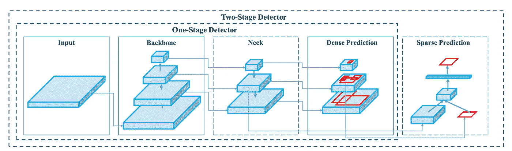
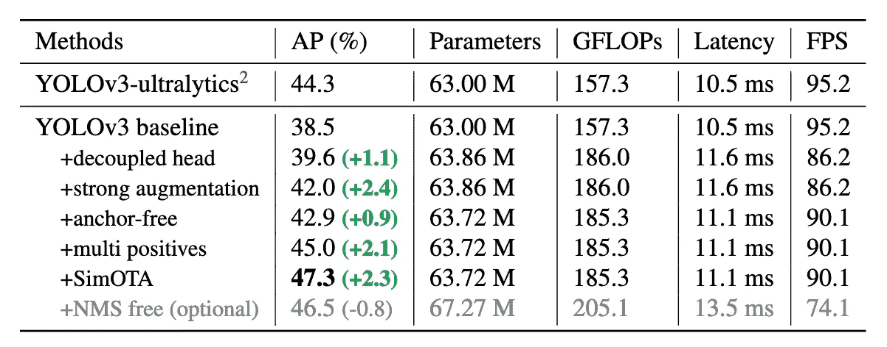

# 对象检测神经网络:在自定义数据集上构建 YOLOX 模型

> 原文：<https://towardsdatascience.com/object-detection-neural-network-building-a-yolox-model-on-a-custom-dataset-77d29d85ae7f>

## 综合指南


照片由[马太·亨利](https://burst.shopify.com/@matthew_henry)拍摄

在计算机视觉中，对象检测是检测图像或视频中的对象的任务。目标检测算法工作有两个方面

*   *一个定位任务* —输出包围盒(x，y 坐标)。本质上，定位任务是一个回归问题，它输出表示边界框坐标的连续数字。
*   *一个分类任务*——对一个物体(人与车等)进行分类。).

目标检测算法可以基于传统的计算机视觉方法或神经网络方法[1]。在基于神经网络的方法中，我们可以将算法分为两大类:单阶段和两阶段对象检测器。

在**单级物体检测器**中，定位和分类任务一次完成，这意味着没有额外的网络来“帮助”物体检测器的定位和分类过程。单级检测器产生更高的推理速度，更适合移动和边缘设备。YOLO 系列物体检测算法是单级物体检测器。

在**两阶段检测器**中——除了定位和分类网络，我们还有一个额外的网络，称为区域建议网络(RPN)。RPN 用于决定“在哪里”寻找，以便降低整个对象检测网络的计算要求。RPN 使用锚点—固定大小的参考边界框，均匀地放置在整个原始图像中。在区域提案阶段[2] —我们问

*   这个锚包含相关对象吗？
*   我们如何调整锚点以更好地适应相关对象？

一旦我们从上述过程中得到一个列表，本地化和分类网络的任务就变得简单明了。两级检测器通常具有更高的定位和分类精度。RCNN、fast-RCNN 等。是两级物体检测器的几个例子。

# 物体检测器的一般结构

图像是对象检测网络的输入*。*输入*通过卷积神经网络(CNN) *中枢*从中提取特征(嵌入)。*颈部*阶段的工作是混合和组合 CNN 主干中形成的特征，为*头部*步骤做准备。*颈部*的组件通常在层之间上下流动，并且仅连接【7】末端的几层。*头*负责预测——aka。分类和本地化。*



图 1:基于深度学习的对象检测通用架构(来源: [Bochkovskiy 等人，2020](https://arxiv.org/pdf/2004.10934v1.pdf) ，第 2 页，图 2)

YOLO 系列物体探测器[3]是最先进的(SOTA)单级物体探测器。YOLO 家族从 2016 年的 YOLOv1 开始发展到 2021 年的 YOLOX。在本文中，我们将重点关注 YOLOX。

# YOLOx 建筑


图 2:耦合头与解耦头(资料来源:郑等，2021，第 3 页，图 3)

让我们看看 YOLOX 的一些架构组件。

## 去耦头

对于 YOLOv3-v5，探测头保持耦合。这带来了挑战，因为检测头基本上执行两种不同的任务——分类和回归(边界框)。用一个解耦的头代替 YOLO 的头——一个用于分类，另一个用于包围盒回归。

## 强大的数据增强

YOLOX 增加了两种数据增强策略——镶嵌和混合。

*   马赛克最初是在 YOLOv3 中引入的，随后在 v4 和 v5 中使用。镶嵌数据增强将 4 幅训练图像以一定的比例组合成一幅。这允许模型学习如何在比正常情况下更小的尺度上识别对象。这在培训中也是有用的，以显著减少对大的小批量的需求[4]。
*   混合——是一种数据扩充技术，从训练数据中生成随机图像对的加权组合[5]。

## 无锚架构

YOLOv3-5 是基于锚点的管道——这意味着 RPN 风格的固定大小的参考边界框被均匀地放置在整个原始图像中，以检查该框是否包含预期的类。锚定框允许我们在同一个网格中找到多个对象。但是基于锚的机制也有一些问题—

*   在基于锚的机制中，目标检测需要确定最优的锚盒。为此，我们需要在训练之前通过聚类分析找到最佳锚盒。这是增加训练时间和复杂性额外步骤。
*   另一个问题是基于锚的机制增加了对每个图像进行预测的数量。这样会增加推断时间。
*   最后，基于锚的机制显著增加了检测头和整个网络的复杂性。

近年来，无锚机制得到了改进，但直到 YOLOX 才被引入 YOLO 家族。

无锚点 YOLOX 将每个图像单元的预测数量从 3 减少到 1。

## 西蒙塔

SimOTA 是一种先进的标签分配技术。什么是标签分配？它为每个基本事实对象定义正/负训练样本。YOLOX 将这个标签分配问题公式化为最优运输(OT)问题[6]。

下表显示了这些不同的架构组件如何帮助提高模型的平均精度(AP)。



表 1:基于不同技术的 YOLOX 性能(资料来源:[郑等](https://arxiv.org/pdf/2107.08430.pdf)，2021，第 4 页，表 1)。2)

# 在自定义数据集上训练 YOLOX

## 装置

你可以在这里找到 YOLOX [的开源代码。按照安装部分，您可以从源代码安装](https://github.com/Megvii-BaseDetection/YOLOX/)

```
git clone [git@github.com](mailto:git@github.com):Megvii-BaseDetection/YOLOX.git
cd YOLOX
pip3 install -v -e .  # or  python3 setup.py develop
```

## 数据集转换

确保您的自定义数据集为 COCO 格式。如果您的数据集是 darknet 或 yolo5 格式，您可以使用 [YOLO2COCO](https://github.com/RapidAI/YOLO2COCO) 存储库将其转换为 COCO 格式。

## 下载预先训练的重量

当在自定义数据集上训练我们的模型时，我们更喜欢从预训练基线开始，并在其上训练我们的数据。

```
wget https://github.com/Megvii-BaseDetection/storage/releases/download/0.0.1/yolox_s.pth
```

## 模特培训

YOLOX 模型培训的一个关键组成部分是拥有正确的实验文件——这里有一些示例自定义实验文件。

```
#!/usr/bin/env python3
# -*- coding:utf-8 -*-
# Copyright (c) Megvii, Inc. and its affiliates.
import os

from yolox.exp import Exp as MyExp

class Exp(MyExp):
    def __init__(self):
        super(Exp, self).__init__()
        self.depth = 0.33
        self.width = 0.50
        self.exp_name = os.path.split(os.path.realpath(__file__))[1].split(".")[0]

        # Define yourself dataset path
        self.data_dir = "datasets/coco128"
        self.train_ann = "instances_train2017.json"
        self.val_ann = "instances_val2017.json"

        self.num_classes = 71

        self.max_epoch = 300
        self.data_num_workers = 4
        self.eval_interval = 1
```

您可以根据您拥有的类的数量来试验变量，如`self.num_classes`,更改数据集路径等。

你可以在这里看到另一个自定义实验文件[的例子](https://dicksonneoh.com/portfolio/how_to_10x_your_od_model_and_deploy_50fps_cpu/#-modeling-with-yolox)

```
import os
from yolox.exp import Exp as MyExp

class Exp(MyExp):
    def __init__(self):
        super(Exp, self).__init__()
        self.depth = 0.33
        self.width = 0.50
        self.exp_name = os.path.split(os.path.realpath(__file__))[1].split(".")[0]

        # Define yourself dataset path
        self.data_dir = "data"
        self.train_ann = "train.json"
        self.val_ann = "val.json"

        self.num_classes = 1
        self.data_num_workers = 4
        self.eval_interval = 1

        # --------------- transform config ----------------- #
        self.degrees = 10.0
        self.translate = 0.1
        self.scale = (0.1, 2)
        self.mosaic_scale = (0.8, 1.6)
        self.shear = 2.0
        self.perspective = 0.0
        self.enable_mixup = True

        # --------------  training config --------------------- #
        self.warmup_epochs = 5
        self.max_epoch = 300
        self.warmup_lr = 0
        self.basic_lr_per_img = 0.01 / 64.0
        self.scheduler = "yoloxwarmcos"
        self.no_aug_epochs = 15
        self.min_lr_ratio = 0.05
        self.ema = True

        self.weight_decay = 5e-4
        self.momentum = 0.9
```

要训练模型(确保您在 YOLOX 目录中)，您可以使用下面的命令。注意`d`和`b`的参数。`d`表示 GPU 的数量，在我这里是`1`。`b`是训练时的批量`8x`是`d`的值。

```
python tools/train.py -f exps/example/custom/yolox_tiny.py -d 1 -b 8 --fp16 -o -c yolox_tiny.pth
```

## 模型评估

在模型评估期间，您必须指定用于训练的相同(或其副本)实验文件

```
python -m yolox.tools.eval -n  yolox_s -c YOLOX_outputs/yolox_s/best_ckpt.pth -f exps/example/custom/yolox_s.py -b 1 -d 1 --conf 0.001 --fp16 --fuse
```

## 模型检验

为了在测试图像上运行 YOLOX 推理，我们可以做下面的[8]

```
TEST_IMAGE_PATH = "test_image.jpg"

python tools/demo.py image -f exps/example/custom/yolox_s.py -c YOLOX_outputs/yolox_s/best_ckpt.pth --path {TEST_IMAGE_PATH} --conf 0.25 --nms 0.45 --tsize 640 --save_result --device gpu
```

假设输出的预测图像是`prediction.jpg`。你可以像下面这样想象这个图像

```
from PIL import Image
Image.open('prediction.jpg')
```

要检查您的模型在视频上的表现，您可以执行以下操作

```
python tools/demo.py video -n yolox-s -c /path/to/your/yolox_s.pth -f exps/example/custom/yolox_s.py --path /path/to/your/video --conf 0.25 --nms 0.45 --tsize 640 --save_result --device [cpu/gpu]
```

请注意这里的参数`conf`——它表示置信区间，意味着在输出边界框之前，您希望您的模型有多自信。拥有更高的`conf`分数通常会提高检测的质量——移除不需要的边界框等。

## 前进路径:

既然我们已经学会了如何在自定义数据集上训练 YOLOX 前面还有许多可能性。根据您的使用情况，您可能想要一个更轻或更重的 YOLOX 版本。您可以使用``exps/example/custom/yolox_s.py`中定义的实验文件中的参数进行实验。一旦模型准备好，根据您的使用情况，您可能需要修剪或量化模型，特别是如果您正在边缘设备上部署它。

我希望你喜欢这篇博文。如果你有任何问题，请在这里随意评论。

## 参考资料:

1.  20 年来的物体探测:一项调查[https://arxiv.org/pdf/1905.05055.pdf](https://arxiv.org/pdf/1905.05055.pdf)
2.  一阶段对两阶段物体检测器[https://stack overflow . com/questions/65942471/一阶段对两阶段物体检测](https://stackoverflow.com/questions/65942471/one-stage-vs-two-stage-object-detection)
3.  YOLO 家族简介[https://pyimagesearch . com/2022/04/04/introduction-to-the-yolo-family/](https://pyimagesearch.com/2022/04/04/introduction-to-the-yolo-family/)
4.  YOLOv4 数据增强[https://blog.roboflow.com/yolov4-data-augmentation/](https://blog.roboflow.com/yolov4-data-augmentation/)
5.  https://paperswithcode.com/method/mixup
6.  物体检测的最佳运输分配[https://arxiv.org/pdf/2103.14259.pdf](https://arxiv.org/pdf/2103.14259.pdf)
7.  约洛夫 4[https://blog.roboflow.com/a-thorough-breakdown-of-yolov4/](https://blog.roboflow.com/a-thorough-breakdown-of-yolov4/)彻底崩溃
8.  如何训练一个定制的 YOLOX 模型[https://blog . robo flow . com/how-to-training-YOLOX-on-a-custom-dataset/](https://blog.roboflow.com/how-to-train-yolox-on-a-custom-dataset/)