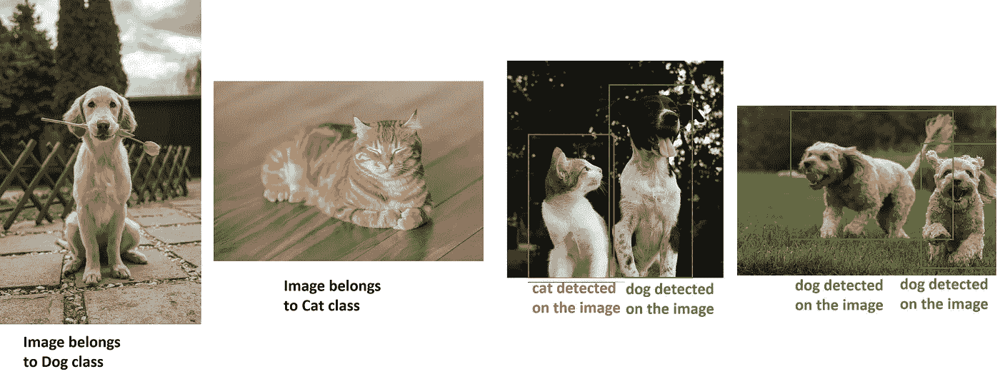
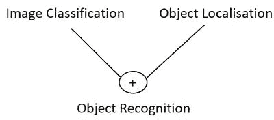
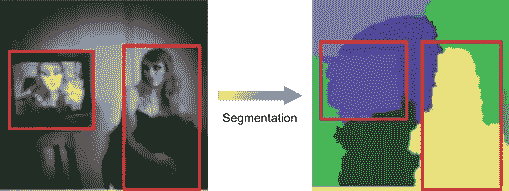
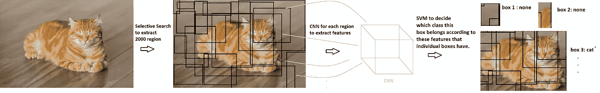
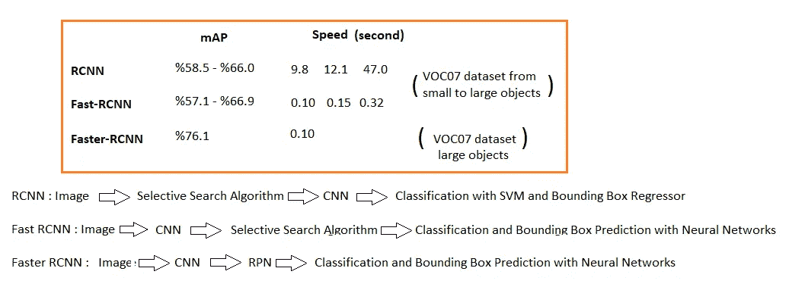
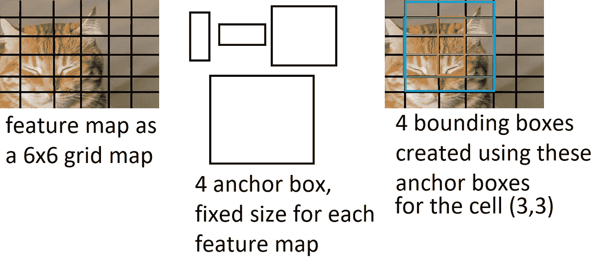
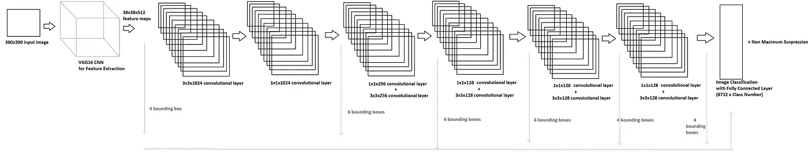

# 基于卷积神经网络的目标检测

> 原文：<https://towardsdatascience.com/object-detection-with-convolutional-neural-networks-c9d729eedc18>

## 多阶段(RCNN，快速 RCNN，更快的 RCNN)和单阶段(SSD，YOLO)结构的对象检测和他们的使用训练自己的对象检测模型进行解释

在我之前的帖子中，我们学习了什么是图像分类以及如何创建图像分类模型。

 [## 基于卷积神经网络的图像分类

### 图像分类卷积和卷积神经网络综合指南，从实现…

towardsdatascience.com](/image-classification-with-convolutional-neural-networks-12a7b4fb4c91) 

现在是时候进一步了解对象检测了。

**物体检测(物体识别)**

*   虽然图像分类问题侧重于对图像进行分类，但在一幅图像中，我们可能要搜索不止一个类别，在对象识别中，我们的任务是找到所有这些类别，并将其放入最合适的**框**。

*包围盒— ROI(感兴趣区域)*:物体识别需要满足的新名词。当我们试图识别物体时，我们使用包围盒，在其中物体可能被检测到。我们将学习如何获得尽可能接近后来探测到的物体的盒子。

作者图片

*   正如你可能注意到的，物体识别是一个比图像分类更复杂的任务，在图像分类中，我们试图**定位**和**识别**图像中的物体。

作者图片

再次继续这 3 个不同的任务:

**图像分类**:预测图像中物体的类别

**目标定位**:定位图像中目标的存在，并用边界框指示其位置。

**物体检测**:用一个包围盒定位物体的存在，并检测这些包围盒中被定位物体的类别

迄今为止创建的对象识别神经网络架构分为两个主要组:**多级**与**单级检测器。**

*多级探测器*

1.  RCNN *2014*
2.  快速 RCNN *2015*
3.  更快的 RCNN *2015*

*单级探测器*

1.  固态硬盘 *2016*
2.  YOLO *2016*
3.  约洛夫 2 *2016* ，约洛夫 3 *2018* ，约洛夫 4 *2020* ，约洛夫 5 *2020*

让我们从检查多级检测器开始🔮

## **多级探测器**

正如我们从名称中所理解的，这些是具有两个独立阶段的对象检测器。通常，他们首先提取一些感兴趣的区域(边界框),然后对这些框进行分类以获得最终结果。这就是它们被称为**基于区域的卷积神经网络**的原因

*   RCNN

作为这个家族的第一个成员，我们将在未来的版本中看到基础方法论及其缺点的改进。该模型的方法如下:

1.  使用选择性搜索从输入图像中提取区域建议

选择性搜索算法的工作方式是，它应用一种**分割算法**来寻找图像**中的斑点，从而计算出什么可能是物体**。选择性搜索递归地将这些区域组合成更大的区域，以创建**2000 个**待调查区域。

作者图片

*分段的选择性搜索*

在下面的帖子中，我提到了不同的算法来应用图像分割，不使用基于人工智能的方法，而是使用经典的基于计算机视觉的方法。

 [## 基于经典计算机视觉方法的图像分割

### 经典的基于计算机视觉的图像分割方法，如阈值法、基于区域的方法、基于边缘检测的方法和

towardsdatascience.com](/image-segmentation-with-classical-computer-vision-based-approaches-80c75d6d995f) 

在同一类别中进行选择性搜索，它应用以下步骤来分割图像:

首先计算所有相邻区域之间的相似性。

将两个最相似的区域组合在一起，并计算结果区域与其相邻区域之间的新相似性。

然后重复该过程，直到整个对象被覆盖在单个区域中。

2.在每个 ROI 上使用 CNN 的特征提取来自上一步

在根据分割提取了可能具有对象的几乎 2000 个可能的框之后，CNN 被逐一应用于所有这些框，以提取用于下一步分类的特征

3.利用 SVM 和包围盒预测进行分类

最后，使用 SVM(支持向量机)进行分类，并使用包围盒回归器，该模型给出最终的包围盒以及检测到的类，其中包围盒回归器的任务只是改进提议的包围盒以更好地包围对象。

作者图片

这是 RCNN 的主要方法论，现在让我们看看它的弱点

*   选择性搜索已经是一种复杂的算法，仅在第一步使用它会大大增加模型的计算成本。-> **慢**
*   获得 2000 个区域以逐个应用特征提取又是太多的计算！-> **慢**

这给了我们 **47 秒**用于 1 个图像检测，因此不可能使用该模型进行实时物体检测任务！

*   它不是一个端到端的可训练模型，因为选择性搜索算法不是一种可训练的方法，这使得不可能通过训练 RCNN 来开发区域提议。-> **某些部位不可训练**
*   使用 SVM 是没有端到端架构的另一个原因，我们需要分别培训 SVM 和 CNN，这带来了更困难的任务。

因此，尽管它是一种先进的架构，比以前的模型具有更好的精度，但很明显，该模型需要改进，尤其是在速度性能方面。出于这个原因，我们发现自己正在检查**快速 RCNN** 模型，它是**RCNN**的改进版本。

*   快速 RCNN

1.  它改变了区域提议步骤和特征提取的顺序，因此我们**首先将 CNN 应用于输入图像，然后提取 ROI。**这样，我们不用对 2000 个不同的区域应用 CNN，而是只应用一次，这提高了模型的速度性能。- > **不再那么慢了**
2.  快速 RCNN 带来的另一个变化是使用带有 softmax 输出激活功能的**全连接层，而不是 SVM** ，这使得模型更加集成为一体式模型。- > **单步训练**
3.  为了使来自区域提议的区域大小适应完全连接的层，应用 ROI 最大池。
4.  边界框回归器和分类任务都是通过完全连接的层实现的，因此在这两个不同的输出成本组合起来更新模型的情况下应用“多任务损失”。-> **单阶段训练**

因此，我们获得了比 RCNN 快 9 倍的**用于训练，比 RCNN 快 0.32 秒的**用于检测 1 幅图像。****

虽然这是个好消息，但是快速 RCNN **仍然有 RCNN** 的一个缺点！即使我们不为快速 RCNN 中的每个建议区域应用 CNN，使用选择性搜索提取 2000 个区域建议仍然是一个问题，这使得模型不必要地复杂。

*   更快的 RCNN

可以想象，更快的 RCNN 的主要变化是使用另一种方法而不是选择性搜索算法来提出区域。这种方法是使用**一个单独的神经网络来学习区域提议**。

因此，该模型首先使用 1 个 CNN 来获得区域建议，然后遵循与快速 RCNN 完全相同的逻辑来检测对象，因此它使用这些建议来用 CNN 提取特征，然后用全连接层进行分类，并使用包围盒回归器来改进 ROI。

如你所知，**Fast-RCNN**在某些资源中被称为 **RPN + Fast-RCNN** ，因为从 Fast 到 Fast RCNN 的唯一更新是区域提议方法。

*RPN* :地区提案网。在这个使用 inf 快速 RCNN 的网络中，**主要目标是预测锚盒的偏移以获得最终的包围盒。**其中锚框是一些默认大小和形状的框。

随着这些逐步的改进，我们看到模型的速度有了很大的提高，尤其是在快速 RCNN 中

作者图片

*mAP* :平均精度百分比是对象检测模型最常见的精度度量，其中计算每个类别的精度，然后取平均值。关于地图计算的更多信息，可以看看这篇很棒的帖子。

 [## 用于对象检测的 mAP(平均精度)

### AP(平均精度)是一个测量物体检测器精度的常用指标，如更快的 R-CNN、SSD 等…

jonathan-hui.medium.com](https://jonathan-hui.medium.com/map-mean-average-precision-for-object-detection-45c121a31173) 

## 单级检测器

现在该检查单级检测器了，与多级检测器相反，在单级检测器中，盒子预测和分类是同时进行的。

**SSD:单次多盒探测器**

*   标准的预训练神经网络被用作**特征提取器**，如 **VGG16** 、VGG19 或 ResNet。
*   在这个 CNN 之后，应用一些附加的卷积层来获得不同大小的特征图。在获得边界框之后，这些特征图中的一些**和来自特征提取网络的输出图被发送到由全连接层**组成的图像分类部分**。**
*   对于这些特征图中的每个单元，我们提取 4 或 6 个边界框，将它们直接发送到完全连接的层。与多级检测器相反，我们**不对边界框**做任何预测，我们只获取来自不同卷积层的特征图，并将它们转换成网格单元，其中每个像素为 1 个单元。以这些单元格为中心点，**我们产生 4 或 6 个不同的边界框。**
*   为了产生边界框，我们有固定大小和形状的**锚框**，预定义的框。

作者图片

*   非最大抑制机制被应用作为最后一步，该步骤决定是否有多于一个的盒子指向相同的对象，我们选择最佳拟合。

作者图片

*   要了解更多关于非最大值抑制机制以及如何选择最佳拟合边界框的信息，您可以阅读这篇不错的帖子:

 [## 非最大抑制(NMS)

### 一种消除目标检测中重复和误报的技术

towardsdatascience.com](/non-maximum-suppression-nms-93ce178e177c) 

让我们想象一下固态硬盘架构:

作者图片

*   我们看到整个架构有 8732 个包围盒，我们需要决定每个包围盒是否有类对象。我们有 8732 边界框的原因是:

con v4 _ 3:38×38×4 = 5776 盒(每个电池 4 盒)
con V7:19×19×6 = 2166 盒(每个电池 6 盒)
Conv8_2: 10×10×6 = 600 盒(每个电池 6 盒)
Conv9_2: 5×5×6 = 150 盒(每个电池 6 盒)
con v10 _ 2:3×4 = 36 盒

5776+2166+60ch 0+150+36+4 = 8732

*   **SSD 在 VOC2007 上以 59 FPS 实现了 74.3%的 mAP1，而更快的 RCNN 只有 10 FPS。对于速度来说，这是非常令人印象深刻的进步，对吗？！**

*每幅图像的 FPS 与秒*:我们比较了 RCNN 家族使用“秒”单位的速度，因为他们的论文大多使用这个单位。每幅图像的**秒**是解释预测 1 幅图像需要多少秒。**所以值越小，表示性能越好**。另一方面， **FPS** 表示每秒**帧**，这个单位说明了我们在 1 秒钟内可以预测多少帧图像。**因此，数值越大，性能越好**。

YOLO:你只看一次

其基本思想与固态硬盘非常相似，以下是 YOLO 的一些不同之处:

*   它使用基于 Googlenet 架构名称 Darknet 的定制网络。这个暗网架构由 **24 个卷积层和 2 个全连接层**组成。
*   卷积部分使用 Imagenet-1000 数据集进行预训练，来自 CNN 的特征图用于转换为**网格单元，就像 SSD** 中一样。**全连接层**用于从这些特征地图网格预测**边界框坐标**。
*   最后，我们有 **98** 个职业的预测，而我们在 SSD 中有 **8732** 个职业的预测，但是 **YOLO 有 45 FPS 和 63.4mAP，**所以都比 SSD 低。

YOLO 在 SSD 之前发布，所以我们可以说它是第一个单级探测器，虽然 SSD 没有任何更新的版本，但 YOLO 到目前为止有 5 个不同的版本。让我们看看这个模型是如何随着时间的推移得到改进的。

YOLO 有一些弱点，比如:

*   本地化(所以边界框有问题…)
*   规模问题(来自训练数据集的不同大小的对象是一个问题)

**YOLOv2**

**获得 67 FPS 和 76.8 mAP** ！不错的改进，但如何改进？

*   **卷积层增加批量归一化**。
*   **高分辨率分类器**:原 YOLO 以 224 × 224 训练分类器网络，提高分辨率到 448 进行检测。这意味着网络必须同时切换到学习对象检测并适应新的输入分辨率。对于 YOLOv2，输入图像分辨率提高至 448 × 448。
*   **锚框**:锚框用于计算偏移，而不是使用完全连接的层来预测边界框坐标。但与其他锚框方法不完全一样，他们不是手动选择先验，而是在训练集边界框上运行 **k 均值聚类**，以自动为锚框找到良好的先验。
*   基本模型架构略有变化，名称为 **Darknet-19** ，有 19 个卷积层和 5 个最大池层，完全连接的层被删除，如我上面提到的🐟

**YOLOv3**

*   它使用的是**逻辑量词(像 sigmoid！)**不像以前的版本那样使用 softmax，使 1 个对象属于 1 个以上的类。例如，检测到的 1 个对象可以同时是狗和动物，对吗？如果预测高于给定的阈值，这些预测将传递到输出，因此您可以看到 1 个边界框同时表示 2 个类！
*   与 YOLOv2 只将 1 个框(最好的一个)分配给地面真实对象不同，在这一个中，如果边界框超过给定的阈值(使用 0.5)，则进入**损失计算，用于**边界框预测、对象和类别预测。如果它不能通过，它只进行盒预测。(看看论文中的包围盒预测副标题吧！)
*   由于使用了特征提取器 **Darknet-53** 而不是稍微深一点的 Darknet-19，因此**更准确但速度更慢**。

在论文中，我找不到 VOC 数据集的准确性和速度指标，我以前一直将它与以前的模型进行比较，直到现在。所以我只能分享**COCO 数据集上的一些结果**

yolov 3–320 给出 51.5 图，推理时间 22ms，
yolov 3–416 给出 55.3 图，推理时间 29 ms，
yolov 3–608 给出 57.9 图，推理时间 51 ms，

然而

更快的 RCNN 给出了 59.1 的 mAP，推理时间为 172 毫秒
，并且

yolov 2–608 给出了 48 个图，推理时间为 40 毫秒

注意-320，-416，-608 是输入图像分辨率。

⏰ 👽在继续之前稍微停顿一下！正如我检查论文一样，我意识到一些“准确性”指标可能会令人困惑，因为一些论文给出了 VOC 结果，一些论文给出了不同架构的 COCO 结果(小版本、大版本、不同主干的不同实验等)。**我可以说，更快的 RCNN 通常比 YOLO 模型有更好的准确性，而 YOLO 模型几乎总是比它快，直到现在**！

*主干*:物体检测模型的特征提取器部分。通常，我们在之前的 [**帖**](/image-classification-with-convolutional-neural-networks-12a7b4fb4c91) 中看到的图像分类架构像 VGG、瑞思网等

**YOLOv4**

*   YOLOv4 通过使用 **BoF** ( **赠品袋**)和几个 **BoS(特价袋)**来改进 YOLOv3 的模式。BoF 提高了检测器的准确性，而不增加推断时间。它们只会增加培训成本。另一方面，BoS 在显著提高目标检测精度的同时，增加了少量的推理成本。
*   该模型使用 Darknet 中的跨级局部网络(CSPNet)，创建了一个新的特征提取器主干，称为 **CSPDarknet53** 。卷积架构基于改进的 DenseNet。
*   因此，就 FPS 而言， **YOLOv4 比 YOLOv3** 精度高%10，速度快%12。

*一袋赠品:*我们把这些只改变训练策略或者只增加训练成本的方法称为“一袋赠品”。" "[1]关于免费赠品袋对物体检测模型训练的影响的更详细研究请参考本文:[https://arxiv.org/pdf/1902.04103.pdf](https://arxiv.org/pdf/1902.04103.pdf)

**约洛夫 5**

这可能是讨论最多和最引人注目的 YOLO 模型，因为没有官方文件，但 Roboflow 初创公司在比较 YOLOv5 和 YOLOv4 时获得了非常令人印象深刻的结果。

它使用 **Pytorch** 代替 c 中实现的 Darknet。

根据他们的结果:

*   YOLOv5 几乎比 YOLOv4 快 3 倍！
*   YOLOv5 比 YOLOv4 小了将近%90！

YOLOv5 的一些关键特性如下:

*   使用 **CSPDarknet53 作为 YOLOv4**
*   **镶嵌数据增加**被添加到模型中

在结束理论部分之前，我想补充一下，YOLO 有一些“**微型**”版本，特别是当你想拥有超快的模型时使用。几乎每一个 YOLO 版本(v2，v3，v4，v5)都有它的小 YOLO 版本，精确度稍低，但速度快了将近 4 倍。值得尝试的实时对象检测项目！

理论部分做完了！是时候学习如何真正使用这些模型来为您自己的数据集进行对象检测了。

对于这一部分，我将分享两个非常好的更快的 RCNN 和 YOLOV4 的仓库。

**使用更快的 RCNN 进行对象检测**

我使用了一个定制的实现库，因为我找不到任何官方的更快的 RCNN 实现。这是一个非常简单的 repo，可以下载并用于 Keras 实现的训练和测试。

在下面的 GitHub 链接中，您会发现我的 repo 是从基础源代码派生出来的，我在其中添加了一些更多的属性，并详细解释了如何构建和使用这个实现。

 [## GitHub-YCAyca/Faster _ RCNN _ for _ Open _ Images _ Dataset _ Keras:Faster R-CNN for Open Images Dataset by…

### 快速 RCNN 实现的分叉存储库。在本文档中，构建说明和回购的使用将…

github.com](https://github.com/YCAyca/Faster_RCNN_for_Open_Images_Dataset_Keras) 

**用 YOLOV4 进行物体检测**

对于 YOLOV4，我使用了基于 C 的官方实现，并分叉为我的 GitHub repo，其中我添加了关于**如何构建**和**如何使用** YOLOV4 的指令。这个实现很难理解和构建，所以我强烈建议查看一下 repo，并按照步骤一步一步来训练和测试您自己的数据集。

 [## GitHub-YCAyca/darknet:yolov 4/Scaled-yolov 4/YOLO-用于对象检测的神经网络…

### YOLOv4 / Scaled-YOLOv4 / YOLO -用于对象检测的神经网络(Windows 和 Linux 版本的 Darknet ) - GitHub …

github.com](https://github.com/YCAyca/darknet) 

感谢您的关注，我希望这对您自己开始使用对象检测模型有所帮助！

选择性搜索算法官方论文:[https://IVI . fnwi . UVA . nl/ISIS/publications/2013/uijlingsijcv 2013/uijlingsijcv 2013 . pdf](https://ivi.fnwi.uva.nl/isis/publications/2013/UijlingsIJCV2013/UijlingsIJCV2013.pdf)

RCNN 官方论文:[https://arxiv.org/pdf/1311.2524.pdf](https://arxiv.org/pdf/1311.2524.pdf)

快速 RCNN 官方论文:[https://arxiv.org/pdf/1504.08083.pdf](https://arxiv.org/pdf/1504.08083.pdf)

更快 RCNN 官方论文:[https://arxiv.org/pdf/1506.01497.pdf](https://arxiv.org/pdf/1506.01497.pdf)

SSD 官方论文:[https://arxiv.org/abs/1512.02325](https://arxiv.org/abs/1512.02325)

https://arxiv.org/pdf/1506.02640.pdf 官方文件:

YOLOv2 官方论文:[https://arxiv.org/pdf/1612.08242.pdf](https://arxiv.org/pdf/1612.08242.pdf)

YOLOv3 官方论文:[https://arxiv.org/pdf/1804.02767.pdf](https://arxiv.org/pdf/1804.02767.pdf)

[1] Yolov4 官方论文:[https://arxiv.org/pdf/2004.10934.pdf](https://arxiv.org/pdf/2004.10934.pdf)

Yolov5 还没有正式论文！