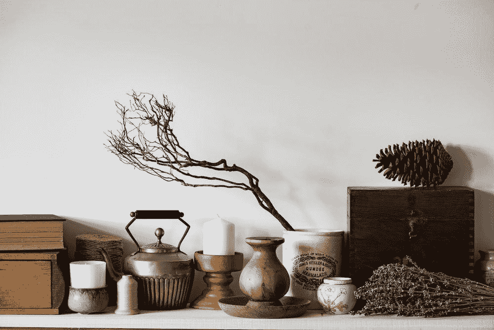
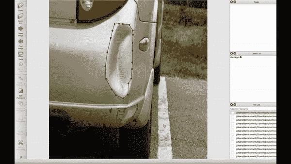
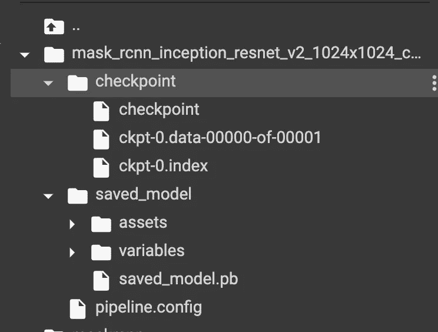
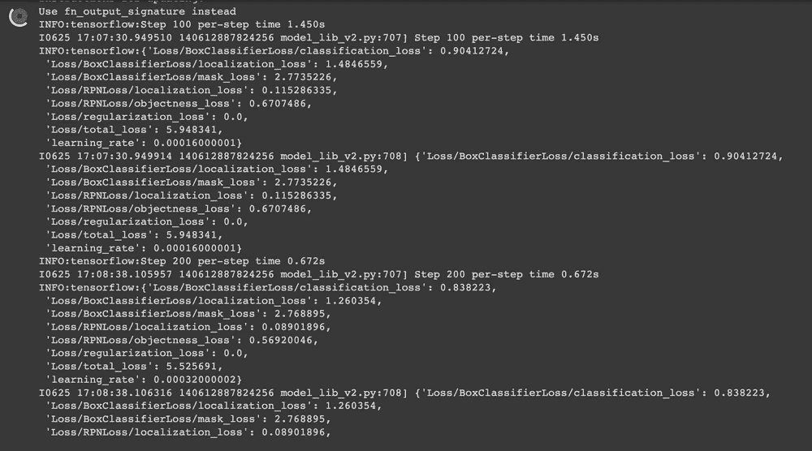
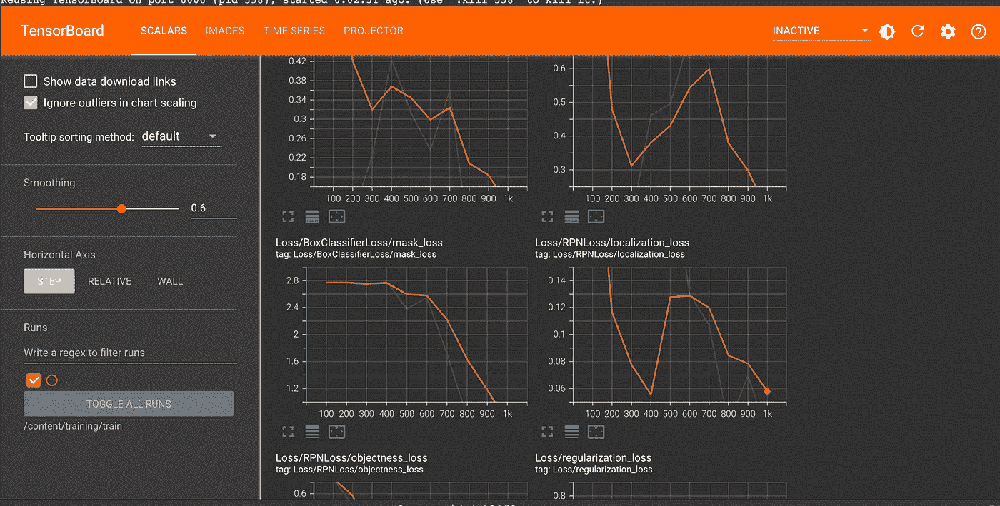
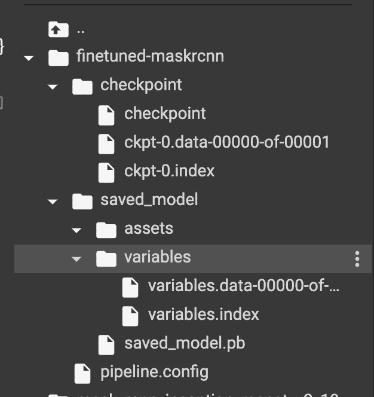
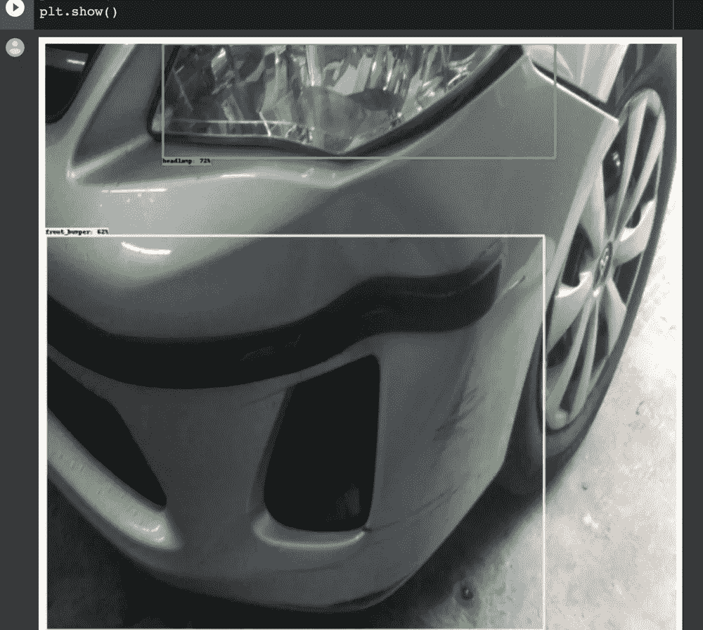
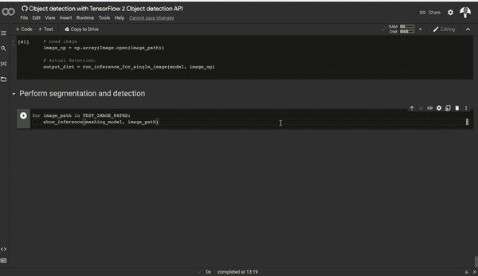

# 使用 TensorFlow 2 对象检测 API 进行对象检测

> 原文：<https://towardsdatascience.com/object-detection-with-tensorflow-2-object-detection-api-3f89da0f1045>

## TensorFlow 中基于掩模 R-CNN 的目标检测



乔安娜·科辛斯卡在 [Unsplash](https://unsplash.com/s/photos/object-detection?utm_source=unsplash&utm_medium=referral&utm_content=creditCopyText) 上的照片

构建对象检测和图像分割模型与其他模型略有不同。主要是因为你必须使用专门的模型，并以特定的方式准备数据。本文将研究如何使用 TensorFlow 2 对象检测 API 在自定义数据集上执行对象检测和图像分割。

让我们开始吧！

# 对象检测数据集

在本文中，我们将使用在 [Kaggle](https://www.kaggle.com/) 上可用的 [Coco 汽车损坏检测数据集](https://www.kaggle.com/datasets/lplenka/coco-car-damage-detection-dataset)。它包含损坏的汽车图像。它可以用来训练一个模型来检测汽车和汽车部件的损坏。数据集已经被注释，并且提供了相应的 [COCO](https://cocodataset.org/#home) 文件。

# 为对象检测准备数据集

如果您想要使用自定义数据集，那么您必须自己进行标注和注释。有许多工具和在线平台可以帮助你实现这一点。如果你想坚持开源，Labelme 是一个很好的选择。

下面的视频展示了如何在汽车数据集上创建多边形。完成注释后，您必须保存它。保存后，Labelme 会将生成的 JSON 文件存储在与数据相同的文件夹中。



作者图片

如果你正在寻找一个在线工具，这里有一些我接触过的平台:

*   [**robof low Universe**](https://universe.roboflow.com/)提供了众多的物体检测和图像分割数据集。您可以搜索平台并切换汽车图像数据集。如果你选择那条路线，从平台下载 [TFRecord](https://www.tensorflow.org/tutorials/load_data/tfrecord) 格式。如果您有一个定制的数据集，您也可以在 Roboflow 上执行[注释。](https://roboflow.com/annotate)
*   [**Ango AI**](https://ango.ai/open-dataset/) 提供一些公共数据集来启动你的分类和物体检测项目。他们还提供了一个平台，你可以用它来标记和注释图像。
*   [**Segments AI**](https://segments.ai/explore)**列出了一些可以克隆到项目中的对象检测和图像分割数据集。您还可以在他们平台上执行注释。**

# **什么是 TensorFlow 2 物体检测 API？**

****TensorFlow 对象检测 API** 是一个开源的计算机视觉框架，用于构建对象检测和图像分割模型，可以在同一幅图像中定位多个对象。该框架适用于 TensorFlow 1 和 2。然而，我们鼓励用户使用 TF 2 版本，因为它包含了新的架构。**

**TensorFlow 2 对象检测 API 支持的一些架构和模型包括:**

*   **[中心网](https://arxiv.org/abs/1904.08189)**
*   **[效率检测](https://arxiv.org/abs/1911.09070)**
*   **固态硬盘[移动互联网](https://arxiv.org/abs/1704.04861)**
*   **固态硬盘 [ResNet](https://arxiv.org/abs/1512.03385)**
*   **更快的 R-CNN**
*   **[极限网](https://paperswithcode.com/method/extremenet)**
*   **[屏蔽 RCNN](https://arxiv.org/abs/1703.06870)**

**模型可以从 [TensorFlow 2 检测模型动物园](https://github.com/tensorflow/models/blob/master/research/object_detection/g3doc/tf2_detection_zoo.md)下载。您需要它们相应的配置文件来从头开始训练一个对象检测模型。在这个项目中，我们将使用掩码 RCNN 模型，但您也可以尝试其他模型。**

# **在 Google Colab 上安装 TensorFlow 2 对象检测 API**

**此时，您现在有了一个对象检测数据集。汽车图像数据和相应的 COCO JSON 文件，或者是您自己创建或下载的数据集。**

**我们将在 Google Colab 上运行这个项目，以利用免费的 GPU 资源来训练模型。让我们在 Colab 上安装 TensorFlow 2 对象检测 API。第一步是克隆 TF 2 对象检测 GitHub repo:**

```
!git clone [https://github.com/tensorflow/models.git](https://github.com/tensorflow/models.git)
```

**接下来，运行这些命令在 Colab 上安装 TF 2 对象检测 API:**

```
%%bash cd models/research # Compile protos. protoc object_detection/protos/*.proto --python_out=. # Install TensorFlow Object Detection API. cp object_detection/packages/tf2/setup.py . python -m pip install --use-feature=2020-resolver .
```

# **在本地安装 TensorFlow 2 对象检测 API**

**如果您想在本地使用 API，开发人员建议您使用 [Docker](https://www.docker.com/) 安装它:**

```
# From the root of the git repository docker build -f research/object_detection/dockerfiles/tf2/Dockerfile -t od . docker run -it od
```

**接下来，导入对象检测 API 和几个其他常见的数据科学包。如果您能够导入对象检测包，这意味着安装运行成功。**

# **下载对象检测数据集**

**我们将要训练的模型的数据集和配置文件可以从这个 [GitHub repo](https://github.com/mlnuggets/maskrcnn) 下载。从对象检测报告下载[配置后，您必须进行一些更改。我们稍后将讨论这些变化。](https://github.com/tensorflow/models/tree/master/research/object_detection/configs/tf2)**

```
!git clone [https://github.com/mlnuggets/maskrcnn.git](https://github.com/mlnuggets/maskrcnn.git)
```

# **下载面具 R-CNN 模型**

**下一步是下载我们将微调的[屏蔽 R-CNN 模型](https://github.com/tensorflow/models/blob/master/research/object_detection/g3doc/tf2_detection_zoo.md)。提取文件以获取训练好的模型检查点。**

**压缩文件还包含模型的配置文件。下载完每个模型后，您必须编辑这个文件。**

****

**作者图片**

**让我们看看配置文件中需要更新的项目。**

# **编辑对象检测管道配置文件**

**克隆[这个回购](https://github.com/mlnuggets/maskrcnn)后你将得到的配置文件已经被编辑，可以在 Google Colab 上顺利运行。如果你在其他地方运行这个项目，你需要更新文件路径。简而言之，以下是从 [TensorFlow 2 对象检测 API repo](https://github.com/tensorflow/models/blob/master/research/object_detection/configs/tf2/mask_rcnn_inception_resnet_v2_1024x1024_coco17_gpu-8.config) 下载 Mask RCNN 配置文件后需要更新的项目:**

*   **`num_classes`到 5，因为数据集有 5 个类，`headlamp`、`front_bumper`、`hood`、`door`和`rear_bumper`。**
*   **`image_resizer`从 1024 减少到 512，减小图像尺寸，从而减少训练时间。**
*   **`num_steps`从 20 万到 1000 以减少训练时间。步骤越多，训练模型所需的时间就越长。如果损失仍在减少，验证指标在上升，您可以增加步骤。**
*   **`batch_size = 1`指定训练时要输入内存的图像数量。**
*   **`fine_tune_checkpoint`指向上面下载的 Mask R-CNN 模型的路径。这确保了我们不是从零开始训练模型。**
*   **从`classification`的`fine_tune_checkpoint_type`到`detection`，因为我们正在训练一个物体检测模型。**
*   **`train_input_reader`指向`label_map_path`和 TFRecords 的路径。稍后再谈 TF 唱片。**
*   **`eval_input_reader`与`train_input_reader`相同，但用于测试数据。**

# **将图像转换为 TFRecords**

**物体检测模型期望图像为 [TFRecord](https://www.tensorflow.org/tutorials/load_data/tfrecord) 格式。幸运的是， [TensorFlow 2 对象检测 API](https://github.com/tensorflow/models/blob/master/research/object_detection/dataset_tools/create_coco_tf_record.py) repo 提供了执行转换的脚本。该脚本采用以下参数:**

*   **训练图像的目录。**
*   **包含测试图像的文件夹。**
*   **包含训练图像注释的文件。**
*   **包含测试图像注释的文件。**
*   **应存储生成的 TFRecords 的目录。**

# **训练模型**

**现在，您已经拥有了训练这个 Mask R-CNN 对象检测模型所需的一切。下一步是运行[培训脚本](https://github.com/tensorflow/models/blob/master/research/object_detection/model_main_tf2.py)。模型定型脚本采用以下参数:**

*   **`pipeline_config_path`更新模型配置文件的路径。**
*   **`model_dir`将保存训练模型的目录。**

****

**作者图片**

**在 Colab 上你可能会得到一个[*OpenCV*](https://opencv.org/)*错误。这个错误可以通过安装正确版本的 OpenCV 来修复。***

```
pip uninstall opencv-python-headless==4.5.5.62 pip install opencv-python-headless==4.5.2.52*If you get a* [*cuDNN*](https://developer.nvidia.com/cudnn) *error, you can fix it by installing the right version of cuDNN.*!apt install --allow-change-held-packages libcudnn8=8.1.0.77-1+cuda11.2
```

# **模型评估和可视化**

**训练完成后，您可以运行 [TensorBoard](https://www.tensorflow.org/tensorboard/get_started) 来显示训练和测试指标的可视化，例如定位损失。**

****

**作者图片**

****阅读更多:** [**TensorBoard 教程(深潜附实例和笔记本)**](https://www.machinelearningnuggets.com/tensorboard-tutorial/)**

# **运行转换脚本**

**下一步是[导出模型进行推理。](https://github.com/tensorflow/models/blob/master/research/object_detection/exporter_main_v2.py)转换脚本预期:**

*   **`trained_checkpoint_dir`训练好的模型的最后一个检查点。**
*   **`output_directory`保存导出模型的位置。**
*   **`pipeline_config_path`管道配置文件的路径。**

**转换脚本将输出检查点文件、一个 [SavedModel](https://www.tensorflow.org/guide/saved_model) 和模型配置文件。**

****

**作者图片**

# **从 Google Colab 下载模型**

**您可能希望下载转换后的模型或训练模型。这可以通过压缩文件并使用 Colab 工具下载压缩文件来实现。**

# **基于掩模 R-CNN 的目标检测**

**现在是时候使用训练好的 Mask R-CNN 模型对测试汽车图像执行对象检测了。幸运的是，TensorFlow 2 对象检测 API 提供了完成这项工作所需的所有实用程序。第一个是加载图像并将其转换成 [NumPy 数组的函数。](https://www.machinelearningnuggets.com/numpy-tutorial/)**

# **将图像从文件加载到 NumPy 数组中**

**该函数需要一个图像文件的路径，并返回一个 [NumPy 数组。](https://numpy.org/doc/stable/reference/generated/numpy.array.html)**

# **可视化检测**

**下一个实用程序是使用 [Matplotlib](https://www.machinelearningnuggets.com/data-visualization-with-matplotlib/) 绘制检测结果的函数。**

# **从最后一个检查点创建模型**

**现在让我们从最后保存的模型检查点创建一个检测模型。**

# **用于推理解码的地图标签**

**接下来，我们声明对解码模型输出很重要的变量。例如，类别和包含培训类别的文件。**

# **对测试图像运行检测器**

**下一步是在一些测试图像上运行 Mask R-CNN 对象检测模型。**

****

**作者图片**

# **基于掩模 R-CNN 的图像分割**

**掩模 R-CNN 对象检测模型可以用于对象检测和图像分割。让我们从加载微调后的模型开始。**

# **设置标签地图**

**模型还需要标签来解码输出。**

# **设置测试图像路径**

**下一步是定义测试图像的路径。在这种情况下，我们将使用所有的测试图像，因为它们并不多。**

# **创建推理函数**

**TensorFlow 2 对象检测 API 报告中也提供了分段实用程序。**

# **执行分割和检测**

**下一步是加载一个图像作为一个 [NumPy 数组](https://numpy.org/doc/stable/reference/generated/numpy.array.html)，并使用上面的函数开始检测物体。**

****

**作者图片**

# **最后的想法**

**在本文中，我们看到了如何使用 TensorFlow 2 对象检测 API 训练对象检测模型。更具体地说，我们涵盖了:**

*   **对象检测任务的数据集准备。**
*   **TensorFlow 2 对象检测 API。**
*   **如何在本地和 Google Colab 上安装 TensorFlow 物体检测 API？**
*   **设置屏蔽 R-CNN 对象检测模型的配置。**
*   **将图像转换为 TFRecord 格式。**
*   **训练对象检测模型。**
*   **评估对象检测模型。**
*   **使用掩模 R-CNN 进行目标检测。**
*   **基于掩模 R-CNN 模型的图像分割。**

**点击 [Colab 链接](https://colab.research.google.com/github/mlnuggets/maskrcnn/blob/main/Object_detection_with_TensorFlow_2_Object_detection_API.ipynb)从头到尾尝试该项目。您也可以用另一个数据集替换该数据集。如果更改模型，记得编辑模型配置文件。始终确保配置文件中的路径指向正确的位置。**

**[在 LinkedIn 上关注我](https://www.linkedin.com/in/mwitiderrick/)获取更多技术资源。**

***数据集引用***

**数据由 Kaggle 上的 [LPLENKA 在](https://www.kaggle.com/datasets/lplenka/coco-car-damage-detection-dataset) [CC0: Public Domain](https://creativecommons.org/publicdomain/zero/1.0/) 许可下提供。**