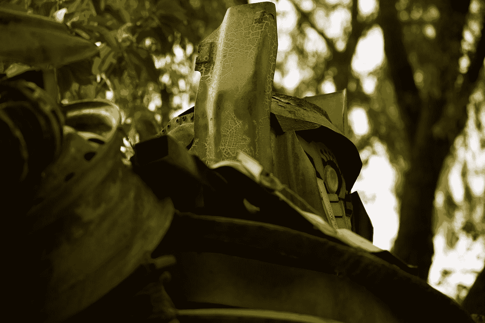
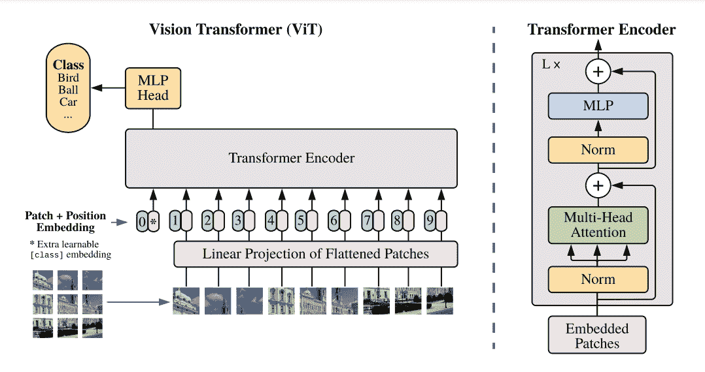
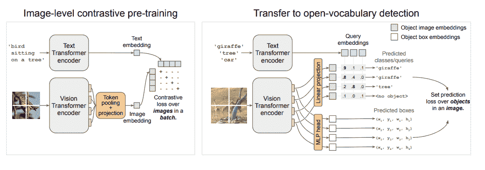
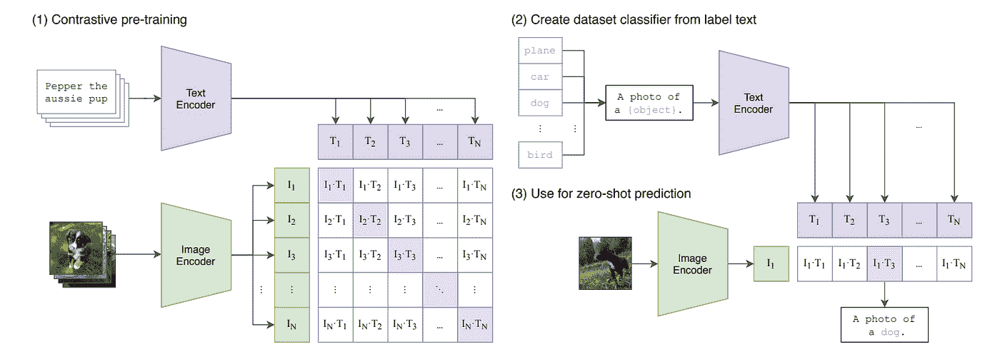
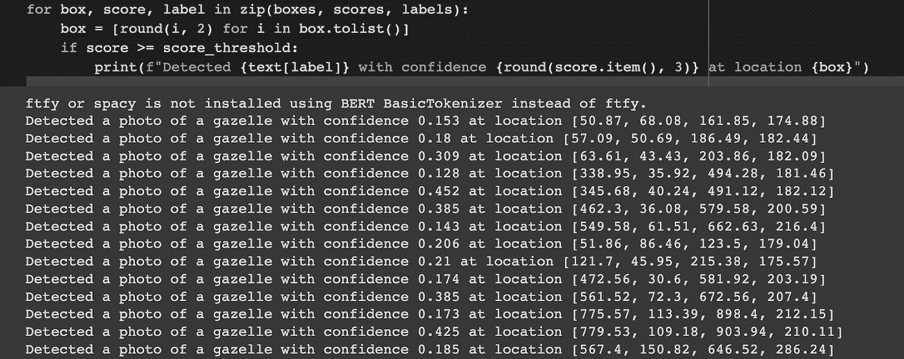
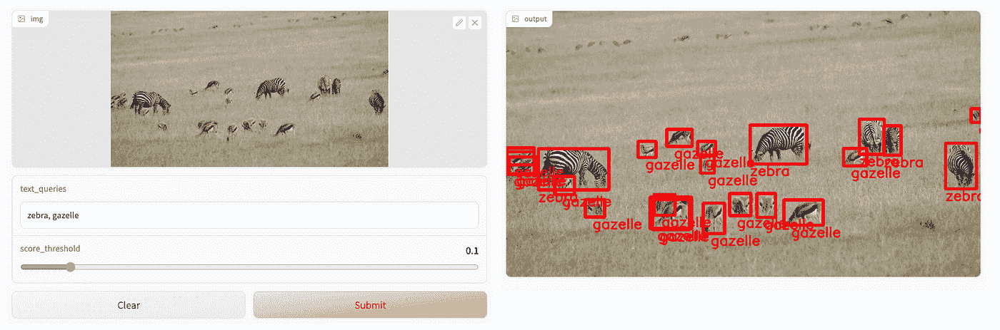

# 用于开放世界定位(OWL-ViT)的视觉转换器的对象检测

> 原文：<https://towardsdatascience.com/object-detection-with-vision-transformer-for-open-world-localization-owl-vit-cb1ab6d4d7a9>

## 使用变压器进行物体检测



杰恩·贝勒在 [Unsplash](https://unsplash.com?utm_source=medium&utm_medium=referral) 上拍摄的照片

卷积神经网络已经成为应用于目标检测的主要网络。最近，变形金刚在自然语言处理和计算机视觉领域越来越受欢迎。

在本文中，我们探索了 OWL-ViT 在物体检测中的应用。

让我们开始吧。

# 什么是视觉转换器？

[变形金刚](https://huggingface.co/docs/transformers/index)已经广泛应用于自然语言处理任务。然而，它们最近被应用于计算机视觉——因此被命名为**视觉转换器**。

[视觉变形金刚](https://huggingface.co/docs/transformers/model_doc/vit)的工作原理如下:

*   图像被分割成固定大小的小块。
*   图像补片被展平并线性嵌入。
*   添加位置嵌入以保留位置信息。
*   将它们传送到**标准变压器编码器**。



[来源](https://arxiv.org/pdf/2010.11929v2.pdf)

# OWL-ViT 是如何工作的？

OWL-ViT 模型是一个开放词汇表的对象检测模型，它使用标准的视觉转换器来执行检测。变压器通过以下方式用于物体检测:

*   用分类和箱头替换最终的令牌池层。
*   通过用来自文本模型的类名嵌入改变固定的分类层权重来实现开放词汇分类。
*   使用[二分匹配损失](https://arxiv.org/pdf/2005.12872.pdf)对具有异议检测数据集的预训练模型进行微调。
*   端到端地微调文本和图像模型。

OWL-ViT 模型可以用作一次性检测学习器。在一次性学习中，模型根据每个类别中的一个或很少几个示例进行训练，并用于对未知样本进行预测。例如，当人类看到一只狮子时，他们可以很容易地在未来的各种环境中认出狮子。

OWL-ViT 模型接受一个图像和一个或多个文本查询，并寻找与查询匹配的对象。

# OWL-ViT 架构

现在让我们看看 OWL-ViT 模型的架构。

[仅编码器](https://huggingface.co/course/chapter1/5?fw=pt) OWL-ViT 模型由以下人员开发:

*   **使用图像-文本对的图像和文本编码器的对比预训练**。
*   **转移预先训练好的编码器**打开词汇表。这是通过用异议检测和本地化头取代令牌池来实现的。物体检测和定位头附在图像编码器输出标记上。
*   **用文本编码器**嵌入查询字符串进行开放词汇检测。然后将查询字符串用于分类。

使用焦点 sigmoid 交叉熵进行分类，因为图像可以具有多个标签。



[来源](https://arxiv.org/pdf/2205.06230.pdf)

使用**对比损失函数**来完成训练，该函数鼓励对应的图像-文本对具有相似的嵌入，而不对应的对具有不同的嵌入。对比预训练包括同时学习文本和图像嵌入。目标是学习与图像嵌入一致的文本嵌入。多头注意力池(MAP)用于聚集图像表示。

文本嵌入是通过将类别名称传递给文本编码器来获得的。在 OWL-ViT 中，文本嵌入被称为**查询**。OWL-ViT 模型预测一个**边界框**和某个文本嵌入应用于特定对象的**概率**。OWL-ViT 还可以用于对图像嵌入的查询进行预测，使得检测无法描述的对象成为可能。这是因为文本和图像编码器之间没有融合。

[CLIP](https://github.com/OpenAI/CLIP) (对比语言-图像预处理)作为 OWL-ViT 的主干。剪辑作品由:

*   训练图像和文本编码器来预测文本和图像对。
*   在推理过程中执行零镜头分类。

CLIP 通过学习多模态嵌入空间来预测文本和图像对。这是通过训练图像编码器和文本编码器来最大化正确的图像和文本嵌入对之间的余弦相似性，同时使用对称损失函数来降低不正确对的余弦相似性来实现的。



[来源](https://arxiv.org/pdf/2103.00020.pdf)

CLIP 有一些限制。它们包括:

*   CLIP 的零拍性能在区分车模、花种等一些任务上表现较弱。
*   为训练数据中没有的任务提供近乎随机的预测。
*   不适用于超出分布的图像分布。

# 如何使用拥抱脸的 OWL-ViT

你可以通过克隆 [OWL-ViT](https://github.com/google-research/scenic/tree/main/scenic/projects/owl_vit) repo 来使用这个模型。然而，你可以更快地使用来自[拥抱面部变形金刚的模型。](https://huggingface.co/docs/transformers/model_doc/owlvit#owlvit)

拥抱脸提供以下功能:

*   按照 OWL-ViT 的要求处理图像。
*   对文本和图像输入运行预测。

在下面的例子中，我们:

*   使用 Pillow 下载图像。
*   使用`OwlViTProcessor`函数处理图像并标记文本查询。处理器负责调整图像的大小、缩放和标准化。使用片段标记器对文本查询进行标记化。
*   将输入传递给`OwlViTForObjectDetection`模型以获得对象预测。模型的输出是预测的逻辑、边界框、类、图像和文本嵌入。
*   获取并打印给定文本查询的预测。

```
import requests
from PIL import Image
import torch

from transformers import OwlViTProcessor, OwlViTForObjectDetection

processor = OwlViTProcessor.from_pretrained("google/owlvit-base-patch32")
model = OwlViTForObjectDetection.from_pretrained("google/owlvit-base-patch32")

url = "https://images.unsplash.com/photo-1637336660118-b4635ce8790c?ixlib=rb-1.2.1&ixid=MnwxMjA3fDB8MHxwaG90by1wYWdlfHx8fGVufDB8fHx8&auto=format&fit=crop&w=1074&q=80"
image = Image.open(requests.get(url, stream=True).raw)
texts = [["a photo of a zebra", "a photo of a gazelle"]]
inputs = processor(text=texts, images=image, return_tensors="pt")
outputs = model(**inputs)

# Target image sizes (height, width) to rescale box predictions [batch_size, 2]
target_sizes = torch.Tensor([image.size[::-1]])
# Convert outputs (bounding boxes and class logits) to COCO API
results = processor.post_process(outputs=outputs, target_sizes=target_sizes)

i = 0  # Retrieve predictions for the first image for the corresponding text queries
text = texts[i]
boxes, scores, labels = results[i]["boxes"], results[i]["scores"], results[i]["labels"]

score_threshold = 0.1
for box, score, label in zip(boxes, scores, labels):
    box = [round(i, 2) for i in box.tolist()]
    if score >= score_threshold:
        print(f"Detected {text[label]} with confidence {round(score.item(), 3)} at location {box}")
```



查看带有 OWL-ViT 拥抱空间的[零拍物体检测进行演示。](https://huggingface.co/spaces/adirik/OWL-ViT)



作者图片

# 最后的想法

在本文中，我们已经看到了如何使用 OWL-ViT 进行对象定向。特别是，您已经了解到:

*   OWL-ViT 如何工作
*   OWL-ViT 建筑
*   如何使用拥抱脸的 OWL-ViT

[在 LinkedIn 上关注我](https://www.linkedin.com/in/mwitiderrick/)获取更多技术资源。