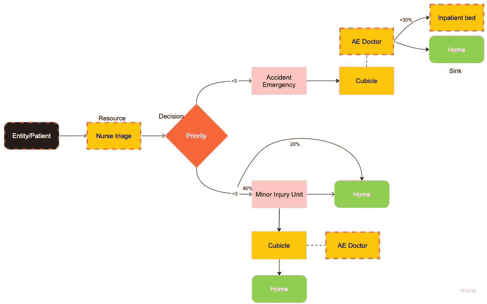
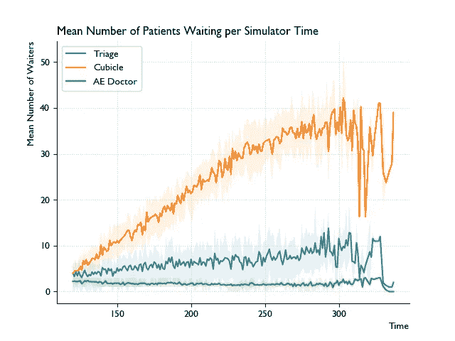
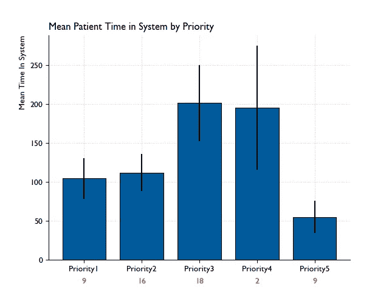
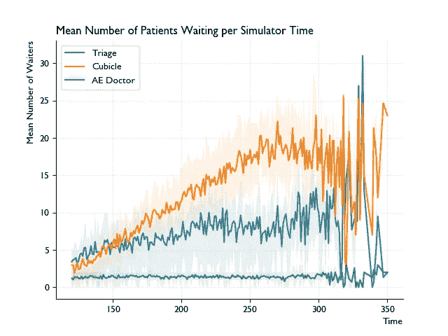

# 面向对象的离散事件模拟—使用 SimPy

> 原文：<https://towardsdatascience.com/object-oriented-discrete-event-simulation-with-simpy-53ad82f5f6e2>

## 用随机离散事件模拟改善繁忙的急诊科


[张子超](https://unsplash.com/@shakusky?utm_source=medium&utm_medium=referral)在 [Unsplash](https://unsplash.com?utm_source=medium&utm_medium=referral) 上拍照

在日常生活中，我们经常会遇到基于队列的系统。在这种情况下，系统或流程需要实体(如客户或患者)在系统中流动，同时排队等待有限的资源。我们也经常发现自己想知道我们正在使用的系统是否是最佳的，或者推测它需要多长时间才能得到服务。

> 在排队论的范围内，离散事件模拟(DES)是一种我们可以用程序和数学的方式解决这些问题的方法。

我之前写过一篇关于 DES 的介绍，概述了方法论背后的一些关键思想，见[这里](https://medium.com/@yasser.mushtaq/discrete-event-simulation-simply-put-4ae9f098a809)。

*在这里*，我们将使用 Python 包 SimPy 实现 DES。此外，我们将演示**面向对象的**方法，随着我们的模型变得越来越复杂，这种方法非常有用。

## 我们提出一个问题

简而言之，DES 可以帮助我们优化任何以实体排队请求特定服务为特征的系统。这适用于许多领域，如制造业、电信和医疗保健。在一个典型的高压环境中，急诊科为测试这种方法提供了一个很好的用例。下面，我们有一个流程图，描述了一个简化的急诊科系统。实体，在这种情况下是患者，流入系统，被分类，随后在回家或被允许进入医院之前通过两个过程中的一个。



黄色方框代表资源，橙色菱形代表决策树，绿色方框代表“汇点”(实体出口点)。

请注意，这个提议的系统确实可以根据项目的需要进行修改和添加。需要仔细考虑所需的详细程度。对系统的过度简化的描述将会产生不切实际的结果，并且不能反映现实，同时我们需要注意不要对超出我们范围的系统方面进行过度建模。

在我们的图中，最多有四个点可以形成队列，而某些元素也有一定程度的随机性。这些用红色虚线边框突出显示，主要与我们系统中的进程相关联。例如，病人到达的间隔时间，以及和护士或医生在一起的时间，都可以被随机建模。换句话说，在我们的模型中有一定程度的随机性。

上面描述的系统非常适合通过 DES 建模。我们将利用 Python 包 *SimPy* 来完成这项工作。

## 代码模板

在这里，我们将通过一个模板，你可以按照这个模板在 *SimPy* 中编写一个 DES 模型。我们将利用*面向对象的*方法来解决这个编码问题，因为这有助于开发用户友好、可读的代码，特别是当模型变大时。

该代码将包括以下三个主要类别:

*   一个简单保存关键变量的类，用于操纵模型，或者测试*假设*场景。
*   用于保存通过系统的实体的关键信息的实体类。在这种情况下，病人类。
*   一个代表我们系统的类，以及表征它的过程。

除了以上所述，我们可能希望包含更多的实用类，比如跟踪指标。

这里，我们将只包括代码的关键元素，显示上面的三个主要类。完整代码可以在 [**这里**](https://github.com/Ya5s3r/Discrete-Event-Sim-AE-Department) 查看。

## 参数和变量

我们将包含一个类，它只是作为定义模型的关键变量和值的占位符。这使得接近和操作变得容易。请注意，我们已经包含了资源水平和平均时间的相关信息，这些信息将被纳入模型的*随机*元素。

## 病人

病人类代表进入我们系统的病人。它是用患者 ID 和在我们系统中花费的时间的占位符来实例化的。它还将拥有两种方法，一种是确定患者拥有的优先级，表示严重程度，另一种是在分类过程中使用的分类决策方法，用于确定患者流向哪条路径。这些方法将在我们的主模型代码中的适当位置使用。

## 系统类别

我们代码的最后一个定义类可以描述为*系统*，或者*模型*类。这是定义关键流程的地方，代表了我们的实体流动的路径。

鉴于这门课比其他课稍长，我将把它分成几个主要部分。首先，在*实例化*时…

这里重要的第一步是建立我们的简单环境。环境管理模拟，在事件到事件的基础上逐步通过时间。除了时间，环境还管理事件的调度和处理。这些都是 DES 的关键组件，否则您需要手工编写代码。因此 SimPy 大大简化了实现。

除了环境之外，我们还分配了一个患者计数器，它也充当患者 ID。

资源(流程图中的黄色方框)也是在这一点上定义的。这些是我们模型的关键元素，并且在很大程度上决定了我们的系统处理实体的效率。我们定义了两种类型的资源，它们来自 SimPy 提供的功能。第一种，也是最基本的类型，是`Resource`类。我们为这些资源设置了一定的容量，并且它们在*先进先出* (FIFO)的基础上工作。也就是说，实体是在先到先服务的基础上处理的。在我们的系统中，分诊护士就是这样一种资源，因此称为`self.nurse = simpy.Resource`。SimPy 允许您定义的另一种资源类型是*优先级资源。*这些资源根据实体相关的优先级处理实体，与 FIFO 队列系统相反。在我们的模型中，我们按照从 1 到 5 的优先级对实体进行排序，1 是最重要的，5 是最不重要的。我们系统中优先资源的例子是医生和小房间。

在我们的关键模型变量实例化之后，我们移动到第一个*过程*函数。我们要定义的第一个过程是到达我们系统的过程，我们可以这样做。

我们使用一个无限 while 循环来生成患者，该循环迭代患者计数器，为每个患者提供一个新的患者 ID。然后，我们用上面定义的`AEPatient`类启动患者，随后通过我们的主要急诊科流程发送患者，我们将在后面定义。我们函数的另一个主要组件是`samples_interarrival`变量，它随机生成下一个实体到达的时间，利用*指数*分布进行采样。这种分布通常用于模拟到达之间的时间。我们将到达之间的平均时间输入到指数函数中，在我们的情况下，我们已经预先确定了到达之间的平均时间，但实际上，您可能希望从真实数据中确定到达之间的平均时间。

然后，到达流程在采样时间内被冻结，随后生成下一个患者。这是通过使用`yield self.env.timeout`实现的。

while 循环一直运行到 SimPy 环境结束，我们将在后面定义。

我们的系统类中的下一个过程是`attend_ed`过程，在这个过程中，我们定义了一个病人在系统中可能经历的旅程。

下面代码中的注释描述了患者可能经过的路径，并遵循上面定义的流程图。因此，我将在下面解释代码的一些关键组成部分，您会注意到这些部分在整个流程中会被多次使用。

在 SimPy 的上下文中，我们可以使用一个`with`块来请求特定的资源，如代码所示。我们在这个块中做的第一件事是`yield`请求，它告诉进程请求资源，如果资源不可用，进程将冻结在适当的位置，直到资源可用(简单地说，SimPy 为我们处理这一点)。在我们的系统中，一旦资源可用，我们通常会对咨询时间进行采样，无论是与护士还是医生。为此，我们使用了*对数正态*分布。对数正态分布的随机变量将只取正的实数值，因此对于在工程等领域中建模过程时间是有用的，在这些领域中负值是不可能的，并且在金融中建模收入分布也是有用的。它的特点是向右倾斜，换句话说，有一条向右的长尾。[这篇文章](/log-normal-distribution-a-simple-explanation-7605864fb67c)给出了一个很好的概述。它的特点也使它非常适合模拟我们的咨询时间。因此，您会注意到我们的过程持续时间利用了一个自定义函数，该函数从对数正态分布中生成一个随机数。然后，我们利用 SimPy 环境类的`timeout`函数在采样的时间内暂停进程。

请注意，如果患者去急诊科或轻伤病房(MIU ),首先会请求一个隔间。在这个`with`区块内，是另一个`with`区块，在这里请求找医生。这意味着，只有当患者进入隔间时，才会请求医生，并且只有当医生结束时，隔间才会被释放，实际上，隔间`with`条款结束。这是在两个相关资源之间建立关系的一种非常好的方式。另一件要注意的事情是，由于隔间和医生是优先级资源，我们在资源函数参数中指出我们使用的优先级。`attend_ae`功能的结束代表我们系统的结束，患者可以离开的任何点在上面的流程图中用绿色表示。

我们类中的最后一个方法是`run`，如下所示。

这种方法就是我们后来用来开始我们的环境。我们启动第一个流程，它是生成病人的生成器函数，并使用环境的`run`函数在指定的时间内运行我们的模拟。

完整的代码包括主要与跟踪一些关键指标和绘制结果相关的其他方面。为了简洁起见，我在这里省略了这些。

在上面的代码块之外，我们将利用循环的*来运行指定次数的模拟，并根据需要包括任何附加元素来跟踪进度。一个简单的例子如下。*

## 输出

在我们的完整代码中，我们跟踪一些帮助我们确定系统整体性能的指标。这些包括我们系统中的资源(包括护士、隔间和医生)的平均等待时间(在所有运行中)。此外，我们还在整个模拟时间内跟踪一些关键服务的队列长度，试图找出瓶颈。

假设我们在每位患者进入我们的系统时为他们设置了优先级，我们也可以基于优先级可视化指标。

我们可以从我们的总体结果开始，显示平均等待时间(以分钟为单位)，模型参数设置如上(提醒一下，我们有 3 名医生，2 名护士和 7 个事故和紧急(AE)室，其他输入见上文)。

```
# average results across all runs of our model
The average number of patients served by the system was 55
The overall average wait across all runs for a triage nurse was 31.4 minutes
The overall average wait across all runs for a cubicle was 62.3 minutes
The overall average wait across all runs for a doctor was 17.2 minutes
The overall average wait across all runs for a MIU doctor was 0.2 minutes
The mean patient time in the system across all runs was 132.5 minutes
```

我们可以看到等待时间最长的是一个小隔间，而平均每个病人花大约 130 分钟通过系统。

我们的 MIU 几乎没有压力，这是因为在我们的默认设置下，我们的模拟并没有大量使用这个单元。

可视化瓶颈的一个好方法是在我们的模拟器中绘制任意给定时间等待资源的患者数量。下图显示了这一点，仅关注 AE 组件。



图表显示整个模拟器中三种主要资源的平均队列长度—所有运行的平均数。阴影区域代表上下四分位数。

我们看到一个小隔间排起了相当长的队，这显然是我们系统的瓶颈之一，因此导致病人通过的时间很长。

同样，使用我们的默认参数，我们还可以通过患者优先级来显示系统中的平均时间。



按优先级划分的系统平均时间—红色数字表示与每个优先级组相关的患者平均人数。误差线表示标准偏差。

鉴于我们建立模型的方式，大多数患者将优先考虑 3。基于优先级的队列以及我们的系统规定优先级 5 的患者可以去 MIU 或回家，这意味着高优先级和非常低优先级的患者可以更快地得到处理。

## 如果……

现在我们有了一个模拟系统，我们可以测试*假设*场景，在之前*到现实世界的应用。此外，我们可以测试操作变化，以优化我们的系统。这是 DES 的伟大用途之一，在这里，我们将看看潜在的场景。*

我们的默认系统产生了相当长的平均超过两个小时的总处理时间！

想象一下，一位运营经理找到我们，希望减少患者通过急症室的时间。众所周知，病人要等很长时间才能进入小隔间。简单地增加隔间能解决问题吗？

让我们通过增加两个隔间并比较结果来找出答案。

```
The average number of patients served by the system was 56
The overall average wait across all runs for a triage nurse was 30.1 minutes
The overall average wait across all runs for a cubicle was 59.2 minutes
The overall average wait across all runs for a doctor was 30.5 minutes
The mean patient time in the system across all runs was 137.2 minutes
```

这也没多大帮助！等待一个小隔间的平均时间略有减少，而总体时间实际上略有增加。

然而，经验让我们认为，也许隔间的数量不是问题，但问题在于一旦患者进入隔间，我们处理他们的效率如何。也许你注意到了，仅仅是增加更多的小隔间实际上增加了看医生的时间，因为同样数量的医生现在有更多的小隔间要通过。

我们认为问题出在隔间的*上游*。换句话说，有更多的医生，可以让我们更快地清理小隔间，从而让病人更快地回家。因此，让我们将小隔间的数量恢复到默认值，而不是增加医生的数量。

下面我们看到增加一个医生的结果，所以我们现在有四个医生。

```
The average number of patients served by the system was 63
The overall average wait across all runs for a triage nurse was 29.6 minutes
The overall average wait across all runs for a cubicle was 44.5 minutes
The overall average wait across all runs for a doctor was 5.2 minutes
The overall average wait across all runs for a MIU doctor was 0.2 minutes
The mean patient time in the system across all runs was 117.8 minutes
```

通过增加一名医生，我们将平均总处理时间减少了约 20 分钟。这也减轻了隔间的压力。

您可能已经注意到，在我们的默认系统中，另一个上游压力相当大。这是需要入院的患者找到住院床位并因此(在我们的系统中)离开急诊室的平均时间。虽然只有 30%的 4 级及以下优先级别患者需要这种服务，但他们平均需要等待 90 分钟才能获得住院床位。为了证明上游压力对我们的声发射系统的影响，我们模拟了平均时间减少到 45 分钟。结果如下所示。

```
The average number of patients served by the system was 72
The overall average wait across all runs for a triage nurse was 33.8 minutes
The overall average wait across all runs for a cubicle was 33.0 minutes
The overall average wait across all runs for a doctor was 10.3 minutes
The overall average wait across all runs for a MIU doctor was 0.3 minutes
The mean patient time in the system across all runs was 110.1 minutes
```

一个隔间的平均等待时间已经减少到大约 30 分钟！请记住，在我们的默认系统中，这大约是 60 分钟。我们还可以在下面看到，在我们的模拟器中，排队等候诊室的患者数量也减少了，从大约 40 名患者减少到现在的大约 20 名。



考虑到我们只在模型中添加了一个 AE 资源，这相当了不起！显然，在我们的模拟器中，住院系统的低效率对 AE 表现有影响。事实上，这是一个众所周知的现象。

我们还可以继续，但是我们可以在这里结束，因为我们已经证明了 SimPy 在相对容易地开发 DES 模型方面的巨大作用。为了更进一步，我们当然可以进一步增加系统的复杂性，以更好地反映真实世界的急救护理系统。

## 感谢

*除特别注明外，所有图片均为作者所有。*

感谢来自[半岛卫生运筹学和数据科学合作组织](https://arc-swp.nihr.ac.uk/research-and-implementation/research-teams/penchord/) (PenCHORD)的同事们在我们参与[卫生服务建模项目(HSMA)](https://arc-swp.nihr.ac.uk/training-type/health-service-modelling-associates-programme-hsma/) 期间给予的支持，我们目前已于*注册。一些 HSMA 资源可以在下面的链接中看到。*

GitHub 回购:

[](https://github.com/hsma5/3a_introduction_to_discrete_event_simulation)  [](https://github.com/hsma5/3b_simpy_part_1)  [](https://github.com/hsma5/3c_simpy_part_2)  

也有一些 YouTube 视频可用:
[https://www . YouTube . com/channel/uccy 9 _ gxg 6km-xjk 9 vv0 mziq/videos](https://www.youtube.com/channel/UCCY9_Gxg6kM-xjk9vV0mzIQ/videos)

## 参考

1.  [https://towards data science . com/log-normal-distribution-a-simple-explain-7605864 FB 67 c](/log-normal-distribution-a-simple-explanation-7605864fb67c)
2.  埃克塞特大学健康数据科学副教授 Thomas Monks 善意分享的从对数正态分布中产生随机数的自定义函数。
3.  英格兰住院床位容量对事故和急诊绩效的溢出效应。R 弗里贝尔和 R M 华雷斯[https://www . science direct . com/science/article/ABS/pii/s 0168851020301901 #！](https://www.sciencedirect.com/science/article/abs/pii/S0168851020301901#!)