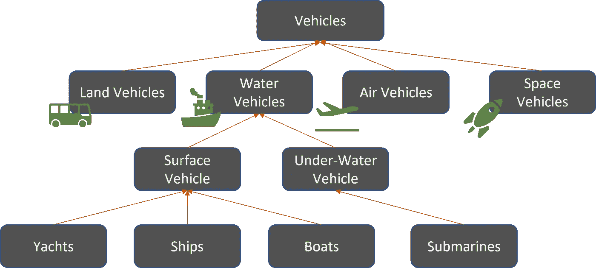

# Python 中的面向对象编程——继承和子类

> 原文：<https://towardsdatascience.com/object-oriented-programming-in-python-inheritance-and-subclass-9c62ad027278>

## 理解继承的基本概念，并通过创建子类来应用它们。


[朱莉娅·卡德尔](https://unsplash.com/@juliakadel?utm_source=medium&utm_medium=referral)在 [Unsplash](https://unsplash.com?utm_source=medium&utm_medium=referral) 上拍摄的照片

本文是 Python 中面向对象编程(OOP)系列的一部分。在这篇文章中，我将从我上一篇文章离开的地方开始讨论——[Python 中的 OOP 理解类](/oop-in-python-understanding-a-class-bcc088e595c6)。

在上一篇文章中，我们学习了一个*类*的构建模块，并构建了我们的第一个*子类*。在这篇文章中，我将从解释子类`NumListExt01`的构造开始，为了便于讨论，我在这里将其重命名为`Customer01`。然后，我将回顾一下，更详细地解释一下*继承*的概念，然后再回到*子类*上，用一些额外的概念对其进行扩展。

# 亚纲

## 概述

我们将从上一篇文章中创建的类和子类例子开始。为了便于解释，我将子类从`NumListExt01`重命名为`Customer01`。

为了提醒我们，`Customer01`子类通过添加一个额外的方法- `get_total()`扩展了超类`NumList`。

## 进入内脏

在进入`Customer01`的内部之前，让我们创建一个`Customer01`类的对象，应用这些方法。

```
Initial list of values of cust02: []
Updated list after adding values to it: [2, 20, 44, 12]
Updated list after removing value 12 is:  [2, 20, 44]
Sum of all the elements of the current list is: 66
```

定义*子类*的最低要求:

*   **超类作为参数:**创建子类时，提供*超类*，当前类将在其上构建，name 作为参数。在我们的例子中，我们已经创建了`Customer01`作为超类`NumList`的子类。
*   **初始化超类** : Python 需要显式调用超类构造函数(`__init__()`)。调用超类构造函数可以确保超类的属性对于子类是正确可用的。

🛑暂停一下，看看如果你不调用超类的构造函数会发生什么，比如试着用`pass`替换`NumList.__init__(self)`。

有了对*类*和*子类*的初步理解，现在我们将把注意力转移到理解*继承*的概念上。如果您对子类细节还有点不清楚，请不要担心，我们将再次回到*子类*来进一步讨论。

# 遗产

## 现实生活中的继承

继承允许我们在现有的通用*类*的基础上构建，并通过定制我们认为合适的新*类*来扩展这些类的用途。这个概念可以用一个真实的例子来解释。



图像由作者创建

**图片:**继承的例子

**超类**

在上面的例子中，*车辆*是最通用的类别或*类*。我们可以把车辆定义为用某种方式移动并用来运送人或材料的东西。这个宽泛的定义让*车辆*成为了*超类*，它基本上包含了我们稍后将定义的所有车辆类型。

**子类**

在第二层中，我们根据车辆行驶的路面类型来指定车辆。还要注意，基于我们想要指定的基础，这一层看起来可能完全不同。例如，我们可以根据其使用目的将车辆指定为两种类型——个人和商业。

这些*陆地*、*水上*、*空中*、*太空*飞行器都是超类*飞行器*的*子类*。

所有这些*子类*都包含它们的*超类*的属性——所有这些都是通过某种方式移动并用于运送人员或物资的车辆。但除此之外，它们都包含基于其操作表面的特定属性:

*   *陆地车辆*有轮子，
*   *水上交通工具*有螺旋桨等等。

**更多子类**

在*子类*的第三层中，我们以*水上交通工具*为例，根据水上交通工具运行的级别进一步指定。我们称它们为— *水面*或*水下*运载工具。

这些类继承了两个超类的属性— *车辆*和*水上车辆*。也就是说，水面和水下交通工具:

*   通过某种方式移动并用于运输——从 *Vehicles* 超类继承的属性
*   他们有某种推进器——继承自*水上交通工具*超类

除此之外，它们还有自己的特性，

*   *水面车辆*具有漂浮能力
*   *水下运载工具*具有下潜能力

到目前为止，T21 遗产的一个关键属性很可能是清楚的，

> 我们越往下走，职业就变得越具体。

🛑从*车辆*等级的例子中选择第四等级，并思考哪些属性使它们更好、更具体地达到其目的。

## 我们例子中的继承

**新要求**

现在让我们回到我们的编码示例，通过应用它们来理解继承概念。

为了建立一个上下文，让我们假设我们的客户 01 带着一个新的需求回来了；和上一个相比有点复杂。他希望能够做两件事:

*   将列表中的每一项视为所有项或值的总和的一部分。
*   获取最大值及其对应的分数值。

查看需求，我们可以看到这些功能是建立在先前创建的类`NumList`和`Customer01`已经提供的功能之上的:

*   `NumList`将是创建和更新数字列表的基础。
*   `Customer01`将需要得到所有值的总和。

考虑到类的这些属性之间的流动关系，我们可以将这些类放入一个很好的层次结构中:`NumList`->-`Customer01`->-`CustReq01`(新类尚未创建)。

不是说我们不能绕过`Customer01`类，而是因为我们已经创建了它，让我们利用这个类并在它的基础上构建。此外，想想如果这是一个实际的商业应用程序，其中`customer01`是一个用数百行代码定义的类。你不会想再造轮子的！

**新增子类:** `**CustReq01**`

```
[2, 20]
{2: 0.09090909090909091, 20: 0.9090909090909091}
Larget value and it's fraction to total:  {20: 0.9090909090909091}
Largest item and it's fraction to total (from variable):  {20: 0.9090909090909091}
```

在新的子类`CustReq01`中，我们添加了两个方法来满足这两个需求。但是为了使这两个方法有用，我们还添加了两个*变量* - `__frac_dict`和`max_item`。此外，我们对超类的实例化与我们在第一个子类`Customer01`中看到的不同。现在让我们来看一下这些新推出的特性和功能。

**初始化超类**

> *初始化超类的两种方式:显式使用超类名，或者使用* `*super()*` *方法。*

*   在类中使用实际的超类名称作为:< 【 >< 【 > 【 . We initialized 【 this way in our first subclass.
*   Using a more general format as: < 【 >< 【 >< 【 >. Doing this helps us avoid re-typing the *超类*而不是作为参数。

⚠️注意到`super()`方法创建了一个上下文，在这个上下文中你不应该需要放`self`参数。该方法调用*超类*，并使其所有属性对子类可用。

**私有变量与公共变量**

在`CustReq01`中，我们有两个*实例*变量:`__frac_dict` -一个空字典，用于存储分数的未来值，以及`max_item` -另一个空字典，用于存储最大值及其分数值。

正如我们在上一篇文章中提到的，在变量或方法前面添加两个下划线会使其成为私有的，这意味着方法或变量不能从对象中直接访问。在`CustReq01`的情况下，`__frac_dict`被创建为私有变量。同样的原则也适用于方法。可以通过添加两个下划线作为前缀来创建私有方法。

> *私有变量/方法通常在这些属性被类中的一些内部方法使用的情况下创建。因此，将这些属性保留为私有属性可以提供某种保护，防止意外的复杂情况。*

查看[stack exchange*的*](https://softwareengineering.stackexchange.com/questions/143736/why-do-we-need-private-variables)答案，了解私有财产的好处。

**练习**

试着思考这两个问题:

🛑试着运行`x.max_item`和`x.__frac_dict`。如果到目前为止您已经运行了本文中的所有代码，您能猜到您会在结果中看到什么吗？

🛑还有，如果你试图在运行`x.frac_max()`之前使用`x.max_item`来获得最大值，会发生什么？你能猜到为什么你会得到你所得到的吗？

**使用先前在后面的方法中定义的方法**

检查方法`frac_max()`如何利用之前在`CustReq01`中定义的方法`frac_list()`。我们使用变量也遵循同样的规则:<`self`><`.`><`method name`>。

请注意，在使用`frac_list()`方法时，我们不必提及`self`参数。

# 下一步是什么

在这篇文章中，我们试图理解，

*   *继承的概念*
*   理解用于创建子类的语法
*   通过创建一个新的子类来应用我们所学的概念
*   最后，我们谈了一点关于*实例变量*

在接下来的几篇文章中，我们将更深入地挖掘概念*变量*和*方法*。我们将会看到不同类型的变量和方法，以及它们的用途如何彼此不同。

**更新**:查看下一篇文章[Python 面向对象编程——理解变量](/object-oriented-programming-in-python-understanding-variable-e451cf581368)。

如果你喜欢这篇文章，试试 Python 系列中以前关于 OOP 的文章:

[](/oop-in-python-understanding-a-class-bcc088e595c6)  [](/oop-in-python-understanding-a-class-bcc088e595c6) 