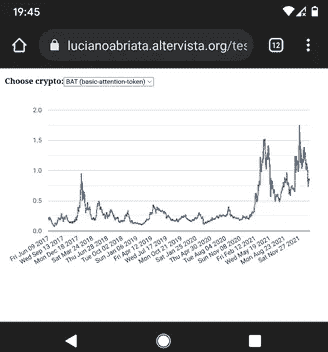

# 通过简单的 Web 代码获得无限的历史加密数据-没有 API 密钥

> 原文：<https://towardsdatascience.com/obtain-unlimited-historical-crypto-data-through-simple-api-calls-without-keys-8a6f5ed55b43>

## 从基于 web 的代码中调用 CoinGecko 的免费 API 来获取价格、交易量和市值，您可以根据自己的需要调整显示、绘制或下载数据。

*免责声明:你在这里找不到任何金融建议，我也不是加密货币、加密艺术、NFT 及其交易等方面的专家。我只赠送免费创意加 HTML+JavaScript 代码通过 API 调用这个加密货币数据聚合器获取数据；我展示了一些从这些数据中得出的图表，还有一些我自己的主观看法。*

**跳转到:** [**简介**](#310e) **|** [**一个从 coingeko**](#eff4)**|**[**检索数据的小型 web app 一个个人加密数据绘图 app**](#8f8a)**|**[**更多灵感**](#3e2b)

早在 2021 年 8 月，我就对加密货币、加密艺术、NFT 等产生了兴趣。我想自己玩加密货币数据。我在网站、新闻、app 上到处看到剧情；但是，我怎样才能得到实际的数据来玩它，做我自己的计划和调查呢？尤其是，我如何确保每次我请求它时它都是最新的？通过研究，我发现通过编写连接到 API 的小网页，我可以很容易地从 CryptoCompare.com 获得数据。在本文中，我描述了这个 API 的基础知识以及使用它所需的 HTML+JavaScript 代码，还包括一些现成的例子:

</obtaining-historical-and-real-time-crypto-data-with-very-simple-web-programming-7b481f153630>  

## CryptoCompare 的 API 的一个小问题，以及为什么有些问题我更喜欢 CoinGecko

在其免费版本中，CryptoCompare 的 API 被限制为每次调用 2000 个数据点。这意味着，例如，要覆盖比特币的全部每日历史数据，您需要执行 3 次调用。当时，我通过递归调用进行 API 调用的函数解决了这个问题，只需要 3 次调用就可以了。然而，如果你想要那么多年的每小时数据，你将需要几十个连续的调用，增加了相当多的时间，在此期间，应用程序将被阻塞，等待所有调用完成。

有了 CoinGecko 的 API，您就没有这种限制。每个调用的大小基本上没有限制，所以我可以在一个调用中获得任何加密货币的完整历史数据。更确切地说，限制是每分钟的通话次数，在我最近的测试中是 50 次。这意味着您可以一次性请求比特币、以太坊和 48 种其他货币的数据。(不尽然，因为实际上有些调用失败了，所以你需要再次运行它们；反正那一点都不差！)

此外，CoinGecko 是一个数据聚合器，这意味着它拥有比其他数据提供的更多的加密货币数据。特别是，在最近一次客户要求的搜索中，我可以找到截至 2021 年底大约有 300 个 DeFis 可用。我猜这可能是以牺牲准确性为代价的；然而，我对照其他数据提供商检查了一些货币，CoinGecko 的结果是一致的。

另一个不好的地方是，CoinGecko 的免费 API 调用在每个时间点只返回一个价格(加上市值和成交量)，而没有单独的最高价、最低价、开盘价和收盘价。至少在基本的免费模式下是如此。

## CoinGecko 及其免费 API

CoinGecko 跟踪并聚合加密货币数据，为用户分析加密市场提供数字货币的完整视图和工具。他们跟踪大量硬币的市场资本总额、价格和数量，并跟踪社区增长、软件开发、市场中的重大事件以及发展和拓展等。

在其网站的“关于”*中解释说，CoinGecko 成立于 2014 年[……]，其使命是使加密数据的访问民主化，并为用户提供可操作的见解*。我认为他们已经很好地实现了他们的目标，这可以从他们网站上免费提供的大量文档以及他们的报告、出版物(包括两本书)、时事通讯中得到证明，最重要的是，他们强大的、易于使用的和记录良好的 API。

在前一节我刚刚介绍了 CoinGecko 的免费 API，所以我在这里只添加了一个到其[主网页](https://www.coingecko.com/en/api)的链接和一个到其[文档](https://www.coingecko.com/en/api/documentation)的链接。他们也有付费服务，提供更多的功能和支持。

# 编写一个从 CoinGecko 检索数据的小型 web 应用程序

通过结合 HTML 和 JavaScript，您可以创建一个简单的网页，通过调用 CoinGecko 的 API 从 coin gecko 检索数据。

点击此处查看一个示例，该示例检索过去 10 天以太坊以美元为单位的每小时数据(价格、市值和交易量):

[**https://lucianoabriata . alter vista . org/tests/cryptogames/coingeckoexample . html**](https://lucianoabriata.altervista.org/tests/cryptogames/coingeckoexample.html)

这是从该网页中剥离出来的核心 JavaScript 代码，您可以看到 API 调用是如何工作的(我删除了所有不重要的内容，并使代码更简单，以明确要点):

```
fetch("[https://api.coingecko.com/api/v3/coins/ethereum/market_chart?vs_currency=USD&days=10&interval=hourly](https://api.coingecko.com/api/v3/coins/ethereum/market_chart?vs_currency=USD&days=10&interval=hourly)")
  .then(function(resp) {
    return resp.json();
  })
  .then(function(data) {
    var txt="(setup table HTML)"

    //Iterate to extract the data and place it into the table HTML
    for (var i=0;i<data.prices.length;i++){
      txt = txt + "<tr><td>" + data.prices[i][0] + "</td><td>" + serialDateToNiceDate(data.prices[i][0]) + "</td><td>" + data.market_caps[i][1] + "</td><td>" + data.prices[i][1] + "</td><td>" + data.total_volumes[i][1] + "</tr>\n"
    }
    txt = txt + "\n</table>" //Close table
    document.write(txt)
  })
}
```

本质上，这是一个 ***fetch*** 命令，使用与您想要检索的内容相对应的参数来调用 URL。当调用被解析时，你得到一个名为**数据**的对象，它包含**。价格**、**。市值**和**。总量**。其中每一个都包含一个日期数组(索引 0)和另一个价格、资本化或成交量数组(索引 1)。

在我的例子中，一个 ***for*** 循环遍历所有的值来编写一个表的 HTML 代码，该代码在过程结束时用一个 *document.write()* 行注入到文档中。

最后，请注意，在 URL 中，您必须指明*硬币 id* ，而不是其通用名称。在这个例子中是“以太坊”而不是 ETH。同样，你可能需要“比特币”而不是 BTC，或者“基本注意力令牌”而不是英美烟草，等等。

# 轻松构建更复杂的程序，如您的个人加密数据绘图或下载应用程序

您可以轻松地将上面的代码进一步开发成一个 web 应用程序，例如实时更新数据，或者设置它以便在移动中可视化，或者创建文件供下载并在您选择的电子表格或数据分析程序中使用。

例如，下一个应用程序允许用户在 3 种货币中选择，并实时查看美元价格。它将上述代码与 Google 的网络图表库集成在一起。

[**https://lucianabriata . alter vista . org/tests/cryptogames/coingeckoexample 2 . html**](https://lucianoabriata.altervista.org/tests/cryptogames/coingeckoexample2.html)

这是在我的智能手机上运行的截图:



该示例显示了基本注意力令牌(BAT)的价格，这是一种有趣的加密货币，与我之前提到的勇敢浏览器相关联:

<https://medium.com/technology-hits/i-like-the-principles-behind-brave-browser-but-the-surf-to-earn-leitmotif-is-pure-deception-c5f0caf05755>  

## 想要更多灵感？

鉴于您在我之前关于检索加密数据的文章中有更多的想法:

</obtaining-historical-and-real-time-crypto-data-with-very-simple-web-programming-7b481f153630>  

我向您推荐这篇文章，在这篇文章中，我将基于网络的虚拟现实与基于网络的加密货币数据检索相结合:

</live-display-of-cryptocurrency-data-in-a-vr-environment-on-the-web-af476376d018>  

喜欢这篇文章，想给我提示？【<https://www.paypal.me/LAbriata>**】-谢谢！**

**www.lucianoabriata.com*[***我写作并拍摄我广泛兴趣范围内的一切事物:自然、科学、技术、编程等等。***](https://www.lucianoabriata.com/) **[***成为媒介会员***](https://lucianosphere.medium.com/membership) *访问其所有故事(我为其获得小额收入的平台的附属链接无需您付费)和* [***订阅获取我的新故事***](https://lucianosphere.medium.com/subscribe) ***通过电子邮件*** *。到* ***咨询关于小职位*** *查看我的* [***服务页面这里***](https://lucianoabriata.altervista.org/services/index.html) *。你可以* [***这里联系我***](https://lucianoabriata.altervista.org/office/contact.html) ***。********