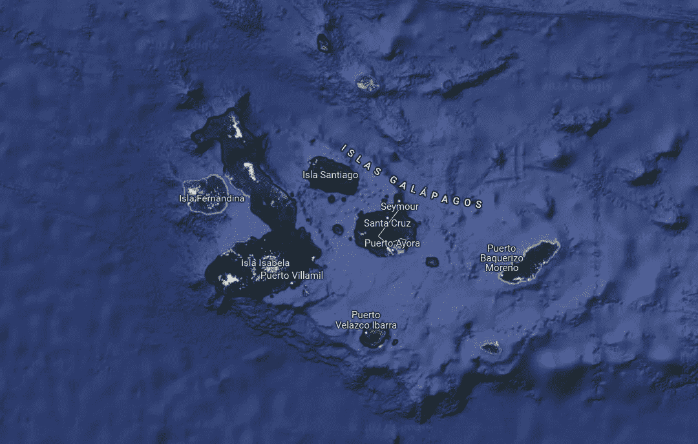
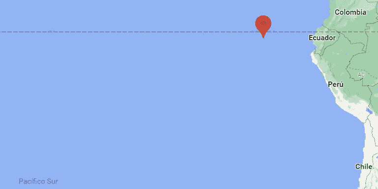
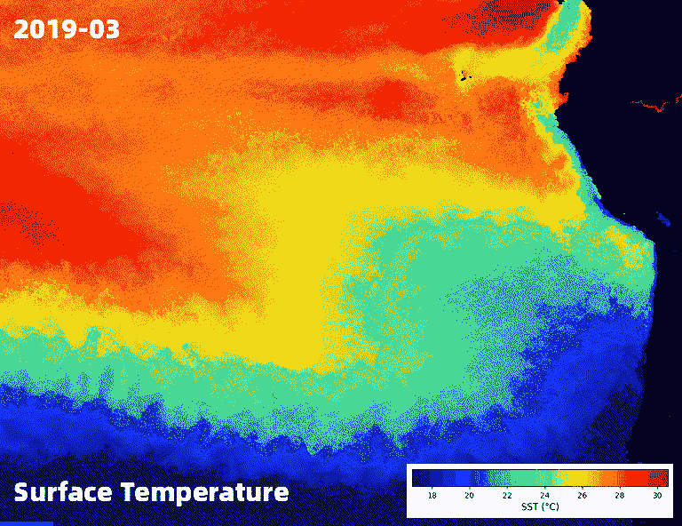
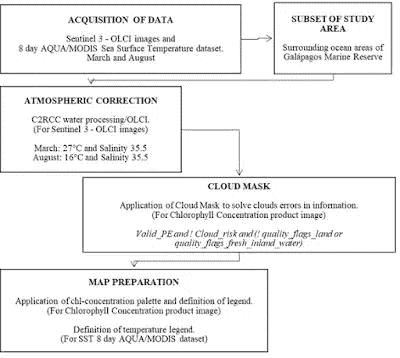
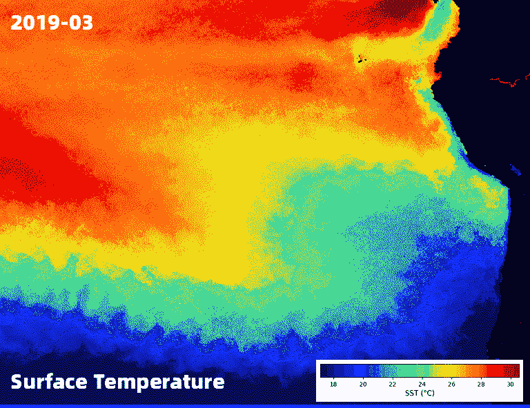
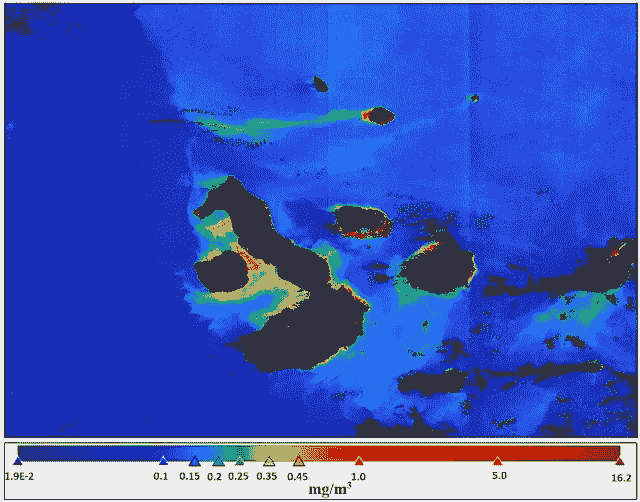
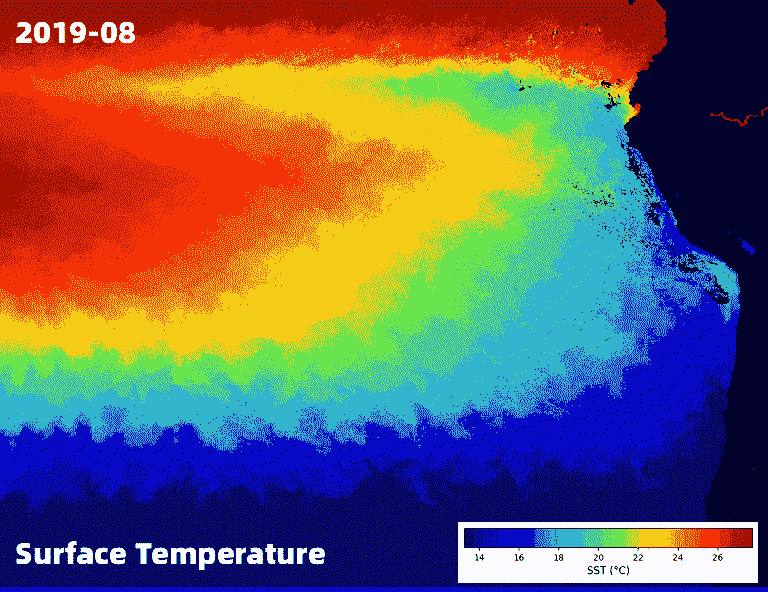
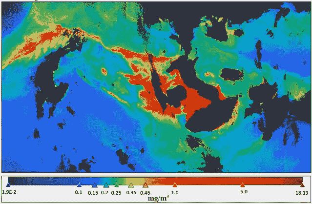

# 厄瓜多尔加拉帕戈斯群岛的洋流季节性

> 原文：<https://towardsdatascience.com/ocean-currents-seasonality-in-the-galapagos-islands-ecuador-9197f0b721c0>

## 使用 Sentinel-3 OLCI 传感器的季节性浮游植物浓度

图片由作者提供。Chl-a 浓度的加拉帕戈斯群岛 2019 年 3 月 28 日。

加拉帕戈斯群岛是一个天堂。每次我去参观它们时，我都感到惊讶，因为到处都可以看到生命的繁荣。在我的最后一次访问中，我有机会在平松岛浮潜练习中与年轻的海狮互动，与野生动物的接触令人难忘。鸟类、海洋和陆地巨龟、黄貂鱼、鱼类、鲨鱼和许多其他我叫不出名字的物种可以在岛上找到(步行或骑自行车 20 分钟)。

我决定分享这一分析，因为地理空间技术的使用可以揭示叶绿素 a 浓度作为 Sentinel 3 OLCI 传感器浮游植物浓度的代理。主要想法是通过“野生动物追踪器”地理框架在实时可见性下直接从卫星星座实施该工作流。点击下一个链接了解这款产品:

> Web: [“野生动物追踪器 v 0.2”](https://www.gis4-wildlife.com/product)

图片由作者提供。野生动物追踪者肖像。www.gis4-wildlife.com

查看我们的最新报道:*野生动物监测系统，实时浮游植物热点*

</marine-wildlife-monitoring-system-with-real-time-phytoplankton-hotspots-9b361dbd2d13>  

在这里你可以找到一个简短的分析和文本，关于加拉帕戈斯群岛以及叶绿素 a 的浓度如何随着洋流的季节性而变化。

## 加拉帕戈斯海洋保护区和海洋生态系统

加拉帕戈斯洋流和生物之间的海洋学相互作用是独一无二的。该群岛位于主要洋流的交汇处，汇集了来自南方的冷水(洪堡洋流)、来自北方穿过赤道的温水(厄尔尼诺洋流)和来自西方的深层、寒冷且富含营养的水(克伦威尔洋流)。这些主要洋流的混合产生了来自不同环境的动植物的融合点，这部分解释了我们今天发现的特殊海洋生物多样性。主要是群岛的隔离允许了物种的独立进化，水流将这些物种带到了新物种诞生的地方。近 20%的海洋生物是特有的，在地球上其他地方找不到。这种程度的特有现象对于海洋物种来说是非常独特的，因为海洋物种往往比它们的陆生同类(例如海鬣蜥)在更大程度上迁移和混合。加拉帕戈斯是地球上鬣蜥适应海洋生态系统的唯一地方。

这些重要的水流帮助了像冷水企鹅这样最奇怪的加拉帕戈斯生物生活在这个纬度。事实上，加拉帕戈斯企鹅是世界上最北的企鹅物种。(达尔文基金会，2020 年)。

图片由作者提供。加拉帕戈斯群岛。来自谷歌地图。

## 洋流对生命繁衍的影响

寒冷而肥沃的洋流为太平洋绿海龟提供了肥沃的绿藻田，维持着太平洋上绿海龟最丰富的聚居地之一。营养丰富而寒冷的洋流克伦威尔沐浴在赤道阳光中，这提高了微观浮游植物的生产力，为生命的爆发提供了养分。加拉帕戈斯是地球上少数几个因为食物供应而可以在近岸看到金枪鱼、杰克鱼、梭鱼、双髻鲨等大量中上层物种(不靠近海岸，也不在海洋深处)集中的地方之一。

浮游植物含有叶绿素，这是一种将阳光转化为植物可以利用的能量的色素。这种色素赋予浮游植物绿色。叶绿素吸收大部分可见光，但反射一些绿光和近红外光。(NEO，2019)。

在加拉帕戈斯，来自温暖的热带洋流厄尔尼诺的珊瑚和鱼类与海狮或企鹅共享生态系统，更典型的是来自极地的海狮或企鹅，它们因洪堡洋流而迁徙。海洋生态系统是一个水下野生动物奇观，世界上没有其他地方可以提供人类如此熟悉的海洋生物多样性的潜水体验。(达尔文基金会，2020 年)。

图片由作者提供。季节性洋流可视化区域和加拉帕戈斯群岛的位置。来自谷歌地图。

## **目标**

确定加拉帕戈斯海洋保护区浮游植物的存在，该保护区受冷洋流洪堡和克伦威尔以及暖洋流厄尔尼诺的季节性影响

## 季节

寒流 Humboldt(来自南方)和 Cromwell(来自西方)通常在加拉帕戈斯 7 月后至年底最为活跃，8 月的最低温度为 16°c。另一方面，暖流 El Niñ(来自北方)在年初到达群岛，3 月的最高温度为 27°c。

在接下来的 AQUA/MODIS SST 时间推移中，可以看到海面温度变化的漂亮视图。2019 年 3 月至 2020 年 3 月(12 个月)

图片由作者提供。用 [Geemap Streamlit App](https://streamlit.geemap.org/) (吴，2022)制作的从厄瓜多(北)到智利巴塔哥尼亚(南)

## 数据

这种对 Pythoplankton 的分析是用 OLCI 传感器(海洋和陆地颜色仪器)从 sensor sensor 3 获得的卫星图像完成的。这些图像是从由于洋流的到来而出现峰值温度的月份中挑选出来的。结果，获得了加拉帕戈斯群岛附近海域的叶绿素浓度。

此外，为了显示浮游植物存在时水温的影响。月平均值由 2018 年 3 月和 2018 年 8 月的 AQUA/MODIS-海面温度进行审查。

*   **哨兵 3 OLCI**
    1)*2019 年 3 月 28 日:*S3A _ OL _ 1 _ EFR _ _ _ _ 2019 03 28t 155754 _ 2019 03 28t 160054 _ 2019 03 29t 200754 _ 0179 _ 043 _ 054 _ 2880 _ LN1 _ O _ NT _ 002。s EN3
    2)*2019 年 8 月 14 日:*S3A _ OL _ 1 _ EFR _ _ _ _ 2019 08 14t 155411 _ 2019 08 14t 155711 _ 2019 08 15t 191235 _ 0179 _ 048 _ 111 _ 2880 _ LN1 _ O _ NT _ 002。EN3
    ***来源*** *:哥白尼开放访问枢纽。(*<https://scihub.copernicus.eu/dhus/#/home>**)**
*   ****海表温度月 AQUA/MODIS*** 1)2019 年 3 月
    2)2019 年 8 月
    **来源**:图片获取自[***GEE time lapse Streamlit App***](https://blog.streamlit.io/creating-satellite-timelapse-with-streamlit-and-earth-engine/)，卫星服务来自 Nasa 地球观测(NEO)。
    ([https://neo.sci.gsfc.nasa.gov/view.php?datasetId=MYD28W&年=2019](https://neo.sci.gsfc.nasa.gov/view.php?datasetId=MYD28W&year=2019) )*

## *数据许可证*

*   ***通过 Sentinel 数据中心访问的 Sentinel 3 OLCI 数据**受关于使用哥白尼 Sentinel 数据和服务信息的 [*法律声明管辖。*](https://sentinels.copernicus.eu/documents/247904/690755/Sentinel_Data_Legal_Notice) 法律声明指出，用户可以公开访问 Sentinel 数据，而无需默示担保。对于 a)复制、b)分发、c)向公众传播、d)改编、修改以及与其他数据和信息的组合，以及 e)任何(a)和(b)的组合，使用是允许和合法的。在影响欧盟安全的极少数情况下，不允许使用。*
*   ***AQUA/MODIS 数据**由美国宇航局海洋生物处理小组(OBPG)支持。美国航天局促进与研究和应用界、私营企业、学术界和公众全面和公开共享所有数据。数据的可用性越大，用户群体就能越快、越有效地利用这些信息来解决基础地球科学问题，并为开发创新的实际应用以造福公众提供基础。在这里找到数据政策。该数据集属于公共领域，可以不受限制地使用和分发。*

## *处理*

*地理处理在 SNAP 软件中完成，该软件涉及水的大气校正，使用的过滤器是 C2RCC 水处理/OLCI。C2RCC 滤波器中使用的参数随季节而变化。3 月份使用的温度为 27°C，8 月份为 16°C，两个月份的盐度均为 35.5 PSU (IFREMER，2020 年)。这个过滤器提供了一个称为 conc-chl 的新层，代表叶绿素(浮游植物)的浓度。为了创造更好的产品，应用了在工作流程中指定的云遮罩。*

**

*图片由作者提供。工作流程。*

*海表温度 8 天-AQUA/MODIS 数据集不需要处理。数据集已经使用云掩膜进行了校正，并表示了所需的信息。对于可视化和地图设计，使用了 ArcMap 软件。*

## *结果*

*下一个季节对比显示了基于洋流影响的浮游植物的存在。主要地，人们发现冷洋流使浮游植物大量存在，因为在冷季节(8 月)可以通过克伦威尔洋流的存在看到这一点。另一方面，温暖季节(3 月)显示，由于厄尔尼诺洋流，没有浮游植物，但由于克伦威尔洋流和洪堡洋流，在岛屿附近有少量浮游植物。*

## ****三月——温暖的季节****

*厄尔尼诺的暖洋流影响太平洋的赤道地区，包括加拉帕戈斯群岛周围。温暖的洋流温度超过 19°c。但是，与此同时，洪堡洋流直接流向加拉帕戈斯群岛的东部，温度主要为 12°c。克伦威尔洋流在这个季节有轻微的影响。*

**

*图片由作者提供。用 [Geemap Streamlit App](https://streamlit.geemap.org/) 创建(吴，2022)*

*因此，在这个温暖的季节(3 月),由于厄尔尼诺洋流，观察到岛屿北部缺乏浮游植物。*

**

*图片由作者提供。暖季浮游植物的存在，2019 年 3 月 28 日*

*在岛屿内部和靠近东部岛屿的地方，浮游植物的浓度超过 0.25 毫克/立方米(绿色、黄色和红色)。这种存在是由于洪堡和克伦威尔洋流的影响造成的。一般来说，在这个季节，加拉帕戈斯海洋保护区的浮游植物浓度没有空间分布。*

## ****八月——寒冷的季节****

*在寒冷季节，厄尔尼诺洋流的影响减弱，群岛北部的温度不超过 19 摄氏度。另一方面，你可以看到洪堡和克伦威尔洋流正在影响整个岛屿的南部和西部，气温在 12℃左右。*

**

*图片由作者提供。用 [Geemap Streamlit App](https://streamlit.geemap.org/) 创建(吴，2022)*

*众所周知，克伦威尔洋流带来了营养物质和丰富的浮游植物。*

**

*图片由作者提供。2019 年 8 月 14 日冷季浮游植物的存在*

*浮游植物的存在表明浓度超过 1 毫克/立方米，在加拉帕戈斯群岛中部和西部(红色)最高为 18.13 毫克/立方米。此外，浮游植物在岛屿周围的空间分布增加了 0.25 毫克/立方米至 0.5 毫克/立方米，尤其是在岛屿的东面(绿色、黄色和橙色)。因此，在寒冷季节，克伦威尔洋流对浮游植物的存在有显著影响。考虑到两者都是冷洋流，克伦威尔洋流的影响大于洪堡洋流。*

## *结论*

*克伦威尔冷洋流对加拉帕戈斯海洋保护区西部的浮游植物有重大影响。考虑到两者都是冷洋流，其影响大于洪堡洋流。浮游植物舒适的生态系统的温度在 12℃以上和 16℃以下。超过 16℃，浮游植物的数量就会减少。厄尔尼诺暖流对加拉帕戈斯海洋保护区北部的浮游植物没有影响。*

## *参考*

*   *达尔文基金会(2020)。气候学数据库。检索自:[https://www . Darwin foundation . org/en/data zone/climate/Puerto-ayora](https://www.darwinfoundation.org/en/datazone/climate/puerto-ayora)*
*   *IFREMER (2020 年)。海面盐度。检索自:[http://www . salinity remote sensing . IFR emer . fr/sea-surface-salnity/definition-and-units](http://www.salinityremotesensing.ifremer.fr/sea-surface-salinity/definition-and-units)*
*   *美国宇航局戈达德太空飞行中心，海洋生态实验室，海洋生物处理组。中分辨率成像光谱仪(MODIS)海洋水色数据。美国马里兰州格林贝尔特 DAAC。来自[https://developers . Google . com/earth-engine/datasets/catalog/NASA _ ocean data _ MODIS-Aqua _ L3SMI #引文](https://developers.google.com/earth-engine/datasets/catalog/NASA_OCEANDATA_MODIS-Aqua_L3SMI#citations)*
*   *吴，秋生(2022)。GEEMap 简化了卫星延时应用程序。来自:【https://streamlit.geemap.org/ *