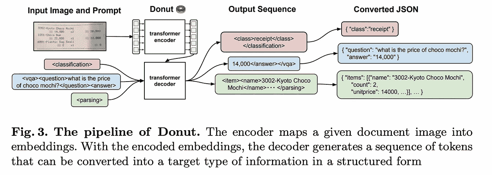
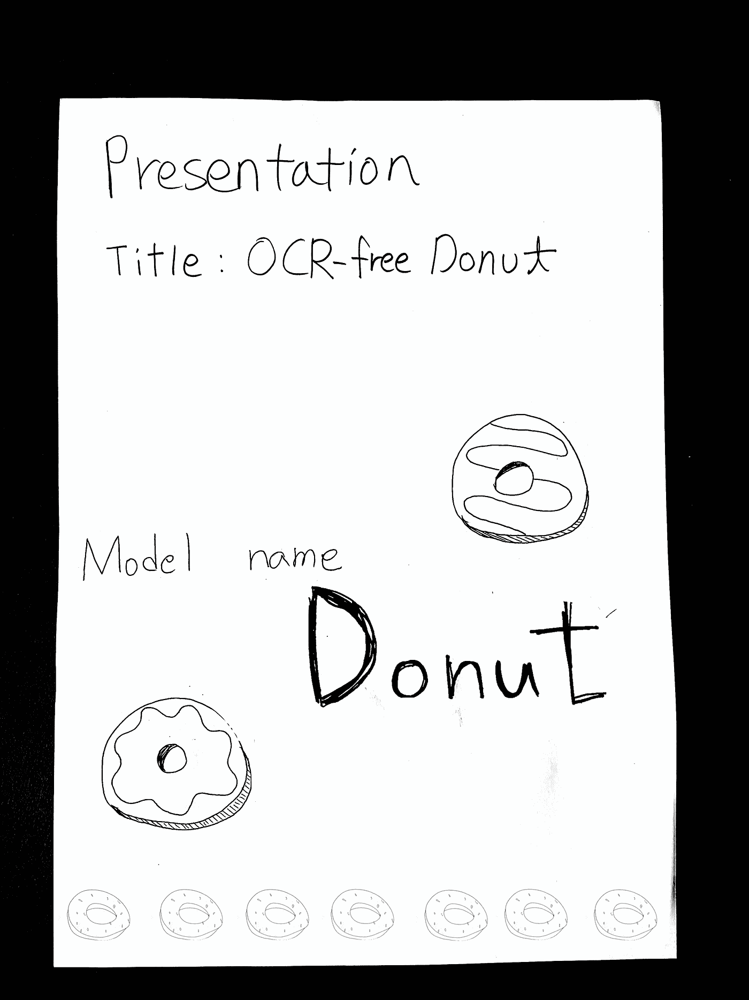
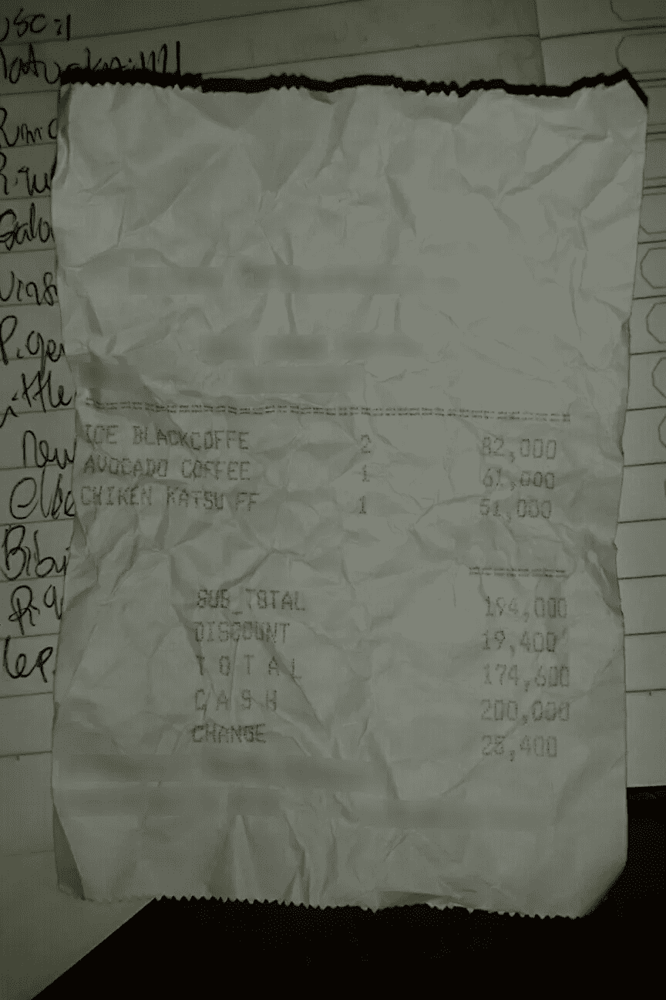
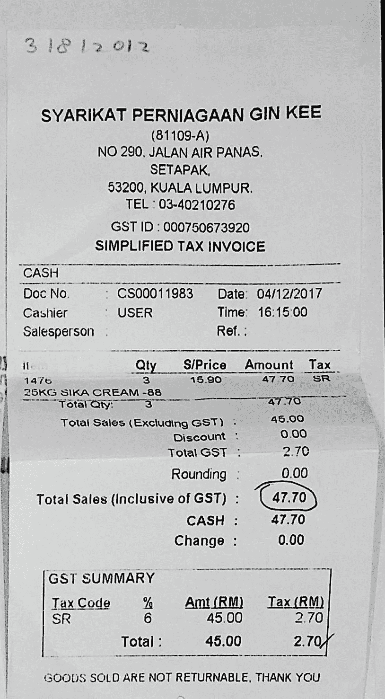

# 用甜甜圈实现无 OCR 文档理解

> 原文：<https://towardsdatascience.com/ocr-free-document-understanding-with-donut-1acfbdf099be>

## 使用最近发布的 Transformers 模型来生成文档数据的 JSON 表示


由[罗曼·丹斯克](https://unsplash.com/@romaindancre?utm_source=medium&utm_medium=referral)在 [Unsplash](https://unsplash.com?utm_source=medium&utm_medium=referral) 上拍摄的照片

视觉文档理解(VDU)是深度学习和数据科学中一个经过大量研究的新领域，特别是因为 pdf 或文档扫描中存在大量非结构化数据。最近的模型，如 [LayoutLM](https://arxiv.org/abs/1912.13318) ，利用 [transformers](/transformers-141e32e69591) 深度学习模型架构来标记单词或回答基于文档图像的给定问题(例如，您可以通过注释图像本身来突出显示和标记帐号，或者询问模型，“帐号是什么？”).像 HuggingFace 的`[transformers](https://huggingface.co/docs/transformers/index)`这样的库使得使用开源变形金刚模型变得更加容易。

VDU 问题的大多数传统解决方案依赖于解析该图像的 OCR 输出以及视觉编码，但是 OCR 的计算成本很高(因为它通常需要安装像 Tesseract 这样的 OCR 引擎),并且在完整的管道中包含另一个模型会导致必须训练和微调另一个模型，并且不准确的 OCR 模型会导致 VDU 模型中的错误传播。

因此，来自 [Naver CLOVA](https://clova.ai/en/research/research-areas.html) [的研究人员提出了一个端到端的 VDU 解决方案](https://arxiv.org/abs/2111.15664)【1】，该方案使用了一个编码器-解码器变压器模型架构，并且[最近将](https://github.com/clovaai/donut)与 HuggingFace `transformers`库结合使用。换句话说，它使用 BART 解码器模型将图像(使用 Swin Transformer 分割成小块)编码成令牌向量，然后可以解码或翻译成数据结构形式的输出序列(然后可以进一步解析成 JSON ),并在多语言数据集上进行公开预训练。在推理时输入到模型中的任何提示也可以在相同的架构中解码。



甜甜圈作者的图片(麻省理工学院许可)

你可以在[脐带收据数据集](https://github.com/clovaai/cord) [这里](https://huggingface.co/spaces/naver-clova-ix/donut-base-finetuned-cord-v2)看到甜甜圈的演示。他们提供了一个样本收据图像来进行测试，但是您也可以在许多其他文档图像上进行测试。当我在这张图片上测试时:



图片由甜甜圈的作者提供

我得到了结果:

```
{
    nm: "Presentation"
}
```

这表明它检测到“演示”标题是菜单或收据上的项目名称。

作者还提供了培训和测试脚本，因此我们可以演示如何在实践中实际使用这些模型(我将使用 [SROIE 数据集](https://github.com/zzzDavid/ICDAR-2019-SROIE) [2]，一个标记收据和发票的数据集，来演示对定制数据集的微调)。我建议在 GPU 上运行代码，因为推理和训练都需要花费 CPU 相当长的时间。Google Colab 提供免费的 GPU 访问，应该足以进行微调(转到**运行时** > **更改运行时类型**从 CPU 切换到 GPU)。

首先，让我们确保我们有 GPU 访问。

```
import torch
print("CUDA available:", torch.cuda.is_available())
!nvcc --version
```

现在我们可以下载相关的文件和库。下面几行代码应该会安装所有的依赖项，包括 donut 库(虽然您可以使用`pip install donut-python`手动安装，但是从 Github 克隆的代码库包括重要的培训和测试脚本)。

```
!git clone https://github.com/clovaai/donut.git
!cd donut && pip install .
```

## 使用 CORD 微调模型进行推断

首先，我们将演示模型的基本用法。

```
from donut import DonutModel
from PIL import Image
import torch
model = DonutModel.from_pretrained("naver-clova-ix/donut-base-finetuned-cord-v2")
if torch.cuda.is_available():
    model.half() 
    device = torch.device("cuda") 
    model.to(device) 
else: 
    model.encoder.to(torch.bfloat16)
model.eval() 
image = Image.open("./donut/misc/sample_image_cord_test_receipt_00004.png")
    .convert("RGB")
output = model.inference(image=image, prompt="<s_cord-v2>")
output
```

在`DonutModel.from_pretrained()`调用中，我已经简单地从 HuggingFace Hub 中指定了预训练模型的名称(此时下载了必要的文件)，尽管我也可以指定模型文件夹的本地路径，我们将在后面演示。Donut 代码库还包括一个示例图像(如下所示)，这是我传递到模型中的，但是您可以用任何您喜欢的图像来测试模型。



甜甜圈作者提供的收据样本图片

您应该得到如下输出

```
{'predictions': [{'menu': [{'cnt': '2', 'nm': 'ICE BLAOKCOFFE', 'price': '82,000'}, 
    {'cnt': '1', 'nm': 'AVOCADO COFFEE', 'price': '61,000'}, 
    {'cnt': '1', 'nm': 'Oud CHINEN KATSU FF', 'price': '51,000'}],
    'sub_total': {'discount_price': '19,400', 'subtotal_price': '194,000'}, 
    'total': {'cashprice': '200,000', 
    'changeprice': '25,400', 
    'total_price': '174,600'}}]}
```

(注意:如果你像我一样好奇，想知道预训练的`donut-base`主干会给你什么输出，我继续测试了一下。因为占用了太多内存，所以在崩溃之前需要很长时间才能产生输出。)

# 在自定义数据集上微调甜甜圈

为了演示微调，我将使用 SROIE 数据集，这是一个收据和发票扫描的数据集，带有 JSON 形式的基本信息以及单词级的边界框和文本。它包含 626 张图片，但我将只在 100 张图片上进行训练，以展示 Donut 的有效性。这是一个比 CORD(包含大约 1000 张图片)更小的数据集，并且标签也更少(只有公司、日期、地址和总数)。

## 下载和解析 SROIE

要下载数据集，您只需从[主存储库](https://github.com/zzzDavid/ICDAR-2019-SROIE)中下载*数据*文件夹。您可以通过克隆整个存储库或者使用类似于[下载目录](https://download-directory.github.io)的东西来下载单个文件夹。

但是现在我们需要将数据集解析为 HuggingFace `datasets`库所要求的格式，这是 Donut 在幕后用来将自定义数据集作为图像字符串表加载的。(如果你在寻找文档，Donut 使用`imagefolder`加载脚本。)

以下是所需的数据集格式:

```
dataset_name
├── test
│   ├── metadata.jsonl
│   ├── {image_path0}
│   ├── {image_path1}
│             .
│             .
├── train
│   ├── metadata.jsonl
│   ├── {image_path0}
│   ├── {image_path1}
│             .
│             .
└── validation
    ├── metadata.jsonl
    ├── {image_path0}
    ├── {image_path1}
              .
              .
```

其中 **metadata.jsonl** 是一个类似于

```
{"file_name": {image_path0}, "ground_truth": "{\"gt_parse\": {ground_truth_parse}, ... {other_metadata_not_used} ... }"}
{"file_name": {image_path1}, "ground_truth": "{\"gt_parse\": {ground_truth_parse}, ... {other_metadata_not_used} ... }"}
```

换句话说，我们希望将每个文档的注释(在*键*文件夹中找到)转换成类似于`"{\"gt_parse\": {actual JSON content}"}"`的 JSON 转储字符串。下面是一个注释示例:

```
{
    "company": "BOOK TA .K (TAMAN DAYA) SDN BHD",
    "date": "25/12/2018",
    "address": "NO.53 55,57 & 59, JALAN SAGU 18, TAMAN DAYA, 81100 JOHOR BAHRU, JOHOR.",
    "total": "9.00"
}
```

下面是我用来将数据转换成 JSON lines 文件以及将图像复制到各自的文件夹中的脚本:

```
import os
import json
import shutil
from tqdm.notebook import tqdm
lines = []
images = []
for ann in tqdm(os.listdir("./sroie/key")[:100]):
  if ann != ".ipynb_checkpoints":
    with open("./sroie/key/" + ann) as f:
      data = json.load(f)
images.append(ann[:-4] + "jpg")
    line = {"gt_parse": data}
    lines.append(line)
with open("./sroie-donut/train/metadata.jsonl", 'w') as f:
  for i, gt_parse in enumerate(lines):
    line = {"file_name": images[i], "ground_truth": json.dumps(gt_parse)}
    f.write(json.dumps(line) + "\n")
shutil.copyfile("./sroie/img/" + images[i], "./sroie-donut/train/" + images[i])
```

我简单地运行这个脚本三次，每次都改变文件夹和列表片的名称(`[:100]`)，这样我在*训练*中有 100 个例子，在*验证*和*测试*中各有 20 个例子。

## 训练模型

Donut 的作者提供了一个非常简单的方法来训练模型。首先，我们需要在 *donut/config* 文件夹中创建一个新的配置文件。您可以将已经存在的示例( *train_cord.yaml* )复制到一个名为 **train_sroie.yaml** 的新文件中。这些是我更改的值:

```
dataset_name_or_paths: ["../sroie-donut"]
train_batch_sizes: [1]
check_val_every_n_epochs: 10
max_steps: -1 # infinite, since max_epochs is specified
```

如果您已经本地下载了`donut-base`模型，您也可以在`pretrained_model_name_or_path`中指定它的路径。否则 HuggingFace 会直接从 Hub 下载。

当我在 Google Colab 上发现 CUDA 内存不足错误时，我将批处理大小从 8 减小，并将`check_val_every_n_epochs`增加到 10 以节省时间。

这里是你应该用来训练你的模型的线:

```
cd donut && python train.py --config config/train_sroie.yaml
```

我花了大约一个小时的时间在 Google Colab 提供的 GPU 上完成了训练。

## 使用微调模型进行推理

使用与上面的 CORD 演示类似的脚本，我们可以使用

```
from donut import DonutModel
from PIL import Image
import torch
model = DonutModel.from_pretrained("./donut/result/train_sroie/20220804_214401")
if torch.cuda.is_available():
    model.half()
    device = torch.device("cuda")
    model.to(device)
else:
    model.encoder.to(torch.bfloat16)
model.eval()
image = Image.open("./sroie-donut/test/099.jpg").convert("RGB")
output = model.inference(image=image, prompt="<s_sroie-donut>")
output
```

请注意，我们已经在`DonutModel.from_pretrained()`调用中更改了模型路径，并且我们还将推理`prompt`更改为`<s_{dataset_name}>`的格式。这是我用的图片:



图片来自 [SROIE 数据集](https://github.com/zzzDavid/ICDAR-2019-SROIE)

这些是我的结果:

```
{'predictions': [{'address': 'NO 290, JALAN AIR PANAS. SETAPAK. 53200, KUALA LUMPUR.',
   'company': 'SYARIKAT PERNIAGAAN GIN KEE',
   'date': '04/12/2017',
   'total': '47.70'}]}
```

# 最后的想法

我注意到，使用 Donut 的伪 OCR 的最终输出比传统的现成 OCR 方法要准确得多。作为一个极端的例子，下面是使用 Tesseract 的 OCR 引擎进行 OCRed 的演示中的同一个 CORD 文档:

```
*' il " i
- ' s ' -
W =
o o
ok S
?flfi (€
rgm"f"; o ;
L i 4
```

图像模糊，对比度低，甚至对人来说也难以阅读，所以不太可能有人会期望模型能够识别角色。令人印象深刻的是，甜甜圈能够用自己的技术做到这一点。即使对于高质量的文档，尽管其他商业 OCR 模型比开源 OCR 引擎(如 Tesseract)提供的结果更好，但它们通常成本很高，并且因为商业数据集的强化训练和更强的计算能力而更好。

解析给定文档的 OCR 输出的模型的替代方案包括仅利用计算机视觉技术来突出显示各种文本块、解析表格、或者识别图像、图形和数学等式，但是如果可以导出有意义的数据，则再次要求用户对包围盒输出进行 OCR。库包括 [LayoutParser](https://layout-parser.github.io/) 和[deep doc detection](https://github.com/deepdoctection/deepdoctection)，两者都连接到 [Detectron2](https://ai.facebook.com/blog/-detectron2-a-pytorch-based-modular-object-detection-library-/) 计算机视觉模型的模型动物园以交付结果。

此外，Donut 的作者还提供了一个测试脚本，您可以使用它为您的微调模型开发评估指标，该脚本位于 Donut 代码库中的 **test.py** 文件中。它提供 F1 准确度分数，该分数是基于对基本事实解析的准确通过或失败来测量的，以及由树编辑距离算法给出的准确度分数，该算法确定最终 JSON 树与基本事实 JSON 的接近程度。

```
cd ./donut &&
python test.py --dataset_name_or_path ../sroie-donut --pretrained_model_name_or_path ./result/train_sroie/20220804_214401 --save_path ./result/train_sroie/output.json
```

使用我的 SROIE-finetuned 模型，我的所有 20 个测试图像的平均准确率为 94.4%。

Donut 还与 SynthDoG 打包在一起，synth dog 是一个模型，可用于以四种不同的语言生成额外的伪造文档以进行数据扩充。它在英文、中文、日文和韩文维基百科上接受了培训，以便更好地解决传统 OCR/VDU 方法的问题，这些方法通常因缺乏除英语之外的大量语言数据而受到限制。

[1] Kim，Geewook 等，“无 OCR 文档理解转换器”(2021).麻省理工许可证。

[2]黄征等，“ICDAR2019 扫描收据 OCR 和信息提取竞赛” *2019 文档分析与识别国际会议(ICDAR)* 。IEEE，2019。麻省理工许可证。

**Neha Desaraju 是德克萨斯大学奥斯丁分校学习计算机科学的学生。你可以在网上的**[**estau dere . github . io**](https://estaudere.github.io/)**找到她。**