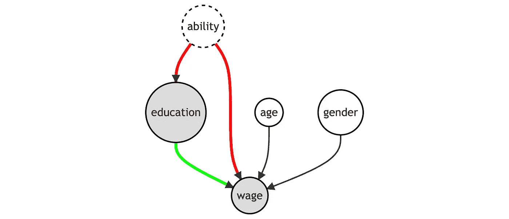
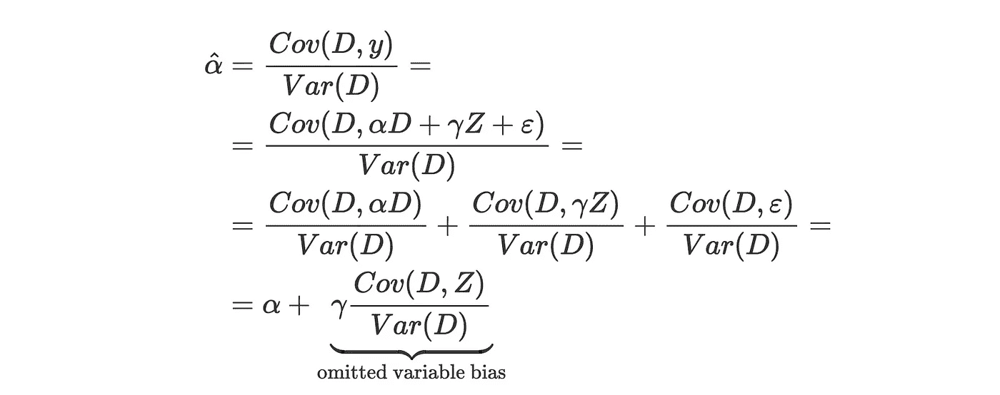
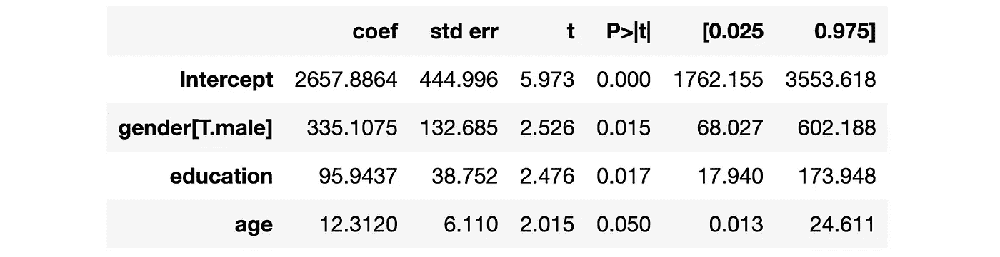
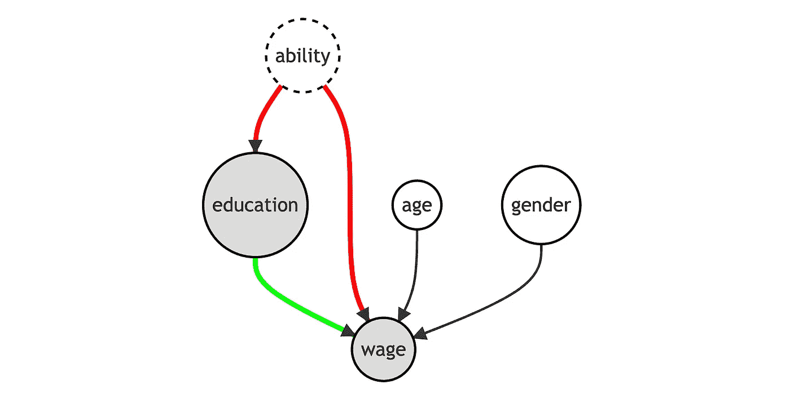
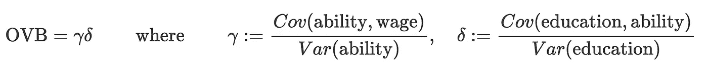
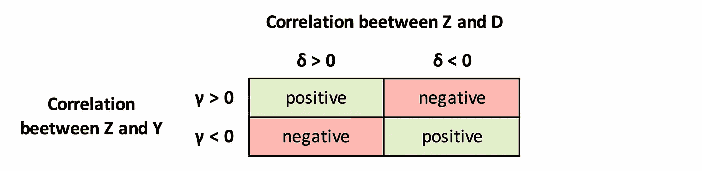
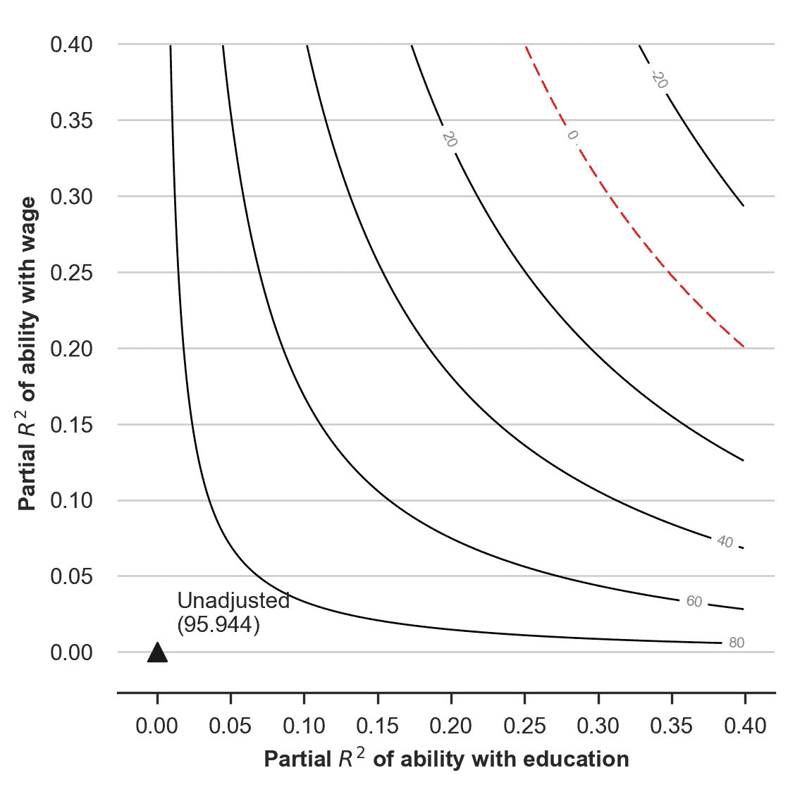
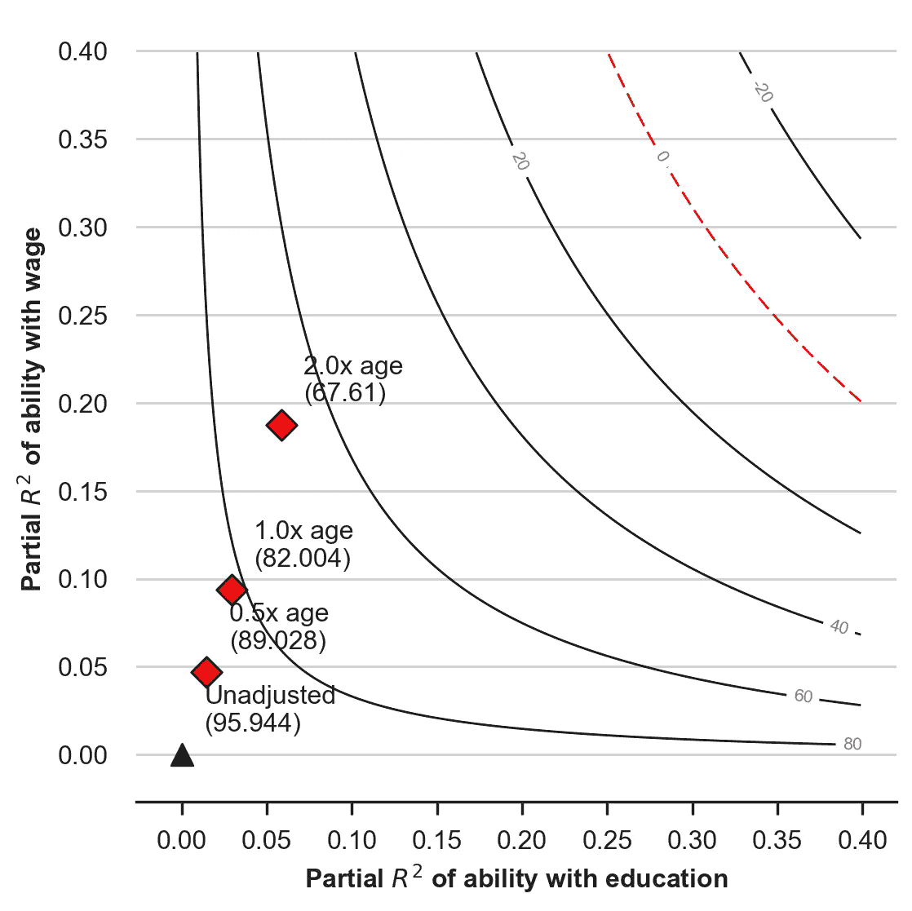
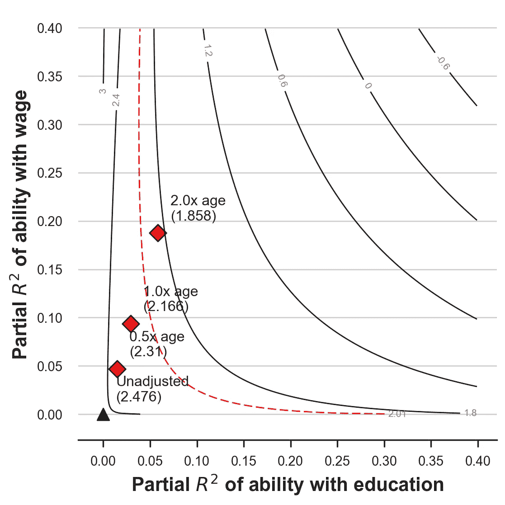

# 理解遗漏变量偏差

> 原文：<https://towardsdatascience.com/omitted-variable-bias-and-what-can-we-do-about-it-344ac1477699>

## [因果数据科学](https://towardsdatascience.com/tagged/causal-data-science)

## 最普遍的偏见类型的逐步指南



作者图片

在因果推理中，**偏差**是非常成问题的，因为它使推理无效。偏差通常意味着估计者不会给出因果效应的平均估计值。

这就是为什么，一般来说，我们更喜欢**无偏**的估值器，代价是更高的方差，也就是更多的噪声。是不是说每个有偏估计量都没用？实际上不是。有时，有了领域知识，我们仍然可以得出因果结论，即使是有偏见的估计。

在本帖中，我们将回顾一个具体但常见的偏差来源，**省略变量偏差(OVB)** 。我们将探索偏见的原因，并利用这些见解做出因果陈述，尽管存在偏见。

# 理论

假设我们对变量 *D* 对变量 *y* 的影响感兴趣。然而，还有第三个变量 *Z* 我们没有观察到，它与 *D* 和 *y* 都相关。假设数据生成过程可以用下面的 [**有向无环图(DAG)**](/b63dc69e3d8c) 来表示。如果你不熟悉 DAGs，我在这里写了一个简短的[介绍](/b63dc69e3d8c)。


作者图片

由于从 *D* 到 *y* 有一条 [**后门路径**](/b63dc69e3d8c) 经过 *Z* ，我们需要以 *Z* 为条件进行分析，以恢复 *D* 对 *y* 的因果关系。如果我们可以观察到 *Z* ，我们将在 *D* 和 *Z* 上运行 *y* 的线性回归来估计以下模型:


作者图片

其中 *α* 为利息的影响。这种回归通常被称为**长回归**，因为它包括模型的所有变量。

然而，由于我们没有观察到 *Z* ，我们不得不估计以下模型:


作者图片

相应的回归通常被称为**短回归**，因为它不包括模型的所有变量。

估计短回归而不是长回归的**后果**是什么？简而言之，我们不能给估计的系数一个**因果解释**。

在这种情况下， *α* 的 OLS 估计量为



作者图片

因此，我们可以把**省略变量偏差**写成


作者图片

这个公式的美妙之处在于它的**可解释性**:被省略的变量 bias 仅由两个部分组成**，两者都非常容易解释。**

*   *γ*:Z*对 y*的影响**
*   *δ*:D*对 Z* 的影响

请注意，这是一个**渐近偏差**，这意味着随着样本量的增长，估计量不会收敛到它应该估计的参数(estimand)。或者，我们可以说估计量是**不** [**一致**](https://en.wikipedia.org/wiki/Consistency_(statistics)) 。

## 附加控制

如果我们在回归中有**个额外的控制变量**会发生什么？例如，假设除了感兴趣的变量 *D* 之外，我们还观察到其他变量的向量 *X* ，因此**长回归**为


作者图片

由于有了 [**弗里希-沃-洛厄尔定理**](/59f801eb3299) ，我们可以简单地将**部分剔除** *X* 并用 *D* 和 *Z* 来表示省略的变量 bias。


作者图片

其中 *D⊥X* 是从 *X* 上回归 *D* 的残差，而 *Z⊥X* 是从 *X* 上回归 *Z* 的残差。如果你不熟悉弗里希-沃-洛厄尔定理，我在这里写了一个简短的[注释](/59f801eb3299)。

Chernozhukov、西内利、纽伊、夏尔马和 Syrgkanis (2022) 进一步将分析概括为处理变量 *D* 、控制变量 *X、*和未观察变量 *Z* 以非参数方式进入长模型的设置，即没有特定的函数形式。你可以在他们的论文中找到更多的细节，但是基本思想是一样的。

# 例子

假设我们是一名对教育和工资之间的关系感兴趣的研究员。从未来的工资来看，投资教育有回报吗？假设我们有受教育年限不同的人的工资数据。为什么不看看受教育年限和工资的相关性？

问题是可能有许多**未观察到的变量**与教育和工资都相关。为了简单起见，我们集中讨论一下**能力**。能力较高的人可能会决定在教育上投入更多，只是因为他们在学校表现更好，获得更多机会。另一方面，他们也可能会获得更高的工资，纯粹是因为他们天生的能力。

我们可以用下面的**有向无环图** (DAG)来表示数据生成过程。


作者图片

让我们加载并检查**数据**。我从`[src.dgp](https://github.com/matteocourthoud/Blog-Posts/blob/main/notebooks/src/dgp.py)`导入数据生成过程，从`[src.utils](https://github.com/matteocourthoud/Blog-Posts/blob/main/notebooks/src/utils.py)`导入一些绘图函数和库。

```
from src.utils import *
from src.dgp import dgp_educ_wages

df = dgp_educ_wages().generate_data(N=50)
df.head()
```


作者图片

我们有 300 个人的信息，我们观察他们的 T2、T3、T4 和当前的 T5。

假设我们在`education`上直接回归`wage`。

```
short_model = smf.ols('wage ~ education + gender + age', df).fit()
short_model.summary().tables[1]
```



作者图片

`education`的系数为正且显著。然而，我们知道可能有一个**遗漏变量偏差**，因为我们没有观察到`ability`。就 Dag 而言，从`education`到`wage`有一条**后门路径**通过`ability`未被阻塞，因此会使我们的估计产生偏差。



作者图片

是不是说我们所有的分析都是**垃圾**？我们还能从回归结果中得出一些因果结论吗？

# 偏向的方向

如果我们知道 *γ* 和 *δ* 的符号，我们可以推断偏差的符号，因为它是两个符号的乘积。


作者图片

在我们的例子中



作者图片

让我们分别分析这两种相关性:

*   `ability`和`wage`之间的相关性很可能是正的
*   `ability`和`education`之间的相关性很可能是正的

因此，偏差最有可能是**正**。由此，我们可以得出结论，我们对`education`的`wage`回归的估计很可能是对因果效应的**高估**，这很可能更小。

这可能看起来像一个小的洞察力，但它实际上是巨大的。现在我们可以很有信心地说，一年的`education`每月最多给`wages`增加**95 美元，这是一个比仅仅说估计有偏差更有信息量的说法。**

一般来说，我们可以在一个 2 乘 2 的**表**中总结偏差的不同可能影响。



偏向的方向(作者图片)

# 进一步的敏感性分析

在不做强有力假设的情况下，我们能说更多关于省略变量偏差的 T21 吗？

答案是肯定的！特别是，我们可以问自己:偏相关 *γ* 和 *δ* 应该有多强，才能**推翻**我们的结论？

在我们的例子中，我们发现数据中的`education`和`wages`之间存在正相关关系。然而，我们知道我们在回归中省略了`ability`。问题是:`ability`与`wage`、 *γ* 、`ability`与`education`、 *δ* 之间的相关性应该有多强，才能使效果不显著甚至为负？

[西内利和黑兹利特(2020)](https://rss.onlinelibrary.wiley.com/doi/full/10.1111/rssb.12348) 表明，我们可以根据所解释的残差变异，即[决定系数 R](https://en.wikipedia.org/wiki/Coefficient_of_determination) 来转化这个问题。这种方法的优点是**可解释性**。猜测所解释的方差百分比比猜测条件相关的大小要容易得多。

作者编写了一个配套包`[sensemakr](https://github.com/carloscinelli/sensemakr)`来进行敏感性分析。你可以在这里找到[包的详细描述。](https://cran.r-project.org/web/packages/sensemakr/vignettes/sensemakr.html)

我们现在将使用`Sensemakr`函数。`Sensemakr`函数的主要**参数**为:

*   `model`:我们要分析的回归模型
*   `treatment`:感兴趣的特征/协变量，在我们的例子中是`education`

我们将尝试回答以下问题:

> *对于* `*education*` *对* `*wages*` *到* ***变化符号*** *的效果*`*ability*``*education*`*需要说明* `*education*` *(x 轴)和 *(y 轴)的残差变化量有多大？**

```
import sensemakr

sensitivity = sensemakr.Sensemakr(model = short_model, treatment = "education")
sensitivity.plot()
plt.xlabel("Partial $R^2$ of ability with education");
plt.ylabel("Partial $R^2$ of ability with wage");
```



在**图**中，我们看到`ability`的 *R* 与`education`和`wage`的局部(因为以`age`和`gender`为条件)如何影响`wage`上`education`的估计系数。标有**三角形**的 *(0，0)* 坐标对应于当前估计值，反映了如果`ability`对`wage`和`education`都没有解释力会发生什么:什么都没有。随着`ability`的解释力增加(从三角形向上和向右移动)，估计系数减小，如**水平曲线**所示，直到在**红色虚线**处变为零。

我们应该如何**解读**剧情？我们可以看到，为了消除`education`对`wages`的影响，我们需要`ability`来解释`education`和`wage`中大约 30%的剩余变化，对应于红线。

你现在可能(有理由)会问:30%是多少？是大还是小？我们可以通过**基准测试**用另一个*观察到的*变量解释的剩余方差的结果来了解部分 R 的**大小**。我们以`age`为例。

`Sensemakr`函数接受以下可选参数:

*   `benchmark_covariates`:用作基准的协变量
*   `kd`和`ky`:这些自变量参数化了与观察到的基准协变量(`age`)相比，未观察到的变量(`ability`)相对于治疗(`kd`)和结果(`ky`)强多少倍。在我们的例子中，设置`kd`和`ky`等于 *[0.5，1，2]* 意味着我们想要研究一个变量的最大强度是`age`的一半、相同或两倍(在解释`education`和`wage`变化时)。

```
sensitivity = sensemakr.Sensemakr(model = short_model, 
                                  treatment = "education",
                                  benchmark_covariates = "age",
                                  kd = [0.5, 1, 2],
                                  ky = [0.5, 1, 2])
sensitivity.plot()
plt.xlabel("Partial $R^2$ of ability with education");
plt.ylabel("Partial $R^2$ of ability with wage");
```



看起来即使`ability`有两倍于`age`的解释力，`education`对`wage`的影响仍然是正面的。但是它会是**统计上显著的**吗？

我们可以重复同样的练习，查看 t 统计量而不是系数的大小。我们只需要将绘图功能中的`sensitivity_of`选项设置为等于`t-value`。

在这种情况下，我们试图回答的问题是:

> *对于*`*education*``*wages*`***对*****变得不显著****的影响*在*`*education*`***`*ability*`*中的残差变化有多大？********

```
sensitivity.plot(sensitivity_of = 't-value')
plt.xlabel("Partial $R^2$ of ability with education");
plt.ylabel("Partial $R^2$ of ability with wage");
```



从图中我们可以看出，为了使`education`对`wage`的影响不显著，我们需要`ability`来解释`education`和`wage`中大约 5%到 10%的剩余变化。特别是，红线绘制了 t 统计量等于 2.01 的水平曲线，对应于 5%的显著性水平。从与`age`的比较中，我们看到稍强一点的解释力(大于`1.0x age`)就足以使`education`对`wage`的系数不具有统计显著性。

# 结论

在这篇文章中，我介绍了**省略变量偏差**的概念。我们已经看到了如何在一个简单的线性模型中计算它，以及我们如何利用变量的定性信息在省略变量偏差的情况下做出推断。

这些工具非常有用，因为省略变量偏差基本上到处都是**。首先，总有我们没有观察到的因素，比如我们玩具例子中的能力。然而，即使我们可以观察一切，遗漏变量偏差也可能以**模型错误设定**的形式出现。假设`wages`二次依赖`age`。然后，从回归中省略二次项会引入偏差，可以使用我们用于`ability`的相同工具对其进行分析。**

## **参考**

**[1] C .西内利，c .黑兹莱特，[弄清楚敏感性:扩展省略变量偏倚](https://rss.onlinelibrary.wiley.com/doi/full/10.1111/rssb.12348) (2019)，*英国皇家统计学会杂志*。**

**[2] V. Chernozhukov，c .西内利，W. Newey，A. Sharma，V. Syrgkanis，[长话短说:因果机器学习中省略的变量偏差](https://arxiv.org/abs/2112.13398) (2022)，工作论文。**

## **相关文章**

*   **[理解弗里希-沃-洛弗尔定理](/59f801eb3299)**
*   **[Dag 和控制变量](/b63dc69e3d8c)**

## **密码**

**你可以在这里找到 Jupyter 的原始笔记本:**

**<https://github.com/matteocourthoud/Blog-Posts/blob/main/notebooks/ovb.ipynb> ** 

## **感谢您的阅读！**

**我真的很感激！🤗*如果你喜欢这个帖子并想看更多，可以考虑* [***关注我***](https://medium.com/@matteo.courthoud) *。我每周发布一次与因果推断和数据分析相关的主题。我尽量让我的帖子简单而精确，总是提供代码、例子和模拟。***

***还有，一个小小的* ***免责声明*** *:我写作是为了学习所以错误是家常便饭，尽管我尽了最大努力。当你发现他们的时候，请告诉我。也很欣赏新话题的建议！***