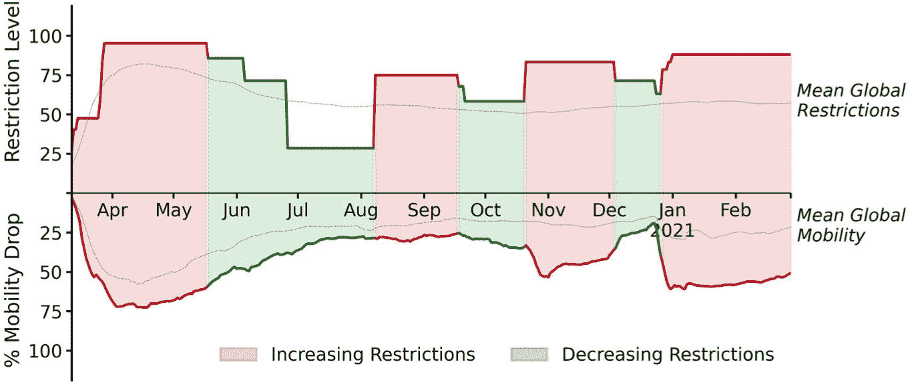
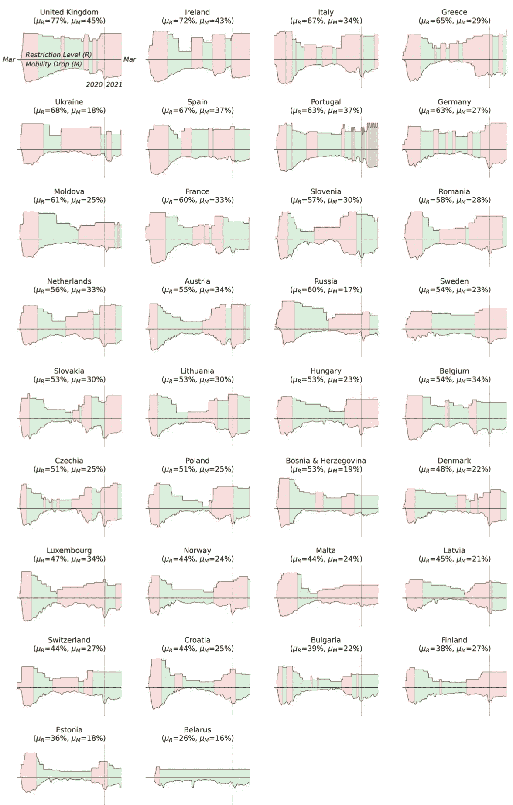
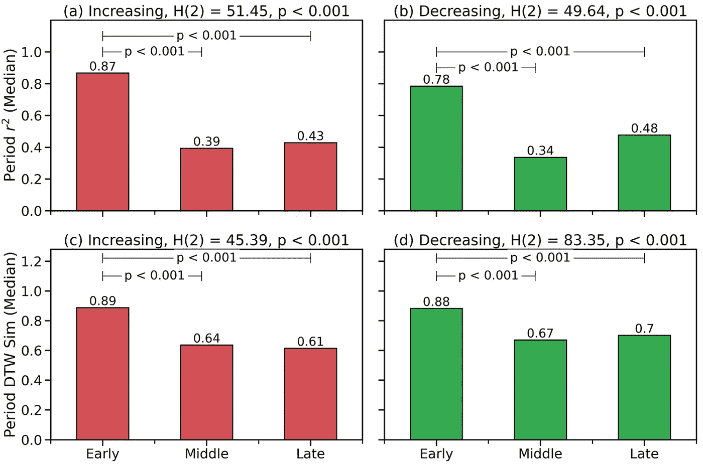

# 关于衰减锁定有效性

> 原文：<https://towardsdatascience.com/on-fading-lockdown-effectiveness-381b20886f9>

## SARS-COV2 疫情第一年公众遵守旅行限制的数据分析。

照片由 null xtract:[https://www . pexels . com/photo/person-looking-out-of-the-window-3047470/](https://www.pexels.com/photo/person-looking-out-the-window-3047470/)

从 2020 年 3 月到 2021 年 2 月底，疫情爆发 SARS-COV2 的第一年，世界大部分地区不时出现封锁和旅行限制，各国试图遏制 SARS-COV2 的传播，并管理其超负荷医疗系统的疾病负担。在这项分析中，我们研究了在疫情的第一个整年中，作为限制非必要旅行和遏制病毒传播的一种方式，这些限制是否仍然有效。我们通过分析 125 个国家的公众在疫情第一年的早期、中期和晚期以及疫苗广泛可用之前遵守限制的情况来做到这一点。

我们发现，与早期阶段的初始封锁相比，由于疫情中期和后期阶段的限制，遵守率有所下降，这主要是因为流动性水平的变化，而不是限制水平的变化。这表明，随着疫情的推进，限制在减少非必要旅行方面变得不那么有效，突出了限制作为长期缓解战略的局限性。

这项工作的完整报告已经通过同行评审，并由[《公共科学图书馆·综合》(Plos One)](https://journals.plos.org/plosone/article?id=10.1371/journal.pone.0269774)发表。以下是对该方法及其主要发现的总结。

他的研究结合了两个公开的数据来源:

1.  A [*限制数据集*](https://www.bsg.ox.ac.uk/research/research-projects/covid-19-government-response-tracker)*基于政府对疫情的反应分类(遏制、经济、健康和其他措施)；这个数据集现在也可以从[我们的世界数据](https://ourworldindata.org/policy-responses-covid)中获得，在[知识共享许可](https://creativecommons.org/licenses/by/4.0/)下。每项指标都在 0 到 100 之间进行了归一化，在这项工作中，我们使用了一个均值*旅行限制指数*，它来自一个子集的指标:学校和工作场所关闭，对集会和公共活动的限制，以及对公共交通和个人活动的限制。*
2.  *一个 [*移动数据集*](https://www.google.com/covid19/mobility/)*，由公开可用的谷歌移动数据组成，基于相对于疫情前水平的移动每日变化；这个数据集现在也可以在[知识共享许可](https://creativecommons.org/licenses/by/4.0/)下从[我们的世界数据](https://ourworldindata.org/covid-google-mobility-trends)中获得。我们根据零售和娱乐、公共交通以及与工作场所相关的流动性类别，计算了*非必要旅行*的平均*流动性下降*。**

**使用 7 天滚动平均值对每日限制和流动性数据进行平滑处理。生成的数据集包括从 2020 年 3 月 1 日到 2021 年 2 月 28 日的 125 个国家的限制和流动性数据。**

**为了衡量限制与出行之间的遵守程度，我们估计了每日限制与出行数据之间的关系强度，以衡量出行限制水平的变化对非必要出行的影响程度。为此，我们使用了两个坚持性评估:**

1.  ***决定系数(r 平方或 r2) —* 基于皮尔逊相关系数( *r* )，计算给定时间段内每个国家的每日限制和流动性下降之间的关系；考虑到预期或延迟的迁移率效应*，使用互相关技术计算 r2* 。换句话说，我们使用最大值 *r* 2，这是通过在限制改变之前/之后移动每天的移动数据找到的。**
2.  ***动态时间扭曲相似度* ( *DTW* ) —作为替代的遵守度估计，我们还使用*动态时间扭曲*计算了每日限制级别和相应的流动性下降之间的相似度。使用 DTW 是因为它提供了一种原则性的方法，通过非线性扭曲数据来确定两个时间序列之间的最佳匹配，作为另一种解决预期或延迟迁移效应的方法。**

**到评估人们在不同的限制期间是否以不同的方式调整了他们的流动性。我们使用限制数据来识别连续的*增加*和*减少*限制的期间。**

*   ***增加期*从限制开始增加的第一天开始，持续到限制开始减少，从而标志着新的减少期的开始。**
*   **减少期从限制开始减少的第一天开始，持续到限制再次增加的第一天。**

**例如，图 1 显示了爱尔兰从 2020 年 3 月到 2021 年 2 月，在增加(红色)和减少(绿色)限制的几个时期的限制和流动性数据。我们可以看到，与全球平均水平相比，爱尔兰的限制更多，流动性下降更大。**

****

****图一**。爱尔兰 2020 年 3 月至 2021 年 2 月(含**)的旅行相关限制(上图)和流动性数据(下图)。**平均全局限制和移动性下降以单独的线形图表示。图片作者。**

**图 2 显示了欧洲 34 个国家的相应数据，以说明在一个经济/地理区域内采用的不同方法。虽然各国经历了增加和减少限制的周期，但爱尔兰和英国实施的限制水平高于大多数国家(流动性下降幅度也更大)。其他人认为，在 2020 年夏季，限制的放松更加显著和持续，随后在秋季和冬季，限制又有所增加。一些国家(如克罗地亚、保加利亚、爱沙尼亚)选择在疫情的后半段实行比其他国家更大程度的限制。**

****

****图二**。欧洲 34 个国家的旅行相关限制和流动性数据，显示增加(红色)和减少(绿色)限制的时期**。**对于每个国家，上图显示限制水平，下图显示相应的流动性下降。每个国家名称还包括 2020 年 3 月至 2021 年 2 月底期间经历的限制( *μR* )和流动性下降(*微米*)的平均水平。图片作者。**

**由于我们对遵守情况如何随时间变化感兴趣，我们通过将疫情分为三个相等的四个月阶段来分析限制时间的影响:*早期*(2020 年 3 月-6 月)、*中期*(2020 年 7 月-10 月)和*晚期*(2020 年 11 月-2021 年 2 月)。不同国家在不同时期受到疫情的影响，这将反映在这些阶段国家一级限制的增加和减少。通过将疫情的第一个全年分为这三个阶段，我们可以合理地比较每个阶段的具体国家的遵守情况。**

**图 3 显示了在疫情的早期、中期和晚期，针对任何增加和减少限制期的两种遵守措施( *r2* 和 *DTW* )。无论采用何种衡量标准，我们都可以看到，与后期相比，疫情早期阶段的遵守率更高。对于增加的限制期(红色条)和减少的限制期(绿色条)都是如此。例如，最初(早期)的封锁与被测试国家的中值*R2*0.87 相关联——表明限制水平和流动性下降之间的关系非常强——但后来的封锁导致限制和流动性之间的关系较弱(中期和后期的 *r2* 值分别为 0.39 和 0.43)。**

****

****图三。**按疫情阶段比较上升期和下降期的遵守指标。图片作者。**

**这些图表还包含统计显著性数据，这些数据在《公共科学图书馆综合》的论文中有充分的解释；可以说，早期和晚期之间的依从性差异在统计学上是显著的。《公共科学图书馆·综合》的论文还显示，随着疫情的展开，即使我们考虑到在增加和减少期间施加和放松的限制水平的变化，这些遵守方面的差异也是显著的。**

**这项工作的主要发现是，在疫情的中后期，尤其是限制越来越多的时期，限制与流动性之间的关系强度减弱了。在疫情的早期阶段，即使考虑到所施加的限制程度，流动水平受到的抑制也比后期阶段要大，在疫情，人们对限制的反应也不那么可预测。**

**尽管这表明疫情的行为发生了变化，但它没有解释这种变化的根本原因，这种变化始于 2020 年夏天——在第一波封锁之后，但远在任何疫苗宣布之前，更不用说上市了——并持续到 2021 年 2 月底。**

**这些结果提供了一个重要的基础，告知新的问题，类似的限制和封锁是否应该或可以在这次疫情或未来的大流行中依赖。至少它们表明，最初被证明相当成功的限制措施很快就变得不那么有效了。此外，考虑到封锁和限制的高社会经济负担，这引发了对其未来实际效用的真正怀疑。**