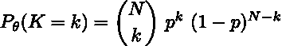
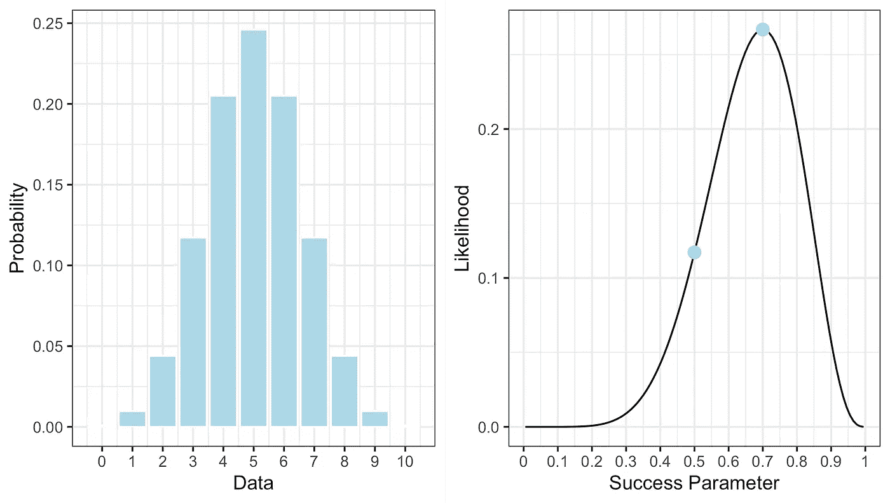
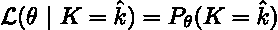

# 概率与可能性

> 原文：<https://towardsdatascience.com/on-probability-versus-likelihood-83386b81ad83>

## 对两个经常互换使用但在数学上截然不同的术语的讨论

奥地利国家图书馆在 [Unsplash](https://unsplash.com?utm_source=medium&utm_medium=referral) 上拍摄的照片

从机器学习和数据科学的角度来看，概率和可能性用于量化不确定性，或者说某个观察值属于某个类别的可能性有多大。他们在查看混淆矩阵时突然出现；事实上，像朴素贝叶斯分类这样的算法基本上是概率模型。现实是，数据科学家无法逃避这些概念。

然而，在日常语言中，我们倾向于互换使用概率和可能性这两个术语。事实上，听到诸如“今天下雨的可能性有多大？”这样的话并不少见。或者“这件事或那件事发生的可能性有多大？”我实话实说。最初对我来说，这并不是一个明显的区别，但是概率和可能性是*不同的* (尽管是相关的)概念。作为数据科学家，这种可互换性经常会渗透到我们的工作中，因此明确这两个术语之间的区别非常重要。因此，在这篇文章中，我想我应该尝试一下说明这两种观点之间的区别。

## 可能性

简而言之，概率和可能性之间的根本区别在于什么被允许*变化——让我来解释一下。*

你需要知道的是*可能性*——尽管具体来说，我实际上是在谈论*可能性函数*——实际上是从一个统计模型中得出的，并被认为是从该模型中生成数据的参数的函数。迷茫？不要担心——让我们更具体一点，考虑掷十次公平硬币。

我们知道这是一个由比率参数 *p* 控制的二项式过程，比率参数定义了在总共 *N 次*投掷中，掷出 *K 次*正面(或反面——这无关紧要)的预期概率。这里，观察头数 *K* 是一个随机变量，它响应于不同的 *p* 值而变化。对于任何固定的参数值(例如， *p* = 0.7)，观察到 *K* 头部的*概率*由概率质量函数(PMF)给出:

二项式 PMF。小写的希腊字母 theta 简单的指模型参数(图片由作者提供)。

在哪里

二项式系数(图片作者提供)。

现在，因为我说硬币是公平的，而且它被抛了十次，我们可以让 *p* = 0.5， *N* = 10。如果我们将这些值代入上面的等式——并让 *K* 变化——我们会得到类似于图 1 左侧面板的结果。基于此，我们可以看到, *K* = 5 是最有可能的结果，这应该是有道理的:如果硬币是公平的，我们扔 10 次，我们应该预期——从长远来看——我们通常会得到 5 个正面和 5 个反面。但是你也应该注意到，获得 4 或 6 个头也不是不常见的。

因此，PMF 告诉我们的是，给定一组固定的模型参数，随机过程的特定实现*有多可能。在这种情况下，我们假设模型参数*是固定的*，并且数据可以自由地*变化*。这里的要点是，如果模型参数是已知的，那么我们要问的是关于可能观察到的数据类型的问题。*

**图 1: A)** 二项式模型的概率质量函数； **B)** 二项似然函数。点表示不同参数值的可能性(图片由作者提供)。

## 可能性

好吧，那么如果我告诉你我已经抛了十次硬币，得到了 7 个正面呢？我的问题是我扔的硬币是否公平。

值得注意的是，在这种情况下， *K* 不再是随机的——我们有一个*观察到的*二项式过程的实现，这意味着它现在是一个固定值。给定该信息，二项式模型的似然函数可以写成:

二项式模型的似然函数。

在这里，我使用“帽子”符号来表明 *K* 是从十次投掷中观察到的头数。现在，这看起来就像我在说，可能性函数和 PMF 是一样的——嗯，我有点像是在说。但是，不同之处在于，现在*数据是固定的*，而模型参数 *p* 可以自由变化。

可能性函数给我们的是一个*测量值*,表示已知 *K* 等于某个观察值时 *p* 的任何特定值出现的可能性。就像上面一样，如果我们将 *K* = 7 代入上面的等式——让 *p* 取所有可能的值——我们会得到类似于上图右侧面板的结果。注意，这里的似然函数是不对称的；相反，它的峰值超过了 p = 0.7。具体来说，该分布的*模式*(即峰值本身)与所谓的*最大似然估计* (MLE)相一致。那是什么？嗯，这是最有可能给定观测数据的 *p* 的值——这个名字有点泄露了它，真的。我将在另一篇文章中更多地讨论 MLE，但是现在，你需要知道的是 MLE 的似然函数值大约是 0.27。

好了，在继续之前，需要注意的是:我知道可能性函数看起来像分布函数，但它是**而不是**合适的概率密度函数(即，它通常不会积分为 1)。更重要的是，可能性函数是**而不是***p*等于特定值的概率(为此你需要计算后验分布。我会在另一篇文章中谈到这一点)。

好吧，继续。

## 统计论据

还记得我说过似然函数被解释为一种度量吗？确切地说，它可以用来量化统计证据。我还说过，关于最大似然估计，你需要知道的就是它的似然值大约是 0.27。但是这告诉我们什么呢？说可能性大约是 0.27 是什么意思？它当然没有告诉我们我使用的硬币是否公平——那么从这里开始呢？

我需要介绍一些东西:

*   **似然原理**指出，对于给定的统计模型，所有与模型参数相关的证据都存在于采样(观察)数据本身中。
*   **似然定律**指出，证据支持一个参数值超过另一个参数值的程度取决于它们各自似然性的比率。

把这些想法放在一起意味着孤立地看待一个单一的可能性告诉我们的很少。是的，它提供了一定程度的证据，但相对于什么呢？上面的定义告诉我们，与其他可能性相比，可能性更有用。这就是为什么我们通常更喜欢相对度量，如*似然比*。

记住这一点，回想一下我问你的问题是，根据你掌握的数据，我扔的硬币是否公平。为了正确解决这个问题，我们还需要观察数据的可能性，如果 *p* = 0.5，大约是 0.12。注意，这两点都在图 1 中的似然函数上标出。给定这两条信息，我们现在可以计算似然比:

在给定观察数据的情况下，似然比比较不同参数值的相对证据(图片由作者提供)。

这给了我们什么？大约 0.44。你需要一些背景知识。

在这个例子中，似然比量化了数据支持断言 *p* = 0.5(公平硬币)的程度。如果这个比例是 1，无论哪种方式都没有证据。如果比率大于 1，那么证据有利于分子(这里， *p* = 0.5)。但是，如果比值小于 1，那么证据支持分母(这里， *p* = 0.7)。看来我们有证据反对公平硬币假说。事实上，如果我们取倒数(即 1 / .44 ),我们会看到 *p* = 0.7 比 *p* = 0.5 的可能性大约高 2.3 倍(请记住，这是仅与一个选项进行的比较，除了 *p* = 0.7，还有其他可能性)。

在现实中，这是一个微不足道的结果，而似然原理和似然定律意味着使似然函数最大化的参数值就是数据最支持的值。接下来的问题是，这是否足以令人信服地证明我抛的硬币是不公平的。那是改天的话题。

## 包扎

我希望这篇文章明确了概率和可能性的区别。概括一下:*概率*通常是当我们有一个带有固定参数集的模型，并且我们对可能生成的数据类型感兴趣时，我们会考虑的东西。相反，*可能性*在我们已经观察到数据并且我们想要检查某些模型参数的可能性时发挥作用。特别是，我们可以使用似然比来量化支持一个值胜过另一个值的证据。

感谢阅读，欢迎在下面给我留言。

如果你喜欢这篇文章，并且想保持更新，那么请考虑在 Medium 上关注我。这将确保你不会错过新的内容。如果你更喜欢的话，你也可以在 LinkedIn 和 Twitter 上关注我😉