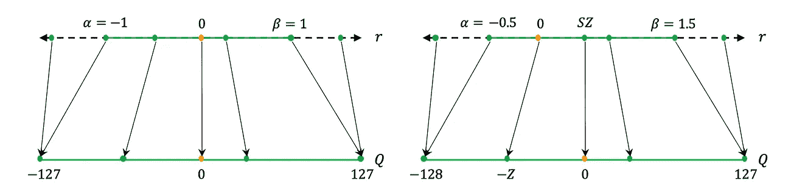
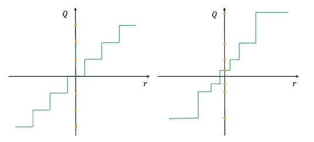
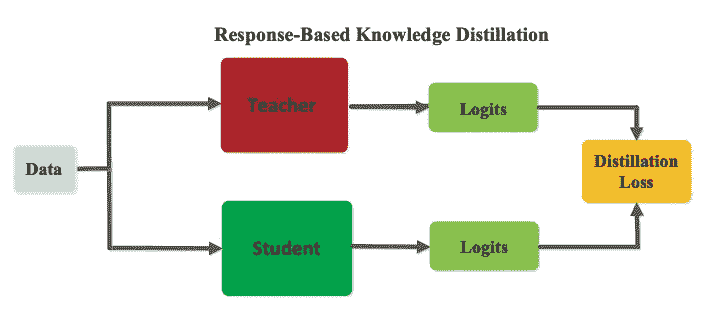
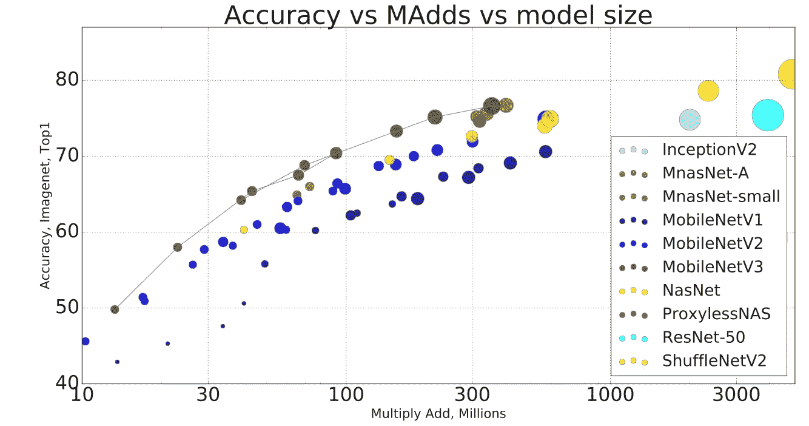

# 在边缘——在移动设备上部署深度学习应用

> 原文：<https://towardsdatascience.com/on-the-edge-deploying-deep-applications-on-constrained-devices-f2dac997dd4d>

## 在受限设备上实现深度神经网络的效率-精度折衷的技术

图片由作者提供。

如此多的人工智能进步登上头条:“人工智能正在围棋上击败人类！”；“深度天气预报”；“会说话的蒙娜丽莎画”…然而我并不感到太兴奋…尽管前景诱人，这些结果是用模型实现的，这些模型是概念的可靠证明，但离现实世界的应用仍然太远。原因很简单——它们的大小。

数据集越大，模型越大，结果越好。但是，从它们消耗的物理资源(如内存和电源)和推理时间来看，这些都是不可持续的，与许多应用程序所需的实时性能相差甚远。

现实生活中的问题需要可以在受限设备上运行的较小模型。随着更广泛的安全和隐私问题，越来越多的人赞成在设备上安装模型，消除向服务器的任何数据传输。

下面我将介绍一些技术，这些技术使得模型对于受限设备(比如手机)变得可行。为了实现这一点，我们降低了模型的空间复杂度和推理时间，并组织数据流以节省计算。在文章的最后，我还介绍了一些实际的考虑因素，比如移动处理器的类型和有助于为移动设备准备模型的框架。

虽然矩阵运算的一般计算速度有很大的提高，但本文将重点关注可以直接应用于深度学习应用的技术。

# 降低模型空间复杂度

深度学习模型需要内存和计算资源，这些资源在移动设备上通常很稀缺。解决该问题的一个直接方法是降低深度学习模型的空间复杂度(参数数量),以占用更少的空间和计算量，同时保持相同的精度。

空间复杂度降低可以分为五种方法:

*   减少模型参数的数量(例如修剪和共享)；
*   通过量化减少模型规模；
*   知识升华；
*   较小模型的直接设计；
*   输入数据转换。

## 修剪

剪枝的基本思想是选择和删除一些对模型精度影响不大的琐碎参数，然后重新训练模型，恢复模型性能。我们可以删减单个权重、层或层块:

*   **非结构** **修剪**移除任何地方出现的小显著神经元。执行积极的修剪相对容易，在对模型的泛化性能影响最小的情况下移除大多数神经网络参数。然而，被修剪的神经元的数量并没有直接转化为内存和计算的节省。这种方法导致稀疏矩阵运算，这是众所周知的难以加速。
*   **结构** **剪枝**利用模型在不同尺度下的结构稀疏性，包括滤波器稀疏性、核稀疏性、特征映射稀疏性。移除一组参数(例如，整个卷积滤波器)，从而允许密集矩阵运算。然而，在不损失准确性的情况下实现更高级别的结构修剪是具有挑战性的。

修剪是迭代的。在每次迭代中，该方法修剪相对不重要的滤波器，并重新训练修剪后的模型，以补偿精确度的损失。当修剪后的模型未能达到所需的最小精度时，迭代结束。

欲了解更多详情，请查看本文。

## 参数共享

我们可以将它们组合起来，而不是丢弃模型的某些部分。当边权重基本相似时，我们可以在几条边上共享它们。

例如，对于两个各有 N 个节点的全连接层，我们需要存储 N 个权重。然而，如果权重基本上相似，我们可以将它们聚类在一起，并为同一聚类的边分配相同的权重，然后我们将只需要存储聚类质心。

## 网络量化

对称/非对称/均匀/非均匀量化映射的例子。图片由 [A .戈拉米](https://arxiv.org/pdf/2103.13630.pdf)提供。

神经网络中使用的默认类型是 32 位浮点数。如此高的分辨率允许在训练阶段进行精确的梯度传播。但是，在推理过程中，这往往是不必要的。

网络量化的关键思想是减少每个权重参数的位数。例如从 32 位浮点到 16 位浮点、16 位定点、8 位定点等。

量化方面的许多研究都集中在从一个较大范围的数字映射到一个小得多的数字的舍入技术上——均匀/非均匀、对称/非对称量化。

谈到培训，有两种主要方法来实现量化:

*   **训练后量化**可能是应用量化最直接的方式——模型权重被映射到较低的精度，之后无需额外的微调。然而，这种方法必然会降低模型的精度。
*   **量化感知训练:**需要重新训练应用了量化的模型，以匹配原始模型的准确性。量化网络通常在与原始模型相同的数据集上重新训练。为了便于梯度传播，梯度没有被量化。

应用现成的量化并不简单，因为不同的网络部分可能需要不同的精度。因此，通常在中间插入量化/去量化块，以允许转换。

更多细节请查看[最近的调查](https://arxiv.org/pdf/2103.13630.pdf)，我也喜欢[这篇关于网络量化的文章](/how-to-accelerate-and-compress-neural-networks-with-quantization-edfbbabb6af7)。

## 知识的升华。

图片由 [J. Gou](https://arxiv.org/pdf/2006.05525.pdf) 提供。

在深度模型的学习权重中的显著冗余的假设下操作，我们可以通过训练较小的模型(学生)来模拟教师输出的分布，从而提取大模型(教师)的知识。

模型提取的关键思想是依赖于由更大的模型提取的知识，例如各种类的相对概率大小，而不仅仅是训练数据集中给出的“硬”标签。

例如，考虑一个对猫、狗和汽车进行分类的网络。凭直觉，当一张新的猫的图像出现时，我们会期望模型给猫分配最高分，然后给狗分配较低的概率，给汽车分配最低的概率，因为猫和狗比猫和汽车更容易被混淆。这些相对概率值携带了关于模型训练所依据的数据的大量信息，并且不一定存在于硬标签中。

通过网络量化和修剪，有可能在压缩率达到 4 倍的情况下保持精确度。在不降低准确性的情况下，通过知识提取获得相似的压缩率是一项挑战；但是，所有方法都可以结合使用。

欲了解更多详情，请查看本文。

## 小型模型的直接设计。

图片由 [A .霍华德](https://openaccess.thecvf.com/content_ICCV_2019/papers/Howard_Searching_for_MobileNetV3_ICCV_2019_paper.pdf)提供。

在深度学习算法的早期繁荣时期，许多工作都集中在建立更大的模型，以达到最先进的准确性。这种趋势后来被一系列研究效率-精度权衡的论文取代，直接设计更小的模型。

地区重点论文有: [MobileNetV1](https://arxiv.org/pdf/1704.04861.pdf) ， [MobileNetV2](https://arxiv.org/pdf/1801.04381.pdf) ， [MnasNet](https://arxiv.org/pdf/1807.11626.pdf) ， [MobileNetV3](https://openaccess.thecvf.com/content_ICCV_2019/papers/Howard_Searching_for_MobileNetV3_ICCV_2019_paper.pdf) 。

有一些值得注意的架构变化的例子，它们是当前所有深度学习库的一部分。这些通常基于低阶因式分解，例如深度可分卷积，有一篇很棒的[文章](/a-basic-introduction-to-separable-convolutions-b99ec3102728)解释了其来龙去脉。

由于用于设计小而精确的模型的搜索空间是巨大的，所以最近的趋势不太集中在手工制作的模型的设计上，而是集中在采用强化学习的神经架构搜索上。例如，该策略应用于 [MobileNetV3](https://openaccess.thecvf.com/content_ICCV_2019/papers/Howard_Searching_for_MobileNetV3_ICCV_2019_paper.pdf) 或 [MNASNet](https://arxiv.org/pdf/1807.11626.pdf) 中。

关于神经架构搜索检查的更多细节。

## 数据转换。

我们可以降低输入数据的维度，而不是通过查看模型的结构来加速计算。一个例子是将图像分解成两个低分辨率子图像，其中一个携带高频信息，另一个包含低频信息。结合起来，它们将携带与原始图像相同的信息，但维度更低——这意味着处理输入的模型更小。

更多详情请查看本文。

# 中间结果的重用

为来自相同输入的整个机器学习管道的各个部分或相似输入的特征使用某些骨干模型以避免冗余计算并不罕见。

## 多任务间的数据重用

对于具有相同输入的不同但相关的任务，并行运行几个模型并不罕见。这个想法是在多个模型中重用浅层的特性，同时在特定的任务上训练更深层的特性。

## 图像帧间的数据重用

虽然输入数据可能不完全相同，但在与后续输入(如连续视觉模型)相关时，它可能足够相似，可以部分重复使用。

欲了解更多详情，请查看本文。

# 五金器具

在对模型进行提炼、修剪和压缩之后，我们终于准备好在移动设备上部署了！然而，有一个警告-最有可能的是，开箱即用的解决方案要么非常慢，要么无法工作…这通常是因为一些操作要么没有优化，要么在移动处理器上不受支持。

值得记住的是，当前的移动设备有几个处理器。深度学习应用程序可能会在 GPU 或 NPU(专门为深度学习应用程序优化的神经处理单元)上运行。在部署深度学习应用程序时，每种方法都有自己的优缺点。

尽管有专门的目的，但在当前的 NPU 中，效率的提高可能会被进出处理器的数据传输瓶颈所抵消，这对实时应用程序来说可能是个问题。

## 移动设备上的深度学习框架

传统的深度学习库如 [PyTorch](https://pytorch.org) 和 [Tensorflow](https://www.tensorflow.org) 并不是特别适合移动应用。这些都很重，并且依赖于第三方依赖，这使得它们很笨重。这两个框架都面向在强大的 GPU 上进行有效的训练，而部署在移动设备上的模型将受益于高度移动优化的推理工具包，而这两个框架都缺乏。

幸运的是，有专门为移动深度学习设计的框架: [TensorFlow Lite](https://www.tensorflow.org/lite) 和 [PytorchLite](https://pytorch.org/mobile/home/) 。

为移动开发深度学习应用的挑战之一是每个移动生产商的可变标准；有些人会在 Tensorflow 中运行他们的模型，有些人会在 Pytorch 中运行，有些人会有自己的框架。为了便于转换，我们可以使用一个[开放神经网络交换](https://onnx.ai)框架，帮助从一个库转换到另一个库。

最后，您可以使用 [OpenVINO](https://docs.openvino.ai/latest/index.html) ，这有助于通过关注部署硬件来优化云和边缘设备上的深度学习应用程序。

关于每款常用手机的开发(包括允许的操作)的更多细节，请查看它们的 API 文档:[华为](https://developer.huawei.com/consumer/en/hms/huawei-mlkit/)，[苹果](https://developer.apple.com/machine-learning/)，[三星](https://developer.samsung.com/neural/overview.html)。这些还包含一些特殊的技巧，可以使模型在特定的设备上更加有效。

# 摘要

深度模型需要计算和内存资源，而这些资源在受限设备上通常是不可用的。为了解决这个限制，几个研究分支集中在减少模型大小和加速其计算。

在部署到移动设备之前，典型模型将被设计为消耗尽可能少的资源，或者将通过蒸馏进行压缩；在最终部署到设备上之前，它将经历量化。如需进一步阅读，请查看关于在移动设备上部署深度学习的[调查](https://www.sciencedirect.com/science/article/pii/S2352864821000298)。

如果你喜欢这篇文章，请与朋友分享！要阅读更多关于机器学习和图像处理的主题，请点击订阅！

我错过了什么吗？不要犹豫，直接给我留言、评论或发消息吧！