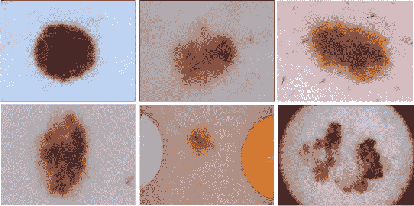
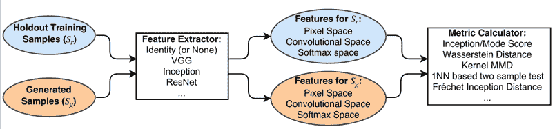
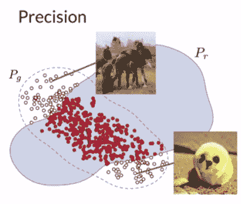
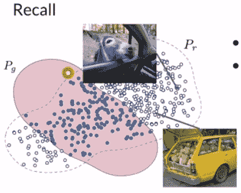
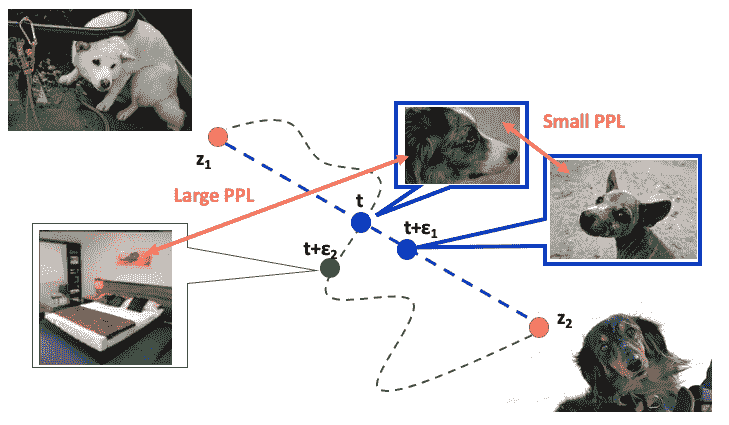
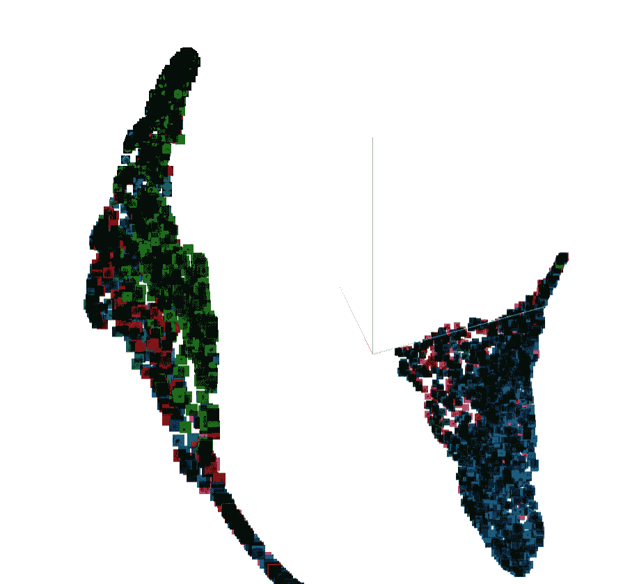
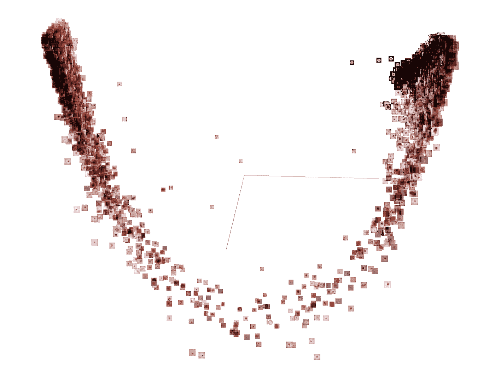

# 生成性对抗网络的评价

> 原文：<https://towardsdatascience.com/on-the-evaluation-of-generative-adversarial-networks-b056ddcdfd3a>

## 医疗保健中的人工智能第三部分

**作者** <https://sylwia-majchrowska.medium.com/>[**桑德拉·卡拉斯科**](https://medium.com/@sandra.carrasco) **和** [**西尔维亚·马奇罗斯卡**](https://sylwia-majchrowska.medium.com/) **。**

图一。来自 ISIC 2016 数据集的恶性和良性黑色素瘤示例[1]。观察到的痣可以有不同的大小和颜色。图片来自 [ISIC 挑战数据集](https://challenge.isic-archive.com/data/)。

在深度学习模型的开发中使用医疗保健数据与个人数据和监管问题相关的挑战相关联。患者数据不能自由共享，因此在创建人工智能解决方案方面的用处有限。在我们之前的[帖子](https://medium.com/towards-data-science/artificial-intelligence-in-healthcare-is-synthetic-data-the-future-for-improving-medical-diagnosis-a74076ea3d7b)中，我们讨论了合成数据在医疗保健中的潜力。我们描述了对开源国际皮肤成像协作(ISIC)档案[1]的研究，这是皮肤病变的皮肤镜图像的最大(且高度不平衡)数据集之一。我们在有条件的设置中选择了 StyleGAN2-ADA 架构，以从黑色素瘤和非黑色素瘤中生成图像。今天，我们将向您介绍 GAN 生成的合成数据的评估主题。

# 甘的评价

没有[目标损失函数](https://machinelearningmastery.com/loss-and-loss-functions-for-training-deep-learning-neural-networks/)用于训练 GAN 的发生器，因此，无法仅从损失客观评估训练的进度和模型的相对或绝对质量。相反，已经开发了一套定性和定量技术来基于生成的合成图像的质量和多样性来评估 GAN 模型的性能。如需全面调查，请参见文章 [*甘评价措施的利弊*](https://arxiv.org/abs/1802.03446)【2】。

**定性**

由于在训练生成模型时没有使用客观损失函数，因此必须使用生成的合成图像的质量来评估这些模型。评估您的 GAN 的最基本和最有用的方法之一是通过手工检查和判断从不同的迭代步骤中生成的例子。

然而，这有许多限制:

*   它是主观的，包含了评论者的偏见。
*   它需要领域知识来区分什么是现实的，什么不是。在我们的具体案例中，依靠皮肤科医生的帮助是非常重要的，他们可以评估假样本。
*   它在可检查的图像数量方面受到限制。

对于如何准确地定性检查生成的图像，还没有明确的最佳实践，因为每个案例之间可能会有很大差异。因此，我们不会在本帖中详细探讨这个话题。

## **定量**

在本节中，我们将检查一些通常用于在培训期间评估创成式模型的指标。这些可以与定性评估相结合，以提供对 GAN 模型的稳健评估。

在衡量 GAN 的性能时，我们需要评估两个主要属性:

*   **保真度:**生成样本的质量。测量图像的逼真程度。你可以把它想象成每一个假样本与其最接近的真样本有多么不同。
*   **多样性:**生成样本的多样性。衡量生成的图像覆盖真实分布的整体多样性或多样性的程度。

图二。基于 GAN 评估方法的典型样本图像[3]。

通过捕捉保真度和多样性，您可以很好地了解您的生成器生成假图像的效果。然而，为了评估我们的生成模型，我们需要评估另一个维度。

*   **真实性/可推广性:**它衡量模型发明新样本的速度，并试图发现与真实数据的过度拟合。Alaa 等人[5]将其定义为生成的样本中比其他训练数据点更接近训练数据集的部分。

最后，合成数据在用于同样的预测目的时，应该和真实数据一样对后续任务有用。

*   **预测性能:**我们对合成数据进行训练，对真实数据进行测试。这评估了合成数据覆盖真实数据分布的程度。我们还可以用合成数据训练和测试模型。这将使我们能够评估合成数据是否保持了预测模型在真实数据上的排名。

我们现在将更详细地讨论引入的定量方法。

# 通常计算的指标

评估 GAN 性能最常用的指标是弗雷歇初始距离(FID)和内核初始距离(KID) **。**他们评估**保真度**(图像质量)和**多样性**(图像种类)**。**

**弗雷歇初始距离(FID)**

为了比较真假图像，可以使用分类器作为特征提取器。最常用的特征提取器是 Inception-v3 分类器，它是在 ImageNet 上预先训练的。截断输出层，得到真假图像的嵌入量，提取特征距离。这些嵌入是两个多元正态分布，可以使用多元正态弗雷歇距离或 Wasserstein-2 距离进行比较。然而，FID 评分有一些缺点。首先，它使用了一个预先训练好的初始模型，这个模型可能不能捕获所有的特征。其次，需要大样本量。最后，它运行缓慢，并且使用有限的统计数据(只有均值和协方差)。

**内核初始距离(KID)**

KID 已被提议作为 FID 的替代。FID 没有无偏估计量，这导致较小数据集的期望值较高。KID 适用于较小的数据集，因为它的期望值不依赖于样本数。它的计算量更小，数值稳定性更好，实现起来也更简单。

**盗梦空间评分**

类似于 FID 和 KID，该分数测量图像的多样性和保真度。它越高，生成的图像就越真实和多样

通过首先使用预训练的 inception v3 模型来预测每个生成的图像的类概率，来计算 Inception 分数。这些是条件概率，例如以生成的图像为条件的类别标签。被强有力地分类为一类而不是所有其他类的图像指示高质量。因此，如果图像包含现实事物，条件概率遵循窄分布(低熵)。

其次，我们使用边际概率。这是所有生成图像的标签概率分布。因此，它告诉我们在我们生成的图像中有多少变化。因此，我们希望边际概率分布的积分具有高熵，即我们的生成器尽可能多地合成不同的类别。

这些元素通过计算条件概率分布和边际概率分布之间的 [Kullback-Leibler 散度](https://en.wikipedia.org/wiki/Kullback%E2%80%93Leibler_divergence)，或 KL 散度(相对熵)来组合。如果它很高，我们的分布是不相似的，即每个图像都有一个清晰的标签，并且所有图像都是不同的。

这个分数有几个限制。首先，它只查看假图像，而不与真图像进行比较。与 FID 一样，它受到初始分类器可以检测的内容的限制，这与训练数据直接相关。一般来说，它试图捕捉保真度和多样性，但它的表现不如 FID。如果你想知道更多，可以去看看大卫·麦克关于《盗梦空间》分数的简单解释的精彩文章。

**精确和召回**

对于分类和检测任务，另一种类型的度量标准是**精度**和**召回**。我们可以将它们定义为:

*   **精度**与**保真度**相关。它根据生成器生成的非真实图像的数量来查看真实数据和虚假数据之间的重叠(非重叠红色)。
*   **召回**涉及**多样性**。它在生成器无法建模的所有实数上查看实数和伪像之间的重叠(非重叠蓝色)。

图 3。真实图像分布 Pr(蓝色)和生成图像分布 Pg(红色)的精确召回图示。图片由[4]提供。

精确召回的问题是，它可以有完美的精确分数，但生成性分布很差，因为它只在实际分布中生成离群值。此外，我们不能检测模式崩溃或模式发明。

**感知路径长度**

评估生成网络的另一个重要度量是感知路径长度(PPL)。这是一种**特征解开的方法，**一种**规则化**的方法，鼓励在从潜在代码到图像的映射中进行良好的调节。在我们进一步讨论 PPL 之前，让我们讨论一下潜在空间。

在 StyleGAN 中，我们发现了两个潜在空间，z 空间和 w 空间。首先，Z 空间是来自高斯分布的 Z 向量所在的位置。在标准 GAN 中，z 向量被直接馈入发生器以生成假图像。然而，在 styleGAN 中，这个向量通过映射网络来产生 w 向量或样式向量。W 空间不遵循任何特定的分布，但是它在训练期间被学习，以便它可以更好地模拟真实数据的底层分布。w 向量然后被馈送到各层的合成网络中，用于最终生成。Z 和 W 空间都是 512 维的。潜在空间 W 是控制图像属性的关键，因为它是不纠缠的，这意味着 512 个维度中的每一个都编码了关于图像的独特信息。

PPL 的目的是建立从潜在空间到图像空间的映射是条件良好的。这是通过鼓励潜在 W 空间中的固定大小的步长导致图像中非零的、固定幅度的变化来实现的。我们可以通过步入图像空间中的随机方向并观察相应的 w 梯度来凭经验测量与这一理想值的偏差。不管 w 或图像空间方向如何，这些梯度应该具有接近相等的长度。

这导致了更加可靠和一致的行为模型，使得架构探索更加容易。还观察到，更平滑的发电机更容易反转。

图 4。图解 PPL。图片由[4]提供。

# 投射到潜在空间

为了进一步探索和理解我们的生成网络，我们可以将真实的图像投射到潜在空间。这基本上意味着您想要获得 w 潜在代码(512 个数字),这将导致生成器生成看起来像我们的图像的输出。

使用 GANs，我们无法直接从输入图像中提取潜在代码，但我们可以通过以下方式进行优化:

*   从起始潜在向量生成输出。
*   将目标图像和生成的图像提供给充当特征提取器的 VGG16 模型。
*   从两幅图像中提取特征，计算它们之间差异的损失，并进行反向传播。

我们从训练数据集中投影一半的图像有两个原因:

*   发现数据泄漏，即评估过度拟合。
*   为了在 3D 空间中可视化投影的潜在代码并研究其分布，尝试找到聚类并研究边缘情况。

图 5。使用 [UMAP](https://umap-learn.readthedocs.io/en/latest/) 可视化两个不同真实数据集(绿色、红色代表黑色素瘤和蓝色良性痣)和合成数据集(浅蓝色代表黑色素瘤和粉红色良性痣)的 W 空间。这两个集群对应于两个不同的类别:黑色素瘤和非黑色素瘤。作者图片。

# 评估真实性和过度拟合

我们如何评估模型的泛化能力或真实性？换句话说，我们如何确保我们的模型不是简单地复制它被训练的数据？这是确保真正的**生成型**模型的一个基本概念。

然而，这在该领域是一个公开的问题[5，6]。我们尝试了一种简单的方法。为了测量真实性并确保我们的生成模型没有复制真实数据，我们进行了以下实验。

首先，我们将来自真实数据集的 12，000 个样本投影到生成器的潜在空间中。这给了我们潜在的代码，使我们的生成器合成出与输入图像最相似的输出。为了优化给定输入图像的潜在代码，我们使用 VGG16 模型作为特征提取器，并计算目标图像和生成输出的提取特征的差异的损失，并执行反向传播。

图 6。实像及其投影样本的嵌入投影。这两个集群对应于两个不同的类。作者图片。

接下来，我们使用在真实和合成数据上训练的分类器的最后卷积层来提取真实图像和它们的投影图像的特征。这些嵌入使用 t 分布随机邻居嵌入(t-SNE)在 3D 空间中可视化。

这允许使用余弦距离在视觉上探索每个真实图像的最近的近邻，并且以这种方式检查真实图像和它们相应的生成图像有多接近。

我们将此视为对生成样本的**真实性**的测量。我们发现一些图像(这证明了它们的真实性)离它们的投影非常远，但仍然与目标图像相似(这证明了它们的保真度)。

# 解决后续任务

生成人工数据本身并不是目的，事实上它是为另一个工具创建*工具的过程。预测性能，或解决后续任务，可以评估我们的合成数据的有效性。在我们的研究中，我们使用了痣的合成图像来平衡 ISIC 数据集，这意味着添加了几千个黑色素瘤的合成图像。正如我们之前提到的，当用于相同的预测目的时，合成数据应该和真实数据一样有用。对于我们的二元分类任务，我们在几个场景中使用了人工数据:*

*   通过仅添加合成黑色素瘤样本并对真实验证子集进行测试来平衡真实训练子集，
*   通过添加属于两个类别的合成图像并对真实验证子集进行测试来平衡真实训练子集，
*   使用大量的合成训练子集(每个类别具有相同数量的数据)并在真实的验证子集上进行测试。

在平衡的训练子集中混合黑色素瘤的真实和合成图像获得了最好的结果。计算的精度非常接近仅在真实样本中实现的精度，这可以证明人工数据的适用性。

不管合成数据有多有用，我们发现在真实数据中发现的所有人工制品，如黑框或医用尺，也会在人工数据中反映出来。但这是另一个故事的素材…

为了重现所描述的研究，我们鼓励您查看我们的 github 资源库，并在提供的自述文件中阅读更多关于我们研究的内容。

<https://github.com/aidotse/stylegan2-ada-pytorch>  

在另一篇[文章](https://medium.com/p/157301b51c0f)中，我们展示了如何使用 SIIM-ISIC 2020 数据集和 StyleGAN2 为皮肤损伤的合成图像生成准备数据。

# 文学

1.  [国际标准工业分类档案](https://www.isic-archive.com/#!/topWithHeader/wideContentTop/main)
2.  [甘评价措施的利弊](https://arxiv.org/abs/1802.03446)
3.  [生成性对抗网络评价指标的实证研究](https://arxiv.org/abs/1806.07755)
4.  [生成性对抗网络(GANs)专业化](https://www.coursera.org/specializations/generative-adversarial-networks-gans)
5.  [您的合成数据有多可信？评估和审计生成模型的样本级指标](https://arxiv.org/abs/2102.08921)
6.  [检测生成模式下数据复制的非参数测试](https://arxiv.org/abs/2004.05675)