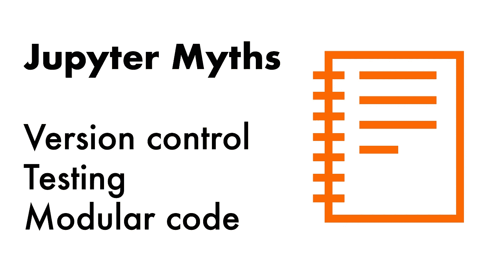
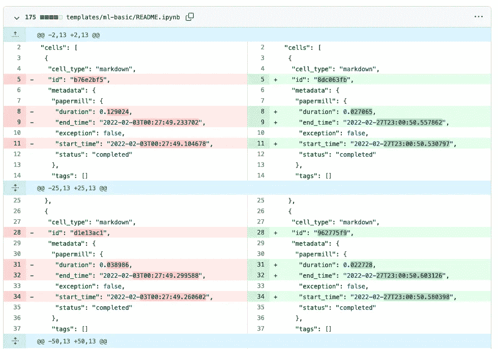
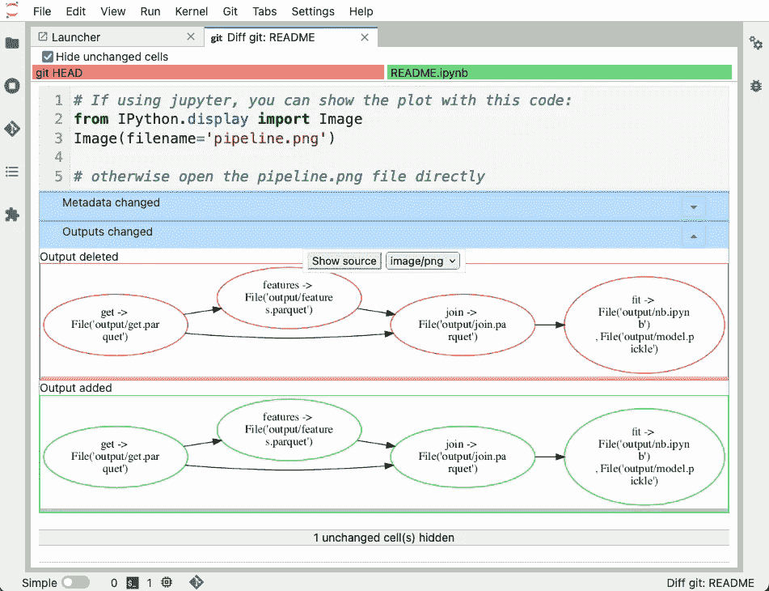
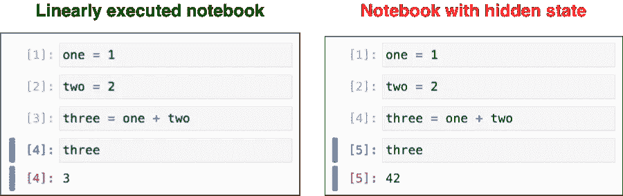
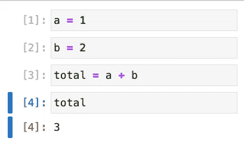

# 朱庇特笔记本的神话和问题

> 原文：<https://towardsdatascience.com/on-the-myths-and-problems-of-jupyter-notebooks-81517a4696ef>

## 数据科学软件工程

## 您可以使用当前工具对笔记本进行版本控制、测试和模块化。让我们讨论真正的问题。

图片作者。

**Jupyter 笔记本，你爱它们，或者你讨厌它们。**Jupyter 笔记本的使用(和误用)是数据社区中最具争议的话题之一。当然，有正当的理由避免使用笔记本，但是我希望谈话集中在真正的问题上，而不是一遍又一遍地讨论已经解决的问题。在这篇博文中，我讨论了笔记本电脑最常见的误区，并评论了尚未解决的关键问题。

# "您不能对笔记本进行版本控制"

通常，笔记本是`.ipynb`文件。在幕后，`.ipynb`文件是具有预定义模式的 JSON 文件，它们将代码和输出保存在同一个文件中。独立笔记本很方便:你可以在笔记本上工作，保存它，明天再来，结果就在那里了。需要注意的是，用 git 管理它们很有挑战性。首先，`.ipynb`文件会增大 git 存储库的大小，其次，`git diff`(和 GitHub Pull 请求)不会起作用。GitHub 上笔记本的 diff 视图是这样的:

GitHub 不喜欢。ipynb 文件。图片作者。

幸运的是，我们可以轻松解决这个问题。有一个官方的 JupyerLab 扩展，将 git 集成到 Jupyter 接口中，允许你(除了别的以外)区分笔记本。它看起来是这样的:

您可以使用 jupyterlab-git 扩展来执行笔记本代码审查。图片作者。

你可以看到它清楚地显示了区别，git 上的当前版本有红色边框的图形，而新版本有绿色边框。

另一个选择是使用 [nbdime](https://github.com/jupyter/nbdime) ，它允许您从终端执行同样的操作(事实上，JupyterLab 扩展使用了幕后的`nbdime`)。

第三种选择(也是我最喜欢的！)是 [Jupytext](https://github.com/mwouts/jupytext) 。该软件包允许您将`.py`文件作为笔记本打开。这样，您可以交互地编辑您的代码，但是一旦您保存了它，它将存储一个`.py`文件。

当使用 Jupytext 时，您可以使用`git diff`和 pull 请求，因为您的笔记本是简单的脚本。主要的警告是，一旦关闭文件，输出就会丢失，但是可以使用 Jupytext 的配对函数，该函数将结果存储在一个单独的`.ipynb`文件中，有效地存储源代码并输出两个不同的文件。

# “您不能测试笔记本”

这个有几个角度。如果我们考虑将笔记本作为一个整体来测试，我们可以使用 [papermill](https://github.com/nteract/papermill) 来有计划地执行它们并评估它们的结果。例如，您可以用`papermill`编写一个测试用例，如下所示:

一个更简单的替代方法是运行冒烟测试(即检查笔记本是否运行，但跳过输出检查)。您可以编写这样的脚本在您的 [CI](https://en.wikipedia.org/wiki/Continuous_integration) 系统中执行(例如 GitHub 操作):

最后，您可能对笔记本的单元测试部分感兴趣(例如，笔记本内部定义的功能)。我建议在笔记本外部定义函数，然后导入到笔记本中。这样，您可以像对任何其他函数一样对这些函数进行单元测试。但是，如果你想在`.ipynb`文件中编写函数，你可以使用 [testbook](https://github.com/nteract/testbook) 。

Testbook 允许你从一个`.ipynb`文件中提取定义并测试它们:

# “您不能模块化笔记本”

另一个批评是你不能模块化笔记本。然而，这对于 [Ploomber](https://github.com/ploomber/ploomber) 来说很简单。假设您有三个笔记本(`load.ipynb`、`clean.ipynb`和`plot.ipynb`)，您可以创建一个管道来按如下顺序执行它们:

然后，您可以使用以下命令运行它们:

Ploomber 将按顺序执行笔记本，并为每个笔记本制作一份副本，因此您可以记录这次运行的输出。

试试吧！

模块化的笔记本打开了许多可能性:它们更容易协作、测试，并且计算效率高(你可以并行运行独立的笔记本！).所以，**我们非常鼓励你写流水线，而不是大块头的笔记本。**

# 那么，真正的问题是什么？

## 隐藏状态

笔记本的隐藏状态阻碍了再现性。图片作者。

给定一个笔记本，我们说它有一个隐藏状态，当它线性地返回不同于存储的输出时。例如，左边的笔记本没有隐藏状态，因为如果您重新启动内核并按顺序运行所有单元，您将得到相同的结果(数字`3`)。但是，右边的笔记本有隐藏状态:如果我们重新启动内核，按顺序运行所有细胞，最终输出不会匹配(记录的是`42`，但我们会得到`3`)。这个问题如此普遍，甚至有一篇关于它的自然博客文章。隐藏使得不可能重现我们的结果。

我们可以通过测试来部分解决这个问题:我们可以在每个`git push`上线性执行我们的笔记本，以确保可重复的结果。然而，这并没有完全解决问题，因为我们仍然可能在笔记本开发期间以隐藏状态结束，直到我们推到存储库和 CI 中断时才发现。

一种流行的方法是反应式笔记本，它自动重新计算单元格以防止隐藏状态。例如，假设我有一个这样的笔记本:

反应式内核是隐藏状态的一种解决方案。图片作者。

如果我运行一个反应式笔记本并编辑单元格`a = 1`，笔记本将自动运行第三和第四个单元格(`total = a + b`和`total`)，因为它们依赖于`a`的值，有效地更新和打印`total`变量的新值。反应性是 Julia 的笔记本系统 Pluto 已经提供的一个很好的特性，它也可以在一些 Jupyter 商业发行版中使用。幸运的是，人们已经在为 Jupyter 中的[反应式内核开发开源解决方案。](https://discourse.jupyter.org/t/dag-based-notebooks/11173/2)

然而，反应式内核也有局限性。在许多情况下，一些单元可能太昂贵而无法重新计算，如果运行一个看似很小的计算突然触发一个小时的计算，这可能会导致用户沮丧。反应式内核应该被强制到什么程度，或者我们应该建立什么样的替代品，这是一个值得讨论的话题。

## 代码质量

笔记本中的代码质量是我发现的最吸引人的问题，因为它总是导致从不同方面解决问题的观点。**代码质量是目前笔记本最大的问题。**

许多人认为笔记本会导致糟糕的代码质量。这是真的吗？我不这么认为。低质量的代码到处存在；这不是木星独有的问题。我的看法是，笔记本中有如此多难以阅读的代码，是因为 Jupyter 使计算大众化了。你不再需要掌握一个 IDE 和一个终端来开发数据分析代码；你可以打开笔记本，马上开始。所以突然之间，我们有很多没有软件背景的人在所有行业中作为数据科学家工作，这是一件非常棒的事情。每个人都应该有机会编码和创造价值，Jupyter 是许多人进入计算世界的入口。

问题不在于笔记本产生低质量的代码。作为一个社区，我们未能指导那些知道很多统计学和机器学习但没有多少编码经验的人。低质量笔记本电脑的普遍存在是缺乏开发和部署数据分析代码流程的结果。几乎没有任何数据团队将代码评审作为他们开发过程的一部分，那么我们如何期望我们成为好的导师并帮助提升我们同事的技能呢？

# 总结想法

笔记本是探索和分析数据的最佳方式，但它们有问题。因此，我希望我们能够从*笔记本无法版本化*的对话中继续，开始更多地讨论如何改进基于笔记本的开发和部署流程。在 Ploomber，我们坚信最大化数据团队交付价值的速度是笔记本电脑的核心。因此，我们正在努力解决所有笔记本电脑问题，以在功能交互性和定义良好的开发和部署流程的可靠性之间找到最佳平衡点。[加入我们的社区](https://ploomber.io/community)让对话继续下去。

*最初发布于*[*ploomber . io*](https://ploomber.io/blog/nbs-myths/)