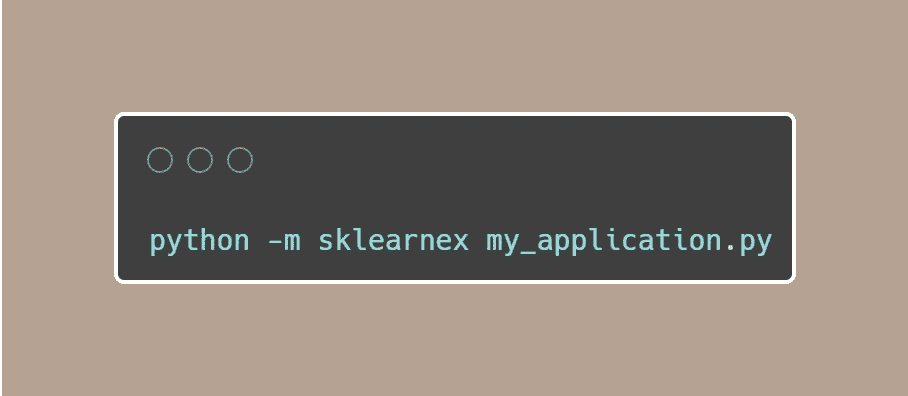
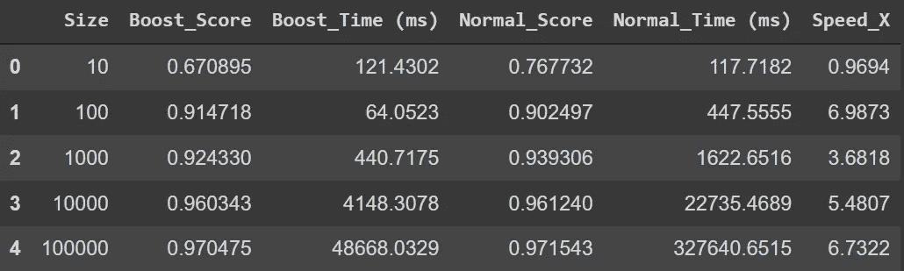
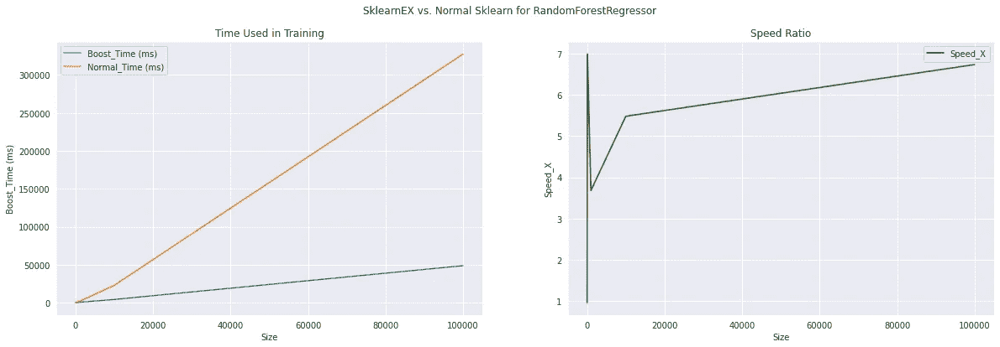
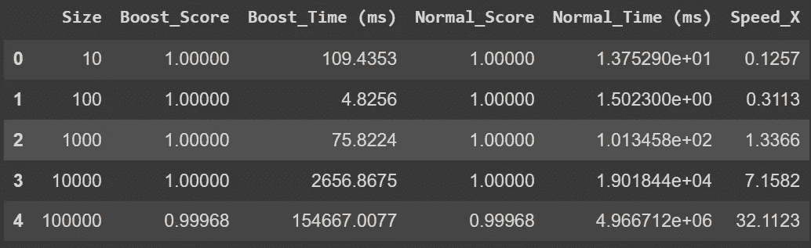
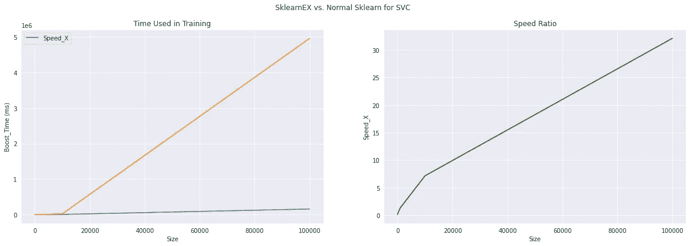
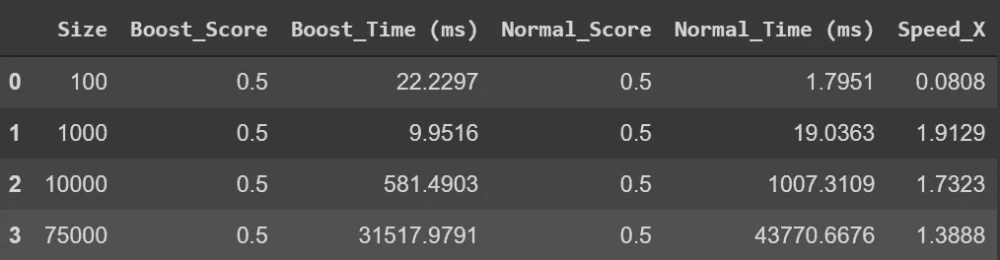
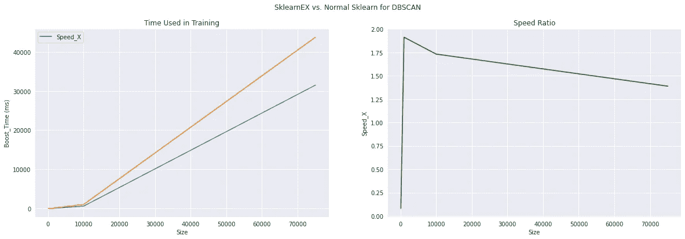
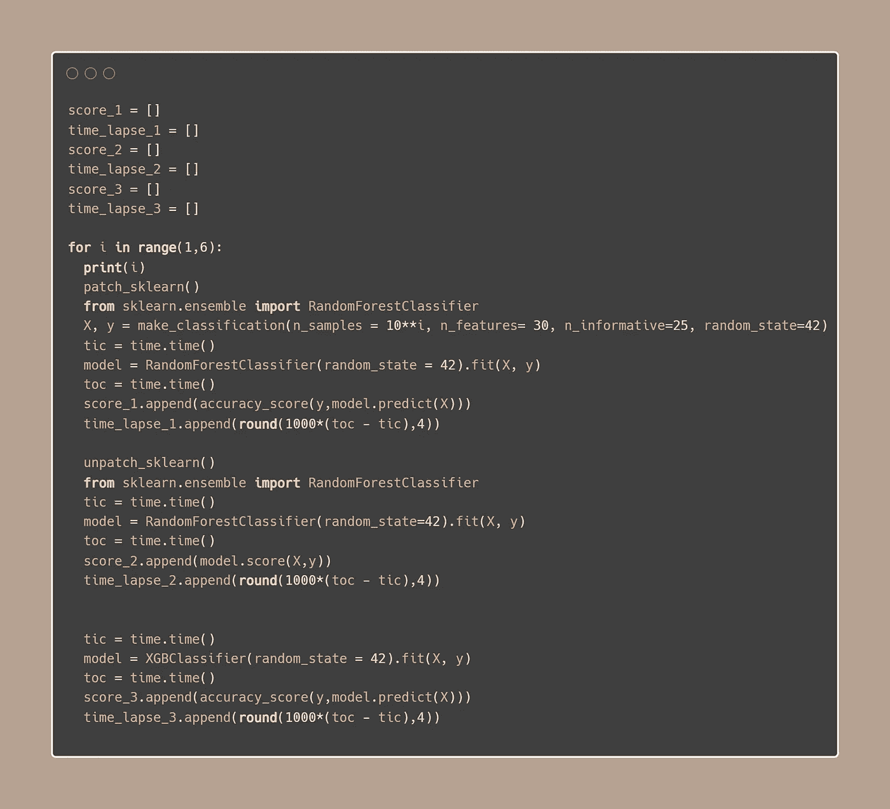
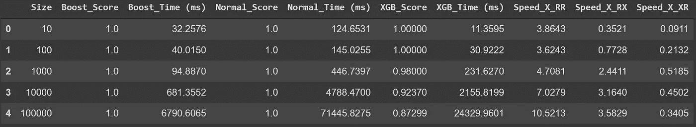
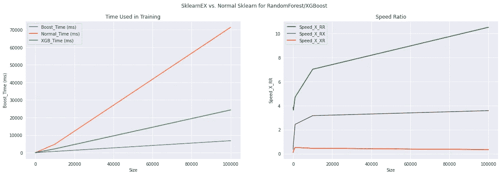

# 一行代码加速您在大数据上的 Sklearn 算法

> 原文：<https://towardsdatascience.com/one-line-of-code-to-accelerate-your-sklearn-algorithms-on-big-data-9c26190a0dc5>

## 英特尔 sklearn 扩展的推出。让你的随机森林比 XGBoost 还要快。

作者图片

# 介绍

Scikit-learn(又名 Sklearn)无疑是当今数据科学中使用最多的 Python 库之一。然而，用 sklearn 算法训练一个大数据集有时会很昂贵。当我还在学校的时候，我记得我训练了一个 SVC 模型一天。我确信我不是唯一一个对这种情况感到沮丧的人。而今天，我要向大家介绍的是 sklearnex，这是一个由英特尔 AI 团队在大约一年前开发的扩展，它最初是 daal4py 库的一部分。这个扩展有可能将您的 sklearn 代码加速 10-100 倍。

根据他们的文档，“Scikit-learn*的英特尔扩展动态修补 Scikit-learn 估算器，以使用英特尔(R) oneAPI 数据分析库作为底层解算器，同时通过使用矢量指令、IA 硬件专用内存优化等更快地获得相同的解决方案。在发射时。”他们的团队还声称，它可以将各种 sklearn 算法的速度提高 10 到 100 倍。你不觉得这很疯狂吗？一起来了解一下吧！

# 履行

要在您的 sklearn 应用程序上修补它而不更改代码，您可以使用以下命令行:

作者图片

如果您想在笔记本中直接使用它，您可以执行以下操作:

作者代码

如果您想在特定算法或特定算法列表的基础上修补它，您可以像这样直接在函数中传递名称:

作者代码

如果您想从您代码中删除它，您可以简单地解包它并重新导入您的 sklearn 模型，如下所示:

作者代码

# Sklearn vs. Sklearnex

*   *RandomForestRegressor*
*   *SVC*
*   *DBSCAN*
*   *RandomForestClassifier vs . xgb classifier*

由于硬件的限制，很难复制他们的所有工作，我计划从三个主要的机器学习算法:回归，分类和聚类，将增强版本与原始版本进行比较。

在我们开始测试之前，让我们导入我们需要的所有包:

作者代码

## 随机森林回归量

第一步:培训

由于我使用 google colab pro 来进行这个演示，所以只分配了 25G 内存供使用。所以我会用 10 到 100K 的样本量来测试模型。对于更大的数据，如数百万条以上的记录，只需查看模式就足够了。

作者代码

第二步:收集结果:

作者代码

作者图片

基于输出，我们可以看到性能非常一致，而对于 100K 个样本，训练速度提高了大约 6.5 倍。我认为这是机器学习实践的显著增长。

第三步:策划

作者代码

作者图片

## 交换虚拟电路

第一步:培训:

*注意:请注意这一部分，最终迭代的培训时间大约需要 1 小时 20 分钟。*

作者代码

由于代码与我用 RandomForestRegressor 所做的极其相似，我将省略第 2 步和第 3 步。结果如下:

作者图片

作者图片

到目前为止，SVC 在这个演示中表现出了最鲜明的对比。在 sklearnex 的基础上，我们可以在 100K 样本的数据集上观察到 32 倍的速度。由于 SVC 的耗时问题，我在大多数情况下都放弃了这种算法，尽管它具有独特的算法唯一性。然而，随着 sklearnex 的增强，我认为 SVC 将开始获得更多的关注。

## 基于密度的噪声应用空间聚类

第一步:培训:

作者代码

结果:

作者图片

作者图片

根据英特尔的文档，他们的扩展可以帮助 DBSCAN 在具有 50 万个样本和 50 个特征的数据集上速度提高 322 倍。然而，我的 google colab 会因为 DBSCAN 的样本量大于 80K 而崩溃，所以我无法复制这个数字。根据我所能得到的，在 sklearnex 的帮助下，DBSCAN 平均快了 1.25 倍。

## RandomForest vs. XGBoost

对于许多数据科学项目，我们已经看到人们选择 XGBoost 而不是 Random Forest。这种决策涉及许多权衡，当然，在大型数据集上的训练时间就是其中之一。所以我要给你看一些真正令人兴奋的东西:

第一步:培训

作者代码

结果:

作者图片

*注:*

*Spped_X_RR 是原始随机森林与带扩展的随机森林的训练时间的比较*

*Spped_X_RX 是 XGBoost 在扩展为*的随机森林上的训练时间比较

*Spped_X_RR 是原始随机森林的训练时间与 XGBoost 的比较*

作者图片

根据结果，我们可以看到，在 10K 和 100K 的给定数据集上，增强的随机森林分类器比 xgb 分类器分别快大约 3.5 倍。

你可以在这里找到完整的代码:[https://github . com/Jin hangjiang/Medium _ Demo/blob/main/Intel _ sk learn/Intel _ Extension _ for _ sk learn . ipynb](https://github.com/jinhangjiang/Medium_Demo/blob/main/Intel_Sklearn/Intel_Extension_for_Sklearn.ipynb)

# 结论

鉴于这一英特尔扩展实现的简单性，我相信它可以应用于数据科学中非常大范围的项目。特别是，鉴于有限的测试结果，我们可以清楚地观察到这个扩展的可伸缩性。总结一下，就这么简单:数据越大，性能越好。您可以在这里找到英特尔进行的完整比较的详细信息:[https://Intel . github . io/sci kit-learn-intelex/acceleration . html](https://intel.github.io/scikit-learn-intelex/acceleration.html)。

当然，目前这个扩展有一些限制。例如，扩展不支持随机森林和 K 近邻的多输出和稀疏数据。更多详情，请查看这里:[https://Intel . github . io/sci kit-learn-intelex/algorithms . html](https://intel.github.io/scikit-learn-intelex/algorithms.html)。

***请随时与我联系***[***LinkedIn***](https://www.linkedin.com/in/jinhangjiang/)***。***

# 参考

英特尔公司。(2021).Scikit-learn* 2021.5 文档的英特尔扩展。[https://intel.github.io/scikit-learn-intelex/blogs.html](https://intel.github.io/scikit-learn-intelex/blogs.html)

Smirnov，E. (2021)借助英特尔 Scikit-learn 扩展节省时间和资金。[https://medium . com/Intel-analytics-software/save-time-and-money-with-Intel-extension-for-scikit-learn-33627425 ae4](https://medium.com/intel-analytics-software/save-time-and-money-with-intel-extension-for-scikit-learn-33627425ae4)