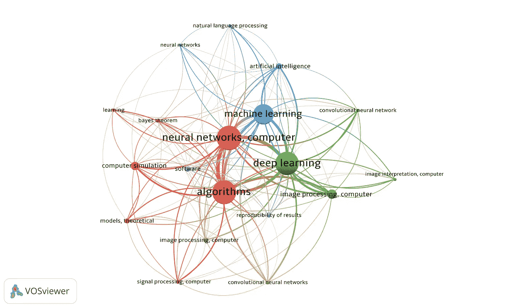
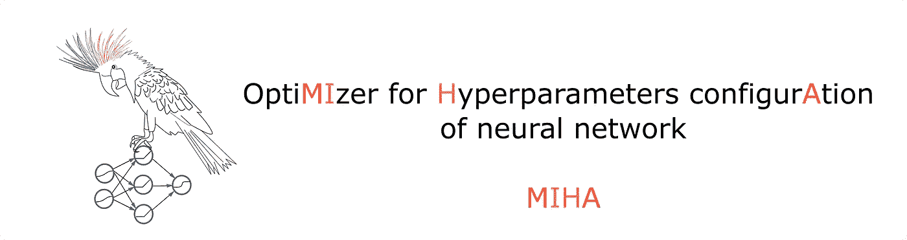
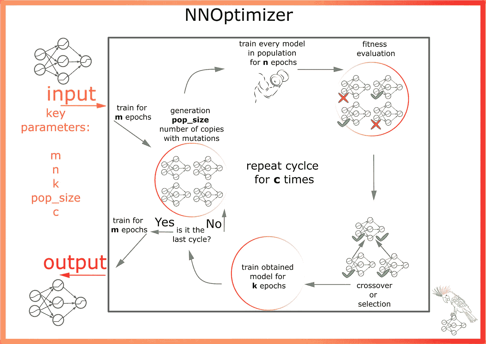
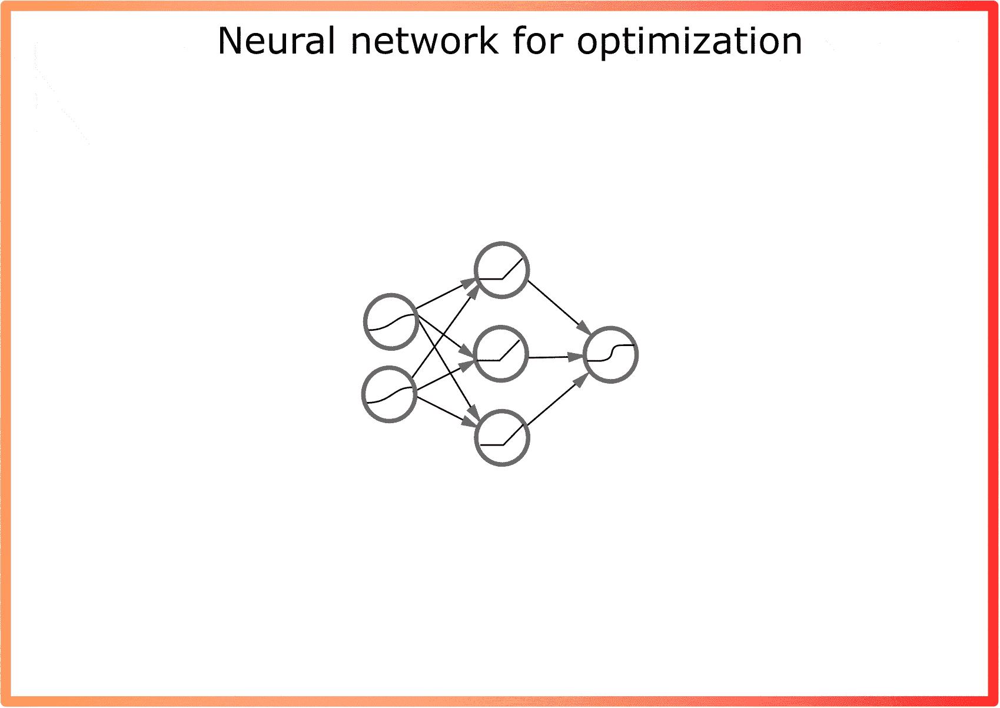
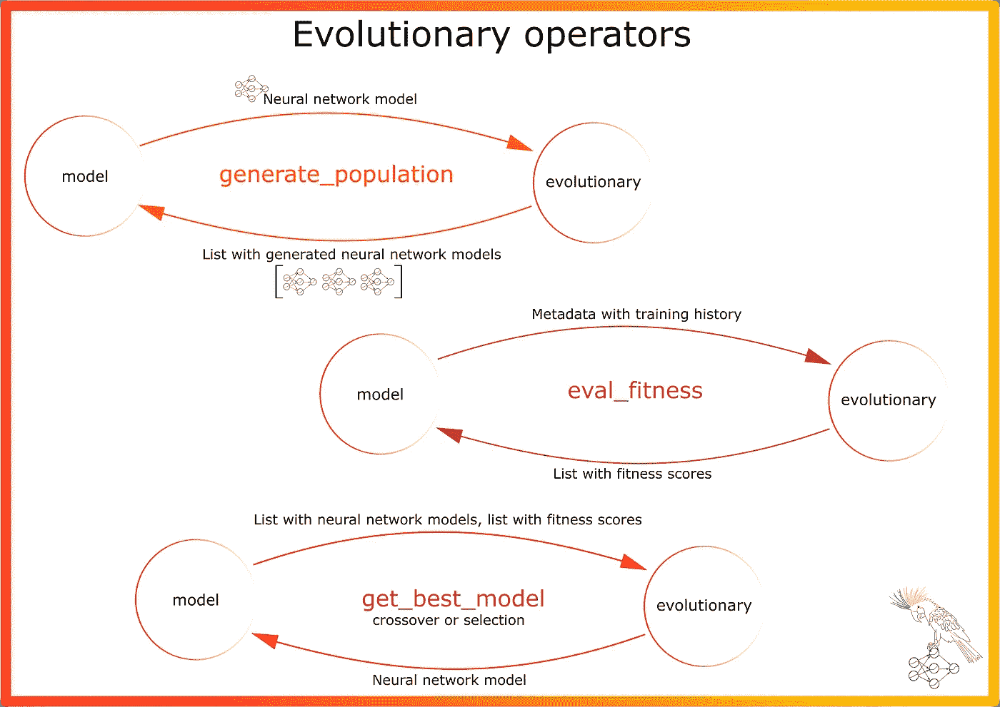
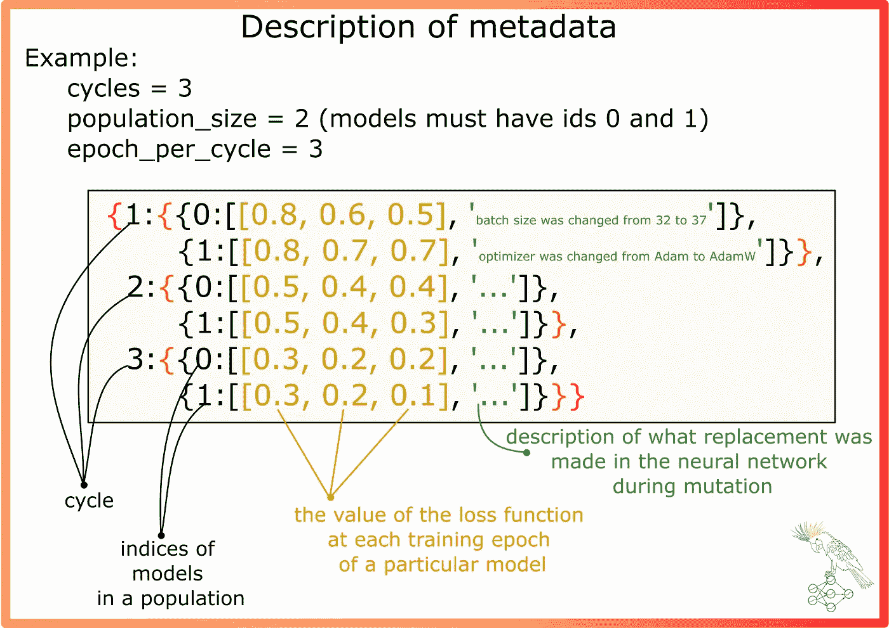
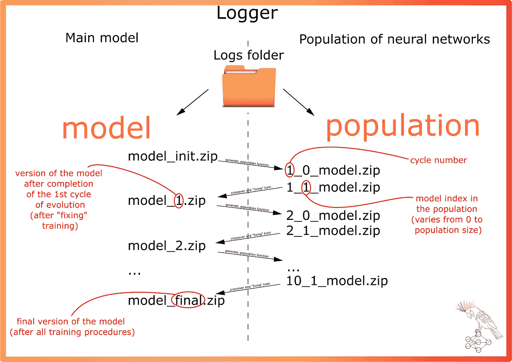
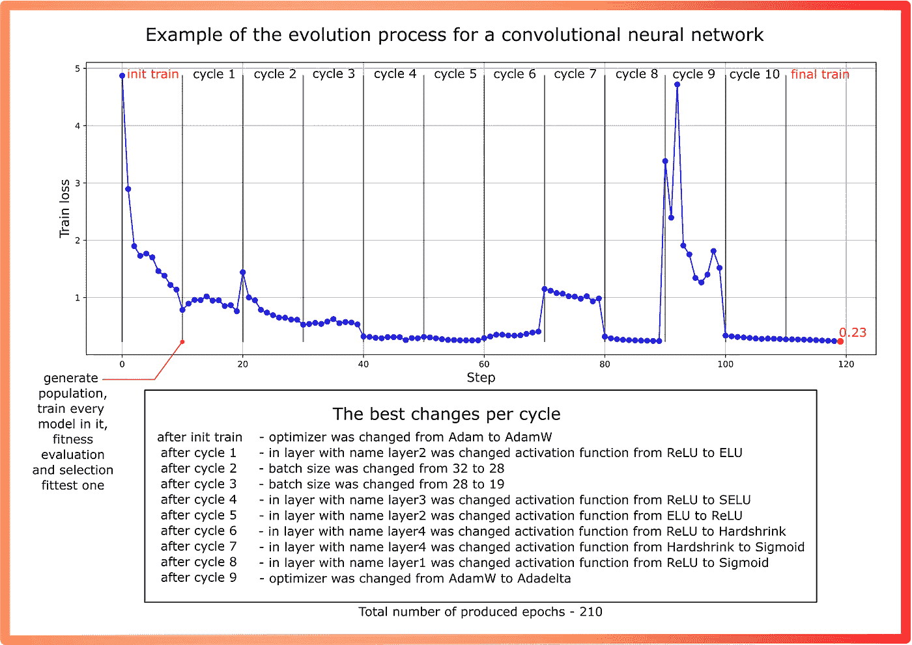

# 优化神经网络的另一种方法

> 原文：<https://towardsdatascience.com/one-more-approach-to-optimize-neural-networks-1dd173703301>

## 浅谈优化神经网络超参数的神经结构搜索和自适应算法

预览图像(作者提供的图像)

在过去的十年中，基于神经网络的解决方案变得非常流行。同时，深度学习是一个相当复杂的领域，对专家的理论知识要求很高。这个行业需要很多这样的专家，但是现在没有足够的专家来满足需求。由于供需之间的这种差距，特殊工具正在出现。让我们称这些工具为“自动化工具”。

这种工具也出现在其他行业。例如，特殊的机器使汽车装配自动化，灌溉系统使农业自动化。由于有了这项技术，组装汽车和灌溉所需的专业人员减少了。

在现代“数据科学”中也观察到了同样的过程。出现了各种自动机器学习(AutoML)框架和库。所有这些都允许我们自动化模型识别的过程。对于表格数据上的经典机器学习任务(分类、回归)，可以使用 [H2O](https://github.com/h2oai/h2o-3) 、 [TPOT](https://github.com/EpistasisLab/tpot) 、[自动生成](https://github.com/awslabs/autogluon)、 [LightAutoML](https://github.com/sberbank-ai-lab/LightAutoML) 或 [FEDOT](https://github.com/nccr-itmo/FEDOT/tree/master/fedot/core) 框架。这样的库被称为 AutoML 框架。然而，深度学习模型的识别领域已经被性质略有不同的技术所占据。这里常用的是所谓的神经架构搜索(NAS)。

一般来说，所有的 NAS 算法都属于 AutoML 范畴。然而，由于神经网络的特殊性，在方法上存在显著的差异。首先，神经网络往往比经典的机器学习算法有更多的超参数(例如，想象 ResNet 和线性回归模型，并比较它们)。其次，神经网络通常需要更多的计算资源。这是一个大问题，它限制了用于优化的算法集，该算法集可用于神经网络。

声明:AutoML 和 NAS 都很棒！越来越多的常规工作正在用软件来完成，这就给专家们留下了更多的时间来进行有趣的实验。我参与了 AutoML 工具的开发，并相信这种工具是数据科学发展的下一步。

## **神经架构搜索**

神经网络是一个复杂的模型。它由大量组件(超参数)组成。在开始训练模型之前，专家需要确定神经网络的拓扑结构、多少层、多少个神经元、什么激活函数、批量大小等等。值得记住的是，神经网络需要大量的资源来训练。因此，使用网格搜索来完全枚举所有这些超参数太复杂了。

算法而不是专家可以选择模型。这样的算法有，例如库 [AutoKeras](https://github.com/keras-team/autokeras) 、 [NNI](https://github.com/microsoft/nni) 、[py torch](https://github.com/carpedm20/ENAS-pytorch)中的 ENAS 等等。有些方法允许您自己为简单的架构快速实现这样的优化器。比如基于 optuna 优化库— [的例子](https://github.com/optuna/optuna/tree/master/examples)。另一方面，也有一些有趣的学术框架在寻找基于进化算法的最佳神经网络— [nas-fedot](https://github.com/ITMO-NSS-team/nas-fedot) 和 [NAS-object-recognition](https://github.com/ITMO-NSS-team/NAS-object-recognition) (这些模块的开发由我们实验室的同事负责:)。

这个话题真的很受欢迎，所以有很多工具，我在这里列出了其中很小的一部分。但是如果你对题目感兴趣，你可以从他们开始。更多的解决方案以概念的形式存在，例如，在期刊和会议记录的科学论文中。用关键词“神经架构搜索”搜索，你会找到很多文章(我保证)(图 1)。

图一。最近五年(2017 年以来)科技论文中带有“NAS”的题目。信息检索自[https://www.lens.org/](https://www.lens.org/)(图片由作者提供)

## **另一种方法？**

列举了 NAS 领域正在发生的所有发展中的一小部分。是的，我想介绍另一个。这样做的动机是假设:我相信增加神经元和层数是增加算法精度的可靠方法。但与此同时，它明显增加了训练神经网络的“计算成本”，以及模型的大小。在这种情况下，搜索空间变得太大，无法找到真正最优的东西。也许如果我们限制给定的神经网络拓扑结构并优化激活函数和其他超参数(不改变层和神经元的数量),它也会工作得一样好。

所以，让我们试着做一个算法，优化神经网络的一些超参数。神经元的数量和层数在优化过程中不变。这使得减少搜索空间成为可能。

## **“最重要的是 logo”**

老实说，这很重要。至少对我来说是这样。算法和概念很好，但是开发产品的经验也很重要。体验由外部属性组成，比如存储库的设计、文档和相关材料。

图二。正在开发的模块的徽标(图片由作者提供)

**实际上，概念比标志更重要**

但是这个概念也很重要。所以我们来探讨一下算法的核心思想。

在开始实现算法之前，我遇到的第一个具体特性是 NAS 算法的高计算成本。事实上，为相当多的时期训练几个神经网络是非常耗时的。因此，决定只训练一个神经网络，但在训练过程中改变一些超参数。在某些时刻，会生成少量具有超参数替代配置的神经网络。为了确定所提议的变更有多成功，建议使用几个时期的度量增加(图 3)。

图 3。优化算法的主要思想(图片由作者提供)

主要的超参数是 **m** —初始和最终训练的时期数， **pop_size** —生成的具有备选超参数配置的神经网络数， **n** —专门用于训练每个“备选神经网络”的时期数， **k** —交叉或选择后固定训练中间神经网络的时期数， **c** —种群生成和变化的周期数。从超参数的名称可以看出，使用了来自[进化计算](https://en.wikipedia.org/wiki/Evolutionary_computation)领域的术语:备选神经网络的集合称为群体，评估模型有效性的过程称为适应性评估。超参数的变化——突变。然而，所提出的方法并不是真正的进化(尽管它非常类似于进化)。

优化过程如下面的动画所示。为了方便起见，每个中间神经网络都序列化在一个 zip 存档中。如有必要，可以指定标志，以便在计算结束后删除包含序列化模型的文件夹。

动画。神经网络优化(作者动画)

从动画中可以看出，首先训练具有超参数初始配置的单个神经网络。然后生成几个备选模型，在每个模型中替换超参数。当前原型能够进行以下更改:

*   改变优化算法(SGD、Adam、Adadelta 等)；
*   在随机选择的层中改变激活函数；
*   更改批量大小；

不多，但即使使用这种方法，搜索空间也相当大。

基于适应性评估选择最成功的替换:

*   适应函数值取决于神经网络损失函数值的最后接收值的绝对值；
*   适应函数的值取决于学习的速率(损失函数从一个时期到另一个时期变化得多快)。

最成功的模型是经过几个时代训练出来的。然后重复替换的循环。

## **技术细节**

该模块基于三个主要部分:优化器(模型)、进化操作符(进化)和日志系统(图 4)。

图 4。程序不同部分(类和方法)之间的主要交互方式(图片由作者提供)

我发现实现一个日志系统特别有价值。在优化过程中，许多重要信息被存储(图 5)。

图 5。存储优化过程相关信息的元数据文件示例(作者图片)

除了信息之外，模型也被存储。值得注意的是，它们都是已经训练好的，并且代表现成可用的模型。为了更容易理解文件的名称，准备了下图(图 6)。

图 6。使用序列化神经网络存档名称(图片由作者提供)

如前所述，所有这些模型都保存在一个文件夹中。如果要求所有计算后只保留最终模型，可以指定实验后删除文件夹。因此，基于运行模型的实验，可以获得以下学习历史:

图 7。该算法的一个测试示例(图片由作者提供)

## **实验**

为了了解该算法的有效性，我们决定针对不同的神经网络架构对不同的任务进行几项实验:

*   前馈神经网络(FNN)优化算法的应用。任务—MNIST 数据集的多类分类以及与 Optuna 框架的比较(参见[示例](https://github.com/optuna/optuna-examples/blob/main/pytorch/pytorch_simple.py))；
*   卷积神经网络优化算法的应用。任务—遥感产品中的间隙填充(将该算法的有效性与没有超参数搜索的 init 神经网络训练进行比较)。

关于分类任务—[MNIST _ optuna _ miha . ipynb](https://github.com/Dreamlone/MIHA/blob/main/jupyter_examples/MNIST_optuna_miha.ipynb)
在这本 jupyter 笔记本中，从准确率指标上与 Optuna 进行了对比。optuna 优化器增加了神经网络的层数，而 MIHA 只改变了激活函数、批量大小和优化算法。从测试样本的实验结果中获得以下度量:MIHA — 0.974，奥普图纳— 0.976(结果几乎相同)。

关于填补空白的任务。
质量指标——均方误差(MSE)。具有超参数初始配置的神经网络的 MSE 是 0.38。对于相同的历元数，使用 MIHA 算法的超参数顺序变化的神经网络获得 MSE 0.13。

## **结论**

因此，我们研究了机器学习的神经网络结构优化领域。我试着分享了我在这方面的进展，希望你觉得它很吸引人。值得补充的是，所描述的算法目前还不是一个完整的库。MVP 能够处理有限数量的任务，用于演示概念。

回头见！

**有用链接:**

*   **算法**[**github 上的 MIHA**](https://github.com/Dreamlone/MIHA)
*   如何为分类任务运行算法的示例— [MNIST 分类](https://github.com/Dreamlone/MIHA/blob/main/examples/FNN_mnist_classification.py)
*   [NSS 实验室](https://itmo-nss-team.github.io/)，我和我的同事在那里做 AutoML，比如 [FEDOT 框架](https://github.com/nccr-itmo/FEDOT)