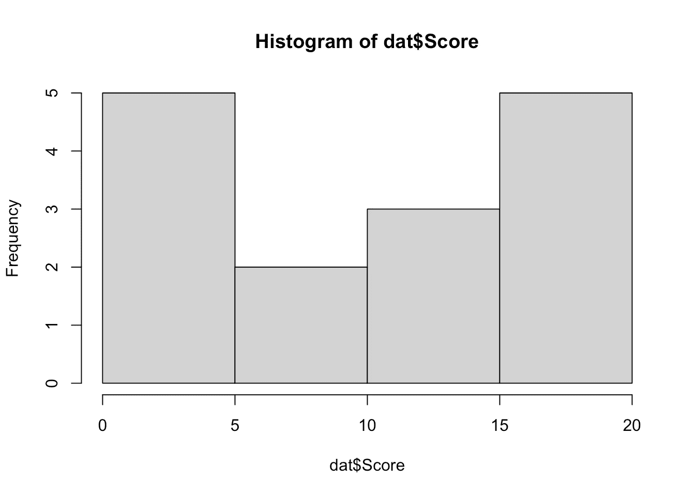
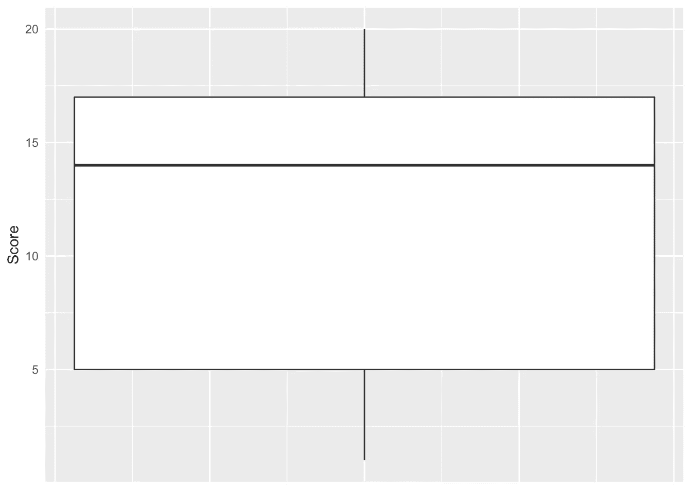
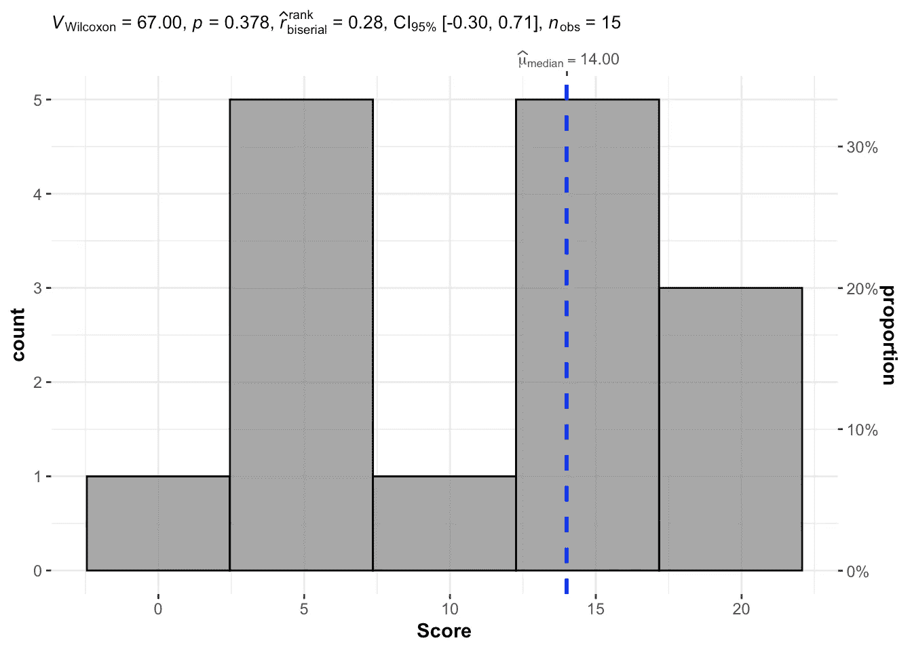

# R 中的单样本 Wilcoxon 检验

> 原文：<https://towardsdatascience.com/one-sample-wilcoxon-test-in-r-7ca71403a419>

## 了解何时以及如何在 r 中进行单样本 Wilcoxon 检验。另请参见如何通过具体示例来可视化和解释结果


[Rodrigo Kugnharski](https://unsplash.com/@kugnharski?utm_source=medium&utm_medium=referral) 在 [Unsplash](https://unsplash.com?utm_source=medium&utm_medium=referral) 上的照片

# 介绍

在之前的一篇文章中，我们展示了如何在 r 中进行[双样本 Wilcoxon 测试](https://statsandr.com/blog/wilcoxon-test-in-r-how-to-compare-2-groups-under-the-non-normality-assumption/)。记住，这个测试实际上有两个版本:

1.  **曼-惠特尼-威尔科森检验**(也称为威尔科森秩和检验或曼-惠特尼 U 检验)，用于比较两个**独立的**样本。该测试是[学生独立样本 t 检验](https://statsandr.com/blog/student-s-t-test-in-r-and-by-hand-how-to-compare-two-groups-under-different-scenarios/)的非参数版本。
2.  **Wilcoxon 符号秩检验**(也称为配对样本的 Wilcoxon 检验)，用于比较两个配对样本。该测试是[学生配对样本 t 检验](https://statsandr.com/blog/student-s-t-test-in-r-and-by-hand-how-to-compare-two-groups-under-different-scenarios/)的非参数版本。

在另一篇文章中，我们还展示了如何在 r 中手工进行[单样本 t 检验](https://statsandr.com/blog/how-to-perform-a-one-sample-t-test-by-hand-and-in-r-test-on-one-mean/)，该检验用于确定测量变量的平均值是否不同于指定值(例如，基于您的信念或理论预期指定的值)。由于是参数测试，数据应该遵循[正态分布](https://statsandr.com/blog/do-my-data-follow-a-normal-distribution-a-note-on-the-most-widely-used-distribution-and-how-to-test-for-normality-in-r/)(或者样本量应该足够大(即 30 以上)，由于中心极限定理)，结果才有效。

与单样本 t 检验不同，**单样本 Wilcoxon 检验**(也称为单样本 Wilcoxon 符号秩检验)是非参数检验，这意味着它不依赖于属于任何特定概率分布参数族的数据。非参数测试通常与参数测试有相同的目标(在这种情况下，将数据与给定值进行比较)。尽管如此，他们不需要正态假设，他们可以处理[异常值](https://statsandr.com/blog/outliers-detection-in-r/)和李克特量表。

在本文中，我们将展示何时执行单样本 Wilcoxon 检验，如何在 R 中执行以及如何解释其结果。我们还将简要展示一些适当的可视化。

# 什么时候？

**单样本 Wilcoxon 检验用于将我们的观察结果与给定的默认值**进行比较，默认值是根据您的信念或理论预期指定的值。换句话说，它用于确定一个群体是否与感兴趣的变量上的已知或假设的群体值显著不同。

由于检验统计量是根据观察值和默认值之间的差异等级计算的(使其成为非参数检验)，当观察值不符合正态分布时，单样本 Wilcoxon 检验比单样本 t 检验更合适。

该测试的目标是验证观察值是否与我们的默认值有显著差异。就无效假设和替代假设而言，我们有(对于双尾检验):

*   H0:数据的位置是*等于*选择的值
*   H1:数据的位置与选择的值*不同*

换句话说，一个显著的结果(即拒绝零假设)表明数据的位置与选择的值*不同*。

请注意，一些作者认为该检验是对中位数的检验，即(对于双尾检验):

*   H0:中间值*等于*选择值
*   H1:中间值与选择值*不同*

然而，只有在数据对称的情况下才会出现这种情况。如果没有关于数据分布的进一步假设，单样本 Wilcoxon 检验不是对中位数的检验，而是对数据位置的检验。 [1](https://statsandr.com/blog/one-sample-wilcoxon-test-in-r/#fn1)

请注意，尽管不要求正态性假设，但独立性假设仍然必须得到验证。这意味着观察值必须相互独立(通常，随机抽样足以具有独立性)。

# 数据

为了便于说明，假设我们想要测试某次考试的分数是否与 10 分不同，即:

*   H0:考试分数= 10 分
*   H1:考试分数≠ 10

为了验证这一点，我们对 15 名学生及其考试分数进行了抽样调查:

```
dat##    Student_ID Score
## 1           1    17
## 2           2     5
## 3           3     1
## 4           4    10
## 5           5     4
## 6           6    18
## 7           7    17
## 8           8    15
## 9           9     7
## 10         10     4
## 11         11     5
## 12         12    14
## 13         13    20
## 14         14    18
## 15         15    15
```

假设学生之间的分数是独立的(一个学生的分数不受另一个学生分数的影响)。因此，独立性假设得到满足。

而且，样本量很小(n < 30) and based on the [直方图](https://statsandr.com/blog/descriptive-statistics-in-r/#histogram)数据不遵循正态分布:

```
# histogram
hist(dat$Score)
```



作者的情节

注意，我们避免通过正态性检验来验证正态性(例如[夏皮罗-维尔克检验](https://statsandr.com/blog/do-my-data-follow-a-normal-distribution-a-note-on-the-most-widely-used-distribution-and-how-to-test-for-normality-in-r/#normality-test))，因为对于小样本量，正态性检验几乎没有能力拒绝零假设，因此小样本通常通过正态性检验([oz tuna，Elhan，和 tüccar 2006](https://statsandr.com/blog/one-sample-wilcoxon-test-in-r/#ref-oztuna2006investigation)；[哈塞米和扎赫迪达斯 2012](https://statsandr.com/blog/one-sample-wilcoxon-test-in-r/#ref-ghasemi2012normality) 。

还要注意，尽管我们使用了一个[定量变量](https://statsandr.com/blog/variable-types-and-examples/#quantitative)进行说明，但是单样本 Wilcoxon 检验也适用于区间数据和李克特量表。

# 怎么会？

单样本 Wilcoxon 测试可以在 R 中用`wilcox.test()`函数完成。

但是首先，将我们的数据可视化在一个[箱线图](https://statsandr.com/blog/descriptive-statistics-in-r/#boxplot)中并计算一些[描述性统计数据](https://statsandr.com/blog/descriptive-statistics-in-r/)来比较我们的观察值和我们的默认值是一个很好的做法:

```
# boxplot
boxplot(dat$Score,
  ylab = "Score"
)
```


作者的情节

如果你和我一样喜欢使用`[{ggplot2}](https://statsandr.com/blog/graphics-in-r-with-ggplot2/)` [包](https://statsandr.com/blog/graphics-in-r-with-ggplot2/)来制作你的剧情:

```
# boxplot
library(ggplot2)ggplot(dat, aes(y = Score)) +
  geom_boxplot() +
  labs(y = "Score") +
  theme( # remove axis text and ticks
    axis.text.x = element_blank(),
    axis.ticks = element_blank()
  )
```



作者的情节

一些基本的描述性统计(四舍五入到两位小数):

```
round(summary(dat$Score),
  digits = 2
)##    Min. 1st Qu.  Median    Mean 3rd Qu.    Max. 
##    1.00    5.00   14.00   11.33   17.00   20.00
```

从上面的箱线图和描述性统计中，我们看到样本中得分的平均值和中值分别为 11.33 和 14。

单样本 Wilcoxon 检验将告诉我们这些分数是否与 10 分有显著差异(因此它们在总体中是否与 10 分不同):

```
wilcox.test(dat$Score,
  mu = 10 # default value
)## 
##  Wilcoxon signed rank test with continuity correction
## 
## data:  dat$Score
## V = 67, p-value = 0.3779
## alternative hypothesis: true location is not equal to 10
```

输出显示了一些信息，例如:

*   测试的标题
*   数据
*   检验统计量
*   p 值
*   另一假设

我们关注 p 值来解释和总结测试。

**释义:**

根据测试结果，(在 0.05 的显著性水平上)我们不拒绝零假设，因此我们不拒绝本次考试分数等于 10 的假设，我们不能得出分数与 10 有显著差异的结论(p 值= 0.378)。

默认情况下，这是一个双尾测试。至于`t.test()`函数，我们可以通过使用`wilcox.test()`函数中的`alternative = "greater"`或`alternative = "less`参数来指定需要单侧测试。

例如，如果我们想测试分数是否比 10 分*高*:

```
wilcox.test(dat$Score,
  mu = 10, # default value
  alternative = "greater" # H1: scores > 10
)## 
##  Wilcoxon signed rank test with continuity correction
## 
## data:  dat$Score
## V = 67, p-value = 0.189
## alternative hypothesis: true location is greater than 10
```

**释义:**

在这种情况下，我们仍然不拒绝分数等于 10 的假设，我们不能得出分数明显高于 10 的结论(p 值= 0.189)。

有关函数中可用参数的更多信息，请参见`?wilcox.test`。

请注意，使用`wilcox.test()`时，您可能会遇到以下警告:

```
Warning messages:
1: In wilcox.test.default(dat$Score, mu = 10) :
  cannot compute exact p-value with ties
2: In wilcox.test.default(dat$Score, mu = 10) :
  cannot compute exact p-value with zeroes
```

这是一个警告，而不是表明你的结果是不正确的。r 通知您，它报告的是基于正态近似值的 p 值，而不是基于数据的精确 p 值，因为存在联系(某些值是相同的)。如果您想移除警告，使用`exact = FALSE`选项。

# 结合统计检验和绘图

如果你是博客的常客，你会知道我喜欢直接在图上显示测试结果。这使我能够可视化数据，并以简洁的方式结束测试。

这要归功于`{ggstatsplot}`封装中的`gghistostats()`功能:

```
# load package
library(ggstatsplot)# combine plot and test
gghistostats(
  data = dat, # dataframe
  x = Score, # variable
  type = "nonparametric", # nonparemetric = Wilcoxon, parametric = t-test
  test.value = 10 # default value
)
```



作者的情节

直方图 [2](https://statsandr.com/blog/one-sample-wilcoxon-test-in-r/#fn2) 显示了分数的分布，测试结果显示在图的标题中。

如您所见，测试结果是相同的，也就是说，数据中没有足够的证据来得出分数与 10 分显著不同的结论(p 值= 0.378)。

感谢阅读。我希望这篇文章能帮助你理解单样本 Wilcoxon 检验以及如何在 r。

和往常一样，如果您有任何与本文主题相关的问题，请添加评论，以便其他读者可以从讨论中受益。

# 参考

哈塞米、阿斯加尔和萨利赫·扎赫迪阿斯。2012."统计分析的正态性检验:非统计人员指南."国际内分泌和代谢杂志 10 (2): 486。

厄兹图纳、德亚、阿蒂拉·哈利勒·埃尔汉和埃尔泽·蒂卡尔。2006."根据不同分布下的 1 型错误率和功效调查四种不同的正态性检验."*土耳其医学杂志*36(3):171–76。

1.  更多信息请参见本文[中的](https://rcompanion.org/handbook/F_02.html)。 [↩︎](https://statsandr.com/blog/one-sample-wilcoxon-test-in-r/#fnref1)
2.  该直方图看起来与上一个直方图不同，因为仓的数量不同(4 对 5 仓)。 [↩︎](https://statsandr.com/blog/one-sample-wilcoxon-test-in-r/#fnref2)

# 相关文章

*   [手工假设检验](https://statsandr.com/blog/hypothesis-test-by-hand/)
*   [R 中的方差分析](https://statsandr.com/blog/anova-in-r/)
*   [R 中的相关系数和相关检验](https://statsandr.com/blog/correlation-coefficient-and-correlation-test-in-r/)
*   [一比例和卡方拟合优度检验](https://statsandr.com/blog/one-proportion-and-goodness-of-fit-test-in-r-and-by-hand/)
*   [如何手动执行单样本 t 检验，并对一个平均值进行 R:检验](https://statsandr.com/blog/how-to-perform-a-one-sample-t-test-by-hand-and-in-r-test-on-one-mean/)

*原载于 2022 年 7 月 7 日 https://statsandr.com**的* [*。*](https://statsandr.com/blog/one-sample-wilcoxon-test-in-r/)