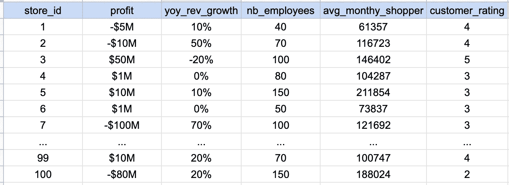
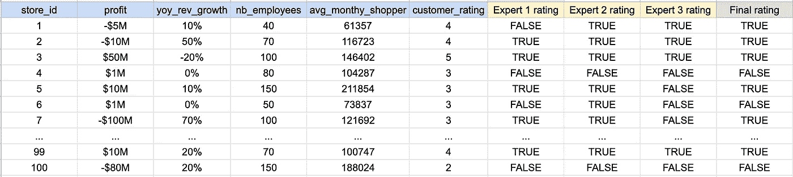

# 一种将主观概念转化为客观指标的简单方法

> 原文：<https://towardsdatascience.com/one-simple-methodology-to-turn-a-subjective-concept-into-an-objective-metric-14943cf6fb95>

## 利用组织中的专家来创造一个真实的来源，并针对它训练一个模型

在一个商业团队中工作，我经常被要求量化一个没有广泛接受的定义的主观概念。一个典型的问题看起来像这样:“我们的商店有多少是成功的？”或者“我们有多少忠实客户？”

照片由 [Unsplash](https://unsplash.com?utm_source=medium&utm_medium=referral) 上的 [Greyson Joralemon](https://unsplash.com/@greysonjoralemon?utm_source=medium&utm_medium=referral) 拍摄

问题的关键在于，每个人对这些主观词汇都有自己的“理论”定义(并且相信他们的理解在整个公司都是一样的)。因此，当被问及这样一个问题时，主要的挑战是实际上将所有不同的观点结合起来，从而得出一个客观的定义。

举一个具体的例子——假设你在一家重要的连锁超市工作，有人问你“有多少家店是成功的？”

你可以考虑“利润”,开始考虑根据利润对不同的商店进行排名，但是:

*   假设在你的行业中，利润是规模的函数——一个利润不多的小店会不会不太成功？
*   一家商店刚刚开业，增长迅猛，但要到明年才能盈利，该怎么办？或者相反，一个利润很大但是负增长的店怎么办？你认为哪一个是成功的？
*   一家利润丰厚但顾客负面评价越来越多的商店该怎么办？或者员工流动率很高的公司？

# 内部众包拯救

正如我们上面看到的，像“成功”或“忠诚”这样的主观概念在你的组织中可以有不同的定义。将这些定义统一到一个坚实的指标中是很重要的，也是很困难的。

有不同的方法来解决这个问题，但我发现一个特别优雅的方法是下面这个:**与一些利益相关者合作建立** **一个真相的来源。**

**基本上——请几名内部专家对您的人群中的代表性样本进行审查和分类，并在此基础上根据手动分类建立一个模型。这将让你明白什么是“数据”定义，最符合你试图定义的主观概念。**

*   这种方法使您的组织内部保持一致，因为您将来自不同团队的具有不同观点的风险承担者纳入进来。
*   它还可以创建有意义的讨论并开启新的学习，尤其是当两位不同的专家对同一记录有不同的分类时，这将有助于您和他们了解彼此的基本原理。

# 如何具体使用

*   找出一份能代表整个人口的记录清单

一个样本的例子(作者)

*   请一些内部专家帮助手动分类不同的记录，并与他们一起审查分类，以得出最终评级

已审核的样本(按作者)

*   恭喜你！您现在有了新度量标准的真实来源，这是一个更加简单的分类问题。你可以开始根据最终评级来拟合模型，并根据你的需要进行调整(例如，你如何平衡可解释性与复杂性或准确性与精确性，或者其他)。
*   一旦你有了第一个定义，把它呈现给你的观众，并向他们展示这对企业意味着什么(用一些具体的例子)。根据需要迭代。

# 今天就开始实施！

上面介绍的方法是**面对这类问题时你可以使用的许多方法**之一。它不是万灵药，而且它确实需要你找到一些专家，他们愿意花时间转移他们已经内化了多年的知识，但是当你在从事需要大量调整的项目和/或你陷入困境甚至不知道从哪里开始的项目时，它可以很好地工作。

# 感谢阅读！

如果你觉得有趣，可以看看我的其他文章:

     