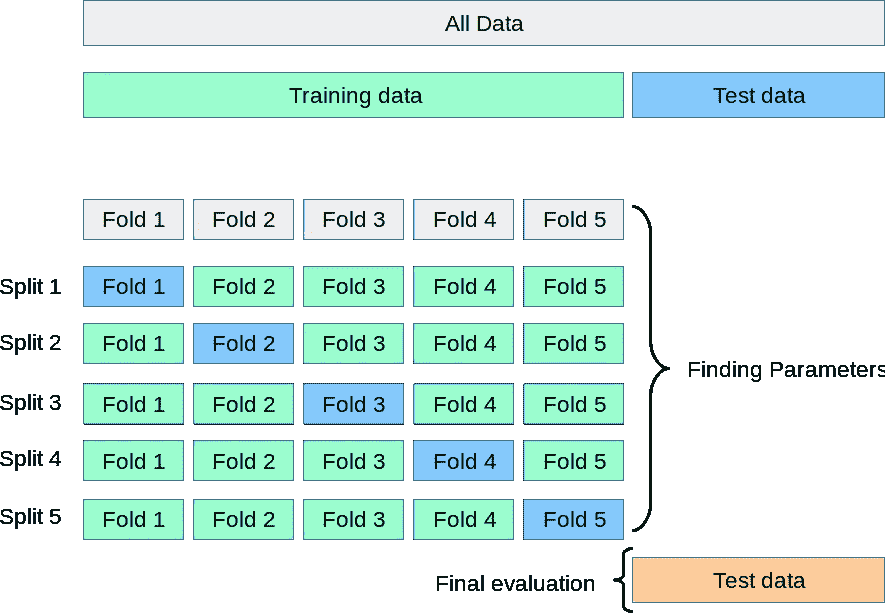
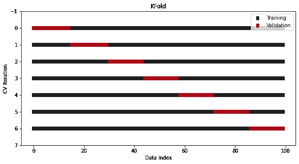
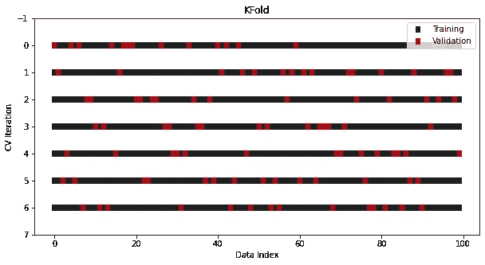
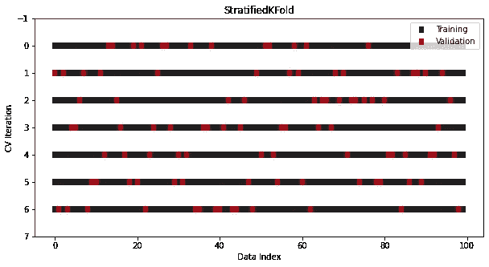
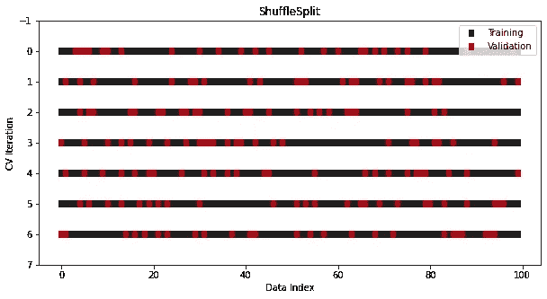
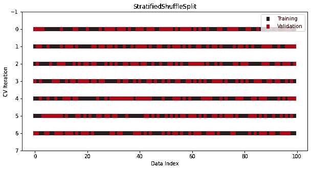
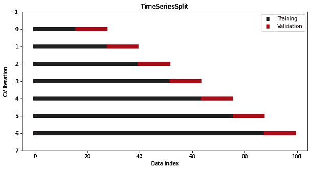

# 你可以(也应该)使用的所有交叉验证技术的一站式教程

> 原文：<https://towardsdatascience.com/one-stop-tutorial-on-all-cross-validation-techniques-you-can-should-use-7e1645fb703c>

## 作为一名数据科学家，你需要知道的所有简历程序，解释如下


照片由[安妮·伦凯](https://www.pexels.com/photo/close-up-photo-of-pink-fluid-2156884/)拍摄

# 为什么要交叉验证？

在我开始销售相关商品之前，我必须宣传主要理念。开始了。

让我们想象一个你不知道什么是跨 val daton 程序的世界。在那个疯狂的世界里，你显然把你的数据分割成一个单独的训练和测试集。该模型从训练数据中学习，您通过预测所谓的看不见的数据(即您的测试集)来测试它的性能。如果你对分数不满意，你可以使用相同的设置调整你的模型，直到 [GridSearch](/11-times-faster-hyperparameter-tuning-with-halvinggridsearch-232ed0160155) (或者 [Optuna](/why-is-everyone-at-kaggle-obsessed-with-optuna-for-hyperparameter-tuning-7608fdca337c) )喊出“够了！”。

这是这个过程中可能出现的多种可怕错误中的两种:

1.  **集合不能很好地代表全部人口**。作为一个极端的例子，在具有三个类别(a、b、c)的行之外，所有的 **a** 和 **b** 类别可能在训练集中结束，而所有的 **c** 在测试集中挂起。或者拆分数值变量，使得某个阈值左侧和右侧的值在训练和集合中分布不均匀。或者接近于这样一种情况，即两个集合中变量的新分布与原始分布如此不同，以至于模型从不正确的信息中学习。
2.  **在超参数调整期间，您将关于测试集的知识泄漏到模型中。**搜索完成后，框架会找出最适合那个*特定*测试集的参数。既然我用的是特定的这个词，你应该已经开始考虑过度拟合了。因为如果你在同一个测试集上重复测试，就会发生这种情况——搜索框架只会给出让你满意的特定测试集的结果。

所以，如果我们回到 CV 受到全世界工程师喜爱和广泛使用的世界，所有这些问题都解决了。下面是 CV 的神奇之处，见 [Sklearn 用户指南](https://scikit-learn.org/stable/modules/cross_validation.html) (BSD 许可证):



上面是一个五重交叉验证过程的例子，需要五次迭代才能完成。在每次迭代中，新模型在四个折叠上进行训练，并在最后一个保持折叠上进行测试。通过这种方式，可以在不浪费任何数据的情况下对模型进行训练和测试。

接下来，报告平均分数及其标准偏差作为置信区间。只有这样，您才能真正用所选的参数来判断模型的性能，因为您得到的平均分将代表模型从数据中有效学习并对未知样本进行准确预测的真正潜力。

[](https://ibexorigin.medium.com/membership)  

获得由强大的 AI-Alpha 信号选择和总结的最佳和最新的 ML 和 AI 论文:

[](https://alphasignal.ai/?referrer=Bex)  

# 1.KFold

现在，让我们开始讨论执行 CV 程序的许多方法。最简单的就是上图看到的`KFold`。在 Sklearn 中实现同名。在这里，我们将编写一个快速函数来可视化 CV 拆分器的拆分索引:

现在，让我们将带有七个拆分的 KFold 拆分器传递给此函数:



这就是香草冰淇淋的样子。

另一个版本是在执行分割之前对数据进行洗牌。通过打破样本的原始顺序，这进一步降低了过度拟合的风险:



如您所见，验证样本的索引是以随机方式选择的。即便如此，由于我们做的是 7 重 CV，样本总数仍然是整个数据的七分之一。

KFold 是最常用的 CV 分配器。这很容易理解，而且非常有效。然而，根据数据集的特征，有时您需要对使用什么样的 CV 过程更加挑剔。所以，我们来讨论一下替代方案。

# 2.分层折叠

另一个为分类问题专门设计的 KFold 版本是`StratifiedKFold`。

在分类中，即使在数据被分成多个集合之后，目标分布也必须被保留。更具体地说，具有 30 到 70 类比率的二进制目标应该在训练集和测试集中保持相同的比率。

这个规则在 vanilla KFold 中被打破了，因为它不关心类比率，也不在分割之前打乱数据。作为一个解决方案，我们在 Sklearn 中使用了另一个 splitter 类— `StratifiedKFold`:



它看起来和 KFold 一样，但是现在类比率在所有折叠和迭代中保持不变。

# 3.离开

有时候，你拥有的数据是如此有限，以至于你甚至不能把它分成训练集和测试集。在这种情况下，您可以执行 CV，在每次迭代中只留出几行数据。这被称为 LeavePOut CV，其中 *p* 是您选择来指定每个维持集中的行数的参数。

最极端的情况是`LeaveOneOut`拆分器，其中您只使用一行作为测试集，迭代的次数等于完整数据中的行数。如果为一个只有 100 行的小数据集构建 100 个模型看起来近乎疯狂，我会支持你。

即使对于更高数量的`p`，迭代次数也会随着数据集大小的增加而呈指数增长。想象一下，当`p`是 5，而你的数据只有 50 行时，将会构建多少个模型(提示——使用排列公式)。

因此，在实践中很少看到这种情况，但是 Sklearn 经常将这些过程作为单独的类来实现:

```
from sklearn.model_selection import LeaveOneOut, LeavePOut
```

# 4.洗牌拆分

不如我们不做 CV，只重复多次训练/测试分割过程？嗯，这是另一种方式，你可以玩弄交叉验证的想法，但仍然没有这样做。

从逻辑上讲，使用不同的随机种子生成多个训练/测试集应该类似于一个健壮的 CV 过程，如果进行足够的迭代的话。这就是为什么在 Sklearn 中有一个执行这个过程的拆分器:



ShuffleSplit 的优点是您可以完全控制每个折叠中的序列和集合的大小。集合的大小不必与拆分的数量成反比。

然而，与其他拆分器相反，不能保证随机拆分会在每次迭代中生成不同的折叠。因此，请谨慎使用该类。

顺便说一下，还有一个分层版本的 ShuffleSplit 用于分类:



# 5.时间序列片段

最后，我们有时间序列数据的特例，其中样本的排序很重要。

我们不能使用任何传统的简历类，因为它们会导致灾难。你很有可能在训练未来的样本并预测过去的样本。

为了解决这个问题，Sklearn 提供了另一个分离器— `TimeSeriesSplit`，它确保上述情况不会发生:



漂亮整洁！

# 用于非 IID 数据的其他 CV 拆分器

到目前为止，我们一直在处理 IID(独立同分布)数据。换句话说，生成数据的过程没有过去样本的记忆。

但是，在某些情况下，您的数据不是 IID 数据，即一些样本组相互依赖。例如，在 Kaggle 上的[谷歌大脑呼吸机压力](https://www.kaggle.com/c/ventilator-pressure-prediction/leaderboard)比赛中，参与者应该使用非 IID 的数据。

这些数据记录了人工肺进行的数千次呼吸(进、出)，并以毫秒为间隔记录了每次呼吸的气压。因此，每次呼吸的数据包含大约 80 行，使这些行相互依赖。

在这里，传统的简历分割器不会像预期的那样工作，因为有一个明确的机会，分裂可能发生在“呼吸的中间”这里是另一个来自 [Sklearn 用户指南](https://scikit-learn.org/stable/modules/cross_validation.html#:~:text=Such%20a%20grouping,paired%20training%20fold.)的例子:

> 这种数据分组是特定领域的。一个例子是当从多个患者收集医疗数据时，从每个患者采集多个样本。并且这种数据可能依赖于个体组。在我们的示例中，每个样本的患者 id 将是其组标识符。

它还在后面陈述了解决方案:

> 在这种情况下，我们想知道在一组特定的组上训练的模型是否能很好地推广到看不见的组。为了衡量这一点，我们需要确保验证文件夹中的所有样本都来自在配对训练文件夹中根本不存在的组。

然后，Sklearn 列出了可以处理分组数据的五个不同的类。如果您掌握了前几节的观点，并且理解了什么是非 IID 数据，那么使用它们就不会有问题:

1.  [分组文件夹](https://scikit-learn.org/stable/modules/cross_validation.html#group-k-fold)
2.  [分层分组折叠](https://scikit-learn.org/stable/modules/cross_validation.html#stratifiedgroupkfold)
3.  [leavonegroupout](https://scikit-learn.org/stable/modules/cross_validation.html#leave-one-group-out)
4.  [离开群组](https://scikit-learn.org/stable/modules/cross_validation.html#leave-p-groups-out)
5.  [分组刷新拆分](https://scikit-learn.org/stable/modules/cross_validation.html#group-shuffle-split)

这些拆分器中的每一个都有一个`groups`参数，在这里您应该传递存储组 id 的列。这告诉班级如何区分每个组。

# 摘要

最后，尘埃落定，我们在这里。

我可能没有回答的一个问题是，“你应该总是使用交叉验证吗？”答案是暂时的肯定。当数据集足够大时，任何随机分割都可能与两个数据集中的原始数据非常相似。在这种情况下，简历不是一个严格的要求。

然而，统计学家和在 StackExchange 方面比我更有经验的人说，不管数据大小如何，都应该至少进行两到三次交叉验证。你越谨慎越好。

感谢您的阅读！

[](https://ibexorigin.medium.com/membership)  [](https://ibexorigin.medium.com/subscribe)  

## 阅读更多我写的故事…

[](https://ibexorigin.medium.com/28-weekly-machine-learning-tricks-and-resources-that-are-pure-gems-1-8e5259a93c94)  [](/10-sklearn-gems-buried-in-the-docs-waiting-to-be-found-ad95a8fabdfd)  [](https://ibexorigin.medium.com/26-weekly-ml-tricks-and-resources-that-are-pure-gems-2-3be56841b1d9)  [](/advanced-tutorial-how-to-master-matplotlib-like-an-absolute-boss-aae2d4936734) 