# Python 中用于图像识别的一对一逻辑回归

> 原文：<https://towardsdatascience.com/one-vs-all-logistic-regression-for-image-recognition-in-python-5d290ce64ad7>

## 如何实现用于分类图像的机器学习 Python 代码


“水滴帮”——图片来自作者——卢卡·扎马塔罗版权所有 2022

他的文章是前段时间开始的一系列专门文章的延续。本系列建议读者理解导致生物医学数据的机器学习的基本概念，如线性和逻辑回归之间的差异、成本函数、正则化逻辑回归和梯度(参见参考资料部分)。每个实现都是从头开始的，我们不会使用优化的机器学习包，如 Scikit-learn、PyTorch 或 TensorFlow。唯一的要求是 Python 3 的更新版本，一些基础库，以及想把这篇文章读完的愿望！

回归(线性、逻辑、单变量和多变量)是统计模型，有助于发现观察到的数据集变量之间的相关性，并回答这些相关性是否具有统计显著性。
统计学家和软件工程师使用回归模型来创建人工智能系统，以完成识别、分类和预测分析。
在机器学习回归生态系统中，我们使用**逻辑回归(LR)** 特别是当因变量是二分的(二元的):我们想要解释因变量二元变量和其他自变量(名义变量、序数变量、区间变量或比率水平变量)之间的关系。

LR 最著名的软件实现之一是**一对一**算法，它具有扩展到多种结果的优势。因此，让我们试着理解像这样的算法是如何被用来对图像进行分类的。对于本文实现的代码和一个 Python 版本≥ 3.8，我推荐使用 [*Jupyter 笔记本*](https://jupyter.org/install) 。

这里给出的代码只需要最少的优化计算，尤其是涉及到的线性代数。我们将使用像*熊猫*、 *NumPy* 、 *matplotlib* 和 *SciPy* 这样的包。这些软件包属于 SciPy.org T21，一个基于 Python 的数学、科学和工程开源软件生态系统。还有，我们将导入 [*seaborn*](http://seaborn.pydata.org/generated/seaborn.pairplot.html) ，这是一个基于 matplotlib 的 Python 数据可视化库。此外，来自 *scipy.optimize* 的对象 *opt* 将被创建，以对渐变进行优化。

```
import numpy as np
from numpy import load
import pandas as pd
import matplotlib.pyplot as plt
import scipy.optimize as opt    
import scipy.io as sio
from random import randint
import seaborn as sns
from matplotlib.pyplot import imshow

%matplotlib inline
```

开始吧！

## 数据集

我们将使用两个图像数据集:MNIST 和时尚 MNIST。第一个是著名的手写数字数据集(从 0 到 9)。Yann LeCun、Corinna Cortes 和 Christopher J.C. Burges 的原始 MNIST 数据集包含 70，000 (60，000 个训练样本+ 10，000 个测试样本)个数字。

[MNIST:](https://www.kaggle.com/datasets/oddrationale/mnist-in-csv) 在这里，我们将使用一个简化版的 MNIST，可从 [Kaggle](https://www.kaggle.com/competitions/digit-recognizer/data) 下载，其训练集由 42000 个样本组成。数据集是一个 CSV 文件；每行包含 785 个特征:第一个特征代表标签(从 0 到 9 的数字)，其余 784 个元素代表 28x28 像素图像的灰度像素值(从 0 到 255)。你可以从[这个链接下载数据集。](https://github.com/lucazammataro/TDS/blob/master/mnist_train.csv.zip)

时尚-MNIST :是来自 Zalando 的数据集。它由 60，000 个示例的训练集组成。此外，对于该数据集，每个样本都是 28x28 灰度图像，每行包含 785 个要素:第一个要素表示标签 0 T 恤/上衣、1 裤子、2 套头衫、3 连衣裙、4 外套、5 凉鞋、6 衬衫、7 运动鞋、8 包、9 踝靴。剩余的 784 个元素代表灰度像素值(从 0 到 255)。请从 [Kaggle 链接](https://www.kaggle.com/datasets/zalando-research/fashionmnist)下载训练集。

下载所有数据集；在建议的地方，从提供的链接下载文件:我已经用“label”替换了列名“labels ”,以便于代码处理。在本地解压缩压缩文件，打开 Jupyter notebook，然后键入:

```
df = pd.read_csv("YourPath/mnist_train.csv")
```

用于使用 Pandas *pd.read_csv()* 上传 MNIST 数据集。

我们创建数据帧 *df，*，它包含所有图片及其相关标签。在新的 Jupyter 笔记本单元格中键入“df”将显示数据结构:

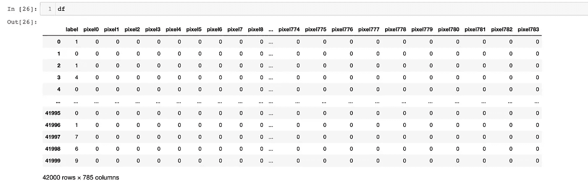

图一。训练数据集结构(图片由作者提供)。

对于 MNIST 数据帧，就像时尚 MNIST 一样，行代表数字样本；列是像素。但是第一列专用于数字的标签，我们将使用它进行训练和分类。

那么，MNIST 图像是如何制作的，又是如何呈现给图像识别算法的呢？图 1 中报告的数字“六”是从数据集中提取的样本之一。我们可以可视化这个示例，但是首先，我们需要重新处理我们通过向笔记本添加一个简单代码而创建的 *df* dataframe:

```
'''
use df.loc for splitting df in a dataframe with the training set values (784)
and in a dataframe containing only the labels (from 0 to 9)
'''
df_train = df.loc[:, (df.columns!='label')]
df_train = df_train.loc[:, df_train.columns!='names']
df_train_label = df.loc[:, df.columns=='label']

'''
assign the two dataframes to the two numpy.ndarray arrays X for the training
and y for the labels
'''

X = df_train.values
y = np.int64(df_train_label.values.flatten())
```

这个短代码使用 Pandas 方法*。loc* 用于将数据帧 *df* 拆分成两个数据帧 *df_train* 和 *df_train_label。第一个将包含我们将用于训练的 784 像素值；后者将只包含标签(从 0 到 9)。*

同样，代码将 *df_train* 和 *df_train_label* 分配给两个 *numpy.ndarray* 矩阵， *X* 用于训练， *y* 用于标签。这一步非常重要，因为所有计算都需要线性代数和矩阵乘积。熊猫数据帧方法*。价值观*适合我们。X 向量包含 42，000 个项目，每个项目包含 784 个灰度值的向量。我们可以使用索引访问单个项目，在本例中， *0，*数据集的第一个元素:

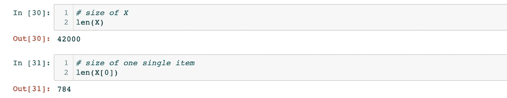

(图片由作者提供)。

我们还可以显示 *X[0]* 内容，看看它是如何制作的:

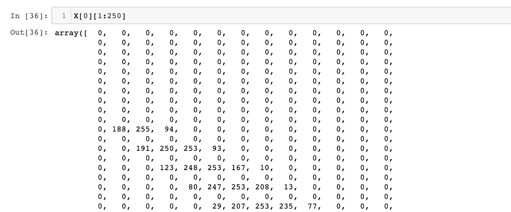

显示 X[0]内容(前 200 个值)(图片由作者提供)。

现在我们可以访问 X 向量了， *matplot* 函数 *imshow()* 将最终显示一张灰度 MNIST 手写图片，该图片由 784 个像素组成，以 28X28 像素的 2D 表示法来表示(图 2A)。例如，图像编号 3500 对应于数字“六”

```
'''
Reshape a 784-values vector extracted from one of the images
stored in the vector X (#3500) which represents a digit "six".
Use the NumPy method .reshape, specifiying the double argument '28'
then show the image with the function imshow, specifying the cmap='gray'
'''

image = X[3500].reshape(28,28)
imshow(image, cmap='gray')
```

但是为了正确显示图像，我们需要对 784 值向量进行整形，指定(28，28)作为方法[*numpy . shape*](https://numpy.org/doc/stable/reference/generated/numpy.reshape.html)*的参数。*代码将显示如图 2A 所示的数字:

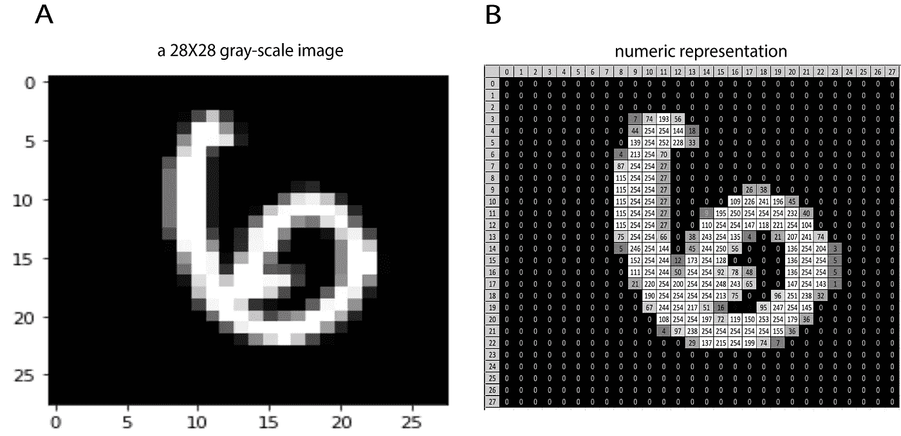

图二。手写数字。a:是来自 MNIST 数据集的灰度图像，B 是其数值表示(图像 MNIST 由作者精心制作)。

为了更好地理解这个概念，图 2B 中的图像是对图 2A 中灰度版本的数字表示的图形改编。每个像素对应 0-255 范围内的特定灰度值，其中 0 为黑色，255 为白色。

包含数据集标签的输出向量*y*是一个 *numpy.ndarray.*


下面的代码可视化了一组 50 个随机选取的数字；运行它以浏览数据集内容:

```
# Function for visualizing fifty randomly picked digits, from the dataset

def plotSamplesRandomly(X, y):
    %matplotlib inline

    # create a list of randomly picked indexes.
    # the function randint creates the list, picking numbers in a 
    # range 0-42000, which is the length of X

    randomSelect = [randint(0, len(X)) for i in range(0, 51)]

    # reshape all the pictures on the n X n pixels, 
    # where n = sqrt(size of X), in this case 28 = sqrt(784)
    w, h =int(np.sqrt(X.shape[1])), int(np.sqrt(X.shape[1]))
    fig=plt.figure(figsize=(int(np.sqrt(X.shape[1])), int(np.sqrt(X.shape[1]))))

    # Define a grid of 10 X 10 for the big plot. 
    columns = 10
    rows = 10

    # The for loop
    for i in range(1, 51):

        # create the 2-dimensional picture
        image = X[randomSelect[i]].reshape(w,h)
        ax = fig.add_subplot(rows, columns, i)

        # create a title for each pictures, containing #index and label
        title = "#"+str(randomSelect[i])+"; "+"y="+str(y[randomSelect[i]])

        # set the title font size
        ax.set_title(title, fontsize=20)        

        # don't display the axis
        ax.set_axis_off()

        # plot the image in grayscale
        plt.imshow(image, cmap='gray')

    plt.show()
```

代码定义了一个名为“plotSamplesRandomly”的函数，该函数在分配了一个“randomSelect”索引列表以传递给循环的*中的 *X* 向量后，创建了一个包含 50 个图像的管道。*

结果如图 3 所示:

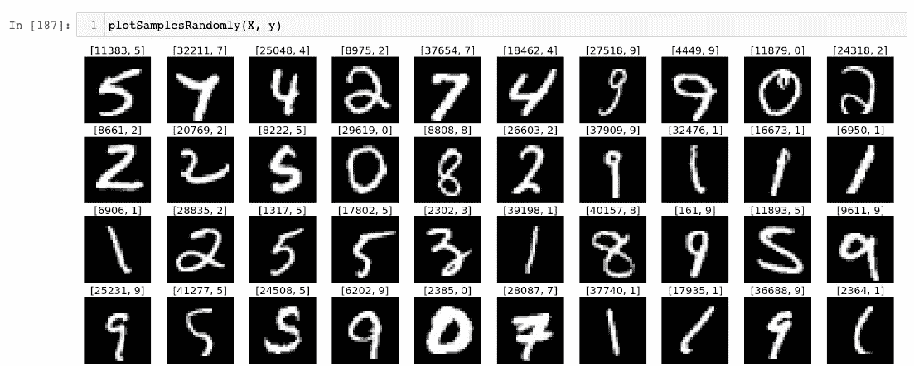

图 3:MNIST 数据集中数字的可视化

## 一对一算法解释。

一对一算法是 LR 的一种特殊实现，它由不同的二元分类器组成。提醒你一下，LR 假设是:

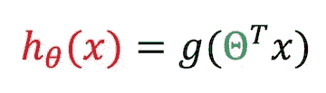

(图片由作者提供)。

***g*** 函数使用转换后的 *θ* *向量*与 X v *向量*的乘积作为参数。这个自变量被称为 *z，*，它被定义为:


(图片由作者提供)。

这意味着 *g(z)* 函数是一个 *sigmoid 函数* ( *逻辑函数)并且*是非线性的。因此，LR 成本函数计算如下:

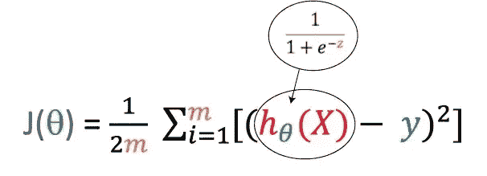

(图片由作者提供)。

Python 中 sigmoid 函数的实现如下:

```
# The Logistic Regression Sigmoid Function (The g function)

def sigmoid(z): 
    return 1 / (1 + np.exp(-z))
```

我们需要保证梯度下降将收敛到全局最小值，避免非凸的问题 *J(θ)，*而不是发生在[线性回归梯度](/machine-learning-for-biomedical-data-linear-regression-7d43461cdfa9)。(参见图 4B)。

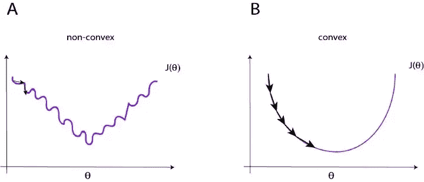

图 4:非凸与凸代价函数(图片由作者提供)。

因此，我们必须重写成本函数，以保证凸的 *J(θ)* :

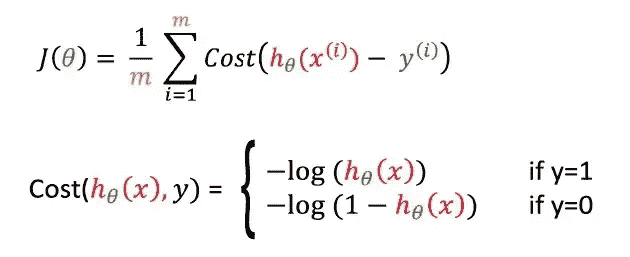

(图片由作者提供)

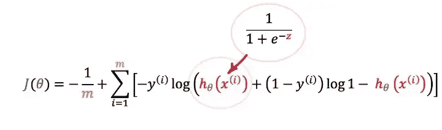

(图片由作者提供)。

重写 LR 成本函数，它将看起来像*图 5* 的红色曲线:

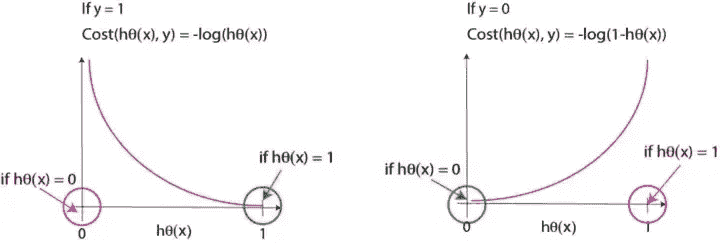

图 5:绘制 Logistic 回归成本函数(图片由作者提供)。

例如，如果我们有两个二进制条件，比如数字 0 和数字 1，代表我们的结果( *y* )，如果 y=1，我们关于 *y* 的假设预测的成本函数是:

> 如果 ***y = 1*** ，但是我们预测 ***hθ(x) = 0* ，**我们会以相当大的代价来惩罚学习算法(参见图 5 中的**红色曲线**，因为在这种情况下，代价将趋于无穷大。相反，如果我们的预测是 ***hθ(x) = 1，*** (从而等于 *y* )，那么成本将会是 0。

在****y = 0***的情况下，我们有相反的情况:*

> *如果****y = 0***并且我们预测 ***hθ(x) = 0* ，**成本将为 0，因为我们的假设与 y 匹配，而如果我们的预测是 ***hθ(x) = 1*** ，我们最终将付出非常大的成本。**

**此外，LR 成本函数必须“正则化”，这意味着我们需要添加额外的特征来达到更好的假设，并避免拟合不足的问题(有关更多信息，[请参见这篇专门讨论正则化逻辑回归的文章](/detecting-melanoma-with-one-vs-all-f84bc6dd0479)):**

**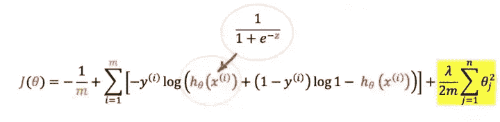**

**(图片由作者提供)。**

**正则化成本函数的一种合适方法是通过收缩我们添加的所有θ参数来修改成本函数，以获得特征的额外高阶多项式项。尽管如此，由于我们不知道什么参数对于收缩是必要的，我们需要通过在末尾添加一个项来收缩所有的 thetas。新的正则项在公式中以黄色突出显示，将收缩所有θ。不惩罚θ0 至关重要。 *lambda* 的作用是收缩θ，所以如果 *lambda* 极大，假设 *h* 就会欠填充。**

**正则化 LR 成本函数的实现是:**

```
**# Logistic Regression Cost Function (Regularized)

def calcLrRegCostFunction(theta, X, y, lambd):

    # number of training examples
    m,n = X.shape  

    # Calculate h = X * theta (we are using vectorized version)
    h = X.dot(theta) 

    # Calculate the Cost J
    J = (np.sum(np.multiply(-y,np.log(sigmoid(h))) - \
                 np.multiply((1.0 - y),np.log(1.0 - sigmoid(h)))) /m) + \
                 np.sum(theta[1:]**2) * lambd / (2 * m)    

    return J**
```

**我们感兴趣的是使用 ***梯度下降*** *，*找到成本函数的最小值，这是一个可以使这种搜索自动化的过程。梯度下降计算*成本函数*的导数，通过参数 *α、*的平均值更新向量 *θ* ，即学习率。*梯度下降*使用数据集的实际矢量 *y* 和 *h* 矢量预测之间的差来“学习”如何找到最小成本函数。该算法将重复直到它收敛。 *θ* 更新必须同时进行。**

**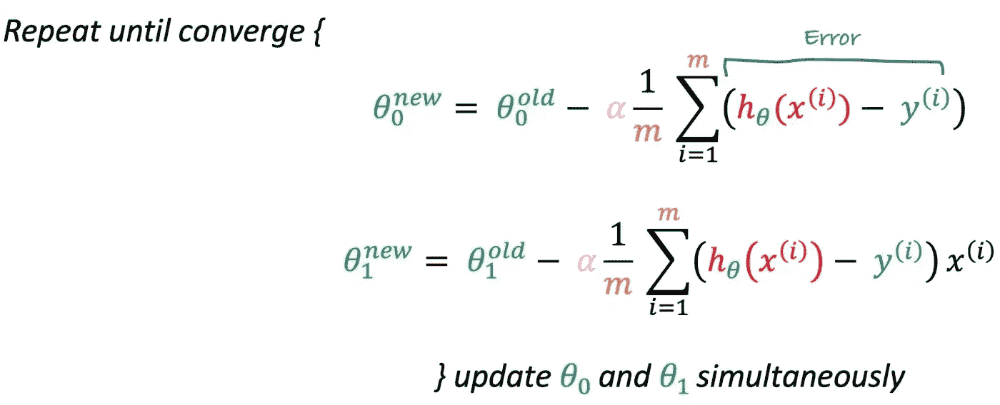**

**(图片由作者提供)。**

**正则化梯度函数的实现将是:**

```
**# Logistic Regression Gradient (Regularized)

def calcLrRegGradient(theta, X, y, lambd):

    # number of training examples
    m,n = X.shape  

    # Calculate h = X * theta (we are using vectorized version)
    h = X.dot(theta) 

    # Calculate the error = (h - y)
    error = np.subtract(sigmoid(h), y)    

    # Calculate the new theta
    theta_temp = theta
    theta_temp[0] = 0.0
    gradient = np.sum((((X.T).dot(np.divide(error,m))), theta_temp.dot(np.divide(lambd,m)) ), axis=0   )

    return gradient**
```

**我们需要十个不同的二元分类器用于一对一和 MNIST 数据集(从 0 到 9 的十个数字)。我们知道每个数据集图像由 784 个像素组成，这意味着我们有 784 个特征。该算法是一个多元回归，这意味着我们必须将多个特征(784 像素)与一个特定的标签相关联。该算法可以逐步对特征进行分类，最初尝试每次将两个特征关联到一个标签，直到所有特征都被分类。**

**假设我们在第一步中从两个特征 pixel_1 和 pixel_2 收集值，这两个特征具有三个标签 0、1 和 2。在这种情况下，该算法将三个标签中的两个分配给负类；比方说，标签 0 和 1 被分配给负类，而剩余的标签 2 被分配给正类。该算法前进到第二步，将负类分配给另一对标签(0 和 2)，将正类分配给标签 1；在第三步中，我们将把标签 1 和 2 标记为负，把标签 0 标记为正。因此，对于三标签分类，我们有三个分类器，每个分类器都被训练来识别三个标签中的一个。对于每个标签*、*,*一对一*训练逻辑回归分类器 hθ(x)，以预测 y=1 的概率。每次计算都对应一系列θ值，这些值必须乘以向量 *X.* 。最后，该算法将只选取一个将 hθ(x)最大化的标签。**

***图 6* 将解释一对多的过程:**

**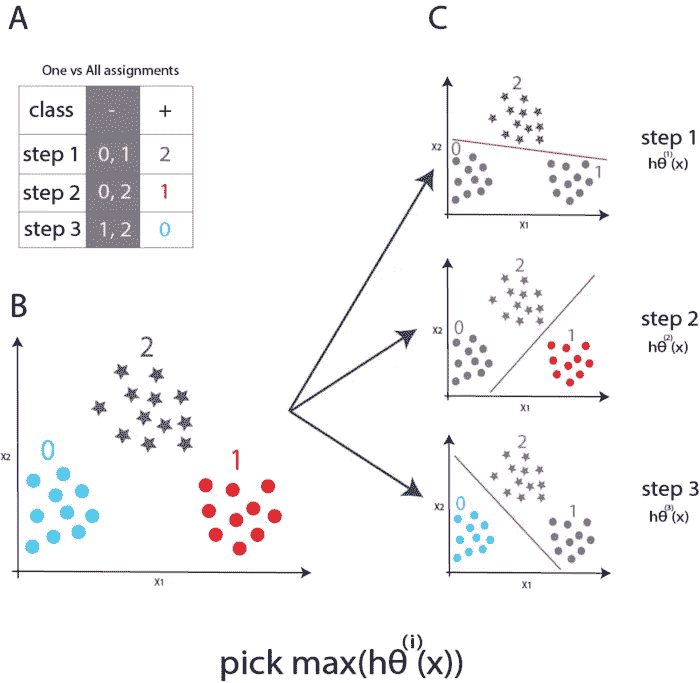**

**图 6。OneVsAll 算法。图 6B:考虑来自两个特征 x1 和 x2 的值:该算法包括在三个步骤中实现的三个不同的二元分类器。第一步将标签 0 和 1 的值分配给负类，将标签 2 的值分配给正类。第二步将负类分配给另一对标签(0 和 2)，将正类分配给标签 1。在第三步中，我们将 1 和 2 标记为负，0 标记为正(图 4A 和 4C)。最后，算法将只挑选一个将 hθ(x)最大化的标签(图片由作者提供)。**

**让我们看看完整的一对一的 python 代码:**

```
**# One-vs-All

def oneVsAll(X, y, lambd):    
    m , n = X.shape;
    num_labels = max(set(y))+1
    all_theta = np.array(np.zeros(num_labels * (n+1))).reshape(num_labels,n+1)
    initial_theta = np.zeros(n+1)

    # Add a column of 'ones' to X
    # Add a column of ones to the X matrix
    X = np.vstack((np.ones(m), X.T)).T        

    for i in range(0, num_labels):
        in_args = (X, (( y == i).astype(int)), lambd)
        theta = opt.fmin_cg(calcLrRegCostFunction, 
                            initial_theta,
                            fprime=calcLrRegGradient, 
                            args=in_args, 
                            maxiter=50, 
                            gtol=1e-4, 
                            full_output=False)

        all_theta[i:] = theta.T

    return all_theta**
```

**函数 *oneVsAll* 接受两个向量 X、y 和λ作为自变量，并调用优化函数 [scipy 函数](https://docs.scipy.org/doc/scipy/reference/generated/scipy.optimize.fmin_cg.html)，该函数使用非线性共轭梯度算法最小化成本函数。这个函数很复杂，深入的解释超出了本文的目的。读者可以通过 scipy 提供的[共轭梯度](https://docs.scipy.org/doc/scipy/reference/generated/scipy.optimize.fmin_cg.html)的链接找到更多信息。**

**现在所有代码(或几乎所有代码)都准备好了，我们将运行 onVsAll 函数，在新的 Jupyter 笔记本单元格中键入:**

```
**# Run oneVsAll

lambd = 0.01
all_thetas = oneVsAll(X, y, lambd)**
```

**该函数执行训练阶段，由收敛到最小值并收集所有θ参数的一系列循环来表示。每个步骤的编号对应于标签编号:**

```
**Warning: Maximum number of iterations has been exceeded.
         Current function value: 0.023158
         Iterations: 50
         Function evaluations: 105
         Gradient evaluations: 105
Warning: Maximum number of iterations has been exceeded.
         Current function value: 0.020032
         Iterations: 50
         Function evaluations: 102
         Gradient evaluations: 102
Warning: Maximum number of iterations has been exceeded.
         Current function value: 0.068189
         Iterations: 50
         Function evaluations: 98
         Gradient evaluations: 98
Warning: Maximum number of iterations has been exceeded.
         Current function value: 0.088087
         Iterations: 50
         Function evaluations: 97
         Gradient evaluations: 97
Warning: Maximum number of iterations has been exceeded.
         Current function value: 0.047926
         Iterations: 50
         Function evaluations: 93
         Gradient evaluations: 93
Warning: Maximum number of iterations has been exceeded.
         Current function value: 0.086880
         Iterations: 50
         Function evaluations: 106
         Gradient evaluations: 106

(to be continued)**
```

**整个游程的乘积再次是包含成本函数最小化所需的所有θ向量的 numpy.ndarray 向量。**

**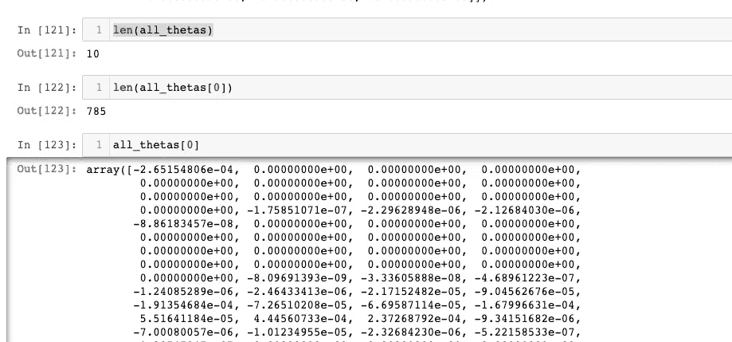**

**(图片由作者提供)。**

**all_theta 向量的长度等于 10，即标签的数量；每个θ向量都有图像的精确大小(784，加 1，因为我们在训练阶段给 X 向量加了 1)。**

**既然梯度已经收敛，让我们用一小段代码来看看它的预测精度:**

```
**def predictOneVsAll(all_thetas, X):
    m , n = X.shape
    X = np.vstack((np.ones(m), X.T)).T    
    # This line calculate the max Theta
    prediction = np.argmax(sigmoid( np.dot(X,all_thetas.T) ), axis=1)
    print('Training Set Accuracy: {:f}'.format( ( np.mean(prediction == y )*100 ) ) )
    return prediction**
```

**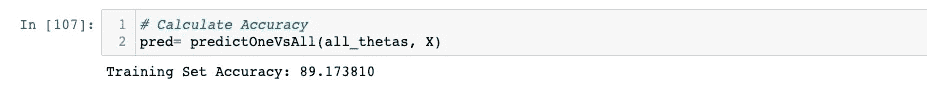**

**(图片由作者提供)。**

***predictOneVSAll* 函数的目的是将 OneVSAll 运行期间获得的θ值与转置的 X 向量相乘。结果作为所有预测的平均值返回，并转换为百分比。MNIST 数据集的预测精度为 89.17。我们将把结果收集到一个新的变量中，我们称之为“pred”此变量是另一个 numpy.ndarray 它的大小和 X(42000)一样，包含了 oneVsAll 所做的所有预测。**

**看到算法的运行将会很棒，展示一些具体的结果。这段代码适合我们，它代表了我们用来从数据集中随机显示数字的先前代码的修改版本。它将向量 *X，* *y* 作为参数，加上之前创建的向量 *pred* :**

```
**# Function for visualizing fifty randomly picked digits with their prediction.
# Code for testing the oneVsAll function

def plotSamplesRandomlyWithPrediction(X, y, pred):
    %matplotlib inline

    # create a list of randomly picked indexes.
    # the function randint creates the list, picking numbers in a 
    # range 0-42000, which is the length of X

    randomSelect = [randint(0, len(X)) for i in range(0, 51)]

    # reshape all the pictures on the n X n pixels, 
    # where n = sqrt(size of X), in this case 28 = sqrt(784)
    w, h =int(np.sqrt(X.shape[1])), int(np.sqrt(X.shape[1]))
    fig=plt.figure(figsize=(int(np.sqrt(X.shape[1])), int(np.sqrt(X.shape[1]))))

    # Define a grid of 10 X 10 for the big plot. 
    columns = 10
    rows = 10

    # The for loop
    for i in range(1, 51):

        # create the 2-dimensional picture
        image = X[randomSelect[i]].reshape(w,h)
        ax = fig.add_subplot(rows, columns, i)

        # create a title for each pictures, containing #index and label
        title = "#"+str(randomSelect[i])+"; "+"y:"+str(y[randomSelect[i]])+"; "+"p:"+str(pred[randomSelect[i]])

        # set the title font size
        ax.set_title(title, fontsize=15)        

        # don't display the axis
        ax.set_axis_off()

        # plot the image in grayscale
        plt.imshow(image, cmap='gray')

    plt.show()**
```

**唯一的区别在这行:**

```
**title = "#"+str(randomSelect[i])+";"+\
"y:"+str(y[randomSelect[i]])+"; "+\
"p:"+str(pred[randomSelect[i]])**
```

**变量“标题”在这里被执行用于显示图像 ID、实际 *y* 值和预测值。代码的部分输出如图 7 所示:**

**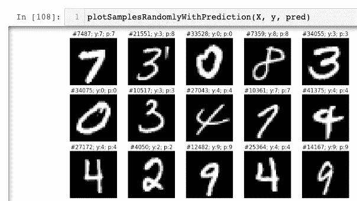**

**图 7:来自 MNIST 数据集的数字预测图**

**对于每个数字，该算法报告其预测的准确率为 89%。**

**以下代码显示了识别一个数字时算法的活动；它采用 X、y、all_thetas、图像 ID 和 pred(包含所有预测的向量):**

```
**def plotOneSample(X, y, all_thetas, imageID, pred):

    # Make a copy of X
    X_original = X
    m , n = X.shape
    X = np.vstack((np.ones(m), X.T)).T    
    MaxTheta = max(sigmoid(np.dot(X[imageID],all_thetas.T)))

    # apply all the theta matrix on a specific X
    MaxThetaPosition = sigmoid(np.dot(X[imageID],all_thetas.T))

    %matplotlib inline
    w, h = int(np.sqrt(X.shape[1])), int(np.sqrt(X.shape[1]))

    image = X_original[imageID].reshape(w,h)
    imshow(image, cmap='gray')

    MaxThetaDf = pd.DataFrame(MaxThetaPosition.tolist()) 
    for col in MaxThetaDf.columns:
        predictedCategory = MaxThetaDf[MaxThetaDf[col] == MaxTheta].index.tolist()

    print(str("Real digit: "+str(y[imageID])))
    print(str("Max Theta: "+str(MaxTheta)))        
    print(str("Precicted category: "+str(predictedCategory[0])))
    print ("\n")
    print(MaxThetaDf)

    return**
```

**输出显示了如何在其他九个矢量中选择最佳的θ矢量。最佳θ确实用于预测标签:**

**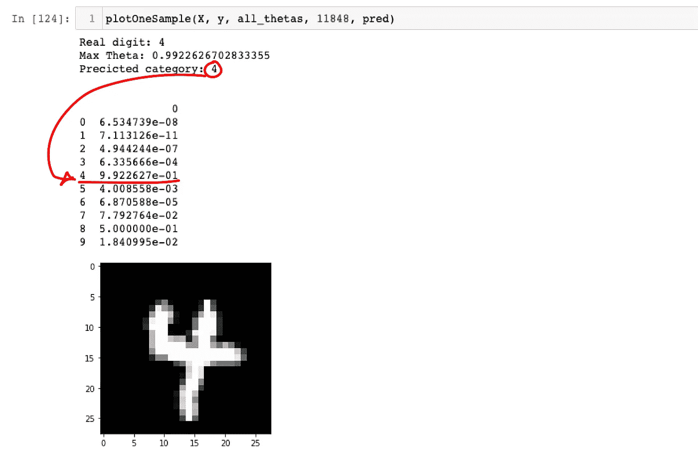**

**图 8:从 MNIST 数据集中为数字 4 选择最佳θ**

## **其他数据集的实验**

**您可以使用建议的另一个数据集尝试这里描述的代码。**

```
**df = pd.read_csv("YourPath/fashion-mnist_train.csv")**
```

**来自 Zalando 的数据集“fashion-mnist_train.csv”的预测准确率为 85.74 %**

****

**图 9:预测时尚-MNIST。(图片来自时尚 MNIST 数据集)**

## **结论**

**一对一算法是一种很好的图像分类算法。它是逻辑回归的更复杂的阐述，继承了 sigmoid 函数、正则化和梯度。我们使用的 MNIST 和时尚-MNIST 代表了用于训练这种算法的数据集的最佳示例，因为每张照片都有很好的对比度，并且有整洁的背景，从而导致良好的预测准确性。如果您尝试处理包含更多灰度级和更复杂背景的其他列表，预测准确度会非常低。无论如何，分类性能是快速的，并且该特征使得一对一算法适用于计算机视觉中的许多令人兴奋的应用。**

**我希望这篇文章对你有帮助！**

# **参考文献。**

**作者制作了所有图像，包括包含公式的图形，除了 MNIST 和时尚 MNIST 图像，它们属于各自的数据集。**

1.  **Y.LeCun、L. Bottou、Y. Bengio 和 P. Haffner。"基于梯度的学习应用于文档识别."IEEE 会议录，86(11):2278–2324，1998 年 11 月。[【上线](http://yann.lecun.com/exdb/publis/pdf/lecun-98.pdf)版本】**
2.  **[来自 Kaggle](https://www.kaggle.com/datasets/oddrationale/mnist-in-csv) 的 MNIST 属于知识共享 [CC0 公有领域。](https://creativecommons.org/publicdomain/zero/1.0/)**
3.  **[时尚-来自 Kaggle 的 MNIST](https://www.kaggle.com/datasets/zalando-research/fashionmnist)受麻省理工学院许可(MIT)版权【2017】Zalando SE、[https://tech.zalando.com](https://tech.zalando.com/)**
4.  **[Luca Zammataro，**一个或多个变量的线性回归**，走向数据科学，2019](/machine-learning-for-biomedical-data-linear-regression-7d43461cdfa9)**
5.  **[Luca Zammataro，**癌症中恶性肿瘤预测的逻辑回归**，走向数据科学，2019](https://medium.com/towards-data-science/logistic-regression-for-malignancy-prediction-in-cancer-27b1a1960184)**
6.  **[Luca Zammataro，**以一对多**检测黑色素瘤，走向数据科学，2020 年](/detecting-melanoma-with-one-vs-all-f84bc6dd0479)**
7.  **[Andrew NG，**机器学习** | Coursera](https://www.coursera.org/learn/machine-learning)**
8.  **克里斯·阿尔邦(Chris Albon)，**机器学习与 Python 食谱**，O'Really，ISBN-13:978–1491989388。**