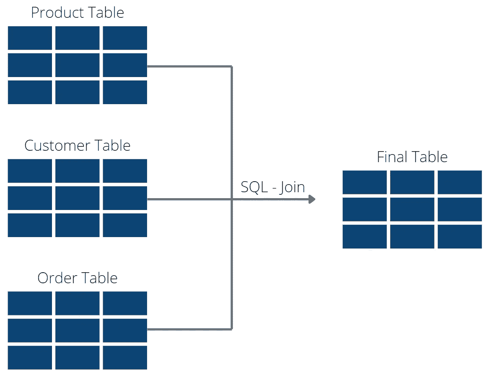
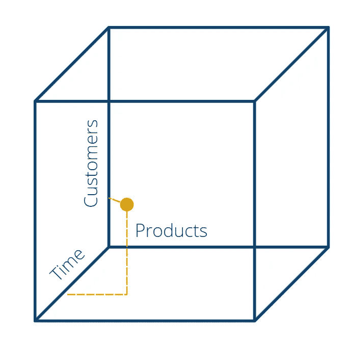
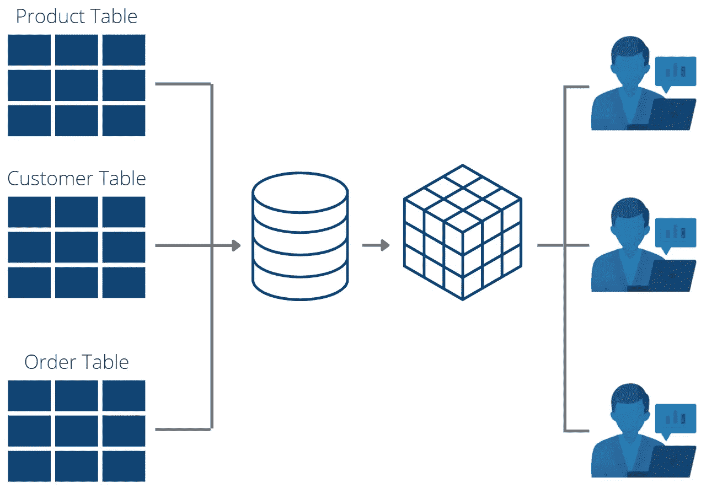

# 在线分析处理(OLAP)及其对数据科学的影响

> 原文：<https://towardsdatascience.com/online-analytical-processing-olap-and-its-influence-on-data-science-c386bc96a736>

## 定义 OLAP 及其与 OLTP 的区别

照片由 [Unsplash](https://unsplash.com?utm_source=medium&utm_medium=referral) 上的 GuerrillaBuzz Crypto PR 拍摄

在线分析处理(OLAP)是一种组织大型、杂乱的[数据库](https://databasecamp.de/en/data/database)的技术，以便可以从多个角度对它们进行商业智能应用分析。它在数据科学领域尤其重要，因为它通常是更深入分析的良好起点。

# 在线分析处理是如何工作的？

在线分析处理用于为数据挖掘或商业智能优化数据库，并加速查询。在这个过程中，关系表中的数据被重新构造，并按维度分别存储在所谓的多维数据集中。这些多维数据集包含许多业务分析师需要的最常查询的维度和值。

在该体系结构中，这会产生两个数据库:

1.  [**数据仓库**](https://databasecamp.de/daten/data-warehouse) :这里存储的是来自源系统的原始表和行。如果需要详细访问特定的行，可以查询数据仓库。例如，数据仓库中的一个表包含所有订单的详细信息。这里的每一行恰好对应一个订单，甚至一个订单项目。
2.  **OLAP —数据库**:这些数据库试图聚集经常使用的列(维度)并将它们保存在内存中。这对于计算聚合关键数字的商业智能应用程序尤其重要。例如，对于管理层来说，每月的营业额是决定性的，所以不是每一单订单都必须保持连续。

 [## 数据仓库综合指南

### 您需要知道的一切，包括与数据湖的比较

towardsdatascience.com](/comprehensive-guide-to-data-warehouses-6374617f45d5) 

# 什么是 OLAP 立方体？

一旦数据集要在图中显示，我们就需要两个不同的概念:维度和值。维度是每一个评价的基础，代表一个独立的值。例如，如果我们的数据集包含去年的销售数据，则存在维度“订单日期”、“客户编号”或“产品编号”。相比之下，有一些数值，是我们在图表中可以依靠的具体数字，例如，销售量或营业额。

然后，至少一个维度和一个关键数字的组合创建图表。例如，条形图可以使用客户号作为维度，销售额作为值。结果是一个视图，从中可以读取最高销售额的产品。简而言之，这就是商业智能的工作方式。各种维度和值被组合到图表中，这应该有助于回答业务环境中的特定问题。

传统的数据库没有针对这种查询进行优化，因此导致了缓慢而低效的事务，尤其是在同时查询几个维度时。这里有一个具体的例子可以说明这个问题:

对于销售评估，我们需要整合三个维度，一个客户维度(例如客户名称)、一个产品维度(例如产品名称)和一个时间维度(例如订单日期)。由于关系数据库的规范化，所有这些信息都存储在不同的数据库表中。为了将它们结合在一起，我们需要使用 SQL 中的连接操作。

三个表的 SQL 连接|图片:作者

为此，OLAP 使用了所谓的立方体。其中，几个维度可以表示为立方体的轴。这些值就是立方体空间中的一个具体点。因此，我们可以将客户、产品和时间这三个维度表示为立方体轴。

然后，所有商业智能用户都可以访问此多维数据集结构并进行查询。这避免了对数据库的多次连接查询，并使事务更快、更有效。当然，立方体中可以包含三个以上的维度。在这种情况下，立方体仅用作图示支持，不应理解为实际的立方体。例如，从第四维度来看，整个事物不能再用立方体来表示，但仍然可以使用在线分析处理。

OLAP 立方体的例子|图片:作者

# 立方体使哪些操作成为可能？

对于分析师来说，划分为立方体带来了全新的可能性，这是传统的关系数据库所无法实现的，或者只有大量的计算工作才能实现。总的来说，OLAP 立方体的操作可以分为五类:

*   **切片**:在切片中，通过将其中一个维度设置为固定值，只考虑立方体的一部分(一个切片)。在我们的例子中，这可能是一个特定的产品，考虑了所有客户和所有订单时间。
*   **切割**:切割比切片更受限制，因为它设置了多个维度。例如，我们可以查看特定客户在 2022 年 6 月的所有产品，因此产品维度仍然是灵活的，但是客户和订单日期维度将是固定的。
*   **下钻/上钻**:在此类别中，分析师可以选择从汇总视图下钻至详细级别(下钻)或从详细级别上钻至汇总级别(上钻)。如果您首先查看整个月的销售额，然后切换到列出每天销售额的视图，那么您正在进行向下钻取。
*   **汇总**:在这种情况下，一个维度的所有值被汇总。例如，如果公司的销售额追溯到三年前，则将最后三年的全部销售额相加并输出。
*   **支点**:这个类别有些抽象，因为它给了分析师思考新想法和掷骰子的机会，带来了一个新的、可能被忽视的维度。例如，在商业智能中，查看一段时间内的销售额是非常常见的。然而，OLAP 立方体也可以将单个客户或产品的视图带回前台。

# 使用 OLAP 的优点和缺点是什么？

OLAP 的使用使得频繁查询比传统的关系表更加灵活和高效，而传统的关系表当然不是为此目的而设计的。此外，它们还通过 OLAP 魔方提供的操作，为商业智能中的数据提供全新的视角。

使用 OLAP 魔方的商业分析师|图片:作者

只有少数几点反对使用在线分析处理，尽管如此，OLAP 的传播仍然很低。这主要是由于关于 OLAP 的知识还不像例如 SQL 那样广泛，SQL 现在几乎在每一个继续教育或学习中都被教授。因此，必须首先对人员进行培训，或者必须高价购买技术诀窍。

至于在线分析处理的实际功能，分析仅限于可以用数字表示的数据。否则，它们无法在立方体的坐标系中表示。例如，对于来自社交媒体挖掘的文本数据，为了使用 OLAP，必须首先找到数字表示。

# 有哪些不同类型的在线分析处理？

在线分析处理系统总共可以分为三种不同的类型。这些是:

1.  **多维在线分析处理(MOLAP)** :这是最常用的形式，形成多维立方体。虽然立方体的形成需要相对长的时间，但是查询非常快速和有效。这种形式特别适用于数值字段。
2.  **关系在线分析处理(ROLAP)** :这种类型去掉了立方体，而是直接在关系表上工作。在 [ETL](https://databasecamp.de/en/data/etl-en) 过程中，数据仓库被提供了聚集表。这些可以使用 SQL 查询。
3.  **混合在线分析处理(HOLAP)** :这是前两种类型的结合。部分数据存储在传统的 MOLAP 多维数据集中，其余部分存储在 ROLAP 存储中。

 [## 初学者指南:提取、转换、加载(ETL)

### 了解数据分析中的大数据原理

towardsdatascience.com](/beginners-guide-extract-transform-load-etl-49104a8f9294) 

# OLTP 和 OLAP 的比较

OLAP(表示联机分析处理)和 OLTP(表示联机事务处理)这两个缩写经常被错误地联系在一起，因为这两个名称具有相似的结构。然而，事实上，这些术语根本没有多少共同点，只是描述了不同的概念。

**在线事务处理(OLTP)** 描述专门从事快速事务处理的系统。主要的焦点是让前端的相关人员相对容易地处理他们的交易，例如在收银台。

**另一方面，在线分析处理(OLAP)** 是一个在数据库中进行更简单数据分析的平台。因此，它主要由[业务分析师](https://databasecamp.de/en/ml-blog/business-analysts)或[数据科学家](https://databasecamp.de/en/ml-blog/data-scientists)在后端使用，以分析业务数据并找到有助于公司进一步发展的部分复杂的相关性。

从技术的角度来看，差异变得更加明显，正如由 IBM[汇编的以下几点所示:](https://www.ibm.com/cloud/learn/oltp)

*   OLTP 查询通常基于单个数据记录来处理事务，而 OLAP 查询大量数据记录。
*   在联机事务处理中，响应时间起着重要作用，而在联机分析处理中，分析与时间无关，在许多情况下可能需要更长时间。
*   在联机分析处理中，数据不被修改，而只是被分析。在线事务处理用每个传入的事务修改数据库。
*   OLTP 的存储需求相对较小，因为尽管存储了许多事务，但它们具有清晰的结构和有限的列数。另一方面，OLAP 处理大量的数据，因为信息来自不同的数据库并被合并是很常见的。

# 这是你应该带走的东西

*   在线分析处理是一种组织商业智能中使用的大型数据库的技术。
*   维度和值被组织在所谓的 OLAP 立方体中。这导致分析师的不同操作和数据的新视图。
*   与传统数据库相比，OLAP 的使用主要提供了数据检索的效率优势。

*如果你喜欢我的作品，请在这里订阅***或者查看我的网站* [*数据大本营*](http://www.databasecamp.de/en/homepage) *！还有，medium 允许你每月免费阅读* ***3 篇*** *。如果你希望有****无限制的*** *访问我的文章和数以千计的精彩文章，不要犹豫，点击我的推荐链接:*[【https://medium.com/@niklas_lang/membership】](https://medium.com/@niklas_lang/membership)每月花$***5****获得会员资格**

* [## 了解微服务

### 将复杂的软件拆分或不拆分成独立服务的原因

towardsdatascience.com](/getting-to-know-microservices-da5a836a7abd)  [## 软件即服务:小型 IT 部门的游戏规则改变者

### 软件即服务简介，与内部解决方案进行比较

towardsdatascience.com](/software-as-a-service-the-game-changer-for-small-it-departments-f841b292b02a)  [## Apache Hadoop 分布式文件系统简介

### 关于这个 Hadoop 组件，您需要了解的一切

towardsdatascience.com](/introduction-to-apache-hadoop-distributed-file-system-99cb98d175c)*