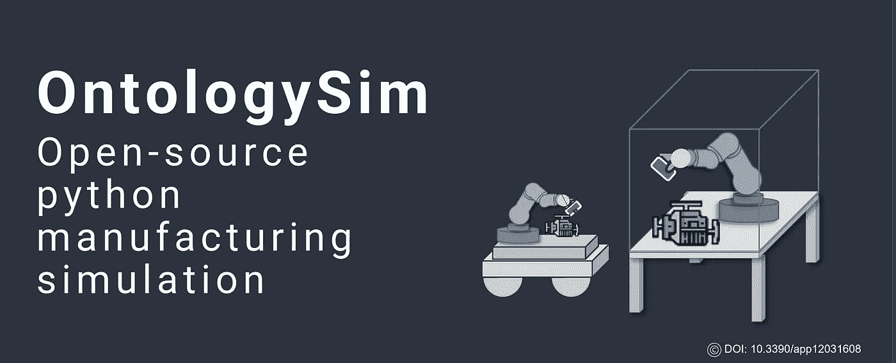
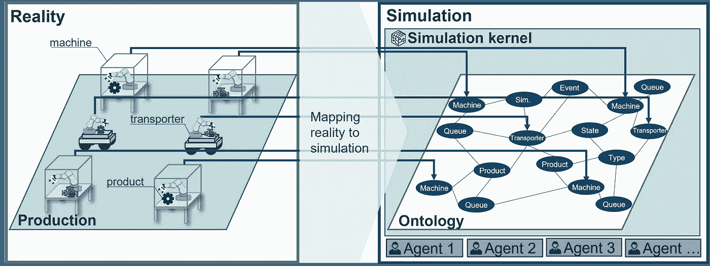
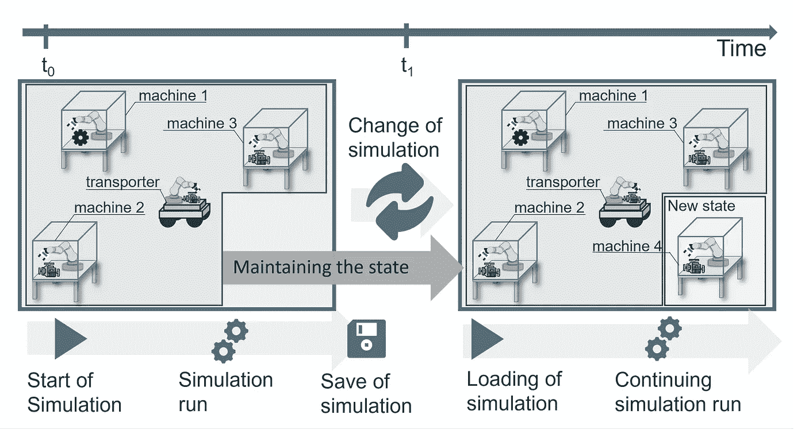

# OntoloySim:基于本体的 Python 生产模拟

> 原文：<https://towardsdatascience.com/ontoloysim-an-ontology-based-production-simulation-for-python-fd8c40cd8a4>

## **离散模块化仿真库，可选择保存和加载仿真状态**



来源:作者图片

# **动机**

OntologySim 库的开发是由实现模拟(生产系统的离散事件模拟)的想法驱动的，这种模拟可以在任何时候保存。因此，完整的状态存储在本体中，并且可以从外部修改或分析。修改后，模拟可以以完全相同的状态重新开始。因此，它为使用数字双胞胎和数据分析创造了新的可能性。作为本体的模拟的一致实现使得这成为可能。此外，基于本体的模拟允许关于所使用的生产系统的高度灵活性，无论是矩阵、生产线还是车间生产。



一个基于本体的仿真模型的概要，来源:图片作者[1]

# **本体论导论**

本体论实现的特殊特征是使用本体论作为数据存储器和模拟状态存储器的一致实现。本体是知识库中知识的正式描述。在这种情况下，owlready2.0 用作模拟开发的基础。本体建模允许在任何时候灵活添加机器、流程、运输商或其他实体。



本体论的主要思想，来源:作者图片[1]

# **优点**

*   保存，模拟加载
*   轻松交换策略的可能性
*   运行时扩展和调整模拟
*   该图书馆在 GPLv3 名下

# **如何建立本体论**

在下文中，使用一个简单的示例来呈现模拟的创建。

**1)安装**

安装要求 Python >3.6，以下两种安装类型可用:

```
pip install ontologysim
```

或者通过 GitHub

```
git clone https://github.com/larsKiefer/ontologysim
cd ontologysim
pip3 install -r requirements.txt
```

# **2)本体论的使用**

为了使用 ontologySim，每个文件中需要以下导入

```
import ontologysim
```

如果使用来自 GitHub 的代码，您可以直接跳转到示例文件夹，其中已经预先配置了包含 ini 文件的可执行文件 Main.py。

# **3) Ini 文件**

模拟运行的第一步是创建各种 ini 文件。ini 文件是模拟初始化的基础。

**3.1)生产文件:定义任务和生产布局** 在本例中，使用 2 台机器和 2 种产品类型创建模拟。保存在以下 ini 文件中。

**3.2) Owl-File:定义保存** 该 ini 文件定义在仿真运行期间是否应该创建 Owl 文件，作为一个完整的仿真(状态)图像。

**3.3)控制器文件:定义控制策略** 本体论允许选择不同的控制器，如 FIFO，或使用定制的编程策略。由于本体，在给定状态下可用的每个信息也可用于控制策略的定义。

**3.4) Logger-File:定义 KPI 和事件
的保存。最后，定义 KPI(基于 ISO 22400)如何保存以及是否保存。**

# 4)主文件

配置完成后，可以开始模拟运行。

# **5)结果**

作为模拟运行的结果，可以存储超过 50 个 KPI。因此，KPI 可通过自由可用的时间范围作为时间序列获得，以及汇总的 KPI 值。模拟的结果和状态可以用不同的方式保存。一方面，模拟的状态可以导出为 owl 文件。另一方面，KPI 可以存储为 CSV 或存储在数据库中。

# **如何改进这个例子？**

正如已经提到的，这只是对基于本体的模拟的简短介绍。更多的例子和预配置文件可以在 GitHub 资源库的 example 文件夹下找到。

GitHub:[https://github.com/larsKiefer/ontologysim](https://github.com/larsKiefer/ontologysim)

PyPi:[https://pypi.org/project/ontologysim/](https://pypi.org/project/ontologysim/)

阅读文件:[https://ontologysim.readthedocs.io/en/latest/](https://ontologysim.readthedocs.io/en/latest/)

# 结论

感谢阅读。如果你有什么要补充的，欢迎随时留言评论！

关于本体论的技术解释、基础知识和文献综述，可以在这里查阅该杂志:[https://www.mdpi.com/2076-3417/12/3/1608](https://www.mdpi.com/2076-3417/12/3/1608)。

感谢这项工作的合作者发表本文:马文·卡尔·梅([@马文。5 月](https://medium.com/@marvin.may)、安德烈亚斯·库恩勒和吉塞拉·兰扎

这项研究工作是在 DIGIMAN4.0 项目(“零缺陷工业 4.0 生产的数字制造技术”，[https://www.digiman4-0.mek.dtu.dk/](https://www.digiman4-0.mek.dtu.dk/))的背景下进行的。IGIMAN4.0 是一个由欧盟研究和创新框架计划“地平线 2020”支持的欧洲培训网络(项目 ID: 814225)

# 来源

[1]: May MC，Kiefer L，Kuhnle A，Lanza G .基于本体的生产模拟与本体主义。*应用科学*。2022;12(3):1608.https://doi.org/10.3390/app12031608