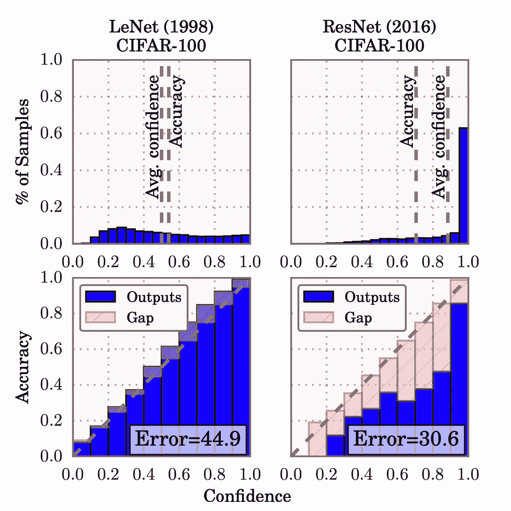
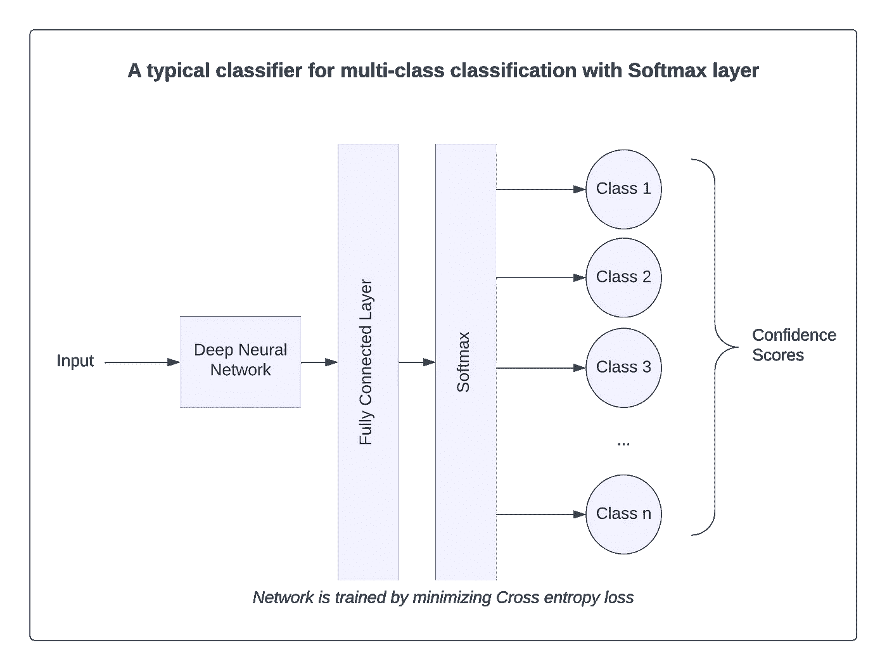
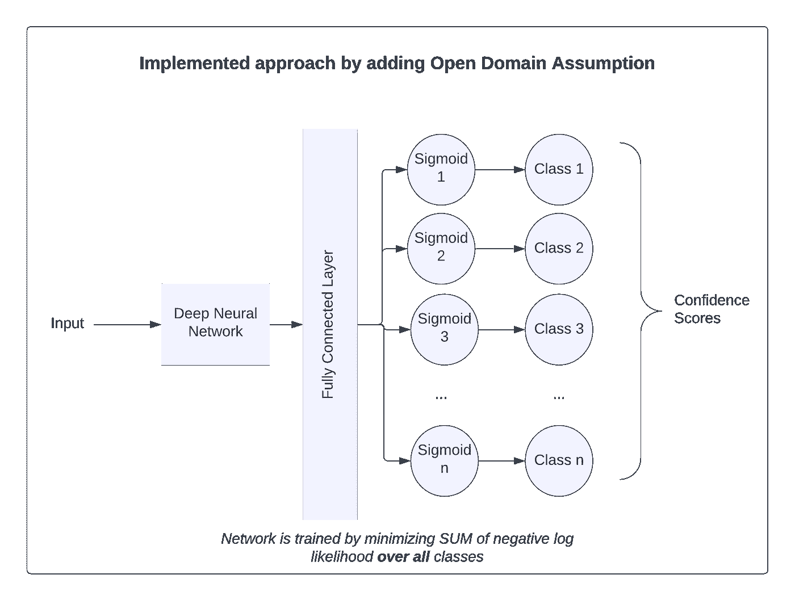

# 开放领域分类

> 原文：<https://towardsdatascience.com/open-domain-classification-1a10a8dd0431>

## 开放域中的聊天机器人

照片由[李宗盛](https://unsplash.com/@sarahleejs?utm_source=medium&utm_medium=referral)在 [Unsplash](https://unsplash.com?utm_source=medium&utm_medium=referral) 上拍摄

当我们设计聊天机器人时，我们意识到会有一些我们无法处理的查询。在相当长的一段时间里，我们的方法是对我们的分类器预测的意图置信度使用一个阈值。这个阈值是一个超参数，我们通过审查客户的真实反馈添加的。然而，我们仍然不断得到一些明确的域外 查询的假阳性结果。

这是一个糟糕的客户体验。我们对于聊天机器人的目标是善于处理那些聊天机器人应该处理的事情。但是，也要确保聊天机器人清楚地退出那些它不应该处理的查询。

聊天机器人对开放域查询表现不稳定有三个原因——

1.  设计聊天机器人时的封闭世界假设。
2.  神经网络的过度自信。
3.  ReLU 网络产生高可信度预测的倾向。

在本文中，我们将讨论这 3 个问题以及我们为聊天机器人实现开放域分类的策略。

# 封闭世界假设

[葛力飞和刘冰](https://aclanthology.org/N16-1061.pdf)的论文定义了封闭世界假设-

> 封闭世界假设，其关注于在训练时所有测试类都已知的假设下设计精确的分类器。

大多数文本分类系统都是在封闭世界假设下运行的。对于许多应用程序来说，这种假设就足够了。如果我们想将电子邮件分为垃圾邮件或垃圾邮件，或者如果我们想将评论分为正面、中性或负面，封闭世界假设就足够了。

然而，对于聊天机器人来说，封闭世界的假设并不现实。一个更现实的场景是在测试期间预期看不见的类(开放世界)。因此，聊天机器人的目标不仅仅是将聊天文本分类为多种意图之一，还包括拒绝不属于任何已知类别的文本。

典型的基于 Softmax 的多类分类系统不是为检测域外类而设计的。而且，正如我们将在接下来的部分中看到的，由于置信度分数的错误校准，置信度阈值化不是检测域外类别的最佳方式。

# 神经网络的过度自信

基于神经网络的分类器在准确性上有所提高。但是精度的提高是以校准为代价的。神经网络的校准是输出置信度等于正确概率的概念。如果某个类的 Softmax 图层的输出置信度为 0.8，并且我们有 100 个独立的预测，每个预测的得分为 0.8，则我们预计其中 20 个预测是错误的。然而，现代深度神经网络(DNN)是错误校准的。如果在上面的例子中，分数来自 DNN，超过 20 的预测将是错误的。

郭川等人在一篇论文中实证性地衡量了这种相对于旧模式(古典的和不那么深刻的)的变化。在论文中，他们表明，在浅层网络(LeNet)中，网络的准确性接近平均置信度得分。然而，在更深的网络(ResNet)中，平均置信度得分比准确度高得多。作者实证证明，更深层的网络是 ***过度自信*** 。

图片来自[郭川等人](https://arxiv.org/pdf/1706.04599.pdf)

虽然作者没有重复文本分类的实验，但我们可以说同样的现象是真实的。即使在文本分类器中，DNNs 的精度增益也是以误校准为代价的。

为了检测域外查询，我们可以使用一个高的类阈值。但是由于阈值是一个超参数，知道它的值的唯一方法是在虚拟代理发布后获得真实的数据。因此，价值只能从负面的用户反馈中获得。第二个问题是，在我们的实践经验中，我们注意到每个班级的“过度自信”程度是不同的。因此，在理想情况下，我们将需要一个独立的超参数，用于我们在虚拟代理中支持的每个类。

# ReLU 网络产生高置信度的预测

与该问题相关的最后一个问题是基于 ReLU 的神经网络中的固有问题。Matthias Hein 等人在一篇数学密集的论文中讨论了这个问题。在该论文中，作者首先证明了基于 ReLU 的神经网络是连续分段仿射分类器。利用这一结果，他们随后证明，只要一些温和的条件为真，基于 ReLU 的网络将 ***总是*** 预测假阳性。论文进一步证明了在输入空间中，误报不一定接近训练样本。事实上，它们证明，如果您尝试，您将总能找到一个与该类的训练示例 相距很远的示例 ***，该示例将为该类提供高置信度预测。***

这最后一点证明了任何高阈值都不是排除域外类别的假阳性的充分条件。即使我们将阈值保持得足够高，也总会有远离训练样本的样本，这些样本将具有高置信度预测。

# 这个问题的解决方案

我们已经确定，在封闭世界的假设下，基于 ReLU 的 DNNs 会产生错误的分类。由于基于 ReLU 的 DNNs 固有的过度自信，置信分数的阈值不是预测域外类别的可靠方式。多类分类的典型方法如下所示。

我们使用了舒磊等人在论文中提出的方法。al 解决虚拟代理中的误分类问题。这种方法很适合我们，因为我们既不需要额外的训练数据，也不需要改变我们使用分类器的方式。这种方法的示意图如下—

在此方法中，我们使用多个 Sigmoid，而不是 Softmax，从而获得多个概率得分，每个得分来自每个 Sigmoid 单元。这种配置允许我们创建一个简单的域外检测器—如果没有一个 sigmoids 高于阈值，我们就将输入文本声明为域外。然而，如果多个 sigmoids 的输出高于阈值，我们选择激活最高的类。

该架构通过最小化所有类的累积负对数似然性来训练。该论文使用了一种类似于异常检测的方法来进一步微调预测。作者引入了可变阈值，而不是使用固定的 0.5(或替代值)作为阳性类别的阈值。外部参数α控制这个阈值。Alpha 是偏离平均值的标准偏差数，仍可视为正类。欲知详情，请参阅参考文件。

# 结论

聊天系统的用户可能没有意识到所设计系统的局限性。他们会有我们设计的聊天机器人无法解决的问题。在本文中，我们探讨了设计中的问题，并对聊天机器人进行了改进。在新的设计中，聊天机器人清楚地知道域外查询，并能优雅地响应这些查询。