# DagsHub 的开源 ML 项目:通过机器学习提高宠物认养率，第一

> 原文：<https://towardsdatascience.com/open-source-ml-project-with-dagshub-improve-pet-adoption-with-machine-learning-1-e9403f8f7711>

## 构建一个预测猫狗可爱程度的应用程序

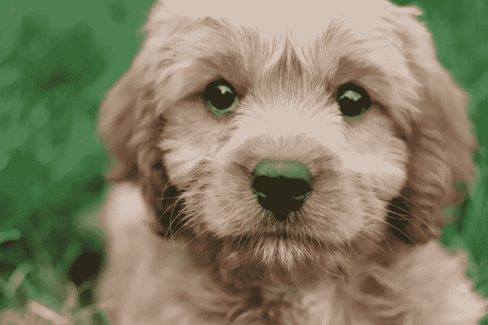

**照片由** [**米娅·安德森**](https://unsplash.com/@miaanderson?utm_source=unsplash&utm_medium=referral&utm_content=creditCopyText) **上** [**下**](https://unsplash.com/s/photos/cute-puppy?utm_source=unsplash&utm_medium=referral&utm_content=creditCopyText)

## 项目介绍

令人难以置信的是，机器学习已经改变了生活的许多方面。它的应用远远超出了商业领域，并被用于许多公益事业，如保护环境、公共卫生、安全和动物福利。

一个例子是最近由马来西亚动物福利平台主办的 Kaggle 比赛。在这项挑战中，参与者被要求处理数千张带标签的宠物图片，并为每张图片生成可爱度评分。

这个可爱度，或者在比赛中被称为可爱度的分数，被用来匹配潜在家庭的宠物档案，以增加他们被收养的机会。

尽管挑战已经结束，我们仍将通过一系列文章尝试构建一个稳健的预测模型来完成这项任务。最后，我们将使用我们的解决方案创建一个 web 应用程序，这样任何人都可以给他们的宠物拍照并获得可爱度评分。

在本文中，您将探索:

1.  Petfinder Pawpularity 评分和数据介绍。
2.  解决手头问题的方法
3.  项目的所有开源工具列表以及它们解决了哪些挑战
4.  Petfinder 数据集的元数据和图像上的 EDA

您可以在 DagsHub 上开始[这个存储库](https://dagshub.com/BexTuychiev/pet_pawpularity)来跟随整篇文章。

[](https://ibexorigin.medium.com/membership)  

获得由强大的 AI-Alpha 信号选择和总结的最佳和最新的 ML 和 AI 论文:

[](https://alphasignal.ai/?referrer=Bex)  

## 解决问题的方法

如果你已经在考虑启动 Jupyter 实验室会议，请停止。在这个项目中，我们将尽可能远离笔记本电脑，并使用市场上最好的开源工具来使这个过程完全可重复。

首先，我们需要解决大文件的问题。Git/GitHub 不会削减它，因为他们在这个任务上是垃圾。我们需要更强大、更灵活的东西，比如 DVC。

[数据版本控制(DVC)](https://dvc.org/) 是追踪大文件变化的最好的开源工具之一。正如 DVC 文档中所说，它是“数据的 Git”。

就像你在 GitHub 上托管代码一样，DVC 需要远程存储来存储你的数据和文件。你可以选择像 AWS、Azure 或 GCP 这样的云解决方案，但是设置会很麻烦，而且它们也不是免费的。

为了解决这个问题，我们将使用 [DagsHub](https://dagshub.com/) ，你可以把它想象成“数据科学家的 GitHub”。这是一个供数据专业人员托管和版本化他们的数据、模型、实验和代码的平台。

一旦您创建了您的帐户，DagsHub 将为您提供 10GB 的免费存储空间，仅适用于 DVC。

DagsHub 会自动生成一个远程存储链接以及为您创建的每个存储库设置该链接的命令。

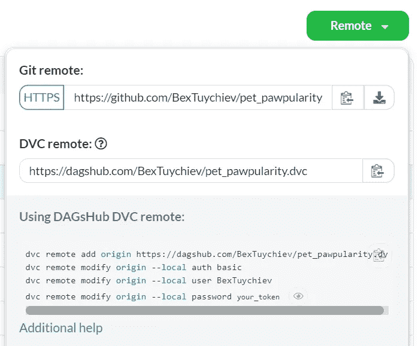

存储库页面上的 DVC 指令示例。按作者。

所有添加到 DVC 的文件都将在您的 DagsHub repo 页面上进行标记:

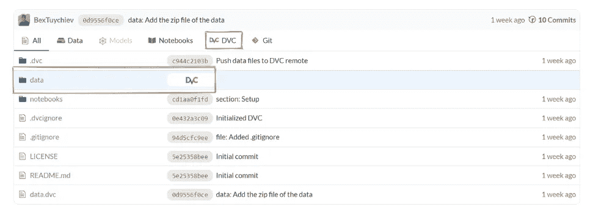

作者截图

为了保持实验的可重复性，我们将使用另一个开源包— [MLFlow](https://mlflow.org/) 。

使用 MLFlow，您可以记录实验的每个细节——用于跟踪性能的指标、模型名称、其超参数、相应的分数等等。

像 DVC 一样，MLFlow 需要一个服务器来保存你实验的细节。DagsHub 也涵盖了这一点:

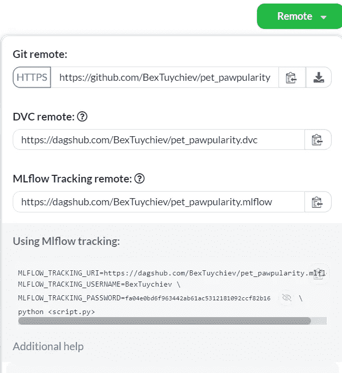

作者截图

设置 MLFlow remote 后，DagsHub 将在“实验”选项卡下记录您的每个实验:

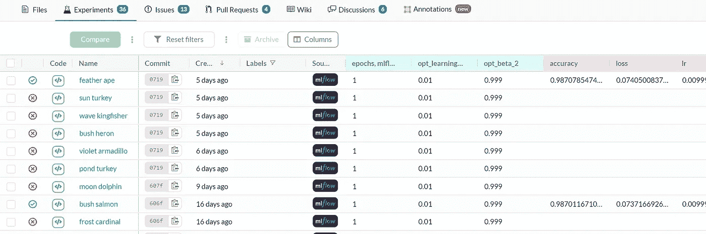

DagsHub 上一个示例实验页面的屏幕截图。按作者。

您可以选择几个成功的实验，并通过按“比较”按钮开始比较它们，这将生成漂亮的表格和图表，以直观地探索这些实验。

最后，一旦我们有了问题的现成解决方案，我们需要使用 web 应用程序来公开它，以便每个人都可以使用友好的 UI 来尝试它，而不是克隆我们的存储库。

传统上，这是使用像 Flask 这样的 web 框架来完成的，但是我们将使用现在所有酷家伙都在使用的东西——Streamlit。

一旦我们完成这个项目，我们将在 Streamlit Cloud 上托管一个应用程序，它可以接受其他人的宠物的图像，并预测它们的可爱程度。

目前，Streamlit cloud 只接受 GitHub 存储库，这意味着我们的应用程序代码必须托管在那里。但这不就意味着我们的项目会被分割 GitHub 上的代码和我们 DagsHub 上的数据、模型、度量吗？

幸运的是，对于这种情况，可以用 DagsHub 连接 GitHub:

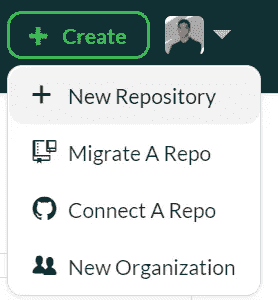

作者截图

每当你将更改推送到 GitHub，它将被同步到 DagsHub 镜像 repo，它也跟踪你的数据和实验:

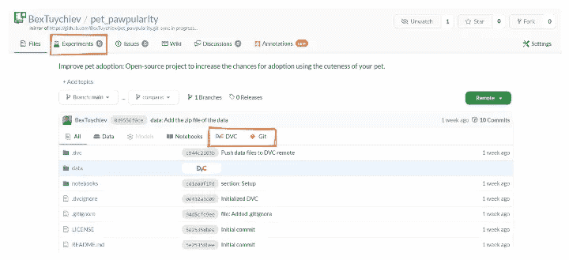

作者图片

在本文中，我们将只讨论项目设置和对数据执行 EDA。让我们开始吧。

## 项目设置

继续向前，我将假设您已经创建了一个 DagsHub 帐户，并从 GitHub 连接了一个空的存储库。

如果是这样，您可以在 conda 环境中安装 DVC，并按照存储库页面上的说明设置遥控器。您可以调用以下命令来创建我们的项目树结构:

```
mkdir data data/raw data/prepared models notebooks
```

我还假设您熟悉 DVC 及其对数据进行添加、拉取和推送更改的常用命令。如果没有，你可以阅读[这篇优秀的教程](https://realpython.com/python-data-version-control/)来帮你补上。

## 获取数据

你可以从 [Kaggle 宠物搜索大赛](https://www.kaggle.com/c/petfinder-pawpularity-score)页面下载完整的数据，但我已经把它上传到我的 repo 了。以下命令将 zip 文件夹提取到项目根目录:

```
dvc get https://dagshub.com/BexTuychiev/pet_pawpularity data/raw/petfinder-pawpularity-score.zip
```

将其解压缩，并将所有文件移动到`data/raw`目录。您可以稍后删除原始 zip 文件:

`dvc get`命令可以处理 DVC 跟踪的任何文件，甚至是其他人的存储库中的文件。

现在，让我们开始工作，探索数据。

> 数据集所有者完全允许我使用文章中的数据。

## 图像元数据的 EDA

Petfinder 数据集有大约 10k 个 pet 图像和每个图像的元数据。在本节中，我们将分析以 CSV 文件形式给出的元数据文件:

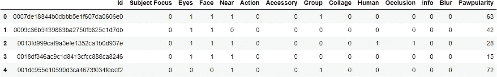

```
>>> test_df.head()
```

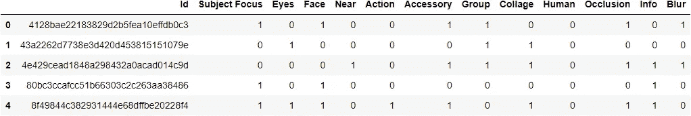

有 13 个特征，ID 是图像的文件名，其余的是与图像特征相关的二进制特征。最后一个“Pawpularity”列是目标。

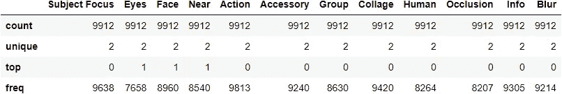

如您所见，在训练集中有 9912 个观察值，而在测试集中只有 8 个。我们必须在文章的下一部分开发一个可靠的验证策略，因为测试图像非常少。

目标的 5 个数字总结告诉我们，可爱分数的范围从 1 到 100，平均值为 38，75%的图像的可爱分数为 46 或更低。为了更好地了解目标，我们来看一下直方图:

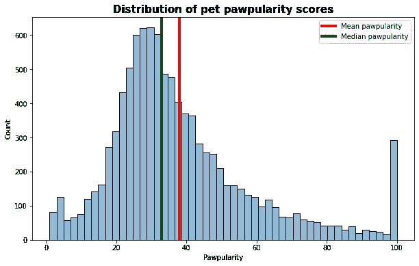

作者图片

我们可以看到大多数宠物的年龄在 20-40 岁之间。看到这么多可爱度分数最高的宠物也很意外。

由于特性都是二进制的，我们不会从中提取太多。因此，我们将查看按每个功能分组的目标分布。在开始绘图之前，让我们看看每一列代表什么:

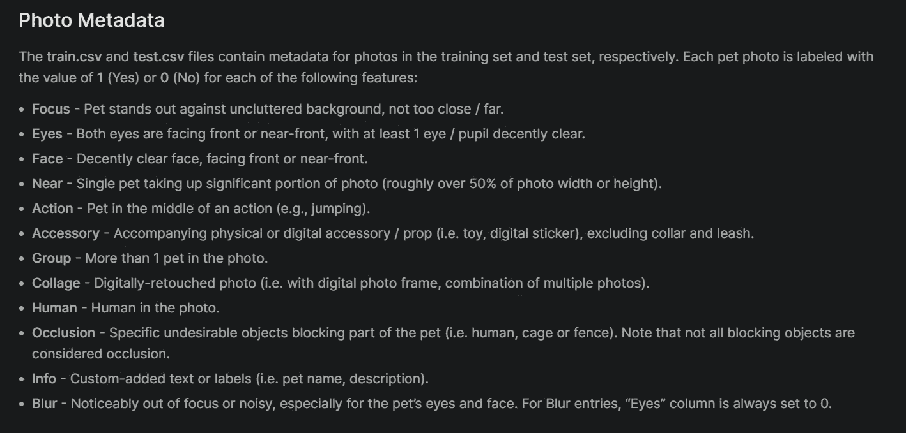

**截图自比赛资料页。**作者。

我们将为每一列创建一对图—一个箱线图和一个直方图:

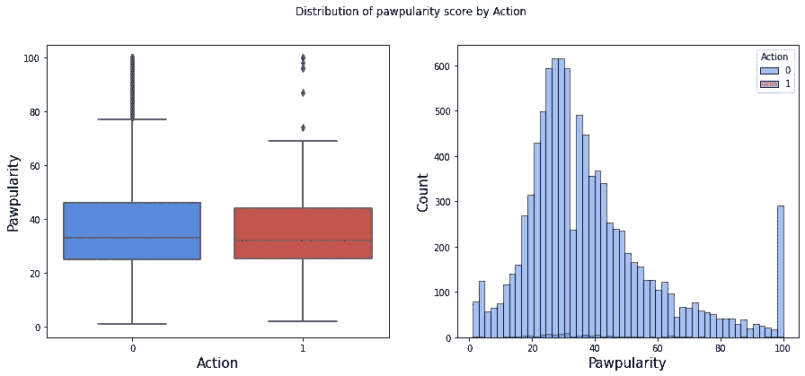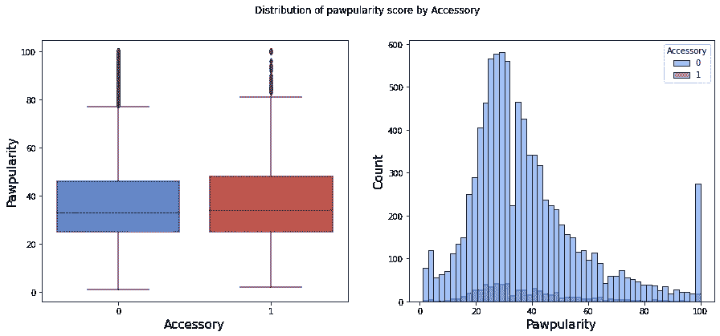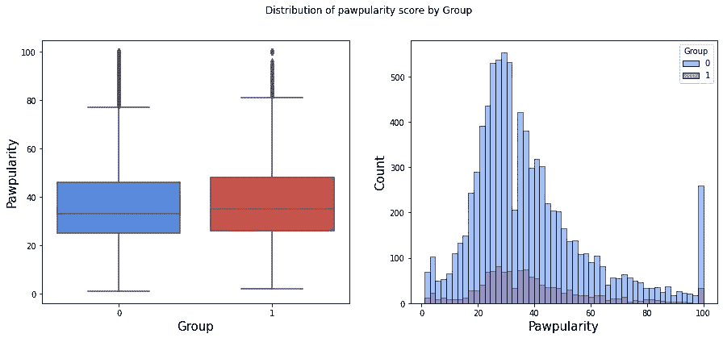

作者提供的图片

> 我省略了一些情节，因为它们都很相似，但是你可以查看[GitHub 上的这个笔记本](https://github.com/BexTuychiev/pet_pawpularity/blob/main/notebooks/eda.ipynb)，它展示了完整的分析。

箱线图显示，即使按特征分组，目标也有相似的分布。直方图证实了这一点，表明这些元数据特征在构建预测模型时可能用处不大。

现在，让我们继续探索图像。

## 图像上的 EDA

首先，让我们创建一个简单的函数，它加载一个图像并使用 Matplotlib 绘制它:

我们将把这个函数与另一个函数结合起来，这样我们每次调用它时都可以查看宠物的随机图片:

正如我们前面看到的，元数据表在 Id 列中包含每个观察的文件名。我们将使用来自`pathlib`模块的 Path 类，用它来构建所有图像路径的列表:

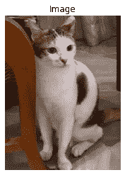

来自 Petfinder 数据集的图像

您可以一遍又一遍地运行`draw_random_image`函数，从中获得一点乐趣。

同时，让我们看看图像的维度以及它们之间的区别。宽度与高度的散点图应给出一个粗略的概念:

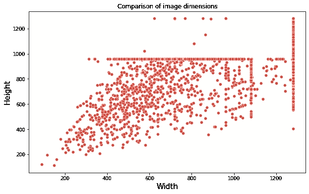

我们可以看到图像尺寸变化很大。在构建模型之前，我们需要在下面的文章中解决这个问题。

现在，让我们来看看不同可爱程度的宠物照片，看看我们是否能找出一些模式来解释它们为什么有其他得分。为了实现这一点，我们将创建一个函数，在提供的 pawpularity 级别绘制 *n* 个宠物的随机图像。这是:

让我们画出从 20 到 100 的五个不同等级:

```
for level in range(20, 101, 20):
    show_pawpularity_level(train_df, pawpularity=level)
```

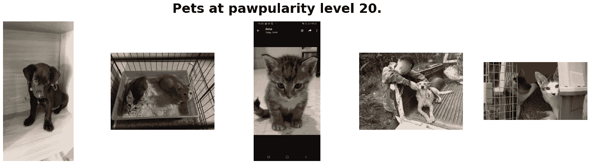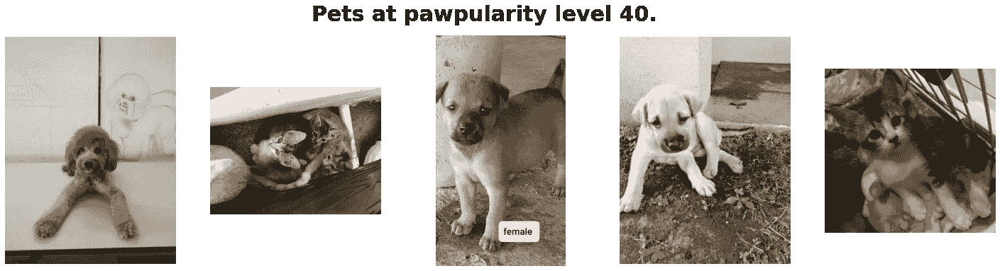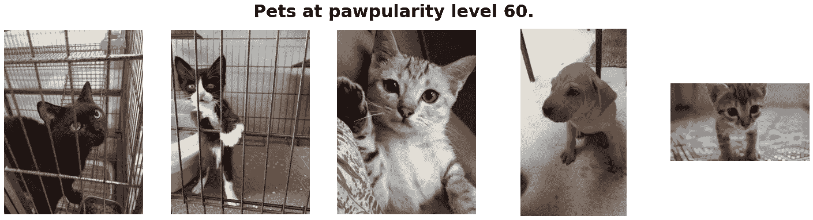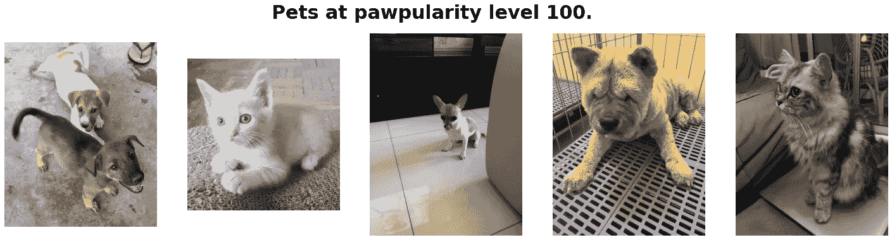

来自 Petfinder 数据集的图像

运行这个函数几次，发现很难辨别为什么 100 级宠物比低级宠物更受欢迎。

作为最后一步，让我们测试我们在最后一节中的观点，看看仅将模型与元数据相匹配是否会产生任何显著的结果。

## 拟合基线模型

由于目标包含可爱分数，因此默认情况下这是一个回归任务。但是，我们总是可以把它看作一个 100 类的多类问题，并适合一个分类器。我们将两者都尝试，从使用随机森林的回归开始:

我们不是过度配合，而是分数太可怕了。每幅图像的平均误差幅度约为 20%。让我们试试分类器:

分类器更令人失望。

我们将在下面的文章中使用图像和深度学习技术来提高这个分数。

## 结论

本文仅作为项目概述。我们已经了解了机器学习项目面临的挑战，以及正在使用哪些工具来解决这些挑战。我们还初步研究了数据，探索了元数据文件和图像。

在下一篇文章中，我们将继续发现 DVC DagsHub 的更多特征，并了解 [MLFlow](https://mlflow.org/) 以跟踪我们对图像数据的实验。当我们在 DagsHub 中结合所有这些工具时，您将开始欣赏机器学习生命周期变得多么容易。感谢您的阅读！

**您可以使用下面的链接成为高级媒体会员，并访问我的所有故事和数以千计的其他故事:**

[](https://ibexorigin.medium.com/membership)  

**或者订阅我的邮件列表:**

[](https://ibexorigin.medium.com/subscribe) 