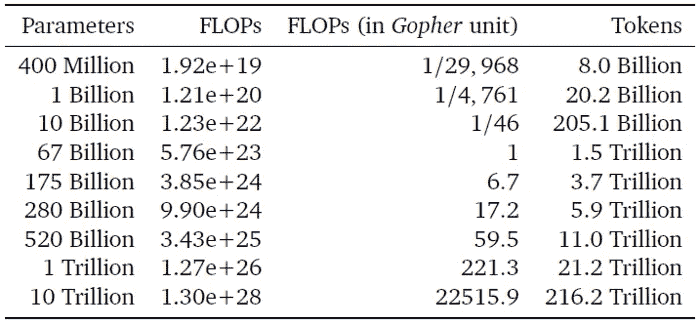

# OpenAI Whisper 掌握着 GPT 4 号的钥匙

> 原文：<https://towardsdatascience.com/openai-whisper-holds-the-key-to-gpt-4-a7f922a7dad9>

## 以及使其成为最佳 ASR 模型的 8 个关键特征(嘿，Siri，这是给你的)

低语的嘴唇。信用:作者通过中途+稳定扩散

> 以下节选自[**The algorithm Bridge**](https://thealgorithmicbridge.substack.com/subscribe?)，这是一份教育通讯，其目的是在算法和人之间架起一座桥梁。它将帮助你理解人工智能对你生活的影响，并开发工具来更好地导航未来。

  

今天，我将覆盖一个我从未想过会写的人工智能子领域——主要是因为它比我通常写的领域(大型语言模型、人工智能艺术)要成熟得多，而且看不到突破。但是我错了。我指的是自动语音识别(ASR)，你肯定已经从标题中推断出来了…请耐心听我说，因为有很好的理由阅读这条新闻。

OpenAI 几天前发布了 Whisper，人们已经开始疯狂了。不是因为这是一个新概念，也不是因为算法设计的改进。不，原因更简单:Whisper 比任何其他商业 ASR 系统都更好。Alexa，Siri，Google Assistant(这些是你可能很熟悉的)，在你尝试了 Whisper 之后，它们中的任何一个都会感觉像是上世纪的技术。你可以的。OpenAI 是一家名不副实的公司，它决定开源这个模型。对许多人来说，数字体验将会彻底改变。

让我们看看这项技术是否能引起轰动。

# 耳语的简要概述:它是什么和做什么

OpenAI 将 Whisper 描述为一个通用的端到端弱监督的基于变压器的 ASR 系列模型。让我们用更简单的话来看看这些行话是什么意思。

*   “通用”是指除了语音识别的核心任务之外，Whisper 还可以完成所有的外围任务，像语音检测、语言识别、转录和机器翻译。
*   “端到端”意味着模型在没有人工干预或手工制作模块的情况下进行无缝训练——这与单独训练各部分(用于外围任务)然后合并它们形成对比。
*   “弱”意味着接受音频数据的阈值比通常低(较低质量的数据可以提高模型的泛化能力)。
*   “监督的”意味着它是在音频-文本对上训练的，这与以前的自我监督的模型相反(改变的原因在数据集中。稍后将详细介绍)。
*   “基于 Transformer”你已经知道:它通过关注前面的元素来预测序列中的下一个元素。作为补充说明，OpenAI 的研究人员选择了原始的 transformer 架构，而不是更花哨的现代版本，因为他们不想通过模型改进来让 Whisper 变得很棒。他们想证明，如果有足够的数据可用，高质量的监督 ASR 是可能的。

> “由于我们工作的重点是研究语音识别的大规模监督预训练的能力，我们使用现成的架构来避免我们的发现与模型改进混淆。”

*   而且是“一家人”因为 Whisper 有五个版本。按照参数从最小到最大:微型(39M)、基本型(74B)、小型(244B)、中型(769M)、大型(1.55B)。你可能会惊讶地发现，与大型语言模型(LLM)如 GPT-3 (175B)或 LaMDA (137B)相比，它们很小。与其他人工智能应用相比，制作一个足够好的生成式语言模型是一个更高层次的追求。从现在开始，当我提到 Whisper 时，它将是 Whisper large(模型大小关系到质量)，除非另有说明。

在这里阅读更多:[博客](https://openai.com/blog/whisper/)(可用演示)[论文](https://cdn.openai.com/papers/whisper.pdf)、 [GitHub 回购](https://t.co/PxnLfnTPQr) ( [模型卡](https://github.com/openai/whisper/blob/main/model-card.md)、 [Colab 示例](https://colab.research.google.com/github/openai/whisper/blob/master/notebooks/LibriSpeech.ipynb)，以及代码)。

好吧，这是文章中最专业的部分。你不需要记住任何细节就能理解接下来的部分。我现在想关注的是，是什么让 Whisper 与你和整个 AI 社区相关。我已经阅读了我上面链接的所有资源，并编制了一个我认为是 Whisper 的八个关键特性的列表(包括研究和生产层面)。

# 用 8 个键轻声细语:什么让它与众不同

## 1.耳语准确度超高

即使在 ASR 基准测试中，Whisper 并不总是最先进的(SOTA ),但它比其他替代品更符合现实世界中的人类表现。来自报纸:

> *“这些结果表明，Whisper 的英语 ASR 性能并不完美，但非常接近人类水平的准确度。”*

这意味着你会发现 Whisper 比任何其他 ASR 系统都更好地理解你(正如我所说，如果条件不是最佳的，Alexa 或 Siri 会明显更差)。这推断到真实世界的场景(例如，有背景噪声、快速语音或重口音。稍后将详细介绍)。试用过 OpenAI 系统的非 open ai 成员表示，他们对该系统的质量印象深刻。例如， [Andrej Karpathy](https://twitter.com/karpathy/status/1573123790795837440) (特斯拉前人工智能总监)今天早些时候在推特上写道:

安德烈·卡帕西的推特

## 2.Whisper 是开源的

麻省理工学院许可下的 OpenAI 开源 Whisper。人工智能公司中有一个明显的趋势，即提供模型和代码:OPT，BLOOM，Stable Diffusion……这种做法提高了人工智能工具的民主化，同样重要的是，允许更好地评估它们如何工作，它们在哪里失败，以及如何改进它们。

[我之前曾说过](https://thealgorithmicbridge.substack.com/p/gpt-4chan-the-worst-ai-ever)开源是人工智能的前进之路，当考虑到安全时，它会比严格控制和隐私下的人工智能产生更大的影响。像谷歌这样在这些类型的实践中落后的公司(开放二级技术与开放最好的技术是非常不同的事情)，如果他们保持封闭，将很难利用各种可能性(DALL E mini 对 DALL E 的成功是每个认为高质量>开放的人工智能公司的一个教训)。

## 3.耳语是容易使用的

这与它是开源的密切相关。拥抱脸已经为[制作了一个可以在电脑或智能手机上使用的演示](https://huggingface.co/spaces/openai/whisper)。数据科学家 [Yuvi Sharma](https://twitter.com/yvrjsharma) 使用 Whisper(语音到文本)、BLOOM(文本生成)和 CoquiTTS(文本到语音)构建了一个[语音-文本-语音系统](https://huggingface.co/spaces/ysharma/Talk_to_Multilingual_AI_WhisperBloomCoqui)。你说话，Whisper 识别并转录你的语音，BLOOM 根据你的要求生成文本，Coqui 从中制作音频文件。一切都在不到 2 分钟内完成。

这让我想起了这个月稳定扩散所发生的事情——开发者不停地发布工具和资源。幸运的是，大多数都是无代码的。这是开源政策的结果。为所有人提供更多无障碍环境。

对于程序员来说:你可以随时下载 Whisper 到你的电脑上，然后玩代码。最大的型号需要 10GB 的 VRAM，所以不是每个人都适合。最小的需要 1GB VRAM，速度快 32 倍，但质量明显较差。中间有三个版本。

## 4.耳语是多语言的

还有一种趋势是让人工智能更具包容性。英语世界很大，但 94%的人口不以英语为第一语言，75%的人根本不说英语。直到现在，数以亿计的人们的母语已经被遗忘了。BLOOM 是一个 LLM，支持多达 46 种语言，并率先将多语言作为人工智能模型的核心特征。Meta AI 在 6 月发布了项目[没有语言落后(NLLB)](https://ai.facebook.com/research/no-language-left-behind/) 。它旨在开源可以在 200 种语言之间进行机器翻译的人工智能模型。OpenAI 用 97 种语言训练了 Whisper。其他 96 种语言占数据集的 17%。

这仍然是不够的——说那些在数据中没有得到很好体现的语言的人将会体验到质量的降低。在互联网上广泛使用的语言之间存在几个数量级的差距，如中文(在 Whisper 的数据集上为 23.5K 小时)或西班牙语(11.1K 小时)，以及其他不像印地语(12 小时)或孟加拉语(1.3 小时)的语言，尽管有数百万人在使用。不太常用的语言，尽管在数据中出现的次数相对较少，但仍是世界上许多人的第一语言——这些人将从这类技术进步中受益最多。

## 5.Whisper 可以增强许多跨行业的应用程序

关于现实世界的使用，想象一下你有一个涡轮增压的 Siri 或 Alexa，不是在智力方面，而是在完美地转录你的演讲方面。你可以用声音做学习笔记，而不必经常检查。你可以在 YouTube 视频或电影中享受即时准确的字幕。而且公司肯定会把 Whisper 嵌入到现有的服务中。无论噪音、口音或语音节奏如何(如果亚马逊聪明的话)，Alexa 都不会错过你说的话。

更重要的是，耳语可能意味着有语言或听力障碍的人生活质量的提高。例如，你可以立即为一个聋人抄写你的话。这可能是消费者服务包容性的提高。所有这些都没有提到专业工作的用途:法律、医疗保健、银行、市场营销、教育……几乎每个行业都可以从中受益，使用案例数不胜数。

## 6.耳语是多任务的

正如开始所解释的，Whisper 不仅做 ASR，还做围绕核心问题的所有任务。例如，Whisper 也在 X→英语翻译(数据集的 18%)上被训练，并且在语言识别上被评估(类似于 SOTA 模型的性能)。总的来说，这使得 Whisper 更容易与现有产品或服务集成，也更容易部署。

## 7.Whisper 是健壮的，并且可以很好地推广

这和高精度点有关，但我觉得值得强调一下。现有 ASR 系统的主要限制之一是底层模型是在具有实验室类型质量的特定数据集(或它们的组合)上训练的。这意味着，当在目标基准上评估时，模型做得很好，但是即使稍微偏离也会导致质量的巨大下降。

Whisper 是以弱监督的方式对大量数据进行训练的，这使得它更加健壮，能够推广到非分布情况(简而言之，非分布意味着训练和测试数据具有不同的基本特征)。例如，Whisper 更擅长理解口音或快速语音，识别技术术语和标点符号，并且它比替代品更擅长检测静音或消除背景噪音。

## 8.Whisper 的训练数据集庞大、多样，而且是私有的

到目前为止，一切看起来都太完美了。如果你在期待一个“但是”的时刻，这就是了。耳语有黑暗的一面。对于那些从事技术工作的人来说，这个特性会立即脱颖而出。让我们从客观部分开始:Whisper 是在 68 万小时的音频-文本数据上训练的(那是 77 年！)从网上刮来的。这比此类数据的现有最大监督数据集高出一个数量级。

不知何故，这使得 Whisper 在音频-文本数据采集方面的突破超过了在算法设计或比例定律方面的突破。OpenAI 的研究人员证明了数据缩放对 ASR 系统的质量非常有影响。这使得数据集成为 Whisper 发布的一个关键方面。如果没有 OpenAI 收集的所有数据，Whisper 就不会存在。

现在，阴暗的部分:数据集是私有的。OpenAI 决定通过开放推理模型和代码来认可他们的名字，但决定保持数据集的封闭。为什么？我不知道。没有人知道这些数据是从哪里来的。他们在论文中解释说，机器生成的数据通常缺乏足够的质量，因此他们想出了一些启发式方法来消除它。但是，他们把它都移除了吗？如果不是来自人工智能来源，他们从哪里找到 10 倍人类标记的数据？OpenAI 似乎不愿意解决的许多公开问题。

这意味着开发人员和外行人仍然可以从 Whisper 中受益，但大学研究人员无法分析数据来源或内部的潜在偏见([这里有一个关于这个](https://twitter.com/KathyReid/status/1572735508916031488)的好线索)，其他科技公司也无法建立在 OpenAI 的研究成果上——或许可以构建和开源一个改进版本。

更有趣的问题是，他们为什么要关闭它。他们显然不打算从 Whisper(直接)获利。我会让你考虑这个问题，因为我认为有更多的事情要做。我没有答案，只有猜测。

所以，我们来推测一下。这就是乐趣的开始。

# 超越耳语:关于 OpenAI 未来的疯狂假设

OpenAI 为什么要把 Whisper 的训练集保密？我还没能找到任何知道答案的可靠来源。有很多可能的(无聊的)假设。例如，OpenAI 不希望数据集对竞争对手开放，因为他们计划以某种方式利用它获利。另一个选择是存在法律问题(网络抓取可能很棘手)，他们更喜欢保持沉默。另一个选择是，这是他们的工作方式，他们认为现在没有理由改变它——尽管他们明显转向开放。

但是，有一种更令人兴奋的可能性——如果你问我的话，这种可能性相当合理。这个假设由米兰-魁北克人工智能研究所的 ML 博士生[伊桑·卡瓦耶罗](https://twitter.com/ethanCaballero/status/1572692314400628739)在推特上分享:

伊桑·卡瓦列罗的推特

好吧，让我解释一下。

首先，GPT-4。这是 GPT 家族的下一个版本。《GPT》于 2018 年出版。2019 年的 GPT 2 号。和 2020 年的 GPT 3 号。预计 GPT-4 将于 2021 年发布，但 OpenAI 专注于人工智能艺术(CLIP 和 DALL E)。现在经过两年的等待，发布日期感觉很近了。今年早些时候，在 4 月份，我写了一篇关于 GPT 4 号的文章，题为“[GPT 4 号即将到来”。下面是我们对它的了解](/gpt-4-is-coming-soon-heres-what-we-know-about-it-64db058cfd45?sk=f40768250be0de123933091208ff2b41)(如果你去谷歌搜索，输入“gpt-4”仍然是排名第一的结果，这让我很自豪！)无论如何，我当时预测 GPT 4 将在 7 月或 8 月发布。对人工智能艺术的突然兴趣可能让它慢了下来。我不能确定，但我愿意打赌，我们将在未来几个月内拥有 GPT-4——原因如下。

在同一篇文章中，我回顾了自 2020 年以来人工智能社区在 LLM 领域取得的最重大进展，并将它们与我们关于 GPT-4 的少量信息进行了匹配(OpenAI 的首席执行官萨姆·奥特曼在 2021 年底进行了一次私人问答)。我强调的一点是，GPT 4 号不会比 GPT 3 号大，但在计算资源方面会优化得多，性能能力也有显著的飞跃。为此，OpenAI 需要更多的数据。

这就是 DeepMind 的[龙猫](/a-new-ai-trend-chinchilla-70b-greatly-outperforms-gpt-3-175b-and-gopher-280b-408b9b4510?sk=43b40b01eb3fffc5e995b16e8c762283)发挥作用的地方。DeepMind 发现，普遍接受的缩放定律(如何通过放大某些特征使模型更具性能；计算、数据或大小)不完整。让模型更大只是让它们更有性能的一半。

另一半呢？数据。DeepMind 的研究人员发现，如果他们使用更多的训练数据，同时保持参数数量固定，他们可以建立一个 LLM“计算优化”。他们用 Chinchilla 证明了他们的假设是正确的，这是一个 70B 参数模型，立即达到了 SOTA 状态，以显著的优势超过了 LaMDA (137B)，GPT-3 (175B)，J1-Jumbo (178B)，Gopher (280B)和 MT-NLG (530B)。他们发现所有这些模特都训练不足。鉴于其体型，龙猫已经从训练数据中获得了最多的信息。

现在我们回到卡瓦列罗的假设:为了训练一个 GPT 3 大小的模型作为计算最优模型，OpenAI 需要的数据比 DeepMind 训练 70B 参数的龙猫所需的数据多得多。卡瓦列罗的猜测？OpenAI 将使用 Whisper 从互联网上转录语音数据，并生成他们缺乏的所有文本数据，以训练 GPT-4 成为计算机最佳。

为了构建一个计算优化的 GPT-4，OpenAI 需要比 GPT-3 多 10 倍的数据(从 300B 到大约 3.7T 令牌)。信用:[龙猫纸业](https://arxiv.org/pdf/2203.15556.pdf)

早在 4 月份，我就预测 OpenAI 会摒弃旧的比例定律，将 DeepMind 的发现应用到 GPT 4 号上。如果卡瓦列罗的假设是真的，我的预测将被证明是正确的。

但是，可能吗？Caballero 帖子上的一位评论者估计，仅 YouTube 的音频数据就相当于大约 [12 万亿代币](https://twitter.com/HenriLemoine13/status/1572846452895875073)。这足以训练一个计算优化的 GPT 3 大小的 GPT 4(约 3.7 吨令牌)，甚至是 MT-NLG 或 PaLM 大小的模型(约 11 吨令牌)。当然，他们也需要更多的计算能力，但鉴于微软支持 OpenAI，他们不会有任何问题。

如果 OpenAI 成功了，我们能期待什么？正如热门科技博客 [Robert Scoble](https://twitter.com/Scobleizer) 上个月在一条推特上说的，我们可以期待 GPT 4 号“就像 GPT 3 号一样是一次激动人心的飞跃”。精神错乱。”如果那最终是真的，我甚至无法想象这种可能性。而且，他[含蓄地说](https://twitter.com/Scobleizer/status/1560843951287898112)GPT-4 已经*训练过了。我对发布日期的预测是错误的，但可能不会差太远。*

罗伯特·斯考伯的推特

*订阅* [**算法桥**](https://thealgorithmicbridge.substack.com/) *。弥合算法和人之间的鸿沟。关于与你生活相关的人工智能的时事通讯。*

*您也可以直接支持我在 Medium 上的工作，并通过使用我的推荐链接* [**这里**](https://albertoromgar.medium.com/membership) 成为会员来获得无限制的访问权限！ *:)*