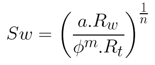
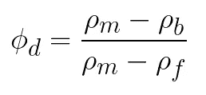

# OpenAI 的 Amazing ChatGPT:对小众话题有前景吗？

> 原文：<https://towardsdatascience.com/openais-amazing-chatgpt-is-it-promising-for-niche-topics-fcee2328dbd8>

## 询问 ChatGPT 关于岩石物理学的问题


图片由作者 DALL-E 2 生成。

OpenAI 最近发布了他们最新的[人工智能聊天机器人原型](https://openai.com/blog/chatgpt/)，由来自 [GPT-3.5 系列](https://beta.openai.com/docs/model-index-for-researchers)的模型驱动。它提供了一种服务，你可以问问题，然后它会以对话的方式给出详细的答案。就像你在和一个人说话一样！

ChatGPT 是基于一个训练有素的模型，使用来自人类反馈的强化学习，允许它模拟对话，回答后续问题，甚至承认错误。

即使 OpenAI 的 ChatGPT 最近在互联网上掀起了风暴，但在处理小众话题时，它真的像看起来那么好吗？

在这篇文章中，我向 chatbot 5 提出了一些特定于我的岩石物理学科的问题，并根据我的领域知识评估了人工智能给出的回答。

# **提示 1** :用简单的术语解释岩石物理学

## 想法:

岩石物理学是石油和天然气行业中一个非常专业的领域。从本质上来说，这是一个我们试图了解岩石的物理性质、其流体含量以及这些流体如何在岩石中移动的角色。该职位主要负责从测井测量中识别石油和天然气。

有时这是一个很难向非地质学家解释的话题。

## **响应**:

> 岩石物理学是地质学的一个分支，研究岩石的物理性质，尤其是岩石的物理性质与其传输流体(如石油、天然气和水)的能力之间的关系。简单地说，岩石物理学关注的是理解岩石的物理特性，以及这些特性如何影响流体在岩石中的流动。这对于依赖于从地下储层中提取石油和天然气的能力的各种行业(例如石油和天然气行业)来说是重要的。岩石物理学家使用各种技术，如钻探岩心、测井和地球物理测量，来测量和分析岩石的物理性质及其传输流体的能力。

## 评论和想法:

总的来说，描述是准确的。岩石物理学家的主要行业确实是石油和天然气，但也有其他领域，如学术界和研究相关的角色。

至于用简单的术语解释这个主题，对于非科学学科来说，它可能仍然太复杂，术语太多，尤其是像“测井”和“传输流体”这样的词。后者可以简化为“允许流体流动”。

回答中也有一点重复，最后一句的最后一部分重复了第一句的最后一部分。

我很乐意——稍加修改——用这个描述向其他人解释什么是岩石物理学。

# **提示 2** :解释伽马射线工具如何测量地层放射性？

## 想法:

理解测井工具如何工作、如何测量以及如何解释它们是岩石物理学家的关键角色之一。

这个提示是为了测试 ChatGPT 将如何回应一个技术问题，以及它是否会提供伽马射线测井工具如何工作的足够好的概述。

## **回应**:

> 伽马射线工具是测井中使用的一种工具，用于测量地下地层的天然放射性。这些工具通过检测伽马辐射来工作，伽马辐射是由某些元素(如钾、钍和铀)发出的一种高能辐射。当伽马辐射从这些元件发出时，它可以被伽马射线工具检测到，并用于测量地层的放射性。
> 
> 伽马射线工具通常由一个辐射探测器组成，如闪烁晶体或充气探测器，它连接到一根细长的电缆上。电缆被放入井中，当它穿过地层时，由岩石中的元素发出的伽马辐射被工具检测到。然后，该工具将这些信息发送到地面，用于创建伽马射线测井，这是地层放射性的图形表示。
> 
> 地质学家和岩石物理学家使用伽马射线测井来了解地下的地质情况，并且可以提供关于地层的组成和性质的有价值的信息。这些信息对于各种行业都很重要，例如石油和天然气行业，这些行业依赖于从地下储层中提取石油和天然气的能力。通过使用伽马射线工具，岩石物理学家可以确定最有前景的钻井和开采区域，并开发出更高效和有效的石油和天然气开采方法。

## 评论和想法:

总的来说，这很好地解释了伽马射线工具的工作原理。它们确实被用来测量三种关键元素——钾、钍和铀——的天然放射性，这三种元素通常存在于岩石所含的矿物中。

当用电缆工具进行测井时，工具被连接在一起，并通过电缆下降到井底。这是缠绕在钻机和测量的地层。伽马射线工具确实包含闪烁晶体或气场管，但它被封装在金属工具主体内。“连接在一根细长电缆上的闪烁晶体或充气探测器”的响应在这个语境下可能会略有误解。

至于回应中的最后一句话，部分正确。伽马射线工具可用于识别潜在的储油层。较低的伽马射线读数表明潜在的清洁储层段。然而，单独使用伽马射线工具不能告诉我们地层中是否有碳氢化合物。为了充分描述地层及其流体的特征，我们需要额外的测井测量。

# **提示三**:如何用阿尔奇公式计算含水饱和度？

## 想法:

岩石物理学领域中的一个基础方程是[阿尔奇方程。](https://geoloil.com/computingSW.php)该方程允许我们从测井测量和关键参数中推导含水饱和度(Sw)。简而言之，它用于确定多少孔隙空间(0-100%)被水填充，进而可用于确定存在多少碳氢化合物(1-Sw)。

阿尔奇方程需要许多关键参数，如地层内流体的电阻率(Rw)、孔隙的几何形状(弯曲度-a)和可用孔隙空间(φ-φ)。这些可以通过其他测量方法获得，也可以从岩心栓中获得。

## **回应**:

> 阿尔奇方程是岩石物理学中广泛使用的方程，用于计算含水饱和度，即储集岩中存在的水量。该等式通常写为:
> 
> S_w = (a * R_w) / (φ * m)
> 
> 其中:
> 
> S_w =水饱和度
> 
> a =胶结指数(取决于岩石类型和岩石润湿性的数值)
> 
> R_w =岩石中水的电阻率
> 
> φ =岩石的孔隙度(岩石体积中被孔隙占据的部分)
> 
> m =胶结系数(该值取决于岩石类型和孔隙中存在的流体类型)
> 
> 要使用阿尔奇公式计算含水饱和度，您需要知道所有这些参数的值。一旦你有了这些值，你就可以把它们代入方程并求解 S_w，这将给出你的水饱和度。例如，如果 a = 2，R_w = 100 欧姆米，φ = 0.2，m = 4，则水饱和度计算如下:
> 
> S_w = (2 * 100) / (0.2 * 4) = 10
> 
> 这意味着岩石的含水饱和度为 10%。
> 
> 值得注意的是，阿尔奇方程是一个简化的模型，它假设了岩石和孔隙中存在的流体的某些条件。在实践中，实际的水饱和度可能不同于使用该方程计算的值，并且可能需要其他更复杂的模型来准确预测水饱和度。

## 评论和想法

这一次的回应在一定程度上是正确的。

它提供了岩石物理学家将在该方程中使用的几个关键参数的信息，然而，方程的形式是不正确的，并且缺少几个参数。

上面给出的表格:

S_w = (a * R_w) / (φ * m)

应该是:



阿奇含水饱和度方程。图片由作者提供。

两个缺失的参数 Rt 是地层的电阻率，n 是饱和指数。这两者在计算水饱和度时都是必不可少的。

ChatGPT 提供的等式顶行是正确的，但底部是错误的。孔隙度(φ)应提高到 m 的幂，而不是乘以 m。

此外，对于未经培训的人来说，示例中使用的值乍一看似乎是合理的。

Rw 值为 100 非常高，m 值为 4 超出了正常范围。通常情况下，m 约为 2，但根据岩石的胶结程度，可以在 1.7 和 3.0 之间变化。

此外，代表孔隙弯曲度的 a 参数被错误地标记为胶结指数，并在示例中被赋值为 2。该参数通常假定为 1，但是，它可以根据存在的岩石类型而变化。

总的来说，如果没有领域知识的人在现实世界中使用提供的等式，我会很担心。

# 提示 4:用 Python 代码展示阿奇方程

## 想法:

我听说 ChatGPT 也能够产生代码。所以作为一个 Python 爱好者，我必须尝试一下。继续上一个提示，我想看看如何用 Python 的形式写出给定的方程。

## 回应:

> 以下是如何用 Python 实现阿奇方程的示例:

```
# define the parameters
a = 2
rw = 100
phi = 0.2
m = 4

# calculate water saturation using the Archie equation
sw = (a * rw) / (phi * m)
# print the result
print(sw)
```

> 在本例中，参数值(a、rw、phi 和 m)被硬编码到程序中。实际上，您可能希望使用用户输入或从文件或数据库中读取这些值。该程序使用阿尔奇公式计算含水饱和度，然后将结果打印到屏幕上。在这种情况下，输出将是 10，这意味着岩石的含水饱和度为 10%。

## 评论和想法:

忽略等式不正确的事实，它提供了可以立即运行的可用 Python 代码。此外，令人惊讶的是，它已经产生了相关的评论，以帮助解释正在发生的事情。

如果能让这个等式发挥作用，允许用户传递参数，那就太好了。如果需要的话，也可以向 ChatGPT 机器人询问这一点。

最后，它还提供了如何通过使用用户输入或从文件中读取值来改进代码的建议，这是常见的做法。

和前面的提示一样，我担心使用这种形式的等式，但是，它确实生成了可运行的代码。

# 提示 5:如何计算密度孔隙度？

## 想法:

根据错误的水饱和度方程，我必须看看这是不是一次性的。因此，我尝试了另一个简单但常用的方程——[密度孔隙度方程。](https://wiki.aapg.org/Density-neutron_log_porosity)

该方程用于根据大量关键参数和体积密度测井测量值，提供岩石中可用孔隙空间的指示。

## **回应:**

> 为了计算密度孔隙度，你需要知道岩石的密度和填充岩石孔隙的流体的密度。然后，您可以使用以下等式:
> 
> φ = (ρ_m — ρ_f) / ρ_m
> 
> 其中:
> 
> φ =密度孔隙度
> 
> ρ_m =岩石的密度
> 
> ρ_f =孔隙中流体的密度
> 
> 这个方程简单地计算了岩石密度和流体密度之间的差值，并将这个差值除以岩石密度。结果是密度孔隙度，它是岩石中孔隙体积相对于岩石总体积的度量。
> 
> 例如，如果岩石的密度为 2.7 克/厘米，孔隙中流体的密度为 1.0 克/厘米，则密度孔隙度的计算公式为:
> 
> φ = (2.7–1.0) / 2.7 = 0.63
> 
> 这意味着岩石的密度孔隙度为 63%。
> 
> 值得注意的是，这个方程是一个简化的模型，假设岩石和孔隙中的流体具有恒定的密度。在实践中，实际的密度孔隙度可能与使用该方程计算的值不同，可能需要其他更复杂的模型来准确预测密度孔隙度。

## 评论和想法:

同样，ChatGPT 提供了一个具有可信参数的部分正确的方程。但是，正确的形式如下所示:



密度孔隙度方程。图片由作者提供。

其中，ρm 为基质密度，ρf 为流体密度，ρb 为体积密度，使用密度测井工具测量。

它为基质和流体提供的值在预期值范围内，但是计算出的 63%的孔隙度在自然界是不可能的。超过 47.6%，岩石就会崩塌。

有趣的是，它为不同的密度测量选择了正确的数学符号和单位。

和以前一样，我担心任何没有领域知识的人使用这个等式来进行现实世界的计算和工作。

# 摘要

总的来说，我对 ChatGPT 及其用途印象深刻并充满热情，但是，如果它被非专家用来获得关于小生境方程和方法的信息，我会非常担心。正如这里看到的，聊天机器人努力提供方程的正确形式。

我可以看到它目前的形式被用来产生想法和围绕主题进行对话，但它应该永远在你的脑海中，它提供的可能是不正确的。

事实上，就在最近，StackOverflow 已经暂时禁止 ChatGPT 使用其平台上的内容来生成答案，原因是其准确性。在接下来的几周里，看看这将如何发展将会很有趣。

我认为它将来会取代谷歌和维基百科吗？可能，在进一步训练后的几年里，但是现在，我不会把太多的重量放在回答上。在可能的情况下，我会试着用其他资源检查它能提供什么。

还有一个风险是，如果这些工具被没有经验的人使用，它们会在以后导致严重的问题。对于许多现有的机器学习算法和程序来说也是如此。

*感谢阅读。在你走之前，你一定要订阅我的内容，把我的文章放到你的收件箱里。* [***你可以在这里做！***](https://andymcdonaldgeo.medium.com/subscribe)**或者，您可以* [***注册我的简讯***](https://fabulous-founder-2965.ck.page/2ca286e572) *免费获取更多内容直接发送到您的收件箱。**

*其次，通过注册会员，你可以获得完整的媒介体验，并支持我和其他成千上万的作家。每月只需花费你 5 美元，你就可以接触到所有精彩的媒体文章，也有机会通过写作赚钱。如果你用 [***我的链接***](https://andymcdonaldgeo.medium.com/membership)**报名，你直接用你的一部分费用支持我，不会多花你多少钱。如果你这样做了，非常感谢你的支持！***