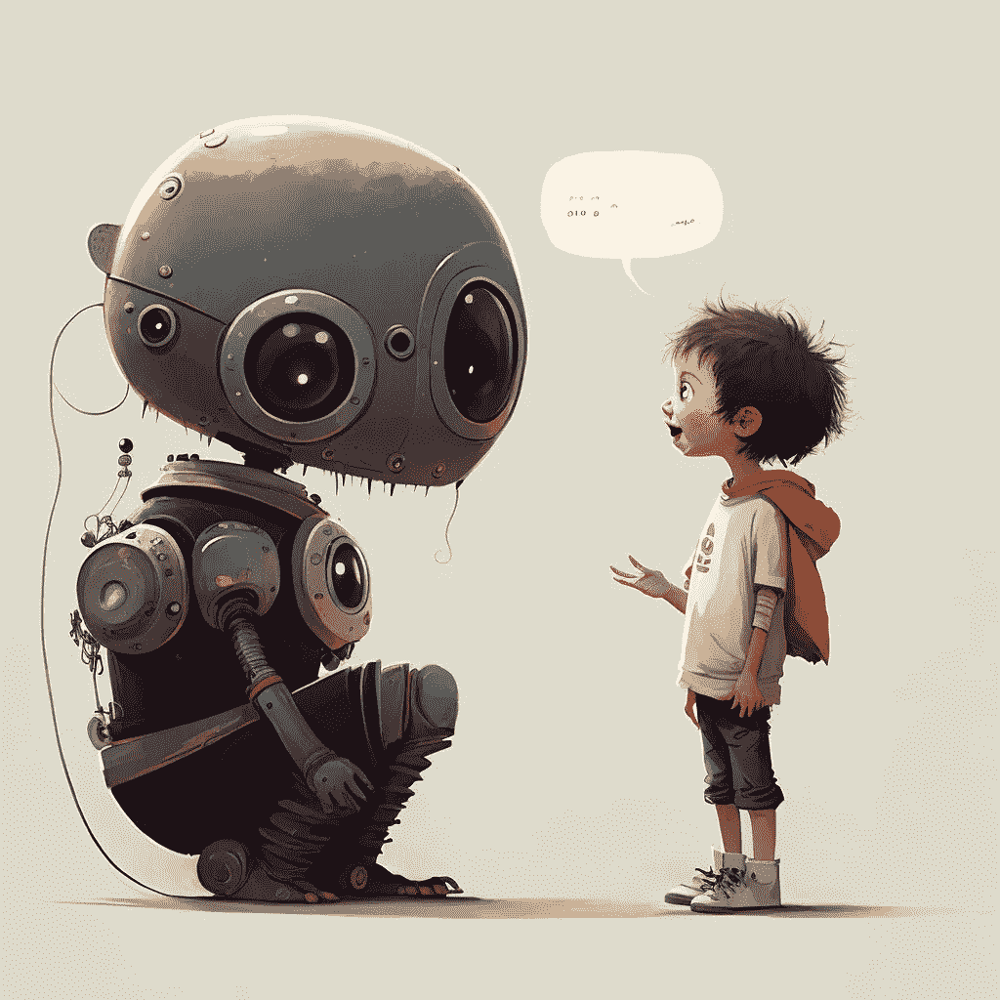

# OpenAI 的 ChatGPT 是世界上最好的聊天机器人

> 原文：<https://towardsdatascience.com/openais-chatgpt-is-the-world-s-best-chatbot-a25fa9f54442>

## 意见

## 一个新模型令人印象深刻的能力——以及如果人工智能模型变得非常善于隐藏自己的不完美会发生什么

鸣谢:作者 via midway

OpenAI 发布了 [ChatGPT](https://openai.com/blog/chatgpt/) ，这是一个新的对话语言模型(LM)，基于 [GPT-3.5](https://beta.openai.com/docs/model-index-for-researchers) 家族系列(在文本和代码上进行训练)，类似于 [InstructGPT](https://openai.com/blog/instruction-following/) (通过人类反馈与强化学习对齐)。该公司建立了一个在线演示，人们对它失去了理智。

简而言之，ChatGPT 是一个聊天机器人，可以“回答后续问题，承认错误，挑战不正确的前提，并拒绝不适当的请求。”

这很好地概括了 ChatGPT 如此特殊的原因:“承认”、“挑战”和“拒绝”是描述 LM 行为的不常见的动词。然而，在 ChatGPT 的例子中这并不夸张(我将很快分享的无数例子证明了这一点)。

ChatGPT 是迄今为止世界上最好的聊天机器人。它可以写[散文](https://twitter.com/timkietzmann/status/1598230759118376960)和[诗歌](https://news.ycombinator.com/item?id=33782275)。它可以[为 AI 艺术模型找到很棒的提示](https://twitter.com/GuyP/status/1598020781065527296)。它可以[角色扮演](https://twitter.com/parafactual/status/1598212029479026689)。它可以写代码，[发现一个 bug，解释它，解决它，解释解决方案](https://twitter.com/amasad/status/1598042665375105024)。它能以最怪异的方式结合各种想法:

[推特](https://twitter.com/goodside/status/1598129631609380864)

这个模型的卓越能力和比基线 GPT-3 更好的排列，使它感觉更像人类。反过来，这使它更可信——尽管这不一定意味着它更可靠，因此更可信。

像所有其他的 LMs(例如 GPTs，Galactica，LaMDA)一样，它编造事情，可以产生有害的完成，并产生错误的信息。这些缺陷都没有显著改变(ChatGPT 更好，但它是基于相同的原则构建的)。

[推文](https://twitter.com/GaryMarcus/status/1598208285756510210)

但这不是我今天的重点。我不会用[另一个关于我们为什么不应该相信这些模型的警示故事](https://thealgorithmicbridge.substack.com/p/galactica-what-dangerous-ai-looks)或者[一篇关于批判性思维的指导文章](https://thealgorithmicbridge.substack.com/p/the-four-filters-of-ai-knowledge)来烦你。

在本文中，我将与您分享人们从 ChatGPT 中挖掘出的最有趣的发现和含义的汇编(当然，还有我添加的评论)。

为了把樱桃放在最上面，我将带你踏上一段旅程。我想探讨一个假设:如果 AI 模型变得如此善于隐藏不完美，以至于我们再也找不到它们的任何缺点或不足，会发生什么？

*本文选自*[***The Algorithmic Bridge***](https://thealgorithmicbridge.substack.com/subscribe?)*，这是一份旨在弥合算法与人之间鸿沟的教育通讯。它将帮助你理解人工智能对你生活的影响，并开发工具来更好地导航未来。*

<https://thealgorithmicbridge.substack.com/subscribe>  

# ChatGPT 的广泛含义

如果你最近没有查看 Twitter，人们已经花了两天时间不停地和 ChatGPT 聊天。我将回顾他们的发现和结论。一旦你看到我将要展示给你的东西，你就会明白为什么上述假设并不那么疯狂。

## 散文已经死了

我 100%同意，散文，作为一种评价形式，很快就会消亡。我以前写过关于这一点的文章——关于教师和教育系统对此都没有准备好。对于 ChatGPT，这是现在普遍接受的说法:

[推文](https://twitter.com/corry_wang/status/1598176074604507136)

在学生[开始在 GPT-3 的作业中作弊](https://www.reddit.com/r/OpenAI/comments/xlvygv/artifical_intelligence_allows_me_to_get_straight/)之后，事情变得很明显，老师们意识到他们[必须准备](https://twitter.com/_akpiper/status/1594370163855466499)。现在这是一个切实的现实。我写了一篇 [1500 字的关于 2023 年五大人工智能预测的文章](https://medium.com/@albertoromgar/top-5-ai-predictions-for-2023-b86b398b1654)，所有这些看起来都非常可信。

然而，我不得不说，有见地、引人入胜、创新或发人深省不是描述 ChatGPT 创作的最佳形容词。它的大部分输出都是乏味的(这[是不可避免的](https://thealgorithmicbridge.substack.com/i/80843412/the-hegemony-of-low-quality-data)，除非你真的试图让[成为一首令人难忘的曲子](https://news.ycombinator.com/item?id=33782275)、[或两首](https://news.ycombinator.com/item?id=33783630)、[重复的](https://twitter.com/Eaterofsun/status/1598237035021873152)或[不准确的](https://twitter.com/paulg/status/1598303581182234626)——当不是[的时候，胡说八道](https://twitter.com/rtombs/status/1598056792864755713)。

除了教育系统需要的改革之外，让我担心的是，我们是否还能再次识别人工书写的作品。LMs 可能会变得很好，以至于完全模糊他们和我们之间的差距。以至于即使是人工智能鉴别器(GAN 式)也无法发现哪个是哪个，因为可能没有区别。

然而，还有另一种可能性:人类的文字有一些特征，使用正确的工具，可以揭示作者身份。随着 LMs 成为散文大师，他们可能会发展出某种写作特质(作为一种特性而非缺陷)。

也许我们可以发现人工智能的风格(就像隐藏在语言中的指纹)不仅仅是为了区分 ChatGPT 和人类，而是为了区分它的风格。

## 谷歌死了吗？

ChatGPT 的另一个重大含义是，它将[“杀死”谷歌](https://twitter.com/realGeorgeHotz/status/1598172113038299137)——互联网搜索的霸主[已经完成](https://twitter.com/jdjkelly/status/1598021488795586561)。没有人暗示这已经发生或即将发生，但鉴于人们已经在使用这种模式令人满意地取代谷歌，这显然不是一件难事:

[推特](https://twitter.com/frantzfries/status/1598154520009519104)

但是这里有一些警告。

在研究能力、人才和预算方面，谷歌都在 OpenAI 之上——如果有人能在 OpenAI 之前建立这项技术，那就是他们。然而，互联网广告的威力实在是太大了，无法做出充分的反应和应对。谷歌的人工智能研究部门可以说是世界上最好的，但他们几乎不再提供任何产品/服务。

谷歌正面临一个“创新者困境”的案例:公司[不能仅仅因为其他公司*可能*最终取代它，就用有风险的创新来制约它的主要商业模式。](https://twitter.com/balajis/status/1560915856955039744)

[推文](https://twitter.com/balajis/status/1560915856955039744)

LMs 实际上可能是谷歌 20 年来面临的第一个真正的威胁。

然而，如果我们分析搜索引擎和 LMs 之间的差异，我们会发现它们并不完全重叠。

一方面，搜索引擎是刚性的。他们只是进入互联网寻找网站，并向你展示一个链接列表，大约会给你你想要的东西——这基本上是最简单的互联网搜索形式。但是，另一方面，他们是可靠的。你知道他们不会捏造事实的。(谷歌搜索和所有其他搜索一样，是有偏见的，可能会向你展示假新闻，但你可以检查来源，这在这里很关键。)

ChatGPT 要灵活得多，但是，因为它的目标不是事实或真实，它可以像给你一个惊人的、高度复杂的、精确的答案一样容易地编造信息。你永远不知道哪一个会是先验的，之后可能会很难检查(ChatGPT 不会给你来源，如果你问的话，它无论如何都会编造这些来源)。

[推文](https://twitter.com/GaryMarcus/status/1598329961383067649)

简而言之，搜索引擎的局限性要大得多，但更适合这项任务。

也就是说，我不认为搜索引擎会在 LMs 中存活下来。时间与他们赛跑——当搜索引擎技术一点也不进步时，LMs 却以光速发展。

一旦更健壮的 transformer 架构出现，或者公司实现“可靠性模块”(无论这意味着什么)，LMs 将自动成为*超级生成搜索引擎*。

没有人会再使用谷歌。

# ChatGPT 令人担忧地令人印象深刻

现在，我将尝试解释为什么我在介绍中提出的假设如此重要——并且在不久的将来会更加重要。

你已经看到了 ChatGPT 拥有的许多令人印象深刻的能力，所以现在你明白我为什么认真对待这个问题了:ChatGPT 让那些反对炒作的人更难找到不足之处——这并不意味着他们不存在。

[推特](https://twitter.com/TonyZador/status/1598325546253000704)

[推文](https://twitter.com/goodside/status/1598053568422248448)

很明显，ChatGPT 缺乏推理能力，也没有很好的记忆窗口(Gary Marcus 写了一篇很棒的文章，解释了为什么“这一分钟看起来很聪明，下一分钟又笨得惊人”。

[像卡拉狄加](https://twitter.com/mrgreene1977/status/1598081141709230080)一样，让[废话听起来像是真的](https://twitter.com/3blue1brown/status/1598256290765377537)。人们可以“轻易地”[通过它的过滤器](https://twitter.com/zswitten/status/1598088267789787136)，它容易受到[及时注射](https://twitter.com/goodside/status/1598253337400717313)的影响。显然，它并不完美。

然而，ChatGPT 是一个进步——朝着我们无法通过测试和采样来绊倒它的方向前进:

[推文](https://twitter.com/TonyZador/status/1598333951461957632)

这是一件大事。

不久前，我写了一篇关于 AGI 的文章，题目是“ [AGI 将给所有人带来惊喜](/what-no-one-is-thinking-agi-will-take-everyone-by-surprise-a76903474c79?sk=c78de3596a3fa797357d4abdce1993ef)”ChatGPT 不在那个水平或接近它的任何地方(它实际上只是类固醇上的 GPT-3)，但它值得提出我对那篇文章的论点:

> “凡事都有极限。宇宙是有极限的——物理定律之外的事情是不可能发生的，无论我们怎么努力——甚至是无限的——自然数的集合是无限的，但它不包含实数的集合。
> 
> GPT-3 有局限性，而我们，那些试图发现它们的人，也有局限性。格温在这里证明了*[*<https://www.gwern.net/GPT-3#prompts-as-programming>**】*的是，在寻找 GPT 3 号的极限时，我们找到了自己的极限。不是 GPT 3 号没有完成某些任务，而是我们找不到合适的提示。我们的极限是阻止 GPT 3 号执行任务。我们阻止了 GPT 3 号发挥其真正的潜力。*
> 
> *这就提出了一个直接的问题:如果 GPT-3 的局限性经常被误认为是我们的局限性，我们如何精确地定义该系统能做什么或不能做什么的界限？*
> 
> *…*
> 
> *最终，我们是一个试图评价另一个有限系统的有限系统。谁能保证我们的极限在各方面都超越他们？我们有一个很好的例子说明情况可能并非如此:我们非常不善于评估自己的局限性。我们不断为自己能做的事情感到惊讶，无论是个人还是集体。我们不断打破身体和认知的极限。因此，我们的测量工具很可能达不到足够强大的人工智能的行动能力。"*

*在他的文章中，Gwern(一个受欢迎的技术博客)指出“抽样可以证明知识的存在，但不能证明知识的缺失。”他用这个想法来捍卫他的论点，即 GPT 3 号失败的原因可能是不良的提示，而不是模型本身缺乏“知识”。*

*我想在这里强调的是，抽样作为一种测试方法的局限性并不适用于我们发现我们的局限性(Gwern 论点)或 AI 的不足(反炒作论点)的情况，而且如果*我们* *没有发现任何*。*

*当人们发现 ChatGPT 的回答有缺陷时，一个常见的反驳是“你不知道如何最大限度地利用人工智能。”这很公平——但还不够——因为一旦发现系统缺陷，我们就可以断定这个系统不可靠。*

*但是，如果尽管无数次尝试让一个人工智能模型打破角色，击败它的过滤器，并让它放弃推理的外表，但人们没有这样做，会发生什么？*

*这可能看起来像一个没有现实基础的哲学思想实验，但我认为很有可能——将这种推理应用于未来的超级人工智能模型——我们可以在发现人工智能的缺陷之前找到手头方法的上限。*

*(我并不是说这个模型实际上能够完美地推理，而是说一套精心设计的护栏、过滤器和内在的保守性，加上我们作为人类的局限性，会使它看起来如此。)*

*我们就没有办法证明这个模型不能推理。没有人会相信现在用抽样来证明这些局限性的人，每个人最终都会开始信任这个系统。如果我们不尽快认识到这个问题，并找到解决方案，那就太晚了。*

*如果说我们应该从 ChatGPT 的卓越能力中学到什么的话，那就是我们正在不可避免地接近这一现实。*

**订阅* [**算法桥**](https://thealgorithmicbridge.substack.com/) *。弥合算法和人之间的鸿沟。关于与你生活相关的人工智能的时事通讯。**

**您也可以直接支持我在 Medium 上的工作，并通过使用我的推荐链接* [**这里**](https://albertoromgar.medium.com/membership) 成为会员来获得无限制的访问权限！ *:)**