# 运筹学——组织运营效率的关键

> 原文：<https://towardsdatascience.com/operations-research-key-to-organizational-operational-efficiency-fc5ae9b54387>

## 有效的流程管理是任何组织成功的关键，它来自于数据科学、运营管理和运筹学的结合。

# 摘要

随着公司转向人工智能，他们必须考虑业务、公司和功能战略，以及人工智能如何适应这些战略。在我进入正题之前，我想给你简单介绍一下。商业战略包括商业模式，以及外部和内部分析。作为一名人工智能领导者，应该理解商业战略，因为数据科学用例会受到公司内部和外部环境的影响。

其次，我想谈谈职能或运营战略，它涉及有效和高效地管理资源以满足客户的期望，同时还帮助组织盈利。该组织专注于其运营战略内部的重要关键绩效指标，这对人工智能领导者的理解至关重要。如果数据科学家想要真正对企业产生影响，他们必须首先了解每个流程中的运营战略和 KPI。

以保险业为例，索赔周转时间可能是一个重要的 KPI。在电信行业，客户生命周期管理流程中的流失率是一个关键的 KPI。因此，数据科学家必须了解每个流程内部的 KPI，以便充分利用数据科学。

在这篇文章中，我想把重点放在运筹学上，因为它与运营战略中的流程管理有关。运筹学是一个非常重要的主题，也是数据科学领域中代表性不足的领域之一。无论您选择哪个组织，它都有多个流程，我们有资源来处理这些流程。有时，某些流程没有得到有效优化，导致管理不善和资源效率低下。

例如，在医院中，低效的流程可能会导致更长的等待时间，从而带来负面体验。同样，低效的库存管理和需求满足会导致持有成本增加。此外，当涉及到项目管理时，不适当的资源分配可能会导致项目失败。这就是运筹学派上用场的时候了。通俗地说，运筹学有助于管理者在正确的时间做出正确的决策，从而降低运营效率，帮助组织提高关键绩效指标。更准确地说，运筹学需要最优化，这有助于在给定各种约束的情况下，资源的分配能够满足总体目标。

# 介绍

在这篇文章中，我将主要关注两个例子，它们将激励你继续努力。首先，我们将解决背包问题，然后我们将使用图解法来研究一些理论。使用图表理解理论有助于建立直觉。我使用这些琐碎的例子只是为了演示整个技术是如何工作的。

# 背包问题

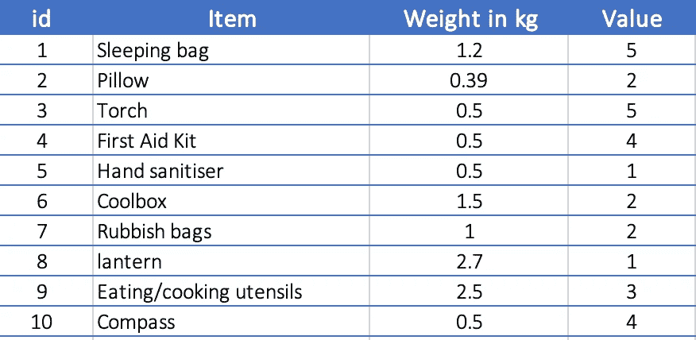

图 1:露营物品清单(作者提供的图片)

假设你正在整理一份露营装备清单，如上表所示。如您所见，所有物品的总重量为 11.29 千克，但您在包中最多只能携带 5 千克。然后你将如何从列表中选择项目？

表中的第三列还包括物品的重要性/价值，这可以帮助您选择最佳的物品数量。你可以采取的一种方法是尝试所有可能的项目组合，这将花费大量的时间。这就是所谓的贪婪方法，编码这个问题会导致很高的时间复杂度。这是一个小问题，但如果你有大量的项目，有无数的组合呢？这种贪婪的方法是行不通的。

现在让我们用数学规划来解决这个问题。数学问题的概念与你在学校已经学过的内容有关，包括线性系统和方程，解联立方程等。在数学或线性规划中，重要的部分是制定你的问题陈述。

## 制定问题陈述

1.  **决策变量**

决策变量是我们想要确定的。在这种情况下，我们需要选择最大化总价值的物品组合，同时考虑 5 公斤的限制。


按作者:如果选择了项目，则为 1；如果未选择项目，则为 0。如果我们排除一个项目，它将被标记为 0。

**2。目标函数**

在这种情况下，我们希望最大化总价值。让我们先计算一下每件商品的重量价值。

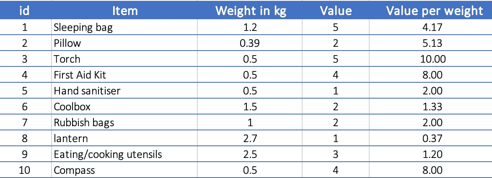

图 2:露营物品清单(作者提供的图片)

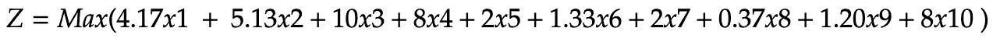

作者:目标函数

所以，理想情况下，我们希望最大化价值，如果我们包括所有的项目，我们可以这样做，但我们没有这个选项。我们必须选择最佳的项目组合来满足我们的约束条件。

**3。约束条件**

总重量不得超过 5 公斤

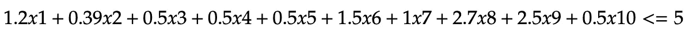

作者:限制→重量不得超过 5 公斤

给定这 3 个部分，我们可以使用求解器来求解完整的方程。我们可以利用纸浆来解决这个方程，并找到正确的项目组合。

**纸浆程序**

```
from pulp import *v = {'Sleeping bag':4.17,
'Pillow':5.13,
'Torch':10,
'First Aid Kit':8,
'Hand sanitiser':2,
'Coolbox':1.33,
'Rubbish bags':2,
'lantern':0.37,
'Eating/cooking utensils':1.2,
'Compass':8}
w = {'Sleeping bag':1.2,
'Pillow':0.39,
'Torch':0.5,
'First Aid Kit':0.5,
'Hand sanitiser':0.5,
'Coolbox':1.5,
'Rubbish bags':1,
'lantern':2.7,
'Eating/cooking utensils':2.5,
'Compass':0.5}
limit = 5
items = list(sorted(v.keys()))# Create model
m = LpProblem("Knapsack Problem", LpMaximize)# Variables
x = LpVariable.dicts('x', items, lowBound=0, upBound=1, cat=LpInteger)# Objective
m += sum(v[i]*x[i] for i in items)# Constraint
m += sum(w[i]*x[i] for i in items) <= limit# Optimize
m.solve()# Print the status of the solved LP
print("Status = %s" % LpStatus[m.status])# Print the value of the variables at the optimum
for i in items:
    print("%s = %f" % (x[i].name, x[i].varValue))# Print the value of the objective
print("Objective = %f" % value(m.objective))
```

**结果**

```
Status = Optimal
x_Compass = 1.000000
x_Coolbox = 0.000000
x_Eating_cooking_utensils = 0.000000
x_First_Aid_Kit = 1.000000
x_Hand_sanitiser = 1.000000
x_Pillow = 1.000000
x_Rubbish_bags = 1.000000
x_Sleeping_bag = 1.000000
x_Torch = 1.000000
x_lantern = 0.000000
Objective = 39.300000
```

正如我们在这里看到的，我们应该为我们的露营选择指南针、急救箱、洗手液、枕头、垃圾袋、睡袋和手电筒。所有这些物品的总重量为 4.59 千克，这满足了我们的约束条件，并使我们的目标函数最大化。

虽然这是一个非常简单的例子，但是相同的概念可以应用于许多实际的用例中，例如生产计划，其中您需要选择正确的资源来最大化您的利润、订单选择等。

我们刚刚解决的问题在技术上被称为“整数线性规划”，因为变量被限制为整数。这只是一个简单的二进制 0-1 整数线性规划。我不会转向其他类型，因为我现在只想让你理解这个概念。

# 理论理解(图解法)

现在让我们更详细地理解数学概念，这样你就能发展直觉。

制造商的目标是通过销售包括桌椅在内的家具来实现收入最大化。制作桌椅需要木材和劳动力等资源。假设所有单位都是在生产时售出的。做一张桌子，我们需要 10 单位的木材和 4 小时的工时。为了制作椅子，我们需要 8 单位的木材和 6 小时的劳动时间。但是，我们只有 200 单位的木材和总共 100 个工时可用。

桌子的单位利润:5 美元
椅子的单位利润:6 美元

为了实现收入最大化(假设本例中收入=利润)，我们可以继续生产桌子和椅子，但由于木材可用性和工时方面的限制，我们不能这样做。让我们用表格的形式总结一下这个问题。

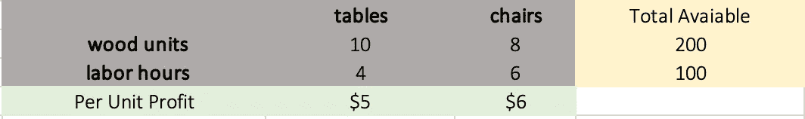

图 3:问题公式化表(作者提供的图)

通过表格阐明问题确实有助于澄清一切。

我们需要确定最大化利润的最佳桌椅数量。这将有助于制造商的决策过程。

## **公式化问题**

**第一步:决策变量(在给定约束条件下，我们需要生产多少张桌子和椅子来实现利润最大化)**

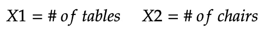

作者:这是我们需要确定的

**第二步:目标函数**

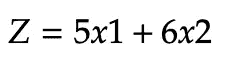

作者:我们想最大化这一点

**第三步:约束**

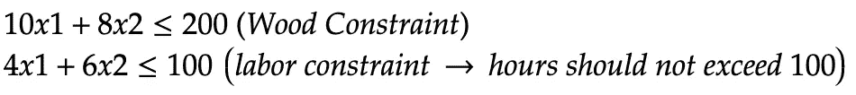

按作者:要满足的约束

因为我们有两个变量，X1 和 X2，我们可以用图解法解决这个问题。

这个问题我们已经公式化了。下一步是绘制约束条件。

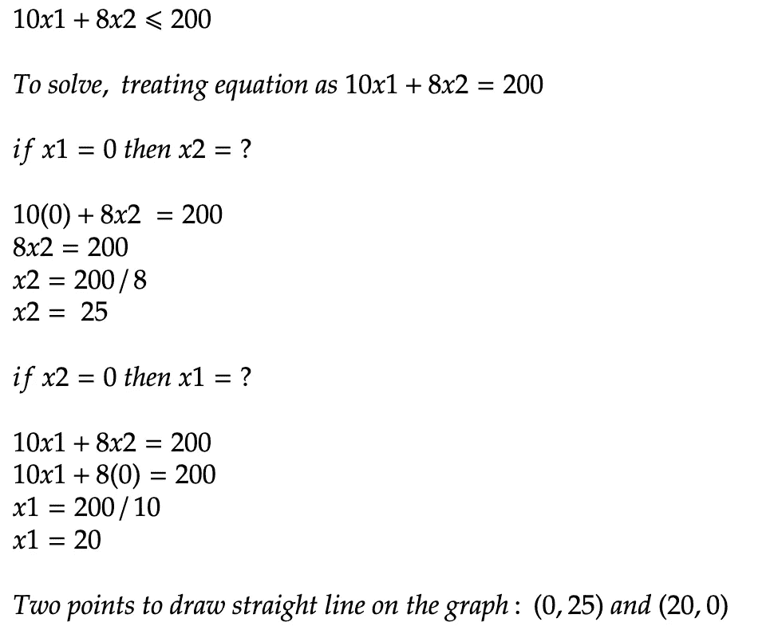

作者:木约束→得到两点画直线

如本例所示，我们有两个点来在图上绘制约束 1。这两点将用来在图上画一条直线。

我们将对约束 2 做同样的事情。

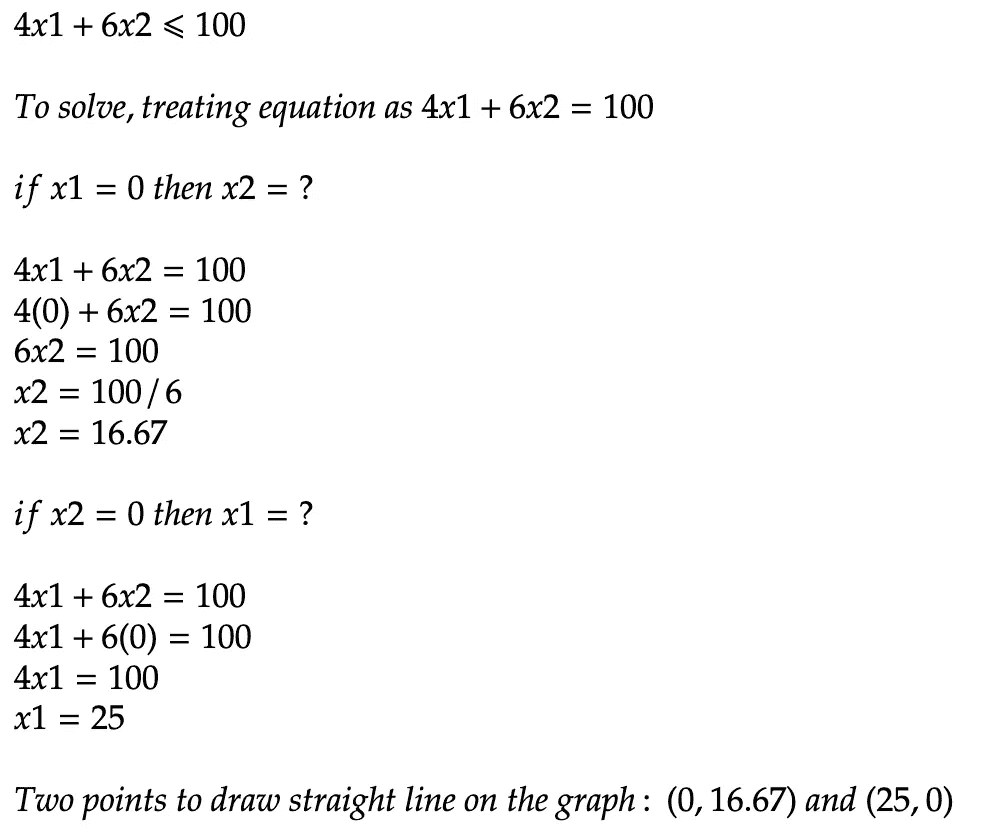

作者:劳动力约束→得到两点画直线

现在我们有了约束 1 和约束 2 的点，我们可以把它们画在图上。

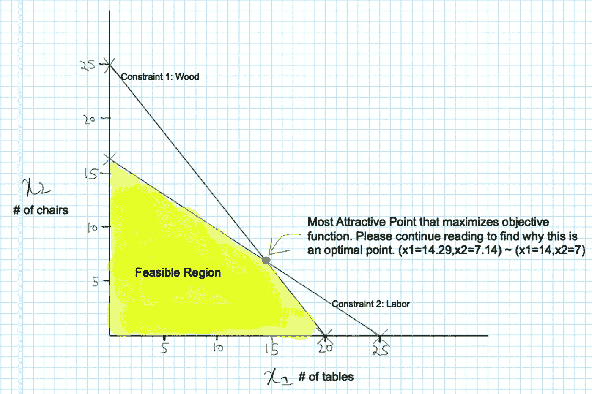

图 4:图表上绘制的约束。阴影部分显示可行区域(作者提供的图片)

在这个图上，我们可以看到一个可行的区域，其中这两个约束都得到满足。我们不能超越它，因为它不符合我们的限制。可行区域是有效约束线两侧的区域。

现在我们必须确定最佳解决方案的目标函数值。换句话说，我们需要在这张图上找到利润最大化的最佳点。


作者:目标功能概述

为此，使用这个目标函数并输入 z 的任意值(理想情况下，从 0 开始)。然后，对于任意 x1，求解 x2。对于另一点，使用不同的 x1 来求解 x2。这将得到一条基于指定 z 值的目标函数线。

同样，尝试不同的 Z 值，得到不同的方程直线。你会注意到这条线将平行于前一条线。

为了找到最吸引人的角，画一条与目标函数线平行的线，该线接触可行域中的最后一点。

在这种情况下，红点是 Z 值最大化的最有吸引力的角落。

因此，目标函数的最大值出现在 Z 值为 114.29 的极值点(14.29，7.14)。这是我们能从 14 张桌子和 7 把椅子中获得的最大利润。

# 结论

通过解决两个重要的问题，我们在这篇文章中看到了运筹学的重要性。这方面有很多应用。当我们将预测分析与运筹学相结合时，我们可以有效地将数据科学转化为决策科学，从而让管理层做出可行的决策。

同样重要的是要注意，当我们添加许多约束时，解决方案可能变得不可行。即使我们有一个可行的区域，当这些区域是无界的时，也是很困难的。此外，同一问题可能有多个最优解。因此，仔细阐述问题是至关重要的。

# 参考

[1][https://py Omo-simple model . readthedocs . io/en/latest/backpack . html #:~:text = The % 20 napsack % 20 problem % 20 considers % 20 The % 20 items % 20 that % 20 can % 20 be % 20 carried](https://pyomo-simplemodel.readthedocs.io/en/latest/knapsack.html#:~:text=The%20Knapsack%20Problem%20considers%20the,items%20that%20can%20be%20carried)。

[2][https://thinkinsights . net/strategy/functional-strategy/#:~:text = A % 20 functional % 20 strategy % 20 is % 20 the，for % 20a % 20 specific % 20 business % 20 function](https://thinkinsights.net/strategy/functional-strategy/#:~:text=A%20functional%20strategy%20is%20the,for%20a%20specific%20business%20function)。