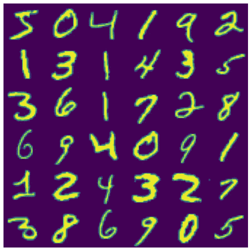
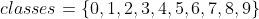
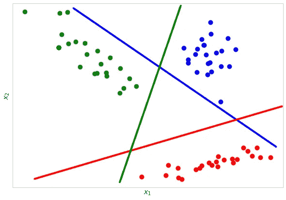
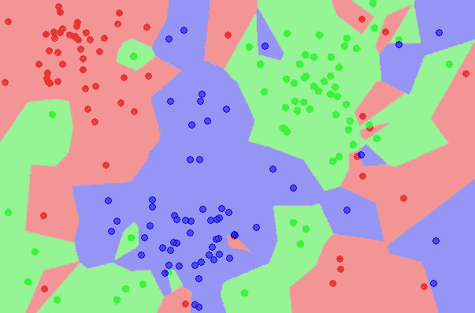
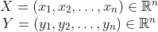
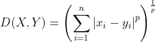
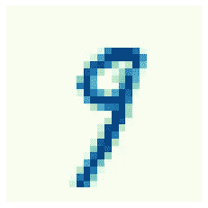
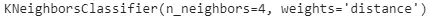

# 基于 KNN 分类器的光学字符识别

> 原文：<https://towardsdatascience.com/optical-character-recognition-with-knn-classifier-10fd220ed797>

## 通过流行的 K 近邻算法编码并解释光学字符识别的工作原理

来自 [MNIST 数据集](http://yann.lecun.com/exdb/mnist/)的手写数字

光学字符识别( [OCR](https://en.wikipedia.org/wiki/Optical_character_recognition) )比我们想象的更经常地出现在我们的日常生活中。当我们使用[谷歌翻译](https://translate.google.com/)从图片翻译文本时，我们使用的是光学字符识别。当我们发送一封信并且它到达目的地时，OCR 正在为我们工作。当一个有视觉障碍的人扫描一份文件，一台机器为他们阅读时，OCR 又一次获得了荣誉。这些只是我们日常工作中 OCR 出现的几个例子，但是，到今天为止，还有更多的例子存在，并且在不久的将来，它们的数量还会进一步增加。

本文旨在说明什么是光学字符识别，并提供一个循序渐进的应用程序来熟悉它。我将使用 [MNIST 数据集](http://yann.lecun.com/exdb/mnist/)来训练一个机器学习模型，它将能够从图片中识别手写数字。在微调算法后，我将评估它的准确性。

# 什么是光学字符识别？

光学字符识别( [OCR](https://en.wikipedia.org/wiki/Optical_character_recognition) )，也称为文本识别，是一种能够将印刷或手写字符转换为机器可读文本的技术。OCR 利用硬件和软件工具。硬件通常由光学扫描仪或照相机组成，而软件(本文的重点)由机器学习算法组成，如 KNN 分类器、SVM 分类器或神经网络。

当前 OCR 的应用是无止境的。仅举其中一些例子:

*   旧书籍或文件的电子版本(软版本)的生成(参见 [Google Books](https://books.google.com/)
*   扫描路标[自动驾驶](https://en.wikipedia.org/wiki/Self-driving_car)
*   创造工具使盲人和视障人士能够阅读(见 [AFB](https://www.afb.org/node/16207/optical-character-recognition-systems#:~:text=Optical%20character%20recognition%20(OCR)%20systems,%2C%20recognition%2C%20and%20reading%20text.) )
*   手写文本的实时转换
*   从护照或保险文件中自动提取信息

# 型号选择

光学字符识别是一个分类问题，这意味着它是一个机器学习问题，其中输出是分类的(即，它属于有限的一组值)。当然，输出类是不同的字符。在这个应用中，我们负责手写数字识别。输出类的数量为 10，由 0 到 9 的整数组成:

有许多现成的分类算法，所以我们需要选择一个非常适合这个目的的算法。算法选择的主要约束是它必须适合于*多类分类*。事实上，由于类别多于 2，这不能被认为是一个*二元分类*问题。

多类分类

一些算法天生能够处理多类分类问题(例如随机梯度下降、随机森林或朴素贝叶斯分类器)。其他算法(如支持向量机或逻辑回归分类器)本身就是二元分类器。即使存在使用二元分类器( [*一对一*或*一对一*](/multi-class-classification-one-vs-all-one-vs-one-94daed32a87b) 策略)执行多类分类的技术，对于本文的范围，我将坚持使用原生多类分类器。

## k 近邻分类器

由于没有公认的理论来确定每种问题类型的最佳学习算法，我的选择落在了**k-最近邻分类器** ( **KNN** ) 上，主要是因为它简单:它需要调整的超参数很少(要考虑的邻居数量 *k* ，距离函数，通常对应于欧几里德距离或曼哈顿距离)，而且它是非参数的(这意味着它不需要关于数据分布的假设)。一个缺点是，由于其固有的性质，KNN 对大型数据集的伸缩性很差:每当需要对新的例子进行分类时，它都必须扫描整个数据集。出于这个原因，探索额外的学习算法是有意义的，比如决策树或随机森林。

KNN 背后的思想是，一个实例 *i* 有很高的概率属于某个特定的类，姑且称之为 *m* ，如果 *m* 也是特征空间中 *k* 最近实例的最流行类。更正式地说，KNN 学习算法遵循以下步骤:

1.  给定一个未知示例，测量它与数据集中所有已标记示例的距离
2.  以最接近未标记的示例的标记示例为例
3.  基于 *k* 个最近邻的类别，预测未标记示例的类别
4.  对所有未标记的示例重复步骤 1-3。

在这个操作之后，特征空间可以被可视化为分成与类一样多的区域。根据一个新例子的位置，它将被预测为属于一个特定的类。

特征空间的分类(图像来源:[Wikipedia.org](https://en.wikipedia.org/wiki/File:Map1NN.png)

为了将 KNN 应用于分类问题，我们需要说明:

*   一个距离度量 *p* 。最常用的是欧几里德距离，它是[闵可夫斯基距离](https://en.wikipedia.org/wiki/Minkowski_distance)的一个特例，这里设置 *p=2。*给定相同尺寸的 2 个点 *X* 和 *Y* ，闵可夫斯基距离 *D(X，Y)* 计算如下:

*   要考虑的邻居数量 k。这可能是 KNN 最关键的超参数，因为:
    -对于 *k* 来说太小的值可能导致过度拟合
    -对于 *k* 来说太大的值可能导致拟合不足
    强烈建议使用[交叉验证](https://scikit-learn.org/stable/modules/cross_validation.html)集来优化 *k* 。
*   可选加权函数。它经常被忽略，但是在某些应用中，通过设置一个奖励最近邻类的加权函数可以获得更好的结果。
*   聚合方法。通常选择简单多数票。

在这里我提供了 KNN 算法的一个简明的快照，有关其功能的更详细的信息请查看本文。

# MNIST 数据集

为了训练我们的模型，我将使用 [MNIST 数据集](http://yann.lecun.com/exdb/mnist/)，这是一个手写数字的大型数据库。该数据集包含 70，000 个小图像(28 x 28 像素)，每个图像都被标记。

首先，我们必须导入数据集。

为了了解数据集，我定义了一个函数来打印 70，000 幅图像中的一幅:

输出将是:

数据集由 70，000 个示例组成，每个示例都有 784 个要素(28 x 28 像素)。每个特征代表灰度色图上给定像素的强度，特征值范围从 0 到 255。
0 值对应白色像素，而 255 值对应黑色像素。

# 模特培训

按照惯例，我们将数据集分为训练集和测试集。我选择将 25%的例子分配给测试集。测试集将被放在一边，直到最后都不会被触及。其唯一目的是提供模型的一般评估。将使用交叉验证集执行超参数调整。

让我们首先尝试用默认参数来拟合分类器。

这应该输出大约 96.8%的准确率，考虑到构建模型的工作量很小，这还不算太差。

## 超参数调谐

为了获得更好的结果，我将尝试使用[网格搜索](https://en.wikipedia.org/wiki/Hyperparameter_optimization#Grid_search)方法来调整模型超参数。网格搜索是一种穷举搜索方法。这就是我在交叉验证中降低折叠数的原因，也就是说，为了计算的原因。我通过考虑以下组合来探索超参数空间:

换句话说，网格搜索将探索最近邻 *k* 的 3 个不同值的组合和聚合邻居类的 2 种方式(统一权重或距离加权)。有了 6 个可能的超参数组合，我将交叉验证折叠数设为 3，总共 18 个训练步骤。

另一个值得研究的可能的超参数是距离度量。

在网格搜索和交叉验证过程之后，我们可以通过在拟合的网格搜索对象上调用`best_estimator_`方法来访问最佳估计量。

在我的例子中，最好的估计器是具有 *k=4* 并使用距离加权聚合的那个。

我现在将在测试集上评估优化后的模型。这里的步骤如下:

1.  使用训练好的模型来预测测试集中每个示例的标签
2.  将预测标签与实际标签进行比较
3.  计算准确度分数

Scikit-learn 允许用一行代码执行所有这些操作:

通过简单地应用网格搜索来寻找更好的超参数，模型的准确度增加到 97.3%。

# 后续步骤

为了进一步改进 OCR 模型，我们可以尝试不同的方法，如运行其他学习算法，扩展超参数搜索空间，以及通过综合修改原始数据(添加噪声，移动或旋转图像)来增加训练集的大小。接下来，将会有一篇文章用合成生成的样本训练一个新模型。

感谢您的阅读，希望您喜欢！