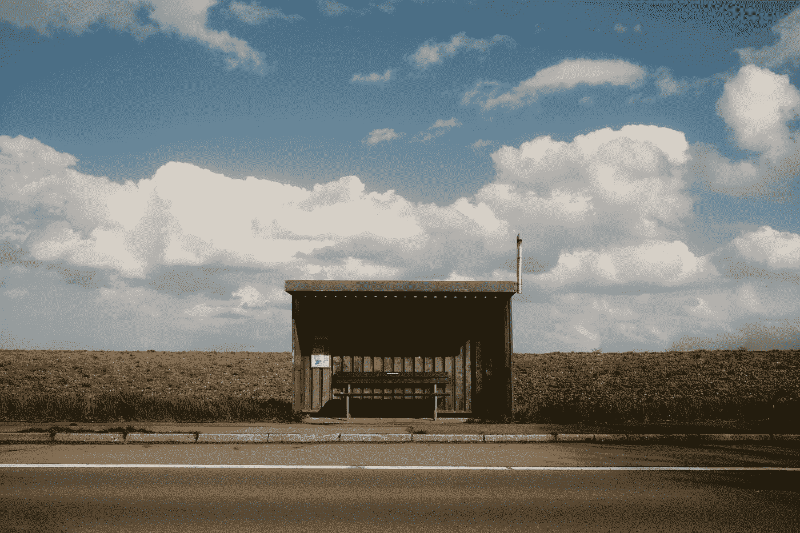
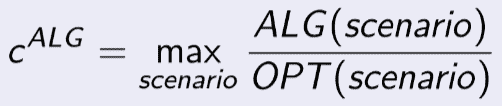
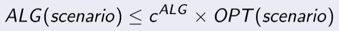
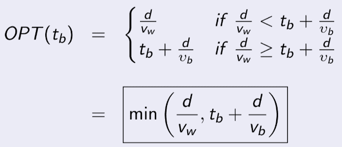
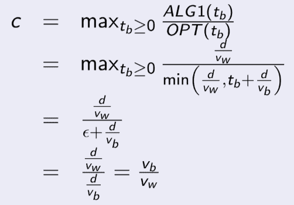
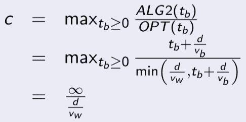
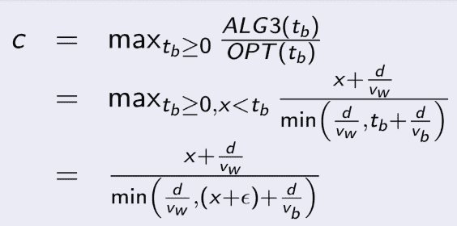
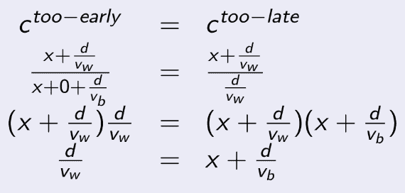
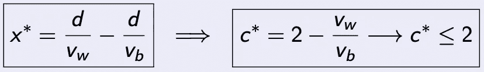
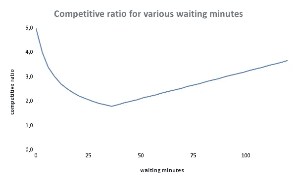

# 如果你的公共汽车不来，等待或步行的最佳决策

> 原文：<https://towardsdatascience.com/optimal-decision-on-wait-or-walk-if-your-bus-is-not-coming-daaefe61bcd6>

## 没有统计数据，困境如何解决？

罗伯特·多肖和迈克尔·施瓦茨

你想去拜访一个朋友，并尽快到达那里。有直达的公共汽车，但是公共汽车通常晚点，有时根本不来。你准时到达车站，但公共汽车却不在那里。你要怎么办？

要么你等公共汽车，要么你开始步行去找你的朋友。如果你离开车站，你将不能再乘公共汽车。一方面，你愿意等着搭车，因为这样更快。另一方面，公共汽车也有可能不来。真是进退两难！

照片由[马里乌斯·马图奇克](https://unsplash.com/@mariusmatuschzik?utm_source=medium&utm_medium=referral)在 [Unsplash](https://unsplash.com?utm_source=medium&utm_medium=referral) 上拍摄

## 问题类型

最初，这似乎是一个优化问题，目标是最小化到你朋友的旅行时间。仔细观察就会发现，只有有限的信息可用，而且无法做出有用的统计假设。旅行时间没有一定的控制。真正的问题是如何最大限度地减少个人对错误决策的后悔。当你意识到公交车不准时时，你会在两个选择之间犹豫不决:等待还是步行？整个问题是一个顺序决策问题，因为波动时间可分为离散的子问题。每当你意识到“公交车还没到”的时候，你就不得不做出新的等待或步行的决定。这种信息以串行方式一点一点到达的顺序问题被称为**在线问题**。相比之下，所有信息都是预先知道的相应问题，如真实的未来，被称为**离线问题**。请注意，如果未来是已知的，就不需要统计假设。

## 一个在线问题的最优解

一个在线问题通常可以用不同的策略来解决。在线算法是策略的公式化，作为解决具体场景的适用步骤序列。这种算法的质量可以通过**竞争分析**进行评估，并允许与替代算法进行比较。对于这个在线算法，需要导出竞争比 ***c*** 。定义为任何场景下在线解( ***ALG*** )与对应离线解( ***OPT*** )的最大比值。换句话说，这一比率是通过确定一个最坏的情况得出的，在这种情况下，信息有限的算法解决方案与知道未来的人的解决方案差异最大。

在线最小化算法的竞争比

如果在数学上可以证明这个 ***c*** 是一个常数(其中 ***c*** ≥ 1)，则一个在线算法被表示为**竞争**，这意味着它独立于任何场景。这个概念有一个巨大的优势。它为该算法提供了性能保证，即使问题的实际实例的结果是未知的。无论任何场景，在线问题的解永远小于或等于一个知道未来的理性决策者的解的 ***c*** 倍。

最小化问题的保证公式

具有数学上可证明的最低 ***c*** 的在线算法具有最严格的性能保证，因此**是最优的**。(注意，对于最大化问题，上述保证公式不同。有关更多信息，请查看*在线优化*。)

## 离线问题的最佳解决方案

假设 ***d*** 到你朋友的距离是 3 公里，你的步行速度 ***v_w*** 是 4 公里/小时，公共汽车的行驶速度 ***v_b*** 是 20 公里/小时，因此，步行需要 45 分钟(3/4 * 60 = 45)，但乘坐公共汽车只需要 9 分钟(3/20 * 60 = 9)。

但是，你个人的决定取决于你是否知道你要等多少分钟，直到公交车到站 ***t_b*** 。所有可能的情况只是到达时间不同。如果等待加上开车的时间比纯步行的时间长，那么你总是会立刻开始步行。如果没有，你就等着。

离线算法:未来已知时的最优解

如果你知道未来，你将永远不会需要超过 45 分钟到达你朋友的地方。在离线问题的所有场景中，只有当公交车在 36 分钟内到达时等待才是有益的。这也可以让你在 45 分钟内到达(36 + 9 = 45)。不幸的是，你不知道未来…

## 各种在线算法的分析

现在，看一看你看不到未来的真正的实际问题。从抽象的意义上说，只有几种方法可以解决这个问题:

**算法 1——运动员(*算法 1* )** :一个策略是，如果公共汽车不在，你总是立即开始步行。该算法最糟糕的情况看起来如下:你将总是步行，并且一旦你开始步行，公共汽车将立即到达(假设在**ε时间之后，其中**T9ε非常小)。****

在线算法 1-运动员的竞争比

你总是需要 45 分钟，但有很多情况下，你会后悔你的决定，更准确地说，在所有情况下，公交车在接下来的 36 分钟内到达。在最坏的情况下，公交车在你开始步行后的 ***ε*** 时间到达，其中 ***ε*** 时间小得可以忽略不计。那么你需要的时间是实际可能时间的 5 倍(9 分钟对 45 分钟，因为 ***ε*** 接近于 0)。这个策略看起来很极端，但至少你在每个场景中都到达了你朋友的地方。算法是有竞争力的…但它也是最优的吗？

**算法二——懒人( *ALG2* )** :另一种极端的策略是，你总是在那里等公交车，从不决定走路。很容易预见，在最坏的情况下，公共汽车永远不会来。你从来没有到达你朋友的地方。这种策略没有常数 ***c*** ，因此没有竞争力。

在线算法 2 的竞争比——懒人

**算法 3 —优化器( *ALG3* )** :人们可能总是决定等待一段固定的时间 ***x*** ，然后变得不耐烦并决定走。引人注目的是，采用不同 ***x*** 的竞争策略在竞争比率上可以有显著差异。

在线算法 3 的竞争比—优化器

例如，假设你总是在开始行走前等待 10 分钟(即***×***= 1/6 小时)。在最坏的情况下，你离开车站后，公共汽车马上就来了。你在 10+45 = 55 分钟后到达你朋友的住处，而离线解决方案需要 10+**T5εT7+9 = 19 分钟。因此，你比你知道公共汽车确切到达时间的解差 2.89 倍(55 分钟对 19 分钟)。相比于*运动员*的 ***c*** = 5(即 ***x*** = 0 小时)，*= 2.89 已经是很大的进步了。但是你能做得更好吗？***

***如何导出最佳等待时间 *x* *？**关于最优在线解 ***x* *** ，有两个错误你会后悔的。你要么开始走得太早，要么走得太晚。在过早的情况下，您会后悔没有等待更长时间，因为相应的离线解决方案总是要等待公共汽车。在来不及的情况下，你后悔没有早点开始走，因为线下解决方案会在你到站的时候立刻开始走。最佳在线策略会平衡这两种情况，使你的遗憾最小化。*

**

*为最佳在线策略平衡过早和过晚的错误*

*重新排列到 ***x*** 提供了最优等待算法。通过将 ***x**** 插入上述误差竞争比之一，可导出相应的最优竞争比 ***c*** *。这是最低的竞争比率。如果公交车速度始终大于步行速度， ***c*** *永远不会大于 2。*

**

*最佳在线策略和最佳竞争比率*

*在具体示例中，最佳等待时间是***×0****= 0.6 小时(3/4–3/20 = 0.6)，即 36 分钟(0.6 * 60 = 36)。对应的竞争比是***c****= 1.8(2–4/20 = 1.8)，其中离线解 45 分钟后到达，在线解需要 81 分钟(36 + 45 = 81)。基于给定的公交车和步行速度，没有更好的策略。这意味着任何其他等待时间总是导致更高的 ***c*** 。*

*为了更好地理解，考虑以下所有在线策略在 0 到 120 分钟等待时间范围内的竞争比率的可视化。最低点代表 ***c*** *，对应 ***x* *** 。*

**

*各种在线策略的竞争比率*

## *结论*

*那么下次你在公交车站，公交车没来的时候，你打算怎么办？在你开始走路之前，想想这篇文章。有一种策略永远不会比知道确切未来的策略差两倍。最佳等待时间是步行旅行时间减去公共汽车旅行时间。这是一个最坏的策略，你对未来毫无所知。认识到这一点:如果在实践中你做出了不同的决定，你要么假设其他信息，要么你没有理性地行动。*

*缩小！你还学到了什么？首先，您解决了一个与未来相关的优化问题，而没有做出任何统计或分布假设。使用的方法叫做竞争分析。第二，您的解决方案有一个性能保证，它基于一个知道确切未来的解决方案。*

*想想商业和私人生活中的其他应用:制造还是购买？租还是买？…做还是不做？*

## *参考*

*   *A.鲍罗丁和 R. El-Yaniv，[在线计算和竞争分析](https://www.cambridge.org/de/academic/subjects/computer-science/algorithmics-complexity-computer-algebra-and-computational-g/online-computation-and-competitive-analysis?format=PB&isbn=9780521619462) (1998)，剑桥大学出版社*
*   *J.Chen，S. Kominers 和 R. Sinnott，[行走与等待:懒惰的数学家赢了](https://arxiv.org/pdf/0801.0297.pdf) (2008)，arXiv 工作文件*
*   *C.汤普森，[公交等待公式](https://www.nytimes.com/2008/12/14/magazine/14ideas-section01-t-008.html) (2008)，《纽约时报杂志:想法之年》*
*   *A.Morton，[关于步行与等待的说明](https://arxiv.org/pdf/0802.3653.pdf) (2008)，arXiv 工作文件*
*   *R.Dochow，[投资组合选择问题的在线算法](https://link.springer.com/book/10.1007/978-3-658-13528-7) (2016)，Springer*