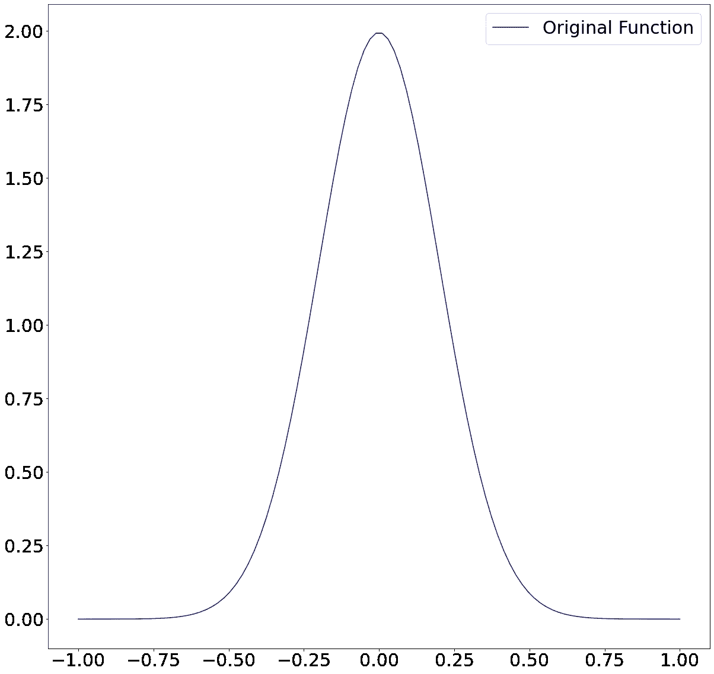
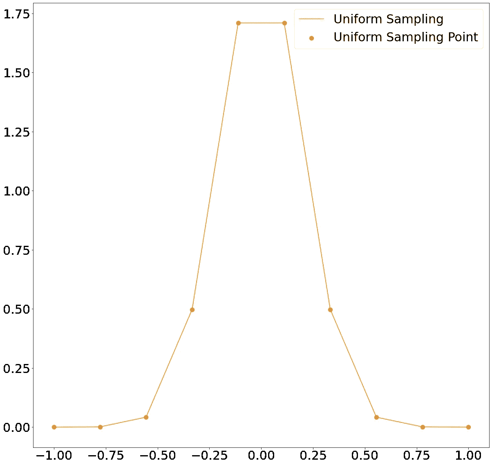
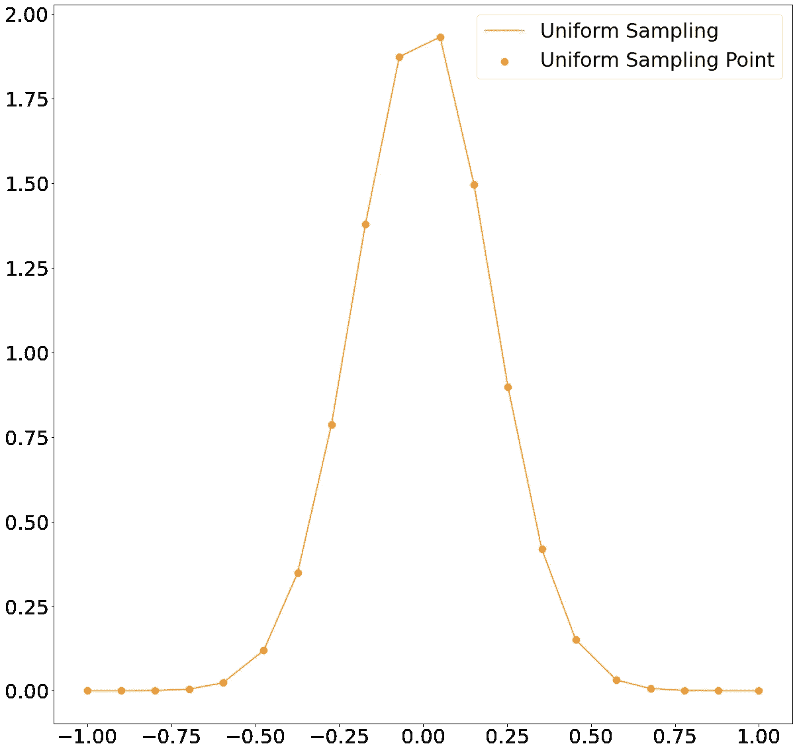
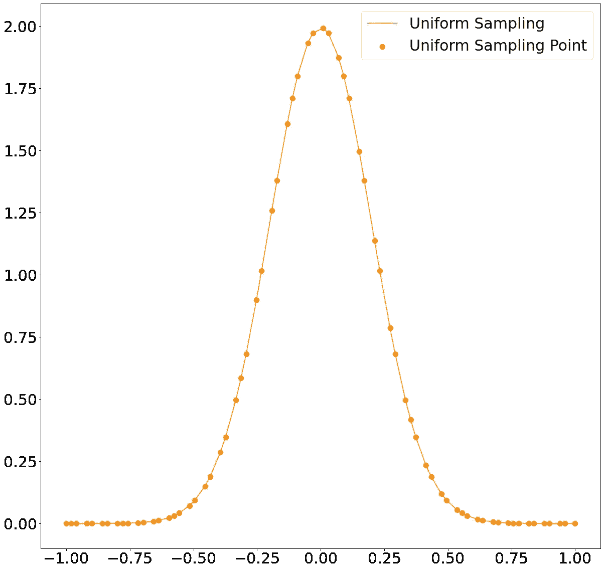
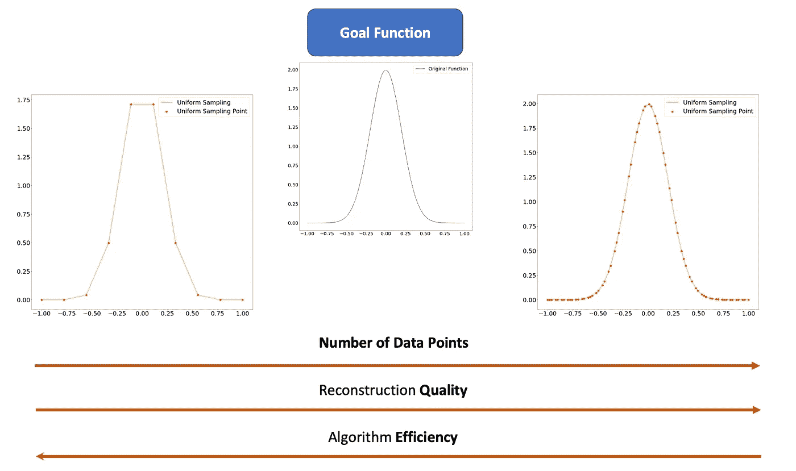
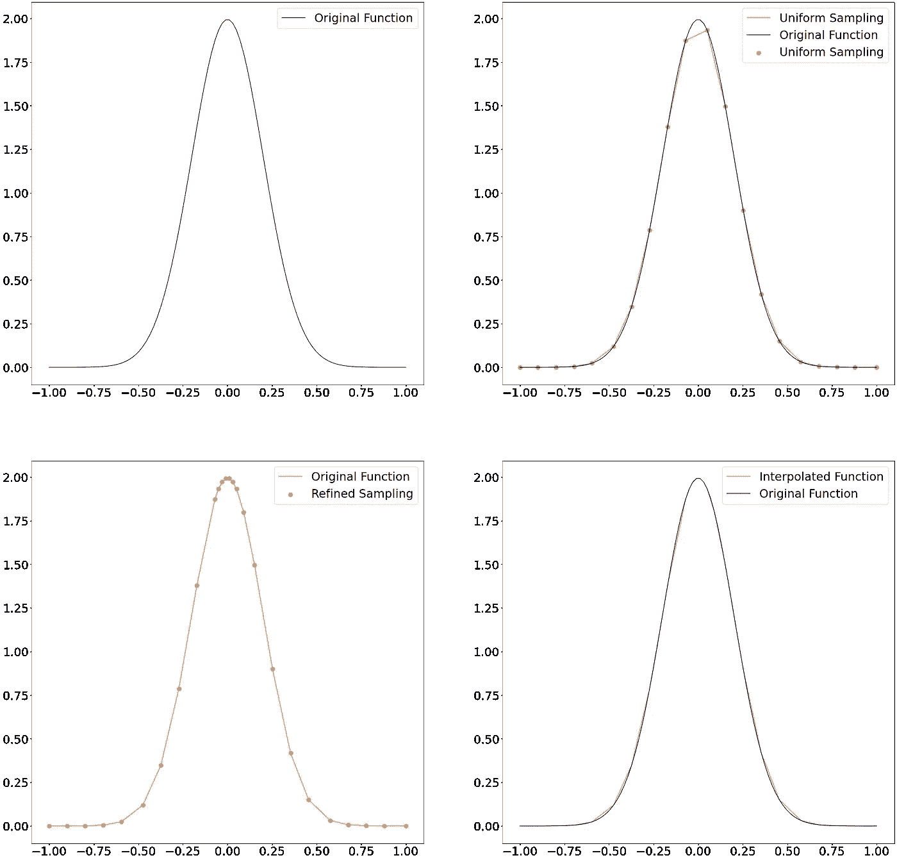

# 使用机器学习和 Python 实现最佳欠采样

> 原文：<https://towardsdatascience.com/optimal-undersampling-using-machine-learning-with-python-d40779583d53>

## 以下是如何使用几行代码智能地对信号进行欠采样


照片由 [Unsplash](https://unsplash.com/s/photos/less?utm_source=unsplash&utm_medium=referral&utm_content=creditCopyText) 上的 [Prateek Katyal](https://unsplash.com/@prateekkatyal?utm_source=unsplash&utm_medium=referral&utm_content=creditCopyText) 拍摄

在大数据时代**欠采样**是数据处理的关键部分。
即使我们能够以非常严格的方式定义欠采样，但我们的想法是，我们希望获得一个长、大、耗时且消耗内存的信号，并用一个更小且耗时更少的信号来代替它。

在这篇文章中，你将学习如何使用机器学习和几行代码以一种“智能”的方式对你的信号进行**欠采样。我们将从描述欠采样背后的优化任务开始，然后我们将解释使这种优化尽可能高效的策略。**

让我们开始吧:)

# 1.介绍

当然，每个欠采样任务最终都是一个**优化**任务。
我来解释一下原因。

考虑这个函数:



作者图片

我用了 100 个点来制作这个函数，正如你所看到的，这足以让它看起来非常平滑。那么欠采样是怎么回事呢？

以一种非常天真的方式和 2D 信号，它是这样工作的:

1.  考虑沿 x 轴的随机点(或采样均匀分布的点)。当然，你应该选择少于你的信号的原始点。在我们的例子中，你可以考虑 10 个数据点，或者 20，或者 30，但是少于 100。
2.  使用插值技术连接这些点。最简单的方法是线性插值。基本上你只是用直线连接这些点。

很简单。让我们看看如果我们从 100 个点中随机选择 10 个点会是什么样子。



作者图片

好吧…你们对这种欠采样满意吗？我打赌你不是。

让我们考虑更多的数据点，看看它是什么样子的。具体来说，让我们把数据点翻倍。



作者图片

当然更好。

让我们试着看看 70 会发生什么:



作者图片

那样的话，我们基本上就完美了。尽管如此，我们考虑了 70%的数据点，所以即使我们实际上是欠采样，我们仍然考虑了很多点。

现在应该更清楚为什么我们每次尝试欠采样时都要考虑一个**优化**问题了:

*   如果使用**太少的**数据点进行欠采样:您的重建会有损失(高效率，低重建质量)
*   如果您使用太多的数据点进行欠采样:您的重建是有损失的，但是该方法不是很有效或者根本没有效率。(低效率，高重建质量)



作者图片

# 2.提议的算法

从这个分析中我们可以得到的信息是**随机**或**均匀**采样 x 轴**不是最优策略**。

我们提出的算法在传统算法的第一步和第三步之间增加了另一步:

1.  考虑沿 x 轴的随机点(或采样均匀分布的点)。当然，你应该选择少于你的信号的原始点。在我们的例子中，你可以考虑 10 个数据点，或者 20，或者 30，但是少于 100。
2.  **对低质量区域进行过采样**
3.  使用插值技术连接这些点。最简单的方法是线性插值。基本上你只是用直线连接这些点。

让我们更仔细地分析步骤 2。
如果我们考虑 10/20 数据点图像，我们可以看到有些区域的误差比其他区域大。例如，在尾部误差最小，因为在那里考虑直线而不是高斯曲线基本上是无害的。然而，如果我们想在高峰期使用线路，我们会遇到麻烦，而且质量会更低。

在我们的算法中，我们考虑了目标信号和插值采样信号之间的绝对差异。然后我们**如果距离太大就加点。**我们来说清楚一点。

假设原始信号有 N 个起始点，我们从 N 个采样点开始。我们将执行以下操作:

```
1\. **Interpolate** the signal and compute, from your n starting point, an interpolated signal with values in the original N data points 2\. **Compute** the absolute normalized difference between the interpolated signal in the N data points and the original N data points values 3\. **Add** the point if the difference is larger than a certain threshold (let's say 5 percent of the maximum)
```

让我们编码:)

# 3.动手实施

导入库:

创建信号:

定义欠采样和插值函数:

定义算法:

# 4.分析结果

此过程的结果可以显示在



作者图片

正如我们所看到的，我们从欠采样的通用信号开始，然后我们找到一个真正的**优化**版本的信号，在需要它的区域中有更多的数据。

# 5.n 维信号

在原始的[文件](https://jovian.ai/piero-paialunga/oversampling)中，您可以找到 N 维信号的相同实现。

# 6.结论

如果你喜欢这篇文章，你想知道更多关于机器学习的知识，或者你只是想问我一些你可以问的问题:

A.在 [**Linkedin**](https://www.linkedin.com/in/pieropaialunga/) 上关注我，在那里我发布我所有的故事
B .订阅我的 [**简讯**](https://piero-paialunga.medium.com/subscribe) 。这会让你了解新的故事，并给你机会发短信给我，让我收到你所有的更正或疑问。
C .成为 [**推荐会员**](https://piero-paialunga.medium.com/membership) ，这样你就不会有任何“本月最大数量的故事”，你可以阅读我(以及成千上万其他机器学习和数据科学顶级作家)写的任何关于最新可用技术的文章。