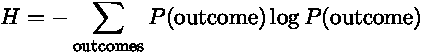
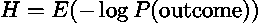
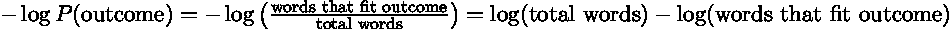

# 🟩🟩🟩🟩🟩最优世界

> 原文：<https://towardsdatascience.com/optimal-wordle-d8c2f2805704>

# 🟩🟩🟩🟩🟩最优世界

你读到的关于沃尔的一切都是错的。或者，至少，我读到的关于选择你的第一个单词猜测的所有东西都做了一个糟糕的假设:你应该尽可能多地猜测最常见的字母。现在，事实证明，最佳的第一个猜测(我将谈到)是由非常常见的字母组成的，但它在平均字母频率的单词列表中排名第 24 位。为什么猜最常见的字母不是最佳策略？因为这些字母不是很有辨别力:它们出现在很多单词中，所以如果你猜的时候看到黄色或者绿色，你还有很多单词要筛选。

让我们看一个简单的例子。假设你在玩一个两个字母的单词游戏，游戏中有一个简短的(非英语的)单词列表 AB，AE，AS，AT，BE，se，TE。还假设列表中的所有单词同样有可能被选为隐藏单词。显然，这个列表中最常见的字母是 A 和 E，你瞧，你甚至可以把它们放在一起，猜 AE 开始，这*保证*你会看到绿色！

如果你从猜测 AE 开始，你得到🟩🟩的概率是 1/7，⬛🟩的概率是 3/7，🟩⬛的概率是 3/7。你有 1/7 的机会赢，否则你知道元音。如果是 A，你列表中剩下的单词是 AB，AS，AT。如果是 E，就剩下 BE，s E，TE 了。所以你有 6/7 的机会剩下 3 个单词可以猜。

现在，让我们先看看猜测 BE。同样，你有 1/7 的机会获得🟩🟩奖(这总是正确的，不管你的第一次猜测是什么)。你有 7 分之 3 的机会获得⬛🟩。你还有 2/7 的几率得⬛⬛ (AS，AT)，1/7 的几率得🟨⬛ (AB)。

如果你猜错了，你保证还有三个可能的单词。如果你猜对了，你会有 50%的时间猜对 3 个单词，33%的时间猜对 2 个单词，另外 17%的时间只猜对 1 个单词。所以你有 50%的机会比从 AE 开始时过得更好。

在这个基本示例中，很容易完成所有案例。这如何根据 12，972 个单词的列表(这是 Collins Scrabble Words 中的五个字母单词的数量)推广到五个字母的 Wordle？答案是熵。在信息论中，熵是对事物随机程度的一种度量。在这种情况下，我们想猜一个结果最随机的单词；我们最不可能预测绿色、黄色和灰色瓷砖图案的猜测。在一个极端，如果我们已经知道一个猜测的结果，比如说两次猜测同一个单词，那么这是一个浪费的猜测——即使它确实包含很多绿色。更多的熵意味着有更多可能的结果，并且这些结果的概率更加平衡。

警告:数学来了。我会长话短说。信息熵被定义为

我们如何理解这个价值？首先，概率乘以某物的和是一个期望值，所以熵是结果的负对数概率的期望值:

结果的负对数概率是多少？在这种情况下，结果的概率是符合该结果的单词数除以列表中的单词总数。这一事实，以及对数的一些规则，使我们得出这样的结论:

这是对我们在解决问题上迈出了多大一步的衡量。我们从最初的单词列表开始，最后得到一个更短的符合我们观察结果的单词列表，所以这个差异就是我们解决了多少问题。对数是因为这个过程是一个分支搜索:每次猜测，我们将剩余的单词分成几个桶，结果告诉我们将保留哪个桶。如果你相对平均地拆分，那么拆分到一个单词所需的次数是你开始时单词数的对数。

综上所述，熵是猜测一个特定单词所产生的解决方案的预期进展量。我写了一个 [Python 脚本](https://github.com/JStech/optimal-wordle)来计算所有可能猜测的熵，给定一个单词列表(并假设答案是从列表中均匀随机选取的)。运行科林斯拼字游戏单词，前 11 个第一猜测是:
1。TARES
2。拉雷斯
3。罗音
4。费率
5。鼻孔
6。传说 7。托雷什 8。雷亚尔
9。敢不敢
10。阿尔
11。传说

就像我之前说的，这些单词确实包含一些非常常见的字母。然而，第一次猜猜会得到最多颜色的瓷砖，ROSE/AEROS/SOARE，分别排在第 298、25 和 20 位。此外，前 11 个单词中只有一个单词有三个元音。第一个有四个元音的单词是 AUREI，排名 1044。知道单词中的元音实际上没有多大帮助。

你怎么想呢?我在什么地方犯了错误吗？这会影响你玩 Wordle 的方式吗？请在下面的评论中告诉我。