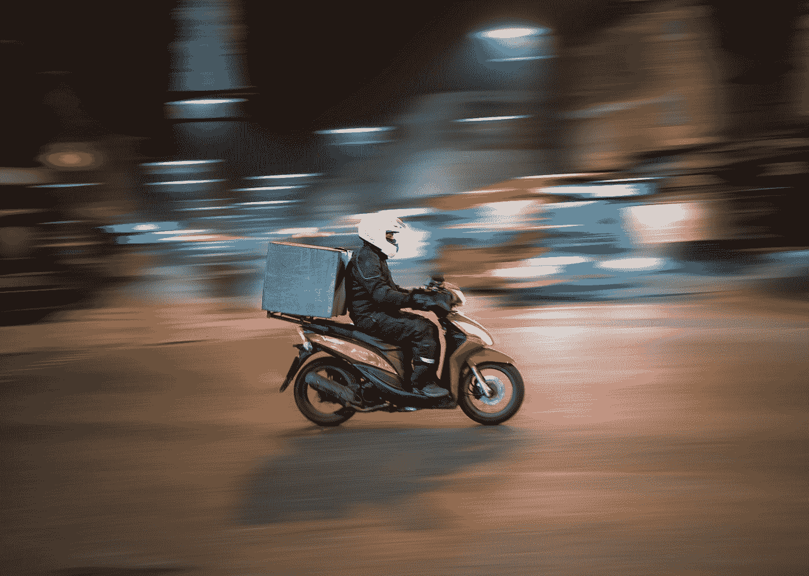
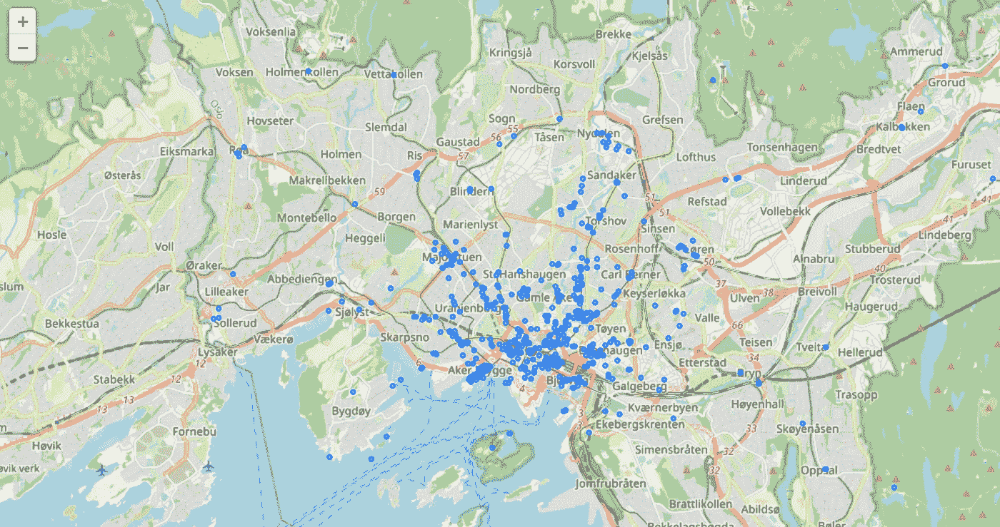
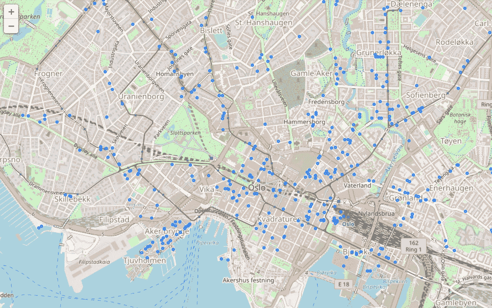
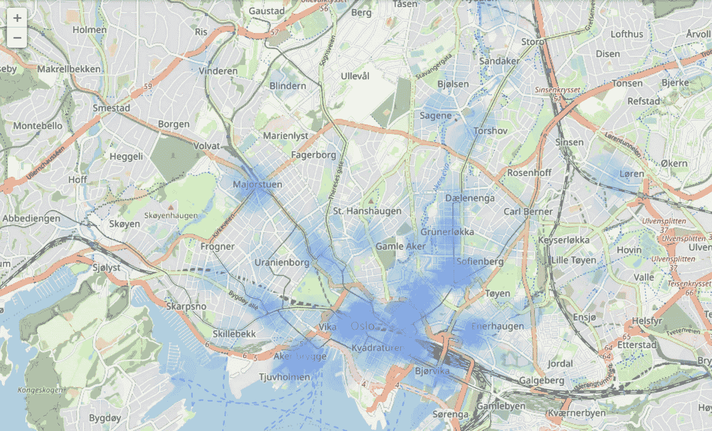
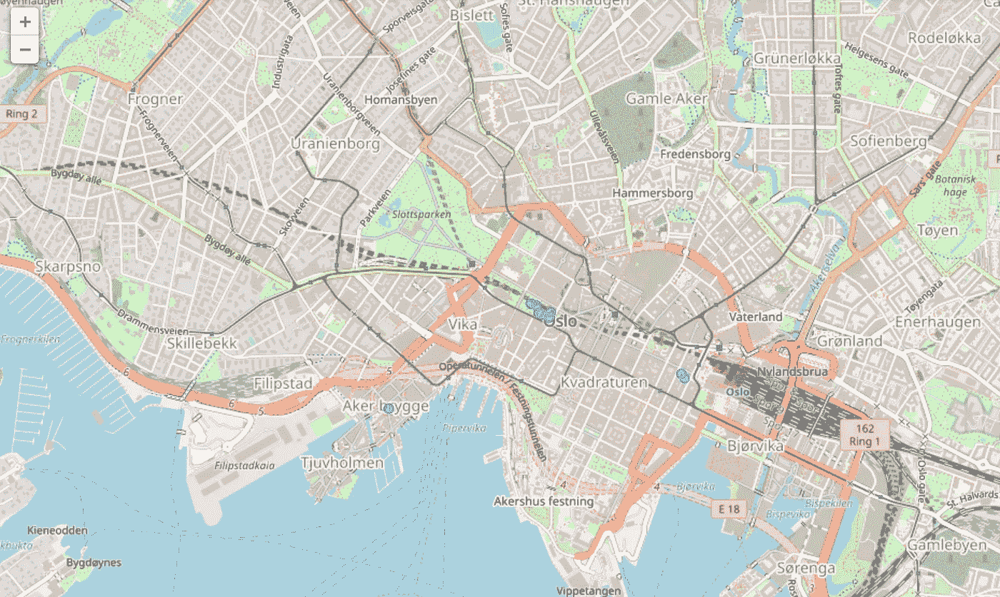

# 使用 Geopandas 和 OpenStreetMap 优化送餐员的位置

> 原文：<https://towardsdatascience.com/optimising-the-location-of-food-delivery-couriers-using-geopandas-and-openstreetmap-e771433e5e9f>

## 快递员应该把自己定位在哪里，才能最好地接触到最多数量的餐厅？



罗文·弗里曼在 [Unsplash](https://unsplash.com?utm_source=medium&utm_medium=referral) 上的照片

在“零工经济”中，食品快递员希望处理尽可能多的食品提货和交付。**本文将探讨如何使用地理空间工具(如 OpenStreetMap 和 Geopandas)来优化送餐员的位置，使其位于餐厅密度较高的区域，从而增加送餐上门的机会。**

如果我们站在送餐员的立场，我们可以问自己以下问题:

> "我应该在哪里接收更多的餐馆送餐？"

该问题与**寻找潜在机会密度最高的区域**(即食品交付提货)有关。为了简单起见，我们不考虑餐馆的受欢迎程度，因为这当然会影响送餐的数量，因此我们坚持在空间背景下考虑问题，例如餐馆的位置。

# 导入和安装相关库

我们将使用 *osmnx* 库来查询 **OpenStreetMap** 并检索我们需要的数据。其他示例将帮助我们处理地理空间数据，主要是 *geopandas* 。我们可以从安装和导入我们需要的库开始:

```
#Installing and importing libraries
!pip install osmnx
!pip install contextily folium==0.12.1.post1 geopandas==0.10.2 matplotlib mapclassify==2.4.3 pygeos==0.12.0 pyproj==3.2.1import geopandas as gpd
from shapely.geometry import Point, Polygon
import contextily as cx
import osmnx as ox
import shapely
import pandas as pd
```

# 提取餐馆数据

使用 osmnx，我们将从查找一个城市中的所有餐馆开始；我们将使用挪威奥斯陆作为我们的测试案例，因为与大城市相比，餐馆的数量较少(也更容易管理)。这非常简单，因为幸运的是奥斯陆很容易被认出是一个地方:

```
#choosing area of interest
place = 'oslo'#Selecting amenities and extracting information
tags = {"amenity":"restaurant"}
food = ox.geometries_from_place(place, tags=tags)
print(food.shape)food = food[['name', 'geometry']]
```

这将生成一个形状为 *(527，114)* 的地理数据框架。关于这些餐馆，我们可以删除许多冗余的元数据列，因为我们只关心位置，它在“几何”列中存储为点*或多边形*或*的形式。*

# **数据处理**

由于多边形也作为此地理数据框的一部分返回，因此我们可以通过获取多边形的**质心来快速将它们转换为点。我们所有的餐馆数据行将对应于纬度和经度的一个点集:**

```
#Convert polygons to points
food['geometry'] = food['geometry'].apply(lambda x : x.centroid if type(x) == Polygon else x)
```

为了绘图，我们将更改点集坐标的 crs，这可以使在底图上绘图更容易(例如，从上下文中),并清理我们的列。最后，我们可以使用 Geopanda 的 *explore()* 生成一个交互式地图，用于可视化餐厅数据:

```
#Simplifying the df and converting crs in case of plotting on other map tiles
food = food.to_crs(epsg=3857)
food.explore()
```



绘制了奥斯陆 OSM 的餐馆数据。图片作者。

所以现在我们可以看到餐馆分布在哪里。不出所料，有些地区的餐馆密度更高。我们假设的送货快递员会对这些感兴趣，因为他们应该能够更好地接收更多餐厅的订单。让我们放大来看看市中心的餐厅是如何分布的:



绘制了奥斯陆 OSM 的餐馆数据。图片作者。

我们已经进入了问题陈述的细节，即在我们的奥斯陆地图上选择一个地方，在那里快递员可以接收更多餐馆的订单。 ***你认为上面地图上的那个位置会在哪里？*** 猜一猜，最后发现…

在这种情况下，我们会说，如果送货员在 5 分钟的步行距离内，即大约 400 米，他们就可以从餐馆接收订单。如果我们**在我们所有的餐馆周围添加一个 400 米的缓冲区**，我们可以更好地了解这些缓冲区**与**重叠的地方(即在多个餐馆范围内的位置会显得更不透明):

```
food['geometry'] = food.buffer(400)
food.explore(style_kwds={'stroke':False, 'fillOpacity':0.05})
```



奥斯陆 OSM 餐厅的缓冲区。图片作者。

# 数餐馆的十字路口

我们现在对在哪里定位有了更好的想法，但是我们如何改进呢？最好是**量化**有更多重叠餐馆缓冲区的区域。这个解决方案已经存在于 [ArcGIS Pro](https://pro.arcgis.com/en/pro-app/latest/tool-reference/analysis/count-overlapping-features.htm) 中，它创建多边形并计算相交要素的数量，但是我发现了一个很好的解决方案[在这里](https://gis.stackexchange.com/questions/387773/count-overlapping-features-using-geopandas)。这现在给出了新创建的相交多边形 ***的地理数据框*** ，其中包括一个相交计数。我们可以根据相交点的数量对这些多边形进行排序，并将多边形转换为点，以获得与最多餐馆缓冲区相交的前十个位置:

```
#Count the overlapping features of restaurant buffers
food_intersections = count_overlapping_features(food)food_intersections = food_intersections.sort_values('count_intersections', ascending=False)
food_intersections['geometry'] = food_intersections.centroid#Plot results
food_intersections[:10].explore(marker_type = 'circle', marker_kwds = {'radius':20, 'fill':True})
```

# 餐厅取菜的最佳位置是…？

这为我们提供了以下位置，根据奥斯陆餐厅的缓冲半径和位置，这些位置可以为最多数量的餐厅安排快递员:



餐厅缓冲区交叉口数量最多的位置地图。图片作者。

有趣的是，我们看到我们有一个单一的位置点集群(即许多相交多边形靠近在一起)以及两个小得多的区域，分别位于西边和东边。基于交叉点计数选择前 10 个质心意味着这些质心中的每一个都与大约 25 个餐馆相交。那么，这和你的猜测相比如何？ 我们现在可以向我们假设的食品配送快递员推荐，如果他们位于我们发现的区域，他们有更高的机会收到食品提货订单。

# 摘要

在这篇文章中，我们思考了**如何让送餐员更好地接收更多来自餐厅的外卖订单**和减少闲置时间。通过提取餐厅数据，创建假设的“可用性”缓冲区，并找到大多数缓冲区重叠的区域，我们可以精确定位等待提货订单的最佳位置。OpenStreetMap 是一个很好的数据集，那么为什么现在在另一个城市尝试一下，看看最佳景点的分布是什么样的。

**感谢阅读！**